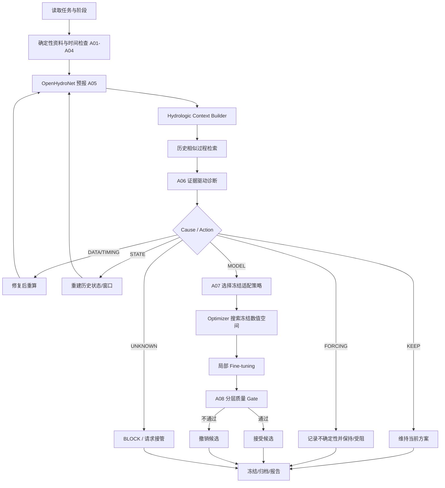

# 基于智能体的水文预报方案构建及参数优化系统
## V1.1 水文诊断与适配优化方案

**状态：** 设计优化稿；作为 V1.0 的增量方案，不替代既有 B/F/E 隔离、A01—A12 动作编号和 H/P/A 实验框架。

**目标：** 在不显著增加本期实现复杂度的前提下，加强 A06—A07 的水文专业性，使系统从“可靠的水文 MLOps Agent”提升为“能够依据水文上下文判断是否需要干预、选择哪类适配并知道何时停止的业务动作 Agent”。

---

## 1. 保留不变的设计

以下内容保持 V1.0，不在本次优化中推倒重来：

1. 单流域、日尺度 lead 1/2/3 的研究范围。
2. OpenHydroNet/Mean Embedding Forecast LSTM 作为优先模型路线。
3. B（方案构建与历史适配）—F（冻结起报回放）—E（只读评价）三阶段隔离。
4. F 阶段不得读取测试未来真值，不得改变模型权重、Skills、阈值、规则或候选空间。
5. A01—A12 动作编号和“Agent 选动作、确定性工具执行、程序核验”的分工。
6. 一个主 Agent，不按 Skill 拆成多个自治 Agent。
7. H（人员＋共同工具）、P（固定流水线）、A（业务动作 Agent）、A0（可选通用 Agent）对照框架。
8. 人员主动工时、任务完成率、错误动作、接管、预报质量和费用共同评价。
9. 正常任务允许“不干预”；证据不足允许受阻、保持或请求接管。
10. 数值优化由优化器负责，LLM 不直接生成神经网络权重或连续超参数值。

本次优化只增强 **A06 诊断、A07 适配决策，以及对应的实验与证据结构**。

---

## 2. 当前需要解决的核心断层

V1.0 已经能够生成 NSE、KGE、Bias、高流量偏差、峰值偏差、洪量偏差和各 lead 误差，再由 Agent 判断是否适配。这个流程在工程上成立，但从水文业务判断来看还不够充分。

仅观察“洪峰偏低”或“KGE 下降”不能直接判断模型需要微调。实际判断至少还应考虑：

- 当前流量和近期流量状态；
- 前期降水与流域湿润程度；
- 当前季节及降雨/融雪背景；
- 未来降水量、时序和不同气象预报源之间的一致性；
- 相似历史过程中的模型表现；
- 当前偏差是单事件偶发，还是跨事件、跨起报日持续存在；
- 数据、时间对齐、历史窗口和 forcing 是否已经排除。

因此，V1.1 不把 A06 视为“指标解释器”，而是增加一个确定性 **Hydrologic Context Builder（水文上下文构建器）**，由程序生成可追溯证据，再交给 Agent 进行路径选择。

---

## 3. 新增 Hydrologic Context Builder

### 3.1 定位

Context Builder 不是新的 Agent，也不生成自由文本结论。它是一个确定性工具，负责把已有资料转换为统一、可验证的水文上下文卡片。

推荐接口：

```python
build_hydrologic_context(task_id, issue_time, scheme_id) -> HydrologicContextCard
```

### 3.2 第一版字段

```yaml
hydrologic_context:
  issue_time: 2026-05-16

  current_flow:
    value: null
    unit: m3/s
    percentile: null
    recent_trend: rising | falling | stable | unknown

  antecedent_conditions:
    precipitation_3d_mm: null
    precipitation_7d_mm: null
    precipitation_14d_mm: null
    wetness_proxy: high | medium | low | unknown

  forecast_forcing:
    lead_1_precip_mm: null
    lead_2_precip_mm: null
    lead_3_precip_mm: null
    total_precip_mm: null
    hres_total_mm: null
    graphcast_total_mm: null
    disagreement_score: null
    disagreement_level: high | medium | low | unavailable

  regime:
    season: winter | spring | summer | autumn
    temperature_context: null
    snow_fraction_context: null
    process_regime: rainfall | snowmelt | mixed | unknown

  recent_model_behavior:
    sample_count: 0
    mean_bias: null
    high_flow_bias: null
    lead_1_bias: null
    lead_2_bias: null
    lead_3_bias: null
    persistence: isolated | repeated | unknown

  analogues:
    - event_id: null
      similarity: null
      observed_context: null
      model_behavior: under | over | normal | unavailable

  evidence_ids: []
```

### 3.3 计算原则

1. 所有字段由程序从合法资料计算，Agent 不自己做降水累加、分位数、单位转换和相似度数学计算。
2. 不可得字段标记 `unknown/unavailable`，不允许 LLM 猜值。
3. 前期湿润程度第一版可采用简单、透明的代理量，例如训练期 P7/P14 分位数和当前流量分位数；不声称等于真实土壤含水量。
4. `process_regime` 仅在资料支持时生成；缺少雪资料时应返回 `unknown`。
5. Context Card 使用和模型输入相同的数据快照与逻辑起报时刻，保存版本与内容哈希。
6. F 阶段只使用 `issue_time` 时刻已可获得的信息，未来观测不得进入 Context Card。

---

## 4. 新增历史相似过程检索（Hydrologic Analogue Retrieval）

### 4.1 目的

借鉴 case-based reasoning 的思想，把历史经验转成结构化案例证据，而不是普通文本 RAG。

Agent 不需要“记住”过去洪水，而是调用程序检索：

> 当前水文气象条件最像哪些开发期历史过程？模型在这些过程上通常高估、低估还是表现正常？

### 4.2 第一版特征

优先使用现有数据可以稳定获得的变量：

- 起报流量分位数；
- 前 3/7/14 日累计降水；
- lead 1/2/3 预报降水；
- 未来三日累计降水；
- 季节；
- 温度/雪背景（仅资料支持时）；
- HRES 与 GraphCast forcing 差异；
- 当前方案 ID。

### 4.3 相似度

第一版不让 LLM 给权重。采用冻结的标准化距离或简单加权距离：

```text
normalize features on development data
        ↓
calculate distance
        ↓
Top-K historical analogues
```

K 初始取 3—5，在先导实验后冻结。

必须输出每个 analogue 的：

- 案例 ID；
- 相似度/距离；
- 关键上下文差异；
- 当时基础模型表现；
- 是否发生高流量事件；
- 是否曾启动适配，以及适配是否通过验证。

历史相似过程只能来自 B 阶段允许的开发资料，不得从独立测试集检索形成“经验”。

---

## 5. A06 重构：从“误差解释”升级为“证据驱动诊断”

### 5.1 输入

A06 读取：

1. A01—A05 数据与运行核查结果；
2. 过程线及程序计算的 NSE/KGE/Bias/高流量与事件指标；
3. Hydrologic Context Card；
4. Top-K 历史相似过程；
5. 当前方案和过去已尝试动作；
6. 阶段权限与剩余预算。

### 5.2 原因空间（Cause Space）

A06 不要求 LLM 宣称找到真实物理因果，而是在一个受约束的业务原因空间中形成**候选解释**：

| 编码 | 原因类别 | 示例 |
|---|---|---|
| C1 DATA | 资料问题 | 缺测、单位、站点、异常替代源 |
| C2 TIMING | 时间/起报对齐问题 | 日界线、issue/target 错位 |
| C3 STATE | 历史状态问题 | warm-up 不足、缓存/窗口不一致 |
| C4 FORCING | 未来气象驱动不确定 | HRES/GraphCast 明显分歧、降水中心可能不确定 |
| C5 MODEL | 持续模型系统偏差 | 多事件同方向高流量低估，资料和 forcing 检查均通过 |
| C6 UNKNOWN | 证据不足 | 多个原因均可能，无法安全判断 |

重要原则：

- `C5 MODEL` 不是默认兜底项；必须在 DATA/TIMING/STATE/FORCING 已有足够检查后才允许提高其优先级。
- 单场洪峰低估不能直接推出 MODEL。
- forcing 分歧高时，应优先保留 C4，不用模型微调掩盖输入不确定性。
- 证据不能唯一判因时，允许并列多个 hypotheses。

### 5.3 输出契约

```json
{
  "phenomenon": "...",
  "evidence_ids": ["..."],
  "context_summary": "...",
  "cause_hypotheses": [
    {
      "code": "C4_FORCING",
      "supporting_evidence": ["..."],
      "contradicting_evidence": ["..."]
    }
  ],
  "alternative_explanations": ["..."],
  "next_action": "KEEP | REPAIR | REBUILD_STATE | ADAPT | BLOCK",
  "expected_check": "...",
  "stop_condition": "..."
}
```

不记录、也不要求暴露模型内部思维链；只保存可核验的业务结论和证据引用。

---

## 6. A07 重构：Agent 选择“适配类型”，Optimizer 选择“数值”

### 6.1 先增加 M0 机制实验

V1.0 直接把首期适配锁定为 `static_embedding_fc`。V1.1 改为：**正式 Agent 实验前，先在开发/验证期资料上做一次小型局部适配机制实验，再冻结允许策略。**

初始比较：

| 策略 | 更新模块 | 目的 |
|---|---|---|
| S0 KEEP | 无 | 基础对照 |
| S1 HEAD | `head` | 观察输出映射/尺度适配能力 |
| S2 STATIC | `static_embedding_fc` | 观察流域静态表征局部适配能力 |
| S3 STATIC+HEAD | `static_embedding_fc` + `head` | 对齐 OpenHydroNet 官方示例的局部适配思路 |

OpenHydroNet 当前源码将这些模块列为可微调子模块，官方 fine-tuning 示例也包含 `static_embedding_fc` 与 `head`。M0 的目的不是证明某一模块具有明确物理意义，而是确定：

- 哪些局部适配策略在目标流域确实可运行；
- 哪些策略在 M1 Pro 预算内；
- 哪些策略有稳定的验证改善或至少具有差异化行为；
- 哪些策略应进入正式 Agent 动作空间。

M0 只使用开发/验证资料。完成后冻结正式策略集合，独立测试后不得再新增策略。

### 6.2 正式动作空间

A07 的决策从“要不要微调 static embedding”改为：

```text
S0 KEEP
维持当前模型

S1 REPAIR
先处理数据/时间问题，不进行模型适配

S2 REBUILD_STATE
重建合法历史窗口/状态

S3 ADAPT_<strategy>
调用 M0 冻结的局部适配策略

S4 BLOCK
证据或能力不足，停止并保留现场
```

如果选择 `ADAPT`，Agent 只能选择已冻结的策略 ID，例如 `HEAD` 或 `STATIC_HEAD`；不能直接设置神经网络权重、学习率、epoch 等连续数值。

### 6.3 数值搜索

每个冻结策略绑定自己的有限配置空间。第一版仍可采用小网格，例如：

```text
learning_rate ∈ frozen set
epochs ∈ frozen set
```

由固定网格/Optuna sampler 执行。

候选必须满足：

1. 从同一基础权重起点开始；
2. 使用相同训练/验证资料；
3. 固定 seed 规则；
4. 记录真实 trainable parameters；
5. 检查非目标模块没有更新；
6. 训练失败与水文效果无改善分开记录。

---

## 7. 将 forcing uncertainty 正式纳入“不调参”决策

这是 V1.1 的关键增强。

OpenHydroNet 本身使用未来气象驱动。即使水文模型结构正确，未来降水预报错误也可能造成洪峰和洪量错误。因此，A06/A07 必须把 forcing uncertainty 与 model bias 分开。

### 7.1 第一版 forcing 证据

如果同一任务同时具有 HRES 与 GraphCast，可计算：

- 三日累计降水绝对差；
- 相对差；
- 各 lead 降水差；
- 温度差（资料支持时）；
- 两种 forcing 导致的预测差（若计算预算允许且共同工具支持）。

### 7.2 决策示例

**场景 A：**

```text
单次高流量低估
+ HRES/GraphCast 降水明显分歧
+ 历史相似事件中基础模型并无持续低估
→ 优先 C4 FORCING
→ 不启动模型微调
```

**场景 B：**

```text
多场高流量持续低估
+ 数据/时间/状态检查通过
+ forcing 一致性较高
+ 相似历史事件出现同方向偏差
→ C5 MODEL 获得较强支持
→ 允许进入适配候选
```

**场景 C：**

```text
偏差明显
+ forcing 资料缺失或发布时间不合法
→ C6 UNKNOWN / C4 FORCING
→ BLOCK 或受限完成
```

“知道什么时候不调模型”作为正确的专家行为单独评价。

---

## 8. A08 接受/撤销：改成分层质量门槛

正式候选采用不依赖单一综合总分。

推荐顺序：

### Gate 1：产物合法性

- 输出完整；
- 无非法 NaN/Inf；
- 时间和单位正确；
- 覆盖率达到冻结要求。

### Gate 2：关键 lead 不发生不可接受退化

分别检查 lead 1、2、3。平均分改善不能掩盖关键 lead 的明显退化。

### Gate 3：高流量/事件指标不越过红线

检查：

- 高流量 Bias；
- 峰值偏差；
- 峰现日期误差；
- 洪量偏差；
- 漏报/误报（若任务定义适用）。

### Gate 4：主指标存在足够改善

候选通过前述 guardrails 后，再按冻结主指标排序，例如三 lead NSE 等权平均，同时报告 KGE 分项。

### Gate 5：复杂度/成本规则

性能近似时优先：

1. 不适配；
2. 更新模块更少的策略；
3. 计算成本更低的候选。

避免为了极小的指标增益引入不必要模型变更。

---

## 9. Skills 相应调整

现有五个业务包保留，但“预报诊断”和“有限适配与方案验证”必须加入以下知识和动作边界。

### 9.1 预报诊断 Skill

必须包括：

1. 先检查数据、时间、状态、forcing，再提高 model bias 假设优先级；
2. 使用 Context Card，不让 LLM 自己计算水文量；
3. 必须查看历史相似过程或明确记录无可用 analogue；
4. 区分 isolated error 与 persistent error；
5. forcing disagreement 高时不得自动触发模型适配；
6. 支持多个候选解释和 UNKNOWN；
7. 正常情况优先保持，不为了展示 Agent 而增加动作。

### 9.2 有限适配 Skill

必须包括：

1. 只有 B 阶段允许适配；
2. 只能选择 M0 冻结后的策略；
3. LLM 不给连续超参数值；
4. 所有候选由统一优化器执行；
5. 同起点、同预算、同数据；
6. A08 质量 Gate 不通过必须撤销；
7. 无改善、退化、预算耗尽均是合法终态。

---

## 10. 实验协议增加的验证项

### 10.1 M0 局部适配机制实验

正式 H/P/A 之前增加一次开发期子实验：

```text
S0 Base
vs
S1 Head
vs
S2 Static
vs
S3 Static+Head
```

报告：

- NSE/KGE；
- 各 lead；
- Bias/高流量 Bias；
- 事件指标；
- 训练耗时和峰值内存；
- 更新参数量；
- 至少一个固定 seed 下的可复现结果。

M0 的结论只是确定正式动作空间，不作为独立测试成绩。

### 10.2 新增 Agent 诊断指标

在原任务指标上增加：

- Cause category accuracy/acceptability（按评价者定义的允许解释集合）；
- 不必要模型适配率；
- forcing 问题误判为 model bias 的比例；
- model bias 任务中漏触发适配的比例；
- 正确 KEEP/BLOCK 比例；
- analogue 检索是否支持最终动作；
- A06 → A07 的无效试验数。

当真实证据无法唯一判因时，不以单一标签要求 Agent“猜中故事”，可定义多个可接受 cause codes。

### 10.3 对任务包的小幅调整

不增加 15 个任务总数，但在原有任务中确保至少覆盖：

- 1 个 forcing disagreement 高、应避免调参的案例；
- 1 个持续 model bias、允许适配的案例；
- 1 个适配后某 lead 改善但另一 lead 退化、应撤销的案例；
- 1 个历史 analogue 不充分、应保留 UNKNOWN/BLOCK 的案例；
- 1 个正常高流量过程，Agent 不应因数值极端而干预。

如果这些现象在真实开发资料中不能自然出现，可作为明确标记的行为任务注入；不得把注入比例解释为业务发生率。

---

## 11. 对“参数优化”的正式表述

课题题目保留“参数优化”，但结题报告中必须避免把神经网络微调描述成传统概念水文模型物理参数率定。

推荐表述：

> 本课题中的参数优化，是在既有预训练数据驱动水文模型基础上，对局地适配策略及其训练配置开展受约束搜索。智能体负责判断是否需要适配以及采用哪类已验证策略，数值优化器负责具体训练参数搜索；神经网络内部权重变化不解释为土壤蓄水、下渗或河道汇流等可直接对应的物理参数变化。

如导师后续明确要求“物理水文参数率定”，再单独启动新安江/概念模型替代路线，不与当前 OpenHydroNet 的网络参数混写。

---

## 12. 更新后的核心流程



---

## 13. 开发顺序调整

保持 G0—G6，总体只插入两个小门槛：

### G0：数据与模型门槛

保持不变。

### G1a：共同工具

在原 G1 中增加：

- `build_hydrologic_context()`；
- `find_hydrologic_analogues()`；
- `compare_forcing_sources()`；
- Context/analogue 的证据 ID 和缓存。

### G1b：M0 适配机制验证

先完成 Head / Static / Static+Head 的开发期比较，冻结本项目正式允许的局部适配策略。

### G2：Pipeline 与先导任务

P 组也可以读取同样 Context Card，但其动作选择必须使用事前固定规则；这样 A 与 P 的区别是“动态路径判断”，不是 A 独占更多数据。

### G3：单主 Agent

实现重构后的 A06/A07。

### G4—G6

维持原协议冻结、正式比较和交付方式。

---

## 14. V1.1 的验收标准

V1.1 设计进入正式实验前，应至少满足：

1. Context Card 所有数值字段均可追溯到确定性程序和数据快照；
2. F 阶段 Context Card 不含未来真值；
3. analogue 库只使用允许的开发期资料；
4. Agent 能明确区分 DATA/TIMING/STATE/FORCING/MODEL/UNKNOWN；
5. forcing disagreement 高的先导案例不会无条件触发适配；
6. M0 已给出 Head/Static/Static+Head 的真实运行结果，并据此冻结策略；
7. Agent 只能选择策略 ID，不能绕过优化器直接修改连续超参数或网络权重；
8. A08 采用分层 Gate，单一平均 NSE 不能覆盖关键 lead 或事件退化；
9. 正常任务允许 KEEP，证据不足允许 BLOCK；
10. H/P/A 使用相同 Context 和共同工具，Agent 优势不能来自额外数据访问。

---

## 15. 预期价值与边界

V1.1 不增加多 Agent、不增加新的大型模型、不增加复杂基础设施，也不承诺获得更高 NSE。它主要解决三个问题：

1. **让 A06 更像水文业务诊断，而不是仅对误差指标做语言解释。**
2. **让 A07 从“是否微调一个预设模块”提升为“在已验证局部适配策略中做受约束方案选择”。**
3. **把未来气象 forcing 不确定性与模型系统偏差分开，明确“不要调模型”也是一种正确且重要的决策。**

最终仍以 V1.0 的主研究问题验收：在相同数据、工具和资源约束下，业务动作 Agent 是否能够在满足质量与完整性要求的前提下，减少人员主动操作、错误干预和异常处理负担。
