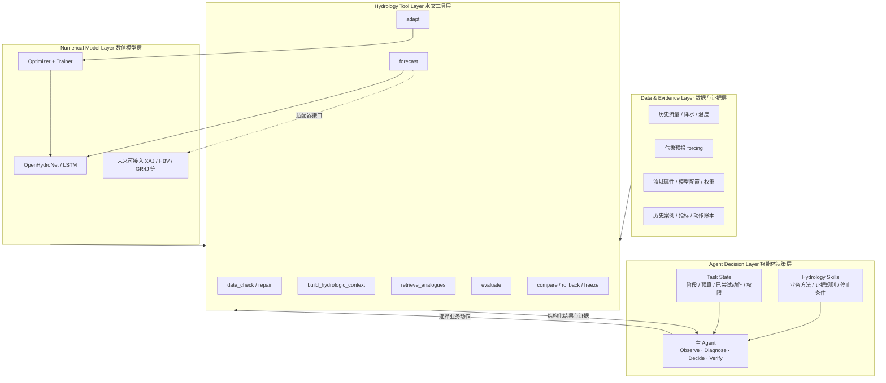
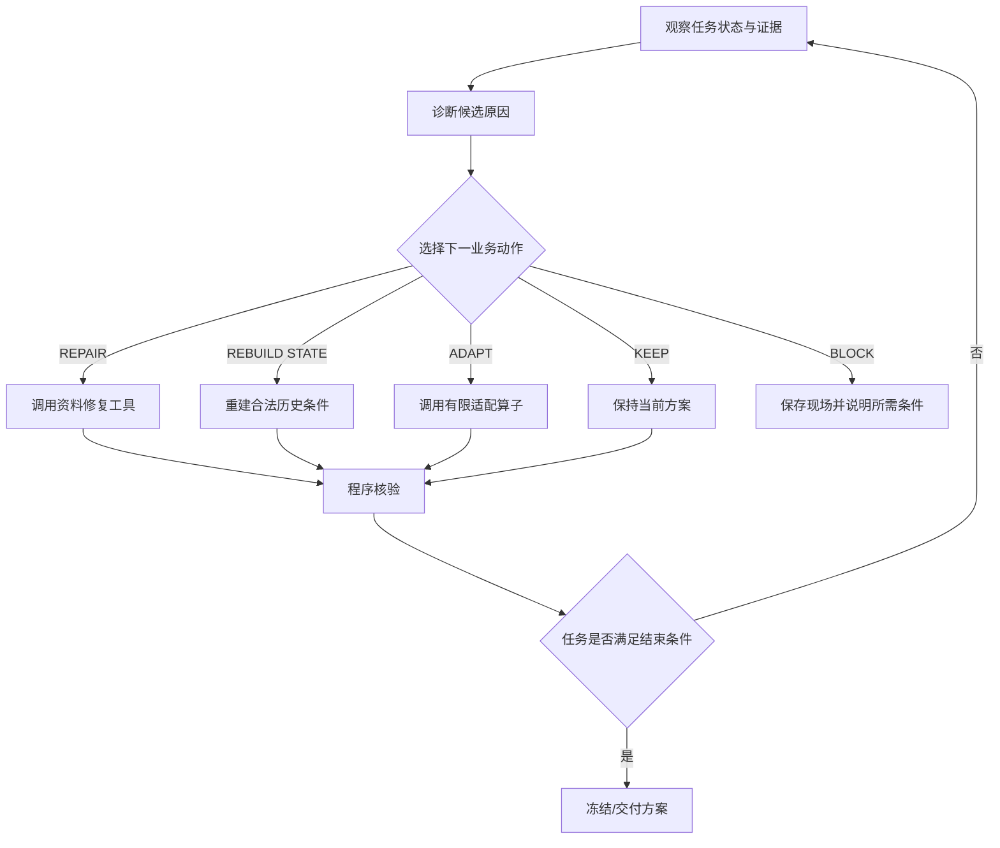

# 基于智能体的水文预报方案构建及参数优化系统
## V1.2 课题定位与分层架构方案

**状态：** V1.0/V1.1 的增量架构澄清稿，不替代既有 B/F/E 隔离、A01—A12 动作编号、H/P/A 实验框架和 V1.1 的水文诊断设计。

**本次目的：** 明确课题研究对象、模型与 Agent 的职责边界，以及“参数优化”在整个方案中的位置，避免把课题误解为“训练一个新的水文模型”或“让 LLM 直接调神经网络参数”。

---

## 1. 课题到底研究什么

课题名称为：

> **基于智能体的水文预报方案构建及参数优化**

本课题的核心研究对象不是新的水文预测模型，而是：

> **面向水文预报业务的智能体自主决策与执行闭环。**

具体而言，将资料检查、预报模型、上下文构建、历史相似过程检索、结果评价、有限模型适配、候选比较与回滚等能力封装为可验证的专业算子，由一个主 Agent 根据水文证据和运行状态自主选择下一步动作，并持续执行到方案完成、保持、回滚、受阻或请求人工接管。

因此，本课题不是研究“怎样训练出一个更好的 LSTM”，而是研究：

> **怎样让 Agent 正确使用已有水文模型和专业工具完成预报工作。**

主研究问题仍保持 V1.0：在相同数据、工具和资源约束下，业务动作 Agent 能否在满足预报质量和任务完整性要求的前提下，相比人员逐步操作减少主动工时，并相比固定流水线更合理地处理需要组合证据和选择路径的异常任务。

---

## 2. 与课题名称的逐项对应

| 题目关键词 | 本项目中的实际落点 | 不是在做什么 |
|---|---|---|
| 基于智能体 | 主 Agent 观察证据、诊断、选择动作、调用工具、核验并决定继续或结束 | 不是给每个步骤加一个聊天机器人 |
| 水文预报方案构建 | 数据核查、模型/配置校验、起报条件、预报执行、异常诊断、结果比较、方案冻结 | 不是只运行一次模型得到一条过程线 |
| 参数优化 | 当证据支持时，Agent 调用受约束的适配/优化算子，在冻结空间内执行局部优化并接受或回滚 | 不是 LLM 自由生成学习率、epoch 或神经网络权重 |

“参数优化”是预报方案构建闭环中的一种处理动作，而不是每个任务都必须发生的步骤。对于正常方案，Agent 正确选择 **KEEP / 不干预** 与正确启动一次适配同样重要。

---

## 3. 关于“模型训练”的准确边界

本项目应避免使用“完全不做模型训练”这一表述，因为 A07 的局部适配在技术上会发生有限权重更新，属于 fine-tuning/训练行为。

更准确的表述是：

> **本课题不以水文基础模型训练或模型结构创新为研究目标。水文模型作为智能体可调用的专业数值能力；如确有模型适配需要，由独立的优化器和训练器在冻结约束下执行有限局部训练，Agent 不直接生成或修改模型权重。**

职责边界如下：

- **Agent 决定：** 当前是否需要干预、优先排查什么、是否允许进入模型适配、选择哪一种已冻结的适配策略、适配结果是否解决原问题。
- **Optimizer 决定：** 在已冻结候选空间中运行哪些数值配置及其执行顺序。
- **Trainer 执行：** 按给定配置更新允许更新的模型模块，保存候选模型和训练记录。
- **Evaluator 核验：** 使用冻结指标、样本和质量门槛对候选结果进行统一评分。
- **Agent 不能做：** 自由生成神经网络权重、绕过候选空间修改超参数、看到独立测试结果后调整策略或阈值。

这使“智能体决策”和“数值训练”保持可解释、可审计的分离。

---

## 4. 四层总体架构

建议将系统正式抽象为四层：**Agent Decision Layer、Hydrology Tool Layer、Numerical Model Layer、Data & Evidence Layer**。



### 4.1 Agent Decision Layer

这是课题最主要的研究层。

Agent 不负责重复计算 NSE、累加降水或训练网络，而负责解决程序难以用单一固定规则表达的业务选择问题：

- 当前异常需要先查数据、时间、状态、forcing 还是模型？
- 现有证据是否足以支持干预？
- 应保持当前方案、修复资料、重建状态、启动有限适配还是停止？
- 已执行动作是否解决原问题？
- 什么时候应该回滚，什么时候应该报告能力不足？

### 4.2 Hydrology Tool Layer

把水文人员实际使用的能力封装为确定性或受约束工具。Agent 只通过工具契约调用，不直接操作底层文件、模型权重或评价公式。

工具必须具有明确的：输入、输出、证据引用、权限、失败状态和幂等/恢复规则。

### 4.3 Numerical Model Layer

包含 OpenHydroNet/LSTM 等实际水文预测模型及有限适配所需的优化器、训练器。

从 Agent 视角看，具体模型不是决策主体，而是**专业数值计算能力**。模型结构可以不同，只要经过 Adapter 提供统一的工具契约，Agent 的上层业务闭环原则上无需随模型整体重写。

注意：不同模型输入、状态、可调参数和适用场景不同，因此“可替换”指的是通过适配器统一上层调用方式，不意味着所有模型可以无条件互换。

### 4.4 Data & Evidence Layer

保存 Agent 决策和程序核验能够引用的事实，包括数据快照、水文上下文、forcing、历史相似过程、模型版本、评价指标、动作结果和成本。

Agent 的重要结论必须能够指向该层中的证据 ID；不可得信息明确标记 unknown/unavailable，不允许通过语言模型补造事实。

---

## 5. 水文模型作为“算子”的正式抽象

在 Agent 层，不建议把 OpenHydroNet 暴露成大量模型内部 API，而应封装为标准预报算子。例如：

```python
forecast(
    scheme_id: str,
    basin_id: str,
    issue_time: datetime,
    data_snapshot_id: str,
) -> ForecastResult
```

`ForecastResult` 至少返回：

```yaml
forecast_result:
  scheme_id: null
  issue_time: null
  predictions:
    - lead_day: 1
      target_time: null
      q_pred: null
      unit: m3/s
    - lead_day: 2
      target_time: null
      q_pred: null
      unit: m3/s
    - lead_day: 3
      target_time: null
      q_pred: null
      unit: m3/s
  quality_flags: []
  model_version: null
  data_snapshot_id: null
  artifact_ids: []
```

Agent 不需要知道模型内部每一层如何计算；它只需要知道该算子的：

- 输入契约是否满足；
- 当前方案和模型版本是什么；
- 输出是否完整合法；
- 该模型支持哪些合法的适配能力；
- 当前阶段是否允许调用这些能力。

以后如果接入新安江、HBV、GR4J 或其他机器学习模型，可以增加对应 Adapter，而不是重写 Agent 的诊断与控制主循环。

---

## 6. 参数优化也应作为一个受约束算子

A07 不应表达成“Agent 自己训练模型”，而应表达成：

```python
adapt_model(
    base_scheme_id: str,
    strategy_id: str,
    training_snapshot_id: str,
    validation_snapshot_id: str,
    budget_id: str,
) -> AdaptationRun
```

其中 `strategy_id` 只能来自正式实验前冻结的策略集合，例如：

```text
KEEP
HEAD
STATIC
STATIC_HEAD
```

具体允许哪些策略由 M0/G0 机制实验决定，未验证的策略不得为了提高正式测试成绩临时加入。

数值参数由 Optimizer 在冻结空间内搜索，例如：

```text
learning_rate ∈ frozen_set
epochs ∈ frozen_set
```

Agent 负责的是：

```text
是否值得适配？
        ↓
适配哪一种允许的机制？
        ↓
调用 adapt_model()
        ↓
程序完成候选训练与统一评价
        ↓
原问题是否改善且没有不可接受副作用？
        ↓
ACCEPT / ROLLBACK / KEEP
```

因此，“参数优化”的研究价值不只是找出一组更高分参数，还包括：**什么时候不应该优化、什么情况下优化无效、如何发现副作用以及何时回滚。**

---

## 7. Agent 的核心应定义为闭环控制，而不是聊天交互

推荐把主循环正式定义为：

```text
Observe
  ↓
Diagnose
  ↓
Decide
  ↓
Act
  ↓
Verify
  ↓
Continue / Finish / Rollback / Block / Handover
```

对应水文业务：



这与 V1.1 的 Cause Space 一致：DATA、TIMING、STATE、FORCING、MODEL、UNKNOWN 只是诊断假设空间；最终仍必须映射到可执行动作或有依据的结束状态。

---

## 8. A01—A12 在四层架构中的位置

| 动作 | Agent 决策重点 | 主要调用的 Tool | 模型层是否参与 |
|---|---|---|---|
| A01 检查资料 | 哪些问题阻断任务、先查什么 | data_check | 否 |
| A02 补取/修复 | 选择合法修复路径 | repair_data | 否 |
| A03 方案校验 | 选择兼容方案/模板 | validate_scheme | 读取模型元数据 |
| A04 历史条件 | 是否重建状态/窗口 | rebuild_state | 可能 |
| A05 执行预报 | 异常结果下一步如何处理 | forecast | 是，作为预报算子 |
| A06 水文诊断 | DATA/TIMING/STATE/FORCING/MODEL/UNKNOWN | context + analogue + metrics | 读取结果，不训练 |
| A07 有限适配 | 是否适配、选哪类策略 | adapt_model | 是，由 Trainer 执行 |
| A08 比较/撤销 | 问题是否真正解决 | compare_candidates | 读取候选结果 |
| A09 恢复/受阻 | 重试、保持还是停止 | recovery | 视故障而定 |
| A10 冻结方案 | 推荐依据和边界是否完整 | freeze_scheme | 冻结模型引用 |
| A11 连续起报 | 运行异常是否需要处理 | batch_forecast | 是，重复调用预报算子 |
| A12 评价报告 | 如何组织事实与失败结论 | evaluate/report | 只读 |

这个映射强调：**A01—A12 才是智能体工作空间；水文模型只是其中若干动作会调用的底层能力。**

---

## 9. 这套架构对实验设计意味着什么

H/P/A 对照应继续保持“相同工具，不同决策主体”的原则。

### H：人员 + 共同工具

人员可以使用与 Agent 相同的 `data_check / forecast / evaluate / adapt / compare` 等工具。这样测到的差异不是“Agent 有自动化程序、人工没有”，而是人员与 Agent 在相同工具条件下如何组织工作。

### P：固定流水线

P 也可以调用同样的模型和参数优化算子，但触发顺序和条件由事前规则固定。它用于回答：常规自动化已经足够时，是否还有必要使用 LLM Agent。

### A：业务动作 Agent

A 的新增能力主要是根据多来源证据选择路径、保留替代解释、判断不干预、有限恢复和停止，而不是拥有更强的水文模型。

因此正式比较应持续报告三类结果：

1. **预报质量：** NSE、KGE、Bias、高流量及事件指标、覆盖率；
2. **处理正确性：** 错误动作、不必要干预、适配采用/撤销、受阻识别、接管；
3. **人工减负：** 主动工时、返工、接管和最终核验时间。

如果 A 与 H/P 使用不同的水文模型或不同优化预算，就无法把差异归因于智能体决策。

---

## 10. 课题答辩时建议使用的统一表述

### 10.1 一句话版本

> **本课题不是研究怎样训练一个新的水文模型，而是研究怎样让智能体会使用水文模型和专业工具完成预报方案构建、异常诊断、有限参数优化及结果验证。**

### 10.2 正式版本

> 本课题研究面向水文预报业务的智能体自主决策与执行方法。通过将数据检查、水文预测模型、水文上下文构建、历史相似过程检索、结果评价及有限参数适配等能力封装为标准化专业算子，由智能体依据水文证据自主完成预报方案构建、异常诊断、动作选择、结果验证和方案冻结，并通过人员、固定流水线与业务动作 Agent 的对照实验，评价其在预报质量、处理正确性和人员主动工时方面的效果。

### 10.3 关于参数优化

> 参数优化不是本项目每次预报都必须执行的固定步骤，而是 Agent 在证据支持时可以调用的一种受约束业务动作。数值搜索和模型训练由确定性优化/训练工具执行，Agent 负责决定是否调用、采用何种已允许策略以及最终接受或回滚。

---

## 11. 实现原则

后续代码实现应遵循以下原则：

1. **Agent 不直接 import 模型内部训练逻辑作为自由操作接口。** 统一通过 Tool/Service 契约调用。
2. **forecast 与 adapt 分离。** 日常预报调用不能隐式触发训练。
3. **模型 Adapter 与 Agent 解耦。** 上层动作使用稳定 schema，模型差异放在 Adapter 内处理。
4. **数值计算尽量确定性。** 指标、单位转换、历史累计、相似度、阈值和评分由程序计算。
5. **Agent 只做有价值的路径选择。** 程序能直接判断的逻辑不消耗 LLM 决策轮次。
6. **所有动作可核验。** 每个动作返回 artifact/evidence ID 和显式状态。
7. **允许不干预。** KEEP 是正式正确动作，不把“调用更多工具”作为智能程度指标。
8. **允许失败和受阻。** BLOCK/HANDOVER 是系统边界能力，不用模型微调掩盖资料或 forcing 不确定性。
9. **训练仅在合法阶段发生。** B 可在冻结规则内适配；F/E 不得借测试真值修改模型。
10. **模型可替换不等于实验可随意换模型。** 正式实验模型与 Adapter 版本必须提前冻结。

---

## 12. 对 V1.0/V1.1 的关系

本文件只做架构与研究定位澄清，不改变已有方案的关键约束：

- 保留单流域、日尺度 lead 1/2/3 的首期范围；
- 保留 OpenHydroNet/Mean Embedding Forecast LSTM 作为首选工程验证模型；
- 保留 B/F/E 时间与权限隔离；
- 保留 A01—A12 动作体系；
- 保留 V1.1 Hydrologic Context Builder、历史相似过程检索、Cause Space 和适配策略机制实验；
- 保留 H/P/A/A0 对照和人员主动工时主指标；
- 保留“Agent 选动作、确定性工具执行、程序核验”的总体原则。

本次新增的核心只有一句：

> **把“水文模型”从课题主角明确降为 Agent 可调用的专业数值能力，把“智能体如何正确组织和使用这些能力”明确提升为课题主研究对象。**

这样能够同时保持题目中的“水文预报方案构建”和“参数优化”，又避免项目被收窄成单纯的 LSTM 微调或 AutoML 实验。