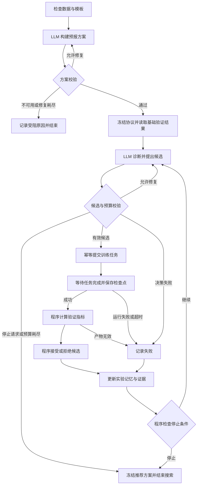

# 基于智能体的水文预报方案构建及参数优化系统
## V1.0 开发实施方案（需求澄清修订版）

- 面向对象：河海大学数字孪生卓工班（二期）。
- 指导教师：方园皓，河海大学水文水资源学院副教授（按课题组提供信息记载）。
- 修订日期：2026 年 9 月 6 日。
- 项目简称：AgentHydro。
- 文档状态：开发与验收设计；尚未完成本机模型复现，文中的实验预算为初始设计，不是实测性能。

## 1. 项目定位与已确认约束

本项目基于 Google OpenHydroNet 开源框架，面向一个具有公开数据的流域，构建由智能体组织预报方案配置、模型参数优化、历史回测和结果解释的实验系统，并通过网页及答辩图表呈现全过程。

课题重点是把成熟水文机器学习框架转化为可执行、可检查、可复现的智能体工作流程。项目不预先承诺智能体优于传统优化算法；没有提升、出现退化和运行失败的实验均须保留证据并形成结论。

| 事项 | 已确认要求 |
|---|---|
| 课题名称 | 保留“基于智能体的水文预报方案构建及参数优化” |
| 模型路线 | 优先基于 Google OpenHydroNet 实际代码开发，避免自行重写水文模型 |
| 备选路线 | 老师允许新安江模型作为备选；V1.0 不并行开发，Google 路线确实受阻时再形成变更说明 |
| 数据 | 美国或欧洲公开数据，优先官方示例覆盖流域；原 Fish River 不是指定对象 |
| 运行设备 | 一台 M1 Pro；实测内存和运行成本后确定最终计算预算 |
| 智能体 | 调用第三方 LLM API；开发工作也可由编码 Agent 承担 |
| 业务范围 | 单目标流域、日尺度、历史回测，不接入生产防汛业务 |
| 交付形式 | 可操作网页、可复现实验及结论、答辩 PPT 与可复用图表素材 |
| 不要求 | 论文、软著及额外格式的结题申报材料 |
| 可视化 | 二维地图辅助定位，以预报过程、调参过程和对照结果为主体；三维非必做 |

“编码 Agent”负责实现软件；“系统中的水文预报智能体”通过受控工具开展实验。二者的权限与成果分别记录。

## 2. 课题的可执行定义

### 2.1 预报方案构建

用户给出目标流域、可用数据、预见期与实验预算后，智能体从经过验证的有限模板中生成一份完整方案，包括：

1. 数据版本、变量及单位、可用时段、输入可得性说明。
2. 起报规则、预见期、训练/验证/测试划分。
3. OpenHydroNet 代码版本、模型模板与基础权重来源。
4. 微调模块、可搜索参数、训练预算、评价与停止规则。
5. 可执行配置、运行入口、输出路径和复现信息。

方案必须能够保存、校验、执行、版本比较和再次运行。仅生成自然语言建议不算完成方案构建。V1.0 允许使用一个模型家族：构建能力体现在数据与运行配置的有效组装，不以支持大量模型为验收条件。

### 2.2 参数优化

智能体依据验证集诊断和既往试验，选择学习率、微调训练长度、允许更新的模块等有限配置，调用训练程序产生候选模型，并由确定的评价规则选择结果。

必须区分：

- 神经网络权重：由优化器通过训练数据更新，LLM 不直接填写权重数值。
- 训练与微调超参数：由智能体在白名单内选择，执行前校验。
- 流域属性与气象观测：属于数据，禁止为了提高成绩而任意改写。

不再将 Kq、Kp、Tlag、Kr 曲线后处理作为核心参数优化。后处理可作为后续独立实验，不能代替本期微调闭环。

### 2.3 核心研究问题

- Q1：在给定数据和单机预算下，能否运行有效且可复现的 OpenHydroNet 预报方案？
- Q2：智能体能否生成合法、可执行的方案，并依据证据组织参数优化？
- Q3：在相同条件下，智能体与固定规则、Optuna 的效果、成本和稳定性有何差别？
- Q4：失败或退化主要发生在哪些场景，现有证据支持哪些解释，哪些仍需验证？

单流域结果只能支持本案例结论，不能推导为普遍优于传统水文方法。

## 3. OpenHydroNet 核查结论与版本策略

本次核查的官方仓库为 `google-research/flood-forecasting`，代码提交为：

`828dfc5a66f4e6f2c86b09d500e4547c4d92ed25`

后续开发先锁定该提交；确需更新时记录变更理由并重新完成兼容性检查。参考来源见第 24 节。

### 3.1 可复用组件

复用官方数据加载、模型、训练/微调、推理与配置体系；自行开发方案适配层、实验管理、智能体工具、网页和报告导出。通过适配层隔离上游变更，尽量不修改官方核心模型。

官方包含 Handoff Forecast LSTM 和 Mean Embedding Forecast LSTM。初始优先复现官方教程实际采用的 `mean_embedding_forecast_lstm` 小模型配置；Handoff 作为有余力后的结构对照，不强制同时训练两套模型。该选择仍属于 Google 路线，不将教程模型等同于 Flood Hub 生产服务。

### 3.2 必须修正的教程与权重问题

| 核查发现 | 项目处理 |
|---|---|
| 当前安装代码要求 Python >= 3.12 | 不沿用原方案 Python 3.11；依锁定版本建立环境 |
| 教程配置以 CPU 运行，包含远程 MultiMet 数据路径 | CPU 为首个复现目标，不能先假定 MPS 已兼容或所有数据都已在本地 |
| 教程训练配置的验证与测试均为 2022—2024 年 | 教程可用于学习流程；正式实验必须重设互不重叠的时间区间 |
| 教程是少量流域的教学例子 | 不宣称获得 Google 全球模型精度 |
| 全球预训练权重说明明确训练覆盖 1982—2023 年、没有时间留出集 | 不能用其在重叠历史期上的成绩声称独立时间泛化；局部微调不会消除预训练泄漏 |
| 教程介绍与配置中的静态嵌入模块名称存在差异 | 用实际模型模块名和可训练参数清单校验，不能照抄介绍文字 |
| 配置存在气象产品替代映射 | 核查替代是否带入未来实测/再分析气象，并逐条标识 |

预训练权重说明中的示例局部划分不构成本项目的独立回测证明。必须追溯基础模型本身的训练范围。

### 3.3 两类运行明确分开

- 教程复现运行：确认数据、模型和推理可用，可使用官方输出做学习与网页联调；标识为教程复现。
- 正式研究运行：基础权重、缩放器、特征与参数选择均满足本项目隔离规则；用于最终对照和答辩效果结论。

只有历史输出而不能重新执行的材料，不能通过模型可运行验收。

## 4. 数据与流域选择

### 4.1 选择流程

从官方示例的美国/欧洲流域开始检查，按以下顺序筛选：变量和权重兼容性、连续有效时段、可核查的数据来源、下载与缓存成本、基本空间资料。过程只依据数据条件，不依据最终测试成绩。

记录候选列表、排除原因和最终 basin_id，选定后冻结。正式目标为一个流域；如必须小规模训练基础模型，可使用不超过官方教学规模的辅助流域，并明确区分基础训练流域与目标研究流域。

地图边界不齐全时先用站点和位置图，不得因此随意更换研究对象。

### 4.2 数据来源与下载策略

- Caravan：优先复用官方支持的 NetCDF 数据与属性结构。
- MultiMet：按目标流域和时间窗口读取必要气象数据并缓存；先统计下载体量和实际可达性。
- 本地派生数据：网页和统一指标输出采用 Parquet；不强制把官方训练数据全部改为 CSV。
- 空间数据：公开流域边界、站点与可取得的河网；记录来源与许可。

不预设所有数据都免费、无需凭据或网络始终可用。第一阶段实际验证访问条件；不可得的变量不得静默填成零。

### 4.3 数据清单与质量报告

每项数据记录来源、版本、下载时间、文件摘要、单位、时区、日聚合方法、缺测标记、覆盖区间和可用时间。报告同时检查重复、断点、异常值、缺测分布和可评价的有效样本数。

依据训练目标明确流量是 m³/s 还是径流深 mm/day。若需转换，采用已验证流域面积：

`Q(m³/s) = runoff(mm/day) × area(km²) / 86.4`。

PET 等变量只在实际模型配置需要时导入，不为凑齐原方案字段增加工作。

目标流量缺测不插值成评价真值；训练样本按上游支持的掩码规则处理。特征填补与归一化只拟合训练部分，禁止用验证/测试的目标统计量。继承预训练缩放器时必须记录其来源；同样检查长期气候属性的统计时段。

## 5. 历史回测与时间边界

### 5.1 基本记录单位

所有预测以 `(basin_id, issue_time, lead_day, valid_time, run_id)` 为唯一键，另存 `input_available_time`、气象来源和 `evaluation_mode`。正式主评价为未来 1、2、3 日；若原生模型输出 7 日，可保留全部输出，前三日作为预先确定的主结果。

不把不同起报时刻的预测任意拼接成一条看似连续的最佳曲线，不从后来起报的结果借值修正当前预报。

### 5.2 两种气象输入口径

**A：起报时刻可得气象驱动的历史回测（优先）。** 使用当时已发布的历史气象预报和当时可得观测，保留预报发布时刻与有效时刻。必须查明多产品替代与数据延迟，不因文件名称含 forecast 就假定没有泄漏。

**B：理想气象驱动回算（数据不足时的降级）。** 如使用未来实测或再分析气象，页面、图表和报告统一标识“理想气象驱动回算”，只能评价该条件下的模型及优化表现，不宣称接近真实业务的提前预报能力。

若输入发布日期不明，标识“输入可得性未验证”，不得归为 A。A、B 结果不能混用。数据门槛验证后选定一个正式口径并冻结，不能看到测试分数后切换。

### 5.3 独立测试的基础模型路径

按成本和资料完整性选择以下合法路径，并在数据门槛报告中说明：

1. 使用训练截止日期可核查的官方教学权重，将验证和测试置于其训练截止之后且互不重叠。
2. 权重不满足条件时，基于官方小模型架构在本项目训练期建立一次轻量基础模型，冻结后供全部搜索方法使用。
3. 使用覆盖至 2023 年的全球权重时，时间泛化评价必须在训练截止之后，并有足够的独立数据；否则仅用于教程复现。空间留出是不同研究设计，不用来冒充本期的时间回测。

不预设 1980—2014 年划分。训练、验证、测试按实际数据和权重截止日期落到具体日期，再封存数据清单。目标尽量保留多个完整水文年；若独立期短或事件少，明确结论限制，不承诺可靠的极端洪水统计结果。

### 5.4 防泄漏执行规则

- 基础训练与所有候选微调仅读取训练标签；验证用于候选选择。
- 测试标签由独立评价任务读取，不挂载到智能体和优化 worker 的工作目录。
- 围绕分界线剔除预测标签跨越两个 split 的训练样本；预热历史可跨边界，但只能是该起报时刻合法可得的数据。
- 同一候选每次从相同基础权重和指定优化器初始状态开始，不能在上轮权重上接着训练。
- 正式搜索结束后冻结各方法冠军配置和代码，再统一开放测试评价。技术故障允许原配置重跑并留痕，测试结果不能回流继续选参数。
- 已查看的测试集不能在后续开发中再次冒充未见数据；进一步改进需另设留出期。

## 6. 本机可行性门槛

先复现，后平台化。首次门槛运行只完成：读取一个流域、一个小时间窗推理、一个微调 epoch、完整评价与文件保存。

记录设备内存、依赖版本、进程峰值内存、下载体积、训练/推理/评价耗时、可训练参数数量、退出状态和输出完整性。只有这些实测通过后才确定完整搜索预算。

- 首先验证 CPU；再尝试 MPS 的前向、反向、保存与加载，以及相同权重下与 CPU 的推理差异。
- 不直接复制上游 CUDA 环境；不承诺 Docker 中使用 Apple MPS。
- macOS 原生环境承担训练 worker；网页与后端也可原生运行。Docker 为可选交付方式，CPU 模式另行验收。
- 初始并行训练数为 1；缓存上限初始取物理内存约 20%，实测调整，禁止直接沿用教程 10 GB 缓存设置。
- 资源不足时先减 batch、worker 数和缓存，再在正式实验前统一缩小预算。改变架构或输入长度属于新的基础模型版本，必须重新建立基线。

不存在“只要用 Agent 开发就一定能训练”的假设。若合法回测与计算预算无法同时满足，应形成受阻结论与替代建议，不能用泄漏权重凑出效果。

## 7. 基础模型与有限搜索空间

### 7.1 固定部分

正式对照固定基础模型家族、权重摘要、输入变量、输出定义、网络尺寸、预见期、损失函数、优化器类型和学习率调度规则。微调阶段不随意改变隐藏层维度或移除权重所需变量。

官方教程可作为初始化依据；采用哪个权重、模块名称是否匹配必须在适配器中实测。

### 7.2 初始候选参数

以下是拟定的小规模实验设计，不是官方推荐最优值。门槛运行后，在不查看测试集的前提下冻结范围。

| 参数 | 初始候选 | 说明 |
|---|---|---|
| 学习率 | 0.00001、0.0001、0.001 | 适配为上游实际支持的字段，如 initial_learning_rate |
| 微调长度 | 2、5、10 epochs | epoch 的样本数与最大更新数固定并记录 |
| 微调模块 | 仅输出 head；静态嵌入层与 head | 以模型实际模块名称校验，均冻结循环主体 |
| batch_size | 固定为本机验证通过的值 | 不作为首期搜索维度，避免扩大空间 |

初始空间为 18 个组合。每种搜索策略最多尝试 8 个候选，包含同一个起始配置；该预算用于检验有限预算下的选择能力，不称为找到全局最优。默认基准微调配置可取学习率 0.0001、5 epochs、仅 head，并经门槛运行确认可用。

静态嵌入层微调并不等于修改真实流域面积或获得物理参数解释。关于融雪、产流机制等原因只列为待验证假设。

### 7.3 训练与最佳 epoch

各候选采用同一套按验证集选 checkpoint 的规则。所有 epoch 验证调用、实际训练更新数和计算时间计入账本。LLM 不实时查看训练中的测试信息，也不通过偷偷增加 epochs 绕过预算。

保留无微调基础模型作为有效选项：所有微调都退化时，推荐基础模型，并解释搜索未取得收益。

## 8. 智能体流程与权限

流程为：

```text
检查数据 → 生成方案 → 校验并冻结实验协议
                          ↓
读取验证诊断 → 提出候选及假设 → 参数校验 → 排队运行
       ↑                                  ↓
更新实验记忆 ← 接受/拒绝/失败 ← 程序评价并对比
                          ↓
停止搜索 → 冻结推荐方案 → 独立测试 → 生成结论
```

LLM 输入为单位明确的指标、事件摘要、当前配置、最近实验及可用模板；长时序不整段塞入提示词。知识规则使用版本化 YAML/JSON，首期不需要向量数据库或多智能体。

### 8.1 结构化决策

```json
{
  "diagnosis": "VALIDATION_DEGRADATION",
  "evidence_ids": ["metric:run_004:val:nse_lead_3"],
  "hypothesis": "较大学习率可能导致当前微调不稳定，尚需对照验证",
  "candidate": {
    "learning_rate": 0.0001,
    "epochs": 5,
    "module_profile": "head_only"
  },
  "expected_change": "检验降低学习率是否减少验证集退化",
  "stop_requested": false
}
```

证据 ID 必须解析到真实记录，文字中的数值从指标表填入；不存在的证据或超范围参数一律拒绝。假设、观察事实和结论分别展示。

### 8.2 工具白名单

- `inspect_dataset`：只返回本实验允许的数据与质量信息。
- `build_plan` / `validate_plan`：生成与验证内部方案，再编译为上游配置。
- `get_validation_diagnostics` / `get_history`：读取验证结果与本实验历史。
- `submit_trial` / `get_trial_status`：提交候选和查询执行状态。
- `request_stop`：申请停止搜索。
- `export_report`：从已冻结结果生成报告；不得借此读取并反馈测试数据给搜索。

训练由受控进程执行，LLM 无任意 shell、任意路径和源码写权限。禁止改数据、切分、指标、预算或测试权限。API 凭据仅在后端环境中保存，不写入方案、日志或报告。

### 8.3 决策与容错

程序验证参数类型、合法组合、模块存在性、预算和重复候选。非法响应允许最多两次结构化修复，计入 LLM 耗时与成本；仍失败则标记决策失败。API 中断保留检查点，可恢复同一策略；切换规则策略必须建立新标识，不能算成原 LLM 的成功结果。

候选权重各自存放，接受只更新“当前最佳”引用；拒绝或中断不覆盖基础权重。异常、超时、取消、拒绝和正常完成均有明确状态。

### 8.4 编排框架选型：LangGraph + LangChain 模型组件

明确采用 **LangGraph StateGraph 编排单智能体实验流程，LangChain 模型组件对接第三方 API，OpenHydroNet 执行模型计算**。本节是拟实施架构，不表示相关代码已经完成。

| 组件 | 本项目职责 | 边界 |
|---|---|---|
| LangGraph | 管理节点、共享状态、条件分支、循环、检查点与恢复 | 不直接承担神经网络训练，也不自动保证外部任务只执行一次 |
| LangChain 模型组件 | 包装第三方模型、消息和结构化输出；统一 Provider 接口 | 不再增加一套自主 Agent 循环来竞争控制权 |
| Pydantic 与业务规则 | 验证方案和决策，检查指标、预算和数据权限 | 接受/拒绝与停止规则不由 LLM 自行改写 |
| OpenHydroNet Adapter + worker | 执行微调、推理、产物保存和状态上报 | 由任务系统调度，不能阻塞网页请求或图的等待节点 |
| SQLite | 保存实验账本、事件，以及独立的 LangGraph 检查点文件 | 检查点不是模型权重或训练进度的替代品 |

选择 LangGraph 是因为本任务需要“评价后再调参”的循环，以及训练等待、失败分支和恢复；固定步骤与 LLM 决策可以放在同一张状态图中。LangChain 并非 LangGraph 的强制依赖，本项目使用其模型接入组件减少第三方适配工作。[LangGraph 官方概览](https://docs.langchain.com/oss/python/langgraph/overview)

使用本地 Python 库即可，首期不依赖托管 Agent 服务、LangSmith 云平台或多智能体。开发时锁定 `langgraph`、`langchain-core`、实际 Provider 包与 SQLite checkpointer 的兼容版本，保留依赖锁文件；具体版本由 P0 安装验证确定。

### 8.5 节点、分支与智能体自主范围

使用 `StateGraph(AgentState)`，明确声明节点与条件边；LLM 决定候选和诊断，程序决定能否进入训练、是否保留、是否继续。节点之间不会默认再调用一次 LLM。



图中失败分支的重试与修复均遵循第 8.3、9 节的上限。因用户主动停止而取消时，记录中止原因并结束，不将取消当作允许自动开展下一轮的普通试验失败。

| 节点名 | 类型 | 输入与产出 |
|---|---|---|
| inspect_context | 程序 | 数据清单、模板与资源记录 → 可用能力和限制 |
| build_plan | LLM | 需求与可用模板 → ForecastPlan 草案 |
| validate_plan | 程序 | 草案 → 校验结果、可修复错误或受阻原因 |
| prepare_baseline | 程序 | 冻结协议 → 基础模型验证结果引用 |
| diagnose_and_propose | LLM / 可替换策略 | 验证摘要与本实验历史 → AgentDecision |
| validate_candidate | 程序 | 候选与账本 → 运行、修复、停止或失败分支 |
| submit_trial | 程序 | 合法候选 → 唯一 trial_id/job_id |
| await_trial | 程序 | job_id → 等待或读取已完成的任务结果 |
| evaluate_validation | 程序 | 完整预测产物 → 同口径验证指标与事件摘要 |
| decide_acceptance | 程序 | 指标与冻结规则 → 接受/拒绝及理由 |
| record_result | 程序 | 成功/拒绝/失败事实 → 账本、记忆摘要、事件 |
| check_stop / freeze_result | 程序 | 预算与历史 → 下一轮或不可变推荐方案 |

构建方案时可以选择模板内的配置；冻结后不能通过诊断节点扩大搜索空间或更改切分。C/D/E 对照共用 trial 执行、评价和账本，只替换候选策略。方案生成使用相同的冻结协议，不能让 LLM 方法额外更换数据或基础模型。

**最终测试不放在可返回优化循环的图里。** 搜索图终止并冻结各方法结果后，独立评价服务执行最终测试；随后只读报告流程使用冻结产物生成解释和 PPT 图表。报告上下文没有训练工具，也不能复用为下一次搜索记忆。

### 8.6 AgentState 与记忆设计

图状态采用类型明确的 `AgentState`，对 LLM 输入/输出再以 Pydantic 校验。初始字段如下：

| 状态字段 | 内容 |
|---|---|
| experiment_id、strategy、graph_version | 实验身份、策略和图代码版本 |
| protocol_id、plan_id、plan_version | 冻结协议与方案引用 |
| dataset_manifest_id、base_model_id | 数据和基础模型引用 |
| phase、round_index、seed | 当前阶段、轮次和随机种子 |
| decision、candidate、evidence_ids | 当前结构化决策与证据引用 |
| trial_id、job_id、job_status | 当前外部训练任务 |
| validation_metrics_ref、best_trial_id | 当前验证结果与最佳候选 |
| budget_used、budget_limit、retry_counts | 候选、时间、API 成本与重试额度 |
| history_refs、diagnostic_summary | 本次实验历史引用与短摘要 |
| stop_requested、pause_requested、last_error | 控制标记和可追溯错误 |

完整时序、权重、API 密钥和测试标签不进入图状态；仅保存受控产物 ID。节点只更新自身负责的字段，历史记录用唯一 ID 去重，恢复时不重复追加同一 trial。

LangGraph 检查点保存当前工作状态；实验表保存完整且可审计的长期记录。首期不另建向量记忆。正式独立重复仅能读取自身 experiment_id 的历史，不能从另一策略、另一 seed 或已开放的测试报告中获得答案。[官方持久化说明](https://docs.langchain.com/oss/python/langgraph/persistence)

### 8.7 检查点、长训练等待与中断恢复

采用文件型 SQLite checkpointer，按同步/异步运行方式选择匹配实现；与实验账本分文件保存并统一备份。编译图时配置持久化 checkpointer，并以 `configurable.thread_id = experiment_id` 定位运行。此处 thread_id 是系统内部实验标识，不是网页聊天窗口。

训练等待采用“提交”和“等待”两个节点：

1. `submit_trial` 在账本中按唯一幂等键创建或取得任务，再返回 job_id。键至少包含实验、逻辑候选编号、规范化配置摘要和 seed；调度器从已入库任务取任务。
2. `await_trial` 先查询任务终态。若仍在运行，调用 `interrupt` 保存等待状态并释放当前图执行；不循环占用 HTTP 请求。
3. worker 完成后先持久化结果与事件。应用协调器核对 experiment_id、job_id 和等待状态，再用相同 thread_id 和 `Command(resume=...)` 恢复。
4. 恢复节点重新读取账本，不把 resume 参数中的任意指标当成可信结果。定期核对已完成任务与等待状态，处理“任务先完成、图后进入等待”的时序。

同一实验只允许一个图执行者持有租约，重复回调和旧任务完成通知被去重；停止标志在恢复和下一次提交前再次检查。检查点与业务账本不是一个跨库事务，恢复时须据唯一任务 ID 对账。

`interrupt` 恢复可能重新执行节点前部逻辑，所以创建任务、扣预算、写实验记录必须可重入且幂等；不能认为加了 checkpointer 就自动避免重复训练。不要用宽泛异常捕获吞掉图的中断信号。[官方中断与恢复说明](https://docs.langchain.com/oss/python/langgraph/interrupts)

“图恢复”只恢复编排位置。worker 失效后的训练续跑取决于 OpenHydroNet 是否保存了兼容的权重、优化器和随机状态；不能续跑时按冻结规则重试或记失败，耗时入账，不承诺从任意 batch 无损恢复。

自动模式默认在预算内连续执行。网页可在轮次边界暂停、查看配置后继续；暂停不是取消，不要求每轮人工批准。用户修改冻结配置时创建新方案和实验，不能在原正式对照中直接改状态。图版本改变后不盲目恢复旧 checkpoint，需兼容检查或建立新实验。

### 8.8 第三方 API 适配与结构化输出

通过 LangChain 模型组件包装 `LLMProvider`，分别提供方案生成、候选决策和只读结论生成接口。Provider 配置包括 endpoint、模型 ID、凭据环境变量、超时、重试与用量记录。

接入时实测结构化输出能力：支持原生 schema 则优先使用；否则使用服务商支持的工具调用或 JSON 输出并严格校验，不假定“OpenAI-compatible”就支持所有高级能力。结构化结果必须通过同一 Pydantic 约束，解析失败不会执行训练。[LangChain 模型说明](https://docs.langchain.com/oss/python/langchain/models)

图节点将经校验的决策转为白名单工具调用；本期无需任意工具自主探索循环，也无需给每个节点配置一个独立 Agent。Provider 或模型切换形成新的实验配置，不能在同一次正式重复中悄悄更换。

### 8.9 编排轨迹与验收证据

将图节点开始/结束、候选提交、worker 完成、接受/拒绝、中断/恢复转成业务事件，带 experiment_id、trial_id、node、event_seq 与时间戳，持久化后通过 SSE 推送。网页展示“构建方案—诊断—训练—评价—结论”的当前节点及证据摘要，不把内部提示词或未校验的流式文本当作正式结论。

答辩除总体架构图外，增加一张真实执行路径图：标出该次运行经过的节点、循环次数、暂停/失败分支，并能跳转到具体 trial。静态图说明设计，真实轨迹证明编排实际发生过。

## 9. 对照实验与公平性

| 编号 | 方法 | 作用 |
|---|---|---|
| B0 | 流量持续性基线 | 检查模型是否优于简单参照；使用起报时刻实际可得的最近观测 |
| B1 | OpenHydroNet 基础模型，无微调 | 分离微调本身的收益 |
| B2 | 预设固定微调配置 | 判断自动搜索是否优于一次常规微调 |
| C | 固定规则策略 | 判断收益是否主要来自既定规则；规则及优先级在运行前冻结 |
| D | Optuna（固定 sampler 与 seed） | 常规超参数优化参照 |
| E | LLM Agent | 本课题实验方法 |

若最近流量在该回测口径下不可得，B0 标为不可用，补训练期季节均值基线并解释信息条件。所有方法使用同一评价样本掩码。

C/D/E 共享参数空间、基础权重、起始配置、训练样本、验证目标和 8 次候选尝试上限。非法提案、重复候选、运行失败及其重试均入账，不能只统计成功试验。完全相同配置与 seed 可复用已保存结果，但同时报告实际执行耗时和按缓存内原始耗时计算的逻辑成本。

冻结每次 trial 的资源限制与重试规则。主结果按候选预算比较，同时展示累计计算时间下的最好验证成绩，避免把“少几轮”直接解释为“更省钱”。LLM 调用次数、实际 token 用量与费用单独记录；服务商未返回的费用标为未知。

正式实验目标为 3 次独立搜索重复，使用预先固定的 seed 列表和相同方法配对条件。资源实测不足时可在测试开启前降级为探索性单次实验，并明确无法判断稳定性。可先完成 1 次贯通，再按冻结协议补足重复。

规则、提示词、LLM Provider/模型标识和参数范围均在正式重复前冻结。不同 seed 分别保留结果，不能只挑最有利的一次答辩。

## 10. 评价指标、事件和接受规则

### 10.1 常规指标

按 1、2、3 日预见期分别计算 NSE、KGE（明确采用 KGE 2009 版本）、RMSE、MAE、PBIAS；报告样本数、单位和缺测比例。

`PBIAS = 100 × Σ(Qpred − Qobs) / ΣQobs`，正值表示高估。NSE 的观测方差为零、KGE 相关系数或均值项不可定义、分母为零时输出“不可评价”及原因，不替换为高分或零分。

正式搜索目标初始定义为 `S = mean(NSE_1, NSE_2, NSE_3)`，三项均有效才进入排名。以下接受规则是本项目预设规则，不宣称为行业统一阈值：

1. 候选完成且所有必需输出有效。
2. 相对当前最佳，S 提升至少 0.001。
3. 任一预见期 NSE 相对 B1 不下降超过 0.03。
4. 满足预先冻结的事件退化约束后方可成为新的最佳。

没有候选通过时保留 B1。KGE、偏差与事件误差全量报告，不因未作主目标而隐藏。

### 10.2 高流量事件

训练期实测流量 P90 仅用作“高流量事件”研究阈值，不称为官方警戒水位。阈值、事件合并距离和匹配容差在正式实验前冻结，不能由智能体调整。

初始事件定义：连续超过阈值的日期组成事件，相隔不超过 2 日的片段合并；评价窗前后各扩 2 日，重叠窗按相邻事件峰值中点拆分。并列峰值取首次日期，边界截断事件注明是否排除及理由。该日尺度事件定义不代表瞬时洪峰分析。

在每个固定预见期的预测序列上独立识别预测事件，与观测事件按峰日差不超过 2 日做一对一匹配：优先最小绝对日期差，再按日期排序打破平局；未匹配观测为漏报，未匹配预测为误报。

报告匹配事件峰值相对误差、峰时有符号与绝对误差、固定窗口水量误差，以及总事件数、匹配数、漏报数和误报数。无匹配事件时峰值统计为不可评价，不记为零误差。日尺度峰时单事件分辨率为整日，平均值允许小数，但不能宣称亚日预报精度。

事件退化约束初始为：验证期存在事件时，相对 B1 漏报数与误报数均不增加。匹配洪峰误差为辅助诊断，避免通过漏掉难事件获得更低峰值误差。无事件时显示约束不适用，并限制洪水结论。

### 10.3 停止条件

到达候选预算、统一运行预算、连续 3 次没有满足接受规则的改善，或无新合法候选时停止。LLM 可建议提前停止，由程序确认。不能要求“至少跑 5 轮”而迫使已收敛系统继续浪费计算。

## 11. 失败实验与结论规范

失败是正式输出，不是可以忽略的日志。

| 类型 | 必须保存的证据 | 可以得出的结论 |
|---|---|---|
| 未提升 | 配置、验证指标、预算与历史 | 在本搜索空间与预算下未获得改善 |
| 指标退化 | 各预见期、事件、总体偏差的前后比较 | 确认退化位置与幅度；原因仍需证据 |
| 未超过 Optuna | 配对结果、重复波动、耗时与 API 成本 | 本案例未证明 LLM 的额外效果优势 |
| 决策失败 | 原始响应、校验错误、修复次数 | 当前 Provider/提示词下的方案合法性不足 |
| 运行失败 | 日志、资源占用、退出码、阶段 | 相关科学假设尚未得到检验 |
| 数据不足 | 缺测与来源报告、时间覆盖 | 当前条件无法支持指定回测口径或指标 |

每项结论统一包含：实验问题、实际观察、证据链接、可能原因、反证或替代解释、适用范围、下一步最小验证。系统不得从“洪峰低估”直接断言“模型没有学会融雪”。

自动生成的结论摘要必须引用真实 metric_id/trial_id；模板中的数值由程序注入，LLM 负责组织文字。缺少证据时明确“尚无法判断”。

## 12. 系统架构与技术栈

```text
Vue 网页（地图 / 方案 / 编排轨迹 / 结果）
                       │ REST + SSE
FastAPI（实验管理 / 任务协调 / 事件 / 独立测试与报告）
                       │
LangGraph StateGraph（状态 / 条件边 / 循环 / 检查点）
          │                             │
LangChain 模型组件               受控工具与任务账本
          │                             │
第三方 LLM API                 单任务 OpenHydroNet worker
                       │
SQLite 实验账本与图检查点 + NetCDF / Parquet + 独立权重目录
```

- 后端：Python >= 3.12（以锁定上游及实测依赖为准）、FastAPI、Pydantic、SQLAlchemy。
- 智能体编排：LangGraph StateGraph、SQLite checkpointer；LangChain 模型组件与实际第三方 Provider 包，版本经兼容性验证后锁定。
- 模型：锁定 OpenHydroNet 与 PyTorch 依赖；CPU 起步，MPS 按实测启用。
- 数据：复用 xarray/NetCDF 体系，Parquet 用于统一结果，SQLite 存元数据。
- 优化：Optuna，配置固定的 sampler、seed 和候选预算。
- 前端：Vue 3、TypeScript、ECharts、Leaflet；无需 Cesium、Three.js。
- 图表导出：程序化静态绘图与网页导出，确保中文字体、单位、来源完整。
- 运行：本地单用户优先；长任务独立于 HTTP 请求，不在请求中阻塞训练。

## 13. 核心实体与任务状态

| 实体 | 核心内容 |
|---|---|
| DatasetManifest | 来源、摘要、变量、单位、切分、气象可得性、质量报告 |
| ModelArtifact | 上游提交、配置、权重摘要、训练截止、流域列表、scaler 来源 |
| ForecastPlan | 数据与模型引用、起报规则、搜索空间、协议版本、预算、状态 |
| Experiment | 方法、seed、Provider、提示词摘要、开始结束时间、最佳候选 |
| Trial | 候选配置、基础权重、合法性、状态、训练日志、成本、输出摘要 |
| Metric | split、lead、事件、指标版本、有效样本数、数值或不可用原因 |
| Decision | 输入证据、结构化响应、候选、接受/拒绝理由 |
| GraphRun | experiment_id 对应的 thread_id、图版本、checkpoint 引用、运行阶段、执行租约 |
| ExperimentEvent | event_seq、节点、trial_id、事件类型、时间戳和产物引用 |
| ReportArtifact | 图表、表格、结论、生成版本与来源 run_id |

方案版本冻结后不可原地修改，修订生成新版本。训练任务采用 QUEUED、RUNNING、SUCCEEDED、FAILED、CANCELLED 状态；图运行另区分 ACTIVE、WAITING_WORKER、PAUSED、COMPLETED、FAILED、CANCELLED，等待和暂停不算任务失败；候选是否被接受是独立字段，避免把正常完成但未提升误写成程序失败。

保存实际训练步数、epoch、设备、运行时间、LLM 用量及 API 失败。预测文件只写入完整成功产物；中断产生的临时文件不作为正式结果。

## 14. API 与恢复机制

主要接口：

- `GET /api/v1/datasets`、`GET /api/v1/datasets/{id}/quality`
- `POST /api/v1/plans`、`POST /api/v1/plans/{id}/validate`
- `POST /api/v1/experiments`、`POST /api/v1/experiments/{id}/start`
- `GET /api/v1/experiments/{id}/trials`、`POST /api/v1/experiments/{id}/stop`
- `GET /api/v1/experiments/{id}/graph-state`（只读阶段与节点摘要）
- `POST /api/v1/experiments/{id}/pause`、`POST /api/v1/experiments/{id}/resume`（只允许合法状态转换，禁止客户端任意改写图状态）
- `GET /api/v1/experiments/{id}/events`（SSE，支持事件游标重连）
- `GET /api/v1/experiments/{id}/forecasts`（必须指定起报日或固定预见期）
- `GET /api/v1/experiments/{id}/metrics`
- `POST /api/v1/experiments/{id}/final-evaluation`（只接受已冻结方案）
- `POST /api/v1/experiments/{id}/exports`

提交使用幂等键，重复点击不生成重复训练。停止先请求安全中断，再清理子进程；重启时识别失联任务并标记待恢复，不能自动宣称完成。测试评价使用独立执行上下文，搜索上下文无法调用该工具。

## 15. 网页可视化设计

### 15.1 页面一：数据与流域

左侧二维位置图，展示流域边界、站点、可取得的河网；右侧展示数据时段、变量、缺测比例、训练/验证/测试条带与数据来源。

地图是空间背景，不展示未经计算的水深、流速或淹没范围。地图服务不可达时降级为本地边界与站点图，不影响核心实验。

### 15.2 页面二：方案构建

用户选择已接入流域、预见期和预算档位，点击“构建方案”。智能体生成方案摘要、选用模板、微调范围、依据、数据限制和预计计算量。页面提供“查看配置”“保存版本”“执行方案”。

预计时间来自本机门槛记录并标明估计范围，不写固定秒级承诺。后续版本比较突出哪些配置发生变化及原因。

### 15.3 页面三：预报与优化

主图为降雨柱状图和流量过程线，降雨与流量分开坐标轴且标注单位。配色固定：观测深灰、基础模型蓝、智能体方案橙、Optuna 紫；另用线型区分，兼顾黑白打印。

提供两种互斥视图：

1. 起报日回放：竖线标注起报时刻，历史与未来区域区分；只展示该次未来 1—3 日预测。未来观测标为“事后评价参照”，不能暗示模型当时可见。
2. 固定预见期序列：选择 lead=1/2/3，展示全时段相同预见期结果；标题明确这是多次起报组成的固定预见期序列。

右侧时间线展示证据、诊断假设、参数变动、结果和接受/拒绝原因。点击某轮同步更新曲线与指标；失败轮也能展开日志。

底部展示参数轨迹、每轮验证得分与当前最佳得分，区分“本轮退化”和“历史最好未变”。禁止只画单调上升的最好值来隐藏试错成本。

### 15.4 页面四：比较与结论

包括指标—预见期图、配对重复结果、效果—累计时间曲线、成本表、事件对照和失败结论。测试未解锁时明确显示未评价，不用示例数值填充。

案例默认按预先固定规则选取：测试期最大观测日流量事件与固定 lead=3 下退化最大的有效事件；这些属于结果解释，不参与调参。可以重合，并说明选择依据。

### 15.5 三维范围

本期不做三维仿真。后续若有真实地形、水位映射或水动力结果，再考虑三维表达；只有站点流量时不制作洪水漫出河道的定量动画。

## 16. 答辩 PPT 与图表交付

答辩材料与软件一并交付，不能只交网页截图。开发阶段先准备方法图与可填充的版式；真实实验结束后生成结果页，不填造示例成绩。

### 16.1 必备图表清单

| 图号 | 图表 | 数据来源 | 用途 |
|---|---|---|---|
| F01 | 系统总体流程图 | 实际模块与接口 | 解释课题做了什么 |
| F02 | 流域位置与资料覆盖 | 数据清单与空间文件 | 解释研究对象 |
| F03 | 时间划分与起报示意 | 冻结的回测协议 | 解释如何防止看到未来 |
| F04 | 基础与优化预测过程线 | 真实预测记录 | 解释一次预报结果 |
| F05 | 指标随预见期变化 | 最终指标表 | 比较不同预测距离 |
| F06 | 搜索过程与累计成本 | 全部 trial 账本 | 比较优化效率 |
| F07 | LangGraph 编排图、真实节点轨迹与候选配置 | 图定义、节点事件与结构化决策记录 | 解释智能体如何工作及中断如何恢复 |
| F08 | 代表性事件对照 | 固定事件集 | 解释洪峰表现 |
| F09 | 失败或退化案例 | 失败与拒绝记录 | 说明研究边界 |
| F10 | 综合效果与资源成本表 | 对照实验与 API 用量 | 支撑最终结论 |

每图同时导出 SVG（适用时）、白底 PNG（建议宽度不少于 2400 px）与底层 CSV；地图涉及许可时保留署名。图注记录 run_id、split、预见期、单位、指标版本及回测口径。跨方法图采用一致坐标，不以缩放制造提升。

没有发生的失败类别不编造案例；可用实际未提升候选说明。单次实验不画虚假的置信区间，多次重复展示实际点和范围；时间序列不能按独立日样本随意计算显著性。

### 16.2 建议 12 页答辩结构

1. 课题背景与需要解决的问题。
2. 目标、设备约束和成果边界。
3. OpenHydroNet 复用范围与本项目新增工作。
4. 数据与流域选择（F02）。
5. 历史回测和防泄漏设计（F03）。
6. 系统架构与方案构建示例（F01）。
7. 智能体如何调参（F07）。
8. 公平对照设计与预算。
9. 主要效果与预见期差异（F04、F05）。
10. 优化成本与效率（F06、F10）。
11. 典型事件、失败实验与限制（F08、F09）。
12. 结论、网页演示入口和后续工作。

最终生成可编辑 PPTX、讲解提纲和独立图表目录。模型效果尚未得到实测时，第 9—11 页保持明确待填状态，不标“已提升”。

### 16.3 现场演示

提前完成训练和正式实验。现场演示保存的真实实验回放、方案构建与结果查询；网络和运行预算允许时再触发一轮真实微调。回放醒目标注“历史实验回放”，不能冒充实时训练。答辩素材可脱离第三方 API 和在线底图展示。

## 17. 开发阶段与验收门槛

不按人员编程熟练程度估算工期，按依赖和证据推进。编码 Agent 每阶段交付实现、验证记录与已知限制。

| 阶段 | 工作 | 退出条件 |
|---|---|---|
| P0：底座核查 | 锁定版本，检查数据/权重，CPU 推理和小微调 | 得到真实输出、资源测量、合法独立测试路径；不能只读取旧图 |
| P1：实验协议 | 冻结流域、时间、输入口径、指标、基础权重 | 方案校验通过，泄漏检查通过，B0/B1 可评价 |
| P2：模型适配 | 封装微调、推理、指标与独立候选目录 | B2 真实运行，候选从同一基础状态起步，输出可复现 |
| P3：优化对照 | 固定规则与 Optuna，预算与恢复机制 | 不接 LLM 已能形成完整搜索账本 |
| P4：智能体 | LangGraph 状态图、LangChain Provider、检查点、工具校验与结论 | 真实 API 闭环；重启恢复不重复训练；暂停/取消有效；失败有结论 |
| P5：网页 | 四个核心页面与图表导出 | 真实后端联调，起报回放与固定 lead 展示正确 |
| P6：正式研究 | 冻结策略、执行重复、统一开启测试 | 对照完整，所有试验入账，结论注明适用范围 |
| P7：答辩交付 | PPTX、素材、演示回放和操作说明 | 图表可追溯、材料可离线展示、清洁环境复现关键流程 |

P0 不通过时，暂停大规模界面开发并提交具体受阻原因。先尝试缓存、CPU、小模型和正确时间切分等低成本处理；仍不可行时提出范围调整或新安江备选，不默默替换课题路线。

## 18. 测试与验证

### 18.1 计算与数据测试

- 用已知数列核对 NSE、KGE、偏差与事件匹配；覆盖恒定观测、全缺测、无洪水、多峰、漏报与误报。
- 验证单位转换、时区、日聚合、lead 与 valid_time 对应关系。
- 证明归一化、阈值和切分不使用测试统计量；检查权重训练截止信息。
- 检查所有输入的起报可得性，无法确认时自动降级标签，不能伪装 A 模式。

### 18.2 模型与搜索测试

- 相同基础权重、配置、seed 的重跑，在设备允许的数值容差内复现；记录 MPS 非确定性限制。
- 检查冻结模块训练前后参数不变、选中模块确有梯度与更新，避免“微调接口成功但没有调到参数”。
- 检查独立 trial 的优化器、随机状态和权重没有串用。
- 验证预算、重复候选缓存、排名规则、拒绝后最佳引用不变。

### 18.3 系统与网页验收

覆盖真实数据至预测至评价、智能体至候选至微调至结论两条链路。真实 API 至少执行一次，其余故障注入可用固定响应测试。

验证 API 超时、非法 JSON、越界配置、worker 中断、重复点击、服务重启与 SSE 重连。前端验证曲线与后端记录一致、无数据和失败状态清楚、导出图与页面单位一致。

不能用 mock 页面通过真实系统验收；mock 只用于开发联调并显式标识。

### 18.4 LangGraph 编排专项验收

- 图编译成功，合法候选能够完成“诊断—提交—等待—评价—记忆—继续/终止”路径；非法候选不可到达训练节点。
- 使用同一 thread_id 从落盘检查点恢复，已完成候选不重复入账；两个不同实验及 seed 的历史互不可见。
- 模拟提交成功但节点检查点未保存、worker 先完成、重复完成事件、API 重启等情况，证明不会重复启动同一逻辑训练或漏记预算。
- 暂停后只在恢复时进入下一轮；取消后迟到的完成事件不能重新触发搜索。
- 冻结规则控制接受与停止；LLM 的停止建议不能绕过必要的结果保存。
- 搜索图及工具无法访问测试标签，报告流程没有返回搜索图的边；真实前端轨迹能对应落盘节点事件。
- Provider 结构化输出不兼容、超时与格式错误时有有限恢复路径，不能将降级规则运行标成 LLM 结果。

## 19. 成果目录建议

```text
agent-hydro/
  vendor/                 # 锁定的上游引用或独立 checkout
  backend/
    app/                  # API、任务、持久化、报告
    adapters/             # OpenHydroNet 适配
    agent/
      graph.py            # StateGraph 节点、条件边与编译
      state.py            # AgentState 与决策 schema
      nodes/              # 构建、诊断、提交、等待、评价与冻结
      providers/          # LangChain 模型组件与第三方 API
      tools/              # 受控业务工具
      prompts/            # 版本化提示词和规则
      persistence.py      # checkpointer、实验恢复与隔离
    evaluation/           # 统一指标与事件评价
    tests/
  frontend/
  configs/
    protocols/            # 冻结的数据与评价协议
    plans/                # 可执行方案版本
  data/
    manifests/
    raw/
    cache/
    processed/
    spatial/
  artifacts/
    models/
    experiments/
    reports/
    defense/
      slides.pptx
      speaker-notes.md
      figures/
      tables/
  docs/
    setup.md
    protocol.md
    reproduction.md
    limitations.md
```

API 密钥和大体积数据不提交 Git；数据清单与摘要提交以便追溯。第三方代码、模型与地图的出处在文档和答辩中保留。

## 20. 最终完成定义

### 软件完成

1. 一个公开流域的数据能够真实加载并出具质量报告。
2. 至少一个 OpenHydroNet 模型能够在本机运行和完成受控微调。
3. 智能体能生成可执行方案，实际调用工具组织候选实验。
4. LangGraph 编排、检查点恢复、参数有效性、候选隔离、预算、停止和失败记录均可验证，恢复不会重复启动已提交训练。
5. 网页四个核心页面使用真实数据，能够回放起报过程和实验决策。
6. 能导出配置、预测、指标、图表与可编辑答辩 PPT。

### 实验完成

1. 数据来源、预训练来源与独立测试边界清楚。
2. 完成 B0/B1/B2/C/D/E 中适用的对照；不适用项说明原因，不能空缺无解释。
3. 完成预先冻结的重复预算；降级单次时明确为探索结果。
4. 所有成功、拒绝、失败、超时试验均在账本中。
5. 测试评价不反馈继续优化，所有结果可追溯至代码与配置。
6. 对 Q1—Q4 逐项回答；未证实的内容写明未证实。

### 不作为强制成功条件

不要求 LLM 胜过 Optuna、不保证固定 NSE、不保证洪峰改善、不要求每轮秒级、不要求三维和真实淹没模拟。但缺失合法回测、只有演示输出或不能真实微调时，不能宣称正式研究完成。

## 21. 风险、处理与结论边界

| 风险 | 首选处理 | 仍不能解决时 |
|---|---|---|
| 官方权重覆盖拟测试年份 | 核查截止，改用合法教学权重或自训轻量基础模型 | 降为教程复现，标明未完成独立研究 |
| 历史预报气象不可得 | 审核缓存与公开来源 | 采用 B 模式并收窄预报结论 |
| MPS 不兼容 | CPU 跑通、缩小统一预算 | 形成资源受阻报告，不承诺自动加速 |
| 微调无提升 | 保留基础方案、报告对照与事件差异 | 结论为当前条件未获益，不挑数据重做成绩 |
| LLM 不稳定或 API 不可用 | 结构化校验、有限重试、保存恢复点 | 记录失败；固定规则结果单列 |
| 测试事件太少 | 报告事件数和每个事件 | 不推导极端洪水可靠性或统计显著性 |
| 现场网络故障 | 本地缓存和真实实验回放 | 展示离线 PPT 与结果，不伪造实时状态 |

## 22. 相对原方案的主要修改

- 保留 Google 技术路线，改为复用明确仓库与版本，取消自行并行实现两套 LSTM 的必做要求。
- 将曲线倍率、平移和平滑调节移出核心，改为有限模块微调与超参数选择。
- 取消随机指定的 Fish River 和固定年代切分，加入数据/权重/计算可行性门槛。
- 明确气象输入可得性和预训练泄漏，区分教程复现、理想气象回算与历史预报回测。
- 将 RuleAgent 纳入正式对照，提前开发 Optuna，并统计所有候选、时间、重试和 API 成本。
- 用确定的指标与接受规则替代笼统“改善”，同时保留基础模型作为推荐结果。
- 增加失败结论、独立测试隔离、任务恢复和证据追溯。
- 明确采用 LangGraph 编排与 LangChain 模型接入，补齐状态、条件分支、长任务等待、检查点和轨迹验收。
- 移除无依据的淹没联动，增加起报回放、方案版本、真实实验图表和答辩 PPT。

## 23. 开发开始前的事实清单

需求已经明确，以下属于开发时需要实测的事实，不再要求课题组凭经验猜测：

- 本机实际内存、CPU/MPS 兼容性、单次推理和微调耗时。
- 官方教学权重是否可完整获取、基础训练日期与 scaler 的准确范围。
- 候选流域必要输入的真实覆盖、下载成本及历史气象发布时间。
- 最终流域、具体时间划分、A/B 回测口径和可用事件数。
- 与所用模型匹配的微调模块名称及允许配置字段。

P0/P1 将这些事实写入独立报告，并据此冻结协议。所有未知值保持“待实测”，不以示例数据替代。

## 24. 官方参考与核查入口

资料核查日期为 2026 年 9 月 6 日。正文中明确标为初始预算、阈值和设计的内容由本项目提出，不代表 Google 官方推荐。

1. [Google OpenHydroNet 官方仓库](https://github.com/google-research/flood-forecasting)：代码入口、模型与教程概览。
2. [Google 发布说明](https://research.google/blog/the-next-chapter-in-flood-resilience-open-sourcing-googles-hydrology-framework/)：框架定位与复用背景。
3. [锁定版本的教学说明](https://github.com/google-research/flood-forecasting/blob/828dfc5a66f4e6f2c86b09d500e4547c4d92ed25/docs/source/tutorial/tutorial.rst)：教学性质与小规模模型限制。
4. [锁定版本的训练配置](https://github.com/google-research/flood-forecasting/blob/828dfc5a66f4e6f2c86b09d500e4547c4d92ed25/tutorial/configs/train-config.yml)：模型、数据、CPU、切分与替代映射。
5. [锁定版本的微调配置](https://github.com/google-research/flood-forecasting/blob/828dfc5a66f4e6f2c86b09d500e4547c4d92ed25/tutorial/configs/finetune-config.yml)：微调模块与参数适配依据。
6. [锁定版本的预训练权重说明](https://github.com/google-research/flood-forecasting/blob/828dfc5a66f4e6f2c86b09d500e4547c4d92ed25/pretrained-models/Pretrained-Models-README.md)：1982—2023 年训练范围和使用限制；局部微调示例不能豁免其预训练时间重叠问题。
7. [锁定版本的安装要求](https://github.com/google-research/flood-forecasting/blob/828dfc5a66f4e6f2c86b09d500e4547c4d92ed25/setup.py)：Python 版本与命令入口。
8. [OpenHydroNet Quick Start](https://openhydronet.readthedocs.io/en/latest/usage/quickstart.html)：安装及数据接入说明；实际命令以锁定代码为准。
9. [LangGraph 官方概览](https://docs.langchain.com/oss/python/langgraph/overview)：状态图编排与 LangChain 的关系。
10. [LangGraph 持久化](https://docs.langchain.com/oss/python/langgraph/persistence)：checkpointer、thread_id 与本地 SQLite。
11. [LangGraph 中断与恢复](https://docs.langchain.com/oss/python/langgraph/interrupts)：interrupt、Command 与节点重执行语义。
12. [LangChain 模型组件](https://docs.langchain.com/oss/python/langchain/models)：模型接入与结构化输出能力。
