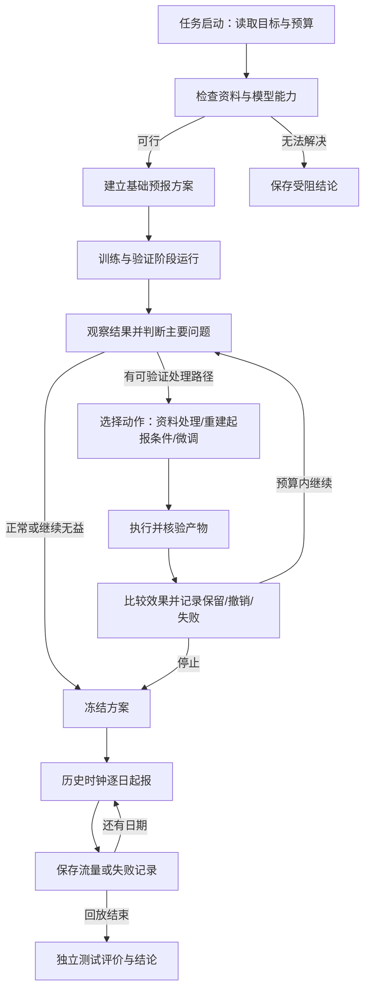

# 基于智能体的水文预报方案构建及参数优化系统
## V1.0 开发实施方案（以水文业务处理动作为核心的重设计版）

- 面向对象：河海大学数字孪生卓工班（二期）。
- 指导教师：方园皓，河海大学水文水资源学院副教授（按课题组提供信息记载）。
- 修订日期：2026 年 9 月 7 日。
- 当前阶段：方案设计。尚未开发 Agent、Skills、网页或完成模型本机复现。
- 配套文件：[预报处理动作设计](预报处理动作设计.md)、[导师审阅简版](课题方案简版（导师审阅）.md)。

## 1. 课题目标：自主完成预报工作

项目基于 Google OpenHydroNet，研究如何让 Agent 接替水文人员在资料检查、预报方案建立、误差判断、处理策略选择、参数调整、重算验证及事后复盘中的部分工作。

系统长期任务为：**在给定公开流域、数据条件与计算预算下，自主建立并验证预报方案，完成指定历史时段的逐日流量预报，并形成可追溯的结果和结论。**

用户不需要逐轮输入“分析洪峰”“调整参数”或“开始下一次预测”。初次部署配置数据来源、API 凭据及任务边界后，运行器由启动事件和历史时钟驱动。Agent 观察当前任务与证据，自主选择处理动作；正常情况下直接完成预报，有问题时排查与处理。网页承担查看、回放、导出和暂停，不以聊天框作为主入口。

这里的“替代”是可验证的任务承担：应证明 Agent 接过了哪些原需人员判断的环节，而不是宣称完全替代水文专业人员或具备生产防汛资格。

## 2. 已确认范围与设计原则

| 事项 | 本期约定 |
|---|---|
| 模型 | Google OpenHydroNet 优先，复用真实代码；不自行重写物理模型 |
| 数据与对象 | 美国或欧洲公开数据，一个目标流域，按数据条件选择；不固定 Fish River |
| 预报输出 | 日尺度，未来第 1、2、3 日站点流量；不等同于淹没范围预报 |
| 实验 | 历史回测；不接入实时业务、闸门控制和水库调度 |
| 算力 | 一台 M1 Pro，第三方 API 承担 LLM 推理；单机串行计算 |
| 开发方式 | 后续可由编码 Agent 开发；本次仅设计，不生成 SKILL.md 或实现代码 |
| 结果要求 | 自动产出预报及诊断记录；未提升、退化、受阻也要有结论 |
| 展示 | 网页、二维位置图、过程线、业务动作轨迹及答辩 PPT 素材 |
| 不设保证 | 不预设 NSE、不保证优于 Optuna、不保证每轮秒级或所有原因可诊断 |
| 备选 | 老师允许新安江模型，但不并行实施；Google 路线受阻时另作范围变更 |

设计顺序固定为：**人员工作 → 问题及证据 → 处理动作 → 验证与下一步 → Skills 边界 → 编排实现。**

前版六个 Skill 名称和有限超参数空间不再作为先验需求。先确定业务动作是否成立，再决定如何封装，不能围绕框架或固定技能数量倒推业务。

## 3. 系统的输入、输出和持久成果

### 3.1 输入由系统读取

- 初始任务：候选流域范围、目标预见期、历史运行时段、设备与计算预算。
- 数据清单：来源、变量、单位、发布日期/可得时间、覆盖、缺测和版本。
- 模型资料：模型配置、权重、缩放器、训练流域与截止时间、允许动作目录。
- 每次起报输入：截至起报时刻可得的历史气象，以及当时已发布的未来气象预报。
- 开发期反馈：训练/验证结果及已经完成的本次实验动作记录。

提供默认任务模板，允许自动筛选符合条件的示例流域。只有凭据缺失、合法数据不存在等无法自行解决的外部条件才输出受阻信息；不要求用户每轮给自然语言指令。

### 3.2 核心输出

每次起报必须产生一条明确记录：可用的未来 1—3 日流量预测，或带原因的未完成/受限记录。不得静默丢弃困难日期。

预测键为 `(basin_id, issue_time, lead_day, valid_time, plan_version)`；同时保存输入版本、气象来源、起报历史窗口、模型权重摘要及结果质量标记。日流量含义、时区与单位在协议中冻结。

模型返回的是确定值还是分布，以实际 head 和推理代码为准；概率输出的点预测归约方式需冻结并验证，不能直接假定返回字段都是 y_hat，也不凭空生成置信区间。

### 3.3 推荐预报方案的含义

方案是可重新运行的组合：数据来源与处理规则、模型及权重、起报历史窗口规则、输入缺失处置、执行预算、质量检查与诊断规则、允许调整动作、评价与停止条件。

参数集是方案的一部分。即使只有一个模型家族，Agent 仍可依据资料可用性、适配结果与预算构建适用方案；不要求凭空生成模型源码。

## 4. 从传统人员工作到本期 Agent 职责

| 人员工作 | Agent 的判断 | 可执行动作 | 本期边界 |
|---|---|---|---|
| 看资料是否可靠 | 缺测、时间、单位或版本是否有问题 | A01 检查、A02 有依据修复/补取 | 不任意修改真实观测 |
| 建立流域方案 | 已有模型是否兼容、是否需要准备基础模型 | A03 组装并试运行 | 模板内配置，不随意换架构 |
| 准备起报条件 | 历史窗口是否完整、状态缓存是否匹配 | A04 重建历史计算条件 | 不等同于物理土壤水同化 |
| 执行一次预报 | 数据与方案准备好后是否可直接计算 | A05 运行并检查输出 | 正常即使用，不强制调参 |
| 分析预报偏差 | 偏差是局部、持续还是输入/执行问题 | A06 分类、排查和形成假设 | 只在允许反馈的阶段看真值 |
| 选择改进措施 | 先修资料、重算，还是进行模型适配试验 | A02/A04/A07，或 A09 结束处理 | 有证据才干预，原因不唯一 |
| 比较处理结果 | 改善是否可重复、是否带来其他退化 | A08 对比、保留或撤销 | 相同输入与评价规则 |
| 确定可用方案 | 当前最好是否足够、继续是否值得 | A10 冻结 | 未改善可保留基础方案 |
| 按时预报与复盘 | 是否完成所有起报任务、有何限制 | A11 回放、A12 总结 | 测试真值不回流调参 |

动作定义及验证见[预报处理动作设计](预报处理动作设计.md)。A01—A12 是业务契约编号，不是已经实现的工具或 Skills。

## 5. 四类“调整”必须分开

### 5.1 输入数据处理

纠正有证据的单位、时间对齐、文件缺失、重复下载等问题。每次处理保留原始数据、依据和新版本。发现降雨偏少不能直接乘系数使流量拟合更好；气象产品替代必须在冻结规则内且符合当时可得性。

### 5.2 起报条件重建

利用合法历史窗口重新运行模型的历史部分，检查缓存和输入一致性。这是对计算起点的准备。不能把 LSTM 的某个隐藏维度解释成土壤蓄水量，更不能直接填一个“更湿”的数就声称完成水文状态校正。

### 5.3 模型参数与适配配置调整

在已排查基础问题后，使用训练资料进行受控微调；学习率、训练长度、可训练模块是可选手段。LLM 提出试验方案，优化器更新网络权重。它们不等于新安江模型中可解释的蓄水、分水源、汇流参数。

### 5.4 结果后处理

整体倍率、峰值放大、时间平移和平滑不作为本期默认纠错措施。它们可能掩盖错误来源或破坏预报时间边界。若以后研究后处理，须另设动作、独立对照与因果限制。

Agent 必须记录自己改变了哪一类对象。资料问题、状态准备问题和模型适配问题不能统一落成“调学习率”。

## 6. 自主工作循环与时间规则

### 6.1 三段任务，一次自动运行

**准备与改进阶段：** 自动检查数据、建立基础方案、在训练/验证资料上运行，观察问题并选择动作。达到停止条件后冻结推荐方案。

**独立回测阶段：** 历史时钟逐日起报，执行冻结的输入处理与预测规则。Agent 可处理数据可得性、执行失败等问题，但不能读取测试流量真值诊断后调参，也不能因预测值看起来“不够好”切换口径。

**总结阶段：** 全部指定起报日期已有结果或失败记录后，独立评价服务开放测试真值并汇总报告。报告流程只读，不能返回本轮改进阶段。

图为设计示意；具体合法分支由动作契约约束。资料版本在正式改进阶段若发生重大修正，必须重建共享基线后重新冻结比较条件，不能只给 Agent 使用修正后的数据。

### 6.2 一次决策的内容

每轮输出：观察事实与证据 ID、主要问题、待验证假设、选择动作及理由、输入与允许修改项、预期改变、验证条件、失败后的下一步。程序校验后才执行。

允许的有效决定包括“直接预报”“保持当前方案”“目前证据不足”“到达能力边界”。不以动作数量、调用次数或循环轮数衡量智能程度。

### 6.3 停止与资源边界

开发前的初始预算建议：最多 8 次模型适配候选；同一资料请求最多 2 次技术重试；结构化决策最多 2 次修复；另设整次运行时长、总动作数与 API 用量上限。数值在本机门槛测试后冻结，不能把此建议写成已验证最优预算。

没有新证据的相同失败动作不无限重复。预算耗尽、连续无实质改善、任务完成或动作不可执行时自动收尾；不等待用户“同意停止”。

V1.0 不实现每日在线重率定。未来若要用新增实测流量继续更新模型，须另设计逐时可得反馈与滚动评价协议，不能与本次封闭测试混称。

## 7. OpenHydroNet 能力依据与缺口

本次代码核查沿用锁定提交 `828dfc5a66f4e6f2c86b09d500e4547c4d92ed25`。核查是源码与配置阅读，尚未本机执行。能力分三类：**U：上游存在可复用机制；P：项目需开发并验证；X：本期不提供。** U 也不代表已经跑通。

| 能力 | 级别 | 核查与处理 |
|---|---|---|
| 模型训练、推理、局部模块微调 | U | 教程、训练配置与 BaseTrainer 存在相关实现，P0 验证真实梯度和产物 |
| 历史与未来气象输入处理 | U | 配置有 hindcast/forecast 输入及产品替代映射；需查实际发布时间 |
| 静态嵌入和输出头微调 | U | Mean Embedding 模型含 static_embedding_fc、head，训练器按 module_parts 解冻 |
| 隐藏状态保存、加载和热启动路径 | U | 两类模型源码存在相关机制；需验证时间、窗口、缓存与数值一致性 |
| 用历史窗口重新建立起报条件 | U+P | 可复用 forward，项目封装来源与状态一致性检查；首期优先完整历史重算 |
| 根据实测流量同化修正 LSTM 隐状态 | X | 已发现的保存/加载接口不能证明具备观测同化算法；本期不承诺 |
| 直接调整“土壤容量”“汇流速度” | X | 未建立 LSTM 参数与这些物理量的一一控制关系 |
| 资料质量诊断、动作决策及效果验证 | P | 项目工作核心，需工具、规则、证据和行为验收 |
| 自动选技能、执行业务循环 | P | 上游水文模型不自带本项目的人员替代流程 |
| 定量洪水淹没、水深、流速 | X | 站点流量输出不足以支持这些成果 |

起步优先官方教程的轻量 Mean Embedding 模型；Handoff 不强制同时开发。模型家族选择以兼容与成本为依据，而非名称先进程度。取得模块名、权重 shape 或输入契约不匹配时拒绝执行，不靠猜测绕过。

## 8. 数据与合法回测的前置门槛

1. 从官方示例覆盖的美国/欧洲流域中按变量覆盖、连续性、可达性和下载成本选择目标，记录候选与排除原因；不根据测试分数挑流域。
2. 优先复用 Caravan NetCDF 与官方气象数据接口，按需缓存；网页使用派生 Parquet。变量按实际模型需求取用，不额外要求不存在的 PET。
3. 核查基础模型、scaler、长期属性的来源与统计期。公开全球权重说明训练覆盖 1982—2023 年，不能拿重叠时期证明独立时间泛化；微调不会消除预训练泄漏。
4. 官方教学配置的验证/测试时段重合，正式研究必须重新划分。优先采用训练范围可核查的教学权重；不满足时评估自训一次轻量基础模型，不能在不合法的权重上硬做测试。
5. 用真实历史预报气象且可得时间确认的运行记为 A 模式；未来实测/再分析气象驱动的运行记为 B 模式“理想气象驱动回算”。可得时间不明则标注未验证，不宣称 A。
6. 模式在测试前冻结。A 模式运行中不得无声切到未来再分析输入；缺资料按既定规则记录失败或受限。

训练样本不得跨入验证/测试标签区间。预热资料可来自更早时间，但必须满足起报可得性。测试目标缺测不插值为真值；缩放器只使用合法训练统计量。流量单位若由径流深转换，使用已核查面积及 `Q(m³/s)=runoff(mm/day)×area(km²)/86.4`。

## 9. 动作选择怎样体现人员判断

Agent 首先判断问题属于资料、执行、起报准备、模型表现还是证据不足，再决定下一步。不能预设所有问题都有可用的微调解法。

| 观察现象 | 优先排查 | 有条件的处理 | 不允许的捷径 |
|---|---|---|---|
| 整体流量高出固定量级 | 单位、面积转换、重复累计 | 有来源依据才纠正并重算 | 直接缩放预测“对齐” |
| 某次洪峰偏低 | 对应气象可得性、缺失与事件匹配 | 先修合法资料；无资料问题再做适配试验 | 断言是土壤或降雨原因 |
| 多场洪峰偏低且其他表现正常 | 多事件一致性、训练目标和适配程度 | 对照微调模块或训练长度，检查其他指标 | 认定 head 必然控制洪峰 |
| 峰现时间偏移 | 时区、日聚合、lead 键、气象时序 | 修正确证的时间错误并重算 | 挪动未来预测填补当前起报 |
| 最近预报跳变或重复运行不一致 | 历史窗口、缓存、模型与输入摘要 | 完整历史重算；隔离失配缓存 | 修改 hidden/cell 数值凑平滑 |
| 训练好而验证差 | 多 epoch 曲线、是否只有少数事件 | 降低训练强度或缩小微调模块作试验 | 确认过拟合为唯一成因 |
| 新候选没有改善 | 对照条件、变化是否实际生效 | 撤销，换有依据的动作或停止 | 为显示智能体工作而继续盲试 |

这些是排查顺序与候选路径，不是已验证的因果规则。具体目标、阈值及失败分支详见动作文件。

## 10. 模型微调作为一种动作

只有处于开发改进阶段、资料与配置基本核查通过、已有模型偏差证据且预算允许时，Agent 才能提出模型适配试验。

初始允许学习率候选 `1e-5、1e-4、1e-3`，训练长度 `2、5、10 epochs`，模块范围“仅 head”或“static_embedding_fc + head”。这些是小规模试验起点，P0 后按兼容性冻结；不声称水文现象能直接决定某一数值。

Agent 应说明为什么本次选择某个动作。例如训练曲线显示继续训练可能退化，可提出减少训练长度的试验；仅观察洪峰偏低，不能直接推出应提高学习率。

每个候选从相同基础权重、初始化规则和指定 seed 开始；固定数据、模型结构、损失函数、训练样本与 batch 规则。记录每轮是否真正改变了允许模块、冻结参数是否保持不变。改变网络结构或数据版本是另一次方案变更，不得混在同一公平调参对照中。

## 11. 验证什么：预报效果与人员工作替代程度

### 11.1 两组互补实验

**业务动作实验：** 在开发数据及独立行为测试样例上，比较固定业务流程与 Agent。两者共享数据、工具、权限和预算；检查能否发现资料/起报问题、选择合适动作、避免无依据干预、完成恢复与结论。构造故障仅用于软件行为验证，不当作真实洪水研究数据。

**参数优化实验：** 在共同核查并冻结的输入上，比较无微调基础模型、固定微调、固定规则策略、Optuna 和 Agent。候选空间、基础权重、评价规则、尝试预算与重复 seed 一致。Optuna 回答“搜索效果”，不单独承担全部人员工作替代的比较。

先完成一次贯通，正式结果目标为三次独立重复；资源不足时在测试前声明探索性单次结果，不能包装为稳定优势。正常资料本来就可直接预报的场景必须纳入，检验 Agent 是否会过度干预。

### 11.2 行为证据

记录问题发现率、错误报警、有效动作比例、非法动作拒绝、无益干预、任务完成率、人工介入次数、时间和 API 成本。每项都给分母与样本数。没有真人对照时，不估算或宣传“节省多少人员工时”。

### 11.3 公平性与成本

非法提案、重复候选、训练失败和重试全部入账。相同候选允许缓存，但报告实际时间与原始执行成本；同一方法不能靠免费缓存虚增预算。独立重复隔离记忆，测试报告不进入搜索知识。

动作修复数据带来的收益与微调收益分别报告。发现共享数据存在错误时，所有方法基线一起更新，不能把条件差异算成 Agent 优化优势。

## 12. 指标、事件与保留规则

按 lead=1/2/3 分别计算 NSE、KGE 2009、RMSE、MAE、PBIAS，明确样本数、流量单位和空值原因。`PBIAS=100×Σ(Qpred−Qobs)/ΣQobs`，正值为高估；常数观测或零分母不能写成有效高分。

拟定的统一候选排名为三种预见期 NSE 的平均值 S。初始保留规则为：S 比当前最好提高至少 0.001，且任一 lead 相对基础模型不恶化超过 0.03；存在高流量事件时漏报和误报数均不增加。数值属于项目初始设计，门槛测试后在正式对照前冻结，Agent 不可自行更改。

每个处理动作还有自己的核验目标，例如单位恢复、输入完整、输出重现或峰值误差减少。**故障修复成功不等于模型精度提升；目标误差改善但不满足统一采用条件，也可以记录为局部有效并拒绝替换。**

事件以训练期实测 P90 定义研究性高流量阈值，不等同于官方洪水警戒值。初始规则为连续超阈值成事件，间隔不超过 2 日合并；前后各扩 2 日评价窗，重叠按峰日中点分割。并列峰取首次，截断事件注明。

每个固定 lead 上识别预测事件，以峰日差不超过 2 日、最小绝对差优先并按日期打破平局做一对一匹配。未匹配分别计漏报/误报，报告事件峰值、峰时和窗口水量误差。无匹配不能记零误差；事件少时只作案例解释。日尺度评估不能宣称瞬时洪峰或亚日预报精度。

所有指定起报日期保留状态。展示共同有效样本上的精度，同时报告覆盖率与各方法缺失/失败日期；不能通过拒绝难事件获取漂亮分数。新方案失效时使用已验证基础方案须依冻结规则并明确标记；仍无有效输出则报告失败。

## 13. Skills 从动作契约中推导

本期设计阶段不创建技能文件、不承诺固定六项技能。动作稳定后，按可复用工作方法聚合为候选技能边界：资料审查与有依据处理、方案建立与起报准备、误差排查与措施选择、适配试验及效果复核、成果解释与答辩材料。

一个 Skill 可协调多个动作，也可被多个业务阶段复用。最终须包含适用条件、证据要求、动作步骤、工具契约、验证标准、失败处理与方法来源；是否拆分以输入输出稳定性决定，而非节点数量。

参考资料和培训案例属于方法素材，检索辅助判断；未核查的教学阈值不能变成可执行规则。实验记忆与通用方法资料分开，前者受 experiment_id 与阶段隔离。

后续采用 Agent Skills 格式时，运行时必须具备目录发现、按阶段过滤、选择、按需加载和产物记录。第三方 API 不会自动执行本地 SKILL.md，项目服务端负责工具权限；开发者编码工具中安装的 Skills 不能作为网页能力完成证据。

## 14. 编排设计服务于自主业务循环

LangGraph 管理任务状态、合法分支、等待、检查点与恢复；LangChain 模型组件连接第三方 API；项目工具执行数据、评价与任务管理；OpenHydroNet 负责数值计算。框架不负责证明水文诊断正确。

实现基线采用 Python 3.12 或锁定上游允许的更高版本、FastAPI/Pydantic、SQLite、NetCDF/Parquet，前端采用 Vue 3、ECharts 和 Leaflet。依赖版本在本机兼容性验证后锁定，模型环境可与编排服务通过本地任务接口隔离。

业务节点按“观察—判别—选择动作—执行—核验—记录—下一步”组织；资料正常且方案可用时可直接进入预报。简单校验由程序执行，只有需要判断和解释时调用 LLM，不能为每个文件读写都增加模型调用。

状态至少包含 mission_id、phase、issue_time、plan_version、dataset_version、问题与证据引用、action_id、候选配置、job_id、结果与预算、当前最佳方案、停止原因；后续增补技能版本。大时序与权重保存在文件，状态只存引用。

训练提交与等待分节点；幂等键绑定实验、逻辑动作、配置摘要和 seed。worker 落盘结果后由协调器恢复等待图，同一实验单执行者，重复和迟到事件去重。SQLite 保存账本与持久检查点；图恢复不能被当作模型从任意 batch 无损续训。

暂停在安全边界生效，取消后不能自动重启任务。状态恢复先对账已提交/已完成动作，避免重复训练与重复扣预算。最终测试与报告独立于可回环的优化图，加载 Skills 也不能扩大权限。

## 15. 网页与答辩：让人看懂 Agent 接过了什么工作

网页主页面以任务进度和结果为中心，启动后自动运行，无逐轮提问或批准要求。

| 页面 | 内容 |
|---|---|
| 预报总览 | 当前任务、流域位置、最新起报、未来 1—3 日流量、质量状态和完成比例 |
| Agent 工作过程 | 发现的问题、证据、选了什么动作、为什么、处理后怎样、下一步；正常直接预报也显示 |
| 预报回放 | 单次起报的历史与未来分区；另提供固定 lead 序列，不混用两种口径 |
| 方案与实验 | 方案版本、动作改动、基础/规则/Optuna/Agent 对照、成本与失败结论 |

过程线包括观测、基础预测和当前方案预测，单位与起报时刻明确。测试回放未解锁时不显示未来真值；最终展示的真值标为事后参照。地图仅解释研究对象，不做无模型支持的淹没动画。

答辩建议 12 页：课题问题、人员工作流程、系统输入输出、动作体系、Google 能力边界、自主循环、数据与时间协议、典型处理案例、预测对照、成本与失败、网页演示、结论与限制。

必备图表：人员工作与 Agent 对应图、问题—动作流程图、起报时间图、流域与数据覆盖、处理前后过程线、动作证据卡、指标—lead 曲线、效果—成本曲线、失败案例与覆盖率表。所有结果图来自真实记录，带来源 ID；静态方法图可先准备，未完成实验的结果页不得填造分数。

最终拟交付可编辑 PPTX、讲解提纲及 SVG/PNG/CSV 图表素材。现场优先回放真实历史运行，标明回放；不依赖现场长训练或 API 可达。

## 16. 本机实施顺序与验收

| 阶段 | 要解决的问题 | 验收证据 |
|---|---|---|
| G0 能力与资料门槛 | 模型、数据、合法独立期及 M1 Pro 是否支持 | 一次推理、小微调、输入/输出结构与耗时内存报告 |
| G1 基础预报闭环 | 不用 Agent，是否能正确逐日起报 | 固定流程的完整起报清单、预测键与失败记录 |
| G2 动作可执行性 | 每个业务动作是否有真实工具和核验 | A01—A12 动作测试，支持/不支持目录 |
| G3 自主判断闭环 | Agent 能否根据问题选动作并验证 | 正常不干预、确证资料修复、候选退化撤销、能力不足停止等轨迹 |
| G4 方法封装 | 哪些动作适合成为可复用技能 | 再确定 Skill 边界、契约与运行时加载，不能先用空文件交差 |
| G5 正式对照 | 预报效果与工作承担程度如何 | 冻结协议、完整重复账本、独立测试与失败结论 |
| G6 展示交付 | 人能否理解并复现过程 | 真实网页、答辩图表、复现说明及限制 |

CPU 首先跑通，MPS 作为验证后的加速选择；macOS 原生训练，不假定 Docker 支持 MPS。记录实际内存，串行训练，缓存限额从保守设置起步。资源不足先调整 batch、缓存和统一预算，不能用预训练泄漏或取消失败日期换取通过。

代码、接口与具体技能目录在 G2/G4 后细化。本设计不提前规定大量 REST 接口和文件树。

## 17. 什么算完成，什么还不能声称

软件完成必须有：真实起报输出、自动驱动、问题与动作记录、动作后核验、失败收尾、版本与成本追溯，以及无需逐轮人员提示的演示。

实验完成必须有：合法时间边界、与固定流程和参数优化方法的适当比较、全部起报状态、真实评价、失败与能力不足结论。没有优势可以完成研究；没有独立测试或无法运行模型，不能声称完成预测研究。

本期不声称：完全替代预报人员、自动识别所有水文成因、掌握 LSTM 内部物理状态控制、可以部署用于实际洪水应急。

相比前版，核心变化为：从“自动搜索参数＋技能目录”调整为“自动完成预报任务，遇到问题时选取有依据的处理动作”。参数适配只占其中一条分支；不处理、重建起报条件、修复确证错误和报告受阻都是正式动作。

## 18. 依据与待实测事实

以下资料支持模型、编排与技能格式；业务动作和资源预算是本项目设计，不是官方效果承诺。上游代码固定到同一提交，更新前重新核对能力。

1. [Google OpenHydroNet 官方仓库](https://github.com/google-research/flood-forecasting)：代码入口、模型与教程概览。
2. [Google 发布说明](https://research.google/blog/the-next-chapter-in-flood-resilience-open-sourcing-googles-hydrology-framework/)：框架定位与复用背景。
3. [锁定版本的教学说明](https://github.com/google-research/flood-forecasting/blob/828dfc5a66f4e6f2c86b09d500e4547c4d92ed25/docs/source/tutorial/tutorial.rst)：教学性质与小规模模型限制。
4. [锁定版本的训练配置](https://github.com/google-research/flood-forecasting/blob/828dfc5a66f4e6f2c86b09d500e4547c4d92ed25/tutorial/configs/train-config.yml)：模型、数据、CPU、切分与替代映射。
5. [锁定版本的微调配置](https://github.com/google-research/flood-forecasting/blob/828dfc5a66f4e6f2c86b09d500e4547c4d92ed25/tutorial/configs/finetune-config.yml)：微调模块与参数适配依据。
6. [锁定版本的预训练权重说明](https://github.com/google-research/flood-forecasting/blob/828dfc5a66f4e6f2c86b09d500e4547c4d92ed25/pretrained-models/Pretrained-Models-README.md)：1982—2023 年训练范围和使用限制；局部微调示例不能豁免其预训练时间重叠问题。
7. [锁定版本的安装要求](https://github.com/google-research/flood-forecasting/blob/828dfc5a66f4e6f2c86b09d500e4547c4d92ed25/setup.py)：Python 版本与命令入口。
8. [OpenHydroNet Quick Start](https://openhydronet.readthedocs.io/en/latest/usage/quickstart.html)：安装及数据接入说明；实际命令以锁定代码为准。
9. [LangGraph 官方概览](https://docs.langchain.com/oss/python/langgraph/overview)：状态图编排与 LangChain 的关系。
10. [LangGraph 持久化](https://docs.langchain.com/oss/python/langgraph/persistence)：checkpointer、thread_id 与本地 SQLite。
11. [LangGraph 中断与恢复](https://docs.langchain.com/oss/python/langgraph/interrupts)：interrupt、Command 与节点重执行语义。
12. [LangChain 模型组件](https://docs.langchain.com/oss/python/langchain/models)：模型接入与结构化输出能力。
13. [Agent Skills 格式规范](https://agentskills.io/specification)：SKILL.md、资源目录与按需加载。
14. [Agent Skills 集成指南](https://agentskills.io/client-implementation/adding-skills-support)：技能发现、选择、加载与运行时接入。
15. [Mean Embedding 模型源码](https://github.com/google-research/flood-forecasting/blob/828dfc5a66f4e6f2c86b09d500e4547c4d92ed25/googlehydrology/modelzoo/mean_embedding_forecast_lstm.py)：实际模块、forward、状态保存与加载。
16. [Handoff 模型源码](https://github.com/google-research/flood-forecasting/blob/828dfc5a66f4e6f2c86b09d500e4547c4d92ed25/googlehydrology/modelzoo/handoff_forecast_lstm.py)：历史计算与热启动路径。
17. [训练器源码](https://github.com/google-research/flood-forecasting/blob/828dfc5a66f4e6f2c86b09d500e4547c4d92ed25/googlehydrology/training/basetrainer.py)：模块解冻、训练与模型产物保存。
18. [新安江状态更新研究](https://hess.copernicus.org/articles/29/335/2025/index.html)：用于区分传统模型参数与状态更新，不能作为 LSTM 已支持同化的证据。
19. [NWS 水文模型率定资料](https://www.weather.gov/owp/oh_hrl_modelcalibration_outline)：人员工作与自动率定方法的背景。

待实测：目标流域、具体切分、输入发布时间、权重训练范围、模型输出解析、微调生效、状态重建一致性、CPU/MPS 耗时、可承担的预算。资料或能力不满足时，自动形成具体受阻报告，保留完成与未完成的区别。
