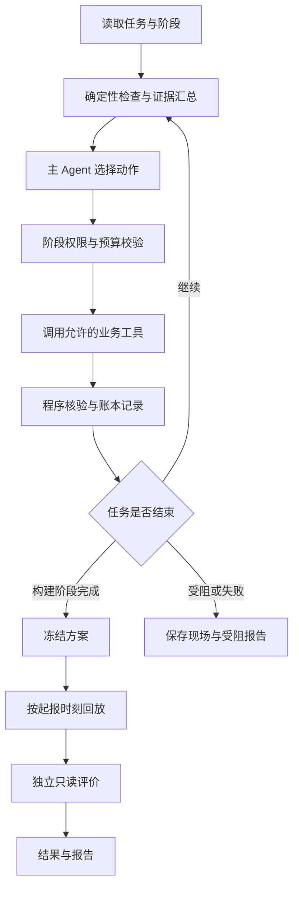

# 基于智能体的水文预报方案构建及参数优化系统
## V1.0 总体实施方案（人工减负与业务动作版）

**面向：** 河海大学数字孪生卓工班（二期）

**指导教师：** 方园皓，河海大学水文水资源学院副教授

**修订日期：** 2026 年 9 月 7 日

**项目状态：** 设计阶段；模型、数据、算力与人工减负效果尚待实验验证。

## 1. 课题目标与研究定位

本课题面向日尺度水文预报中的资料核查、方案配置、异常排查、模型适配和结果复核，构建一个自主调用水文模型与专业工具的智能体。系统读取预设任务后持续执行，依据证据选择下一步动作，完成后交付预报、处理记录及报告；人员无需逐轮输入指令。

**主研究问题：在相同数据、工具和资源约束下，智能体能否在满足预报质量及任务完整性要求的前提下，减少人员主动操作、异常处理和返工时间？**

围绕这一问题开展三项验证：

1. 对比“人员＋共同工具”，测量人员主动工时是否下降。
2. 对比固定自动化流程，检验 Agent 是否更能处理需要组合证据和选择路径的异常。
3. 在资源允许时，对比通用 Agent，检验经核对的业务动作知识是否减少错误干预。

参数优化是处理措施之一。系统既要能够启动有依据的适配，也要能维持正常方案、撤销无效试验和明确报告能力不足。项目先形成工程验证成果，创新程度依据与已有研究的差异及实测结果确定。

## 2. 范围与交付边界

| 项目 | 本期设计 |
|---|---|
| 空间范围 | 一个公开数据流域；第二流域属于扩展 |
| 预测对象 | 站点未来第 1、2、3 日流量及日尺度高流量过程 |
| 应用方式 | 历史起报回放；正式回放前冻结方案 |
| 计算条件 | 一台 M1 Pro，CPU 为可验证起点，MPS 加速需单独测试；第三方 LLM API |
| 模型路线 | 优先 Google OpenHydroNet 的轻量示例模型与局部适配 |
| Agent 组织 | 一个主 Agent；确定性程序完成检查、计算、优化和验证 |
| 交互方式 | 任务配置一次；自动运行；网页查看、暂停、恢复和异常接管 |
| 成果 | 网页工作台、预报方案包、预测文件、动作账本、H/P/A 对照结果、结题报告、答辩 PPT 与图表 |

本期不以小时级山洪预警、洪水淹没、水深流速、调度控制、全球模型训练或自主学习新的水文机理为交付目标。新安江保留为导师已允许的替代路线；若启动替代，单独修订模型适配与评价协议，不把两类模型参数混写。

## 3. 文献基础与拟验证的贡献

已有研究覆盖 LLM 率定、水文建模自动执行、网页平台，以及将预报员经验组织为 Skills。因此，本项目不将 Agent、Skills、LangGraph、网页或优化器的使用本身表述为首创。

| 已有研究 | 本项目采用的经验 | 本项目仍需验证的内容 |
|---|---|---|
| Yang 等的 Skills 水文预报框架，2026，预印本 | 专家经验、数值工具和流程规则分工 | 限定任务内，减少中途干预能否带来净工时收益 |
| Zhu 等的 LLM 率定研究，GRL，2026 | 与传统优化做公平比较，保留负结果 | 智能体是否减少错误适配和无效试验 |
| Yan 等的水文 Agent，GRL，2026；HydroCraft，J. Hydrology，2026 | 工具化、任务执行及产物追溯 | 相同工具下比固定流程多解决了哪些问题 |
| MADR，2026，预印本 | 以过程特征组织诊断依据 | 单流域任务是否需要 LLM 的路径选择能力 |
| 人员预报与自动化相关研究 | 按具体职责和结果评价人机分工 | 学生与专业人员结论分开，计算耗时与人工工时分开 |

拟验证的贡献为：可追溯的业务动作闭环；动作选择与数值搜索分离的模型适配机制；同时覆盖人员工时、处理正确性和预报质量的对照证据。这些为项目研究内容，不能预先写成已实现、已证明的新方法。

详细文献与阅读范围见[文献审查](文献对照与人工减负可行性审查.md)。

## 4. 系统输入、输出与任务定义

### 4.1 一次性任务配置

配置由课题开发者准备默认案例，可由网页读取，无需终端用户填写专业模型参数。必须明确：流域、起报范围、模型版本、数据来源、运行模式、预算、验收规则和停止条件。无人逐轮指挥不等于系统无需目标或可以猜测缺失信息。

输入分为：

- **模型输入：** 所选模型要求的历史气象、未来气象驱动、流域属性及必要历史窗口；按真实输入契约取用。
- **评价资料：** 实测流量及其发布时间、质量标记；用于合法训练、历史诊断和事后评价，不默认它必然是 LSTM 直接输入。
- **方案资料：** 权重、配置、缩放器、模型代码版本、训练时间范围及来源。
- **运行约束：** 允许动作、候选空间、计算及 API 预算、阶段权限。

### 4.2 两种实验模式

| 模式 | 未来气象来源 | 可支持的结论 |
|---|---|---|
| F：历史预报驱动 | 起报时已发布且可获得的历史气象预报 | 在所验证信息条件下的历史提前预报表现 |
| R：理想气象驱动回算 | 未来实测或再分析气象 | 已知未来气象条件下的水文计算、适配和流程表现 |

F 是目标模式。若只能获取 R 模式所需资料，明确降为回算实验并记录范围缺口；不能称为已完成真实提前预报验证。正式实验中各组使用相同模式，禁止缺资料时无声切换。

### 4.3 任务与产物

一个评价任务包是有起点、问题条件、产物要求和预算的完整工作单元，可包含一段连续起报日期。起报日期不自动等于独立实验样本。

每次起报保存 `basin_id、issue_time、target_time、lead_day、q_pred、unit、scheme_id、data_snapshot_id、mode、quality_flag`。每个任务交付：

1. 预报方案包：模型、配置、数据映射、时间协议和版本引用。
2. 预测及质量标签：有缺口时记录缺口，不能用伪造结果补齐。
3. 动作账本：现象、证据、假设、工具、结果、验证和成本。
4. 状态与报告：完成、受限完成、受阻或失败；未解决事项和下一步所需条件。

## 5. 模型与流域选择：先通过可行性门槛

### 5.1 模型依据

沿用源码核查版本 `828dfc5a66f4e6f2c86b09d500e4547c4d92ed25`。官方教程含 Mean Embedding Forecast LSTM 的局部微调路径；对应模块名是 **`static_embedding_fc`**，不是 `static_attributes_fc`。教程存在并不表示项目已完成推理、微调或 MPS 验证。[教程配置](https://github.com/google-research/flood-forecasting/blob/828dfc5a66f4e6f2c86b09d500e4547c4d92ed25/tutorial/configs/finetune-config.yml)

本机先验证单流域推理和一次小规模微调，记录环境、耗时、峰值内存、模块更新及产物。MPS 不通过则使用 CPU；若 CPU 预算也无法承受，缩小模型/样本/候选规模并重新报告范围，不能直接承诺“非常适合本机”。

### 5.2 首选候选流域

首选核查 **South Fork Payette River at Lowman, Idaho，USGS 13235000**。官方 Notebook 将 `camels_13235000` 设为示例微调流域，USGS 核对了站点名称。[官方 Notebook](https://github.com/google-research/flood-forecasting/blob/828dfc5a66f4e6f2c86b09d500e4547c4d92ed25/tutorial/OpenHydroNet_Tutorial.ipynb)；[USGS 站点](https://waterdata.usgs.gov/monitoring-location/USGS-13235000/)

采用理由是教程接口与复现便利，不能为了保证改善而选择低分测试流域。正式使用前核查数据时间覆盖、变量、面积、气象发布时间、融雪和人为调节等流域特点；不预设其代表所有降雨洪水流域。South Yamhill 可作为后续候选，首期不要求同时实现。

候选不通过时，根据资料可用性与算力选择下一对象，保留排除原因；禁止按独立测试分数挑流域。

### 5.3 权重与时间合法性

公开全球权重说明其训练覆盖 1982—2023 年且没有时间留出。不能直接用其在重叠时期的分数证明独立时间预报能力；微调不会消除这个问题。官方教学配置也存在验证与测试时期重合，正式实验须重新划分。[权重说明](https://github.com/google-research/flood-forecasting/blob/828dfc5a66f4e6f2c86b09d500e4547c4d92ed25/pretrained-models/Pretrained-Models-README.md)；[教学配置](https://github.com/google-research/flood-forecasting/blob/828dfc5a66f4e6f2c86b09d500e4547c4d92ed25/tutorial/configs/train-config.yml)

优先查清轻量教学权重的训练范围。若不可核查，可评估在合法开发资料上自训一次轻量基础模型；若采用全球权重，独立时间测试须严格晚于其及后续适配所用资料，并取得对应驱动。正式日期在数据审计后冻结，不在本方案中虚构可用年份。

## 6. 业务人员的工作怎样转成 Agent 动作

为与已有项目文档兼容，保留原 A01—A12 编号；动作契约见[预报处理动作设计](预报处理动作设计.md)。

| 人员工作 | 动作 | 智能体负责的判断 | 程序负责的执行与核验 |
|---|---|---|---|
| 核查资料及预报条件 | A01 | 组合异常证据，决定查什么 | 完整性、单位、时间、来源检查 |
| 追查与补取资料 | A02 | 选择有依据的来源或修复路径 | 获取、确定性转换、差异核验 |
| 配置预报方案 | A03 | 选择兼容模板及可用路径 | 校验模型、配置、权重和小窗试运行 |
| 准备起报条件 | A04 | 判断是否需重建历史计算 | 按合法窗口重算，检查缓存一致性 |
| 运行与检查结果 | A05 | 对异常产物选择后续处理 | 模型执行、结构及数值检查 |
| 分析偏差和替代解释 | A06 | 基于合法历史证据形成假设 | 生成过程线、分段指标和证据摘要 |
| 决定并执行有限适配 | A07 | 是否适配、采用哪类允许策略 | 优化器搜索配置，训练器更新权重 |
| 比较并采用或撤销 | A08 | 解释目标是否解决及剩余问题 | 统一评分、质量门槛、版本回退 |
| 恢复、维持或报告受阻 | A09 | 换路径、保持方案或停止 | 有限重试、恢复现场和记录状态 |
| 冻结推荐方案 | A10 | 汇总推荐依据与限制 | 冻结权重、配置、规则和来源 |
| 连续起报 | A11 | 在允许范围内处理运行异常 | 自动推进日期，保存预测与质量标记 |
| 评价与报告 | A12 | 汇总事实、假设和失败结论 | 只读评价、图表、工时及费用汇总 |

Agent 不能只输出“可能需要优化”；必须选择一个可执行动作或有依据的结束状态。程序能直接判断的检查无需 LLM 重复计算。

## 7. 三阶段运行与自主循环

### 7.1 B：方案构建与历史适配

使用训练资料与验证资料，开展 A01—A09。只有在真值已合法获得且属于开发资料时，才计算预报误差并考虑适配。连续误差是检查依据，不直接等于模型参数存在问题。完成后 A10 冻结方案。

### 7.2 F：冻结方案的历史起报回放

按历史起报时刻推进 A11。模型权重、候选规则、Skills、数据策略及质量门槛均已冻结。只允许当时可得资料的取数、已定义转换、历史条件重建和技术恢复。**本期独立测试不根据测试真值调整模型、提示词、策略或方案。**

### 7.3 E：只读评价与复盘

由独立评价器读取测试实测值，A12 生成评价和报告；工具权限不允许训练或改写已冻结预测。测试中发现的新问题保存为下一版本研究材料，下一版本需要新的留出测试。

起报时，未来实测曲线不能提供给 Agent 或模型；网页也按阶段显示，已发生且已发布的观测与未来目标明确分开。回放结束才开放完整对照图。

## 8. 诊断、策略与数值搜索的分工

### 8.1 结构化诊断

程序提供资料覆盖、单位/时间核查、各 lead 的误差、总体及高流量偏差、事件峰值/洪量/峰现日期偏差等。在样本不足、序列恒定或分母接近零时，标为不可计算并说明原因，不生成误导分数。

Agent 输出：现象、证据 ID、候选解释、替代解释、下一动作、预期验证结果及停止条件。诊断属于待检验假设，不因自然语言通顺就视为物理因果证明。

例如多场高流量低估时，先检查资料、时间与历史条件，再确认是否有足够开发样本支持适配。若气象驱动或数据来源无法解释清楚，应保留不确定性，不能用模型微调掩盖资料问题。

### 8.2 允许策略

| 策略 | 启用依据 | 结束方式 |
|---|---|---|
| 维持当前方案 | 输入和产物合格，无充分适配依据 | 正常预报与归档 |
| 资料修复后重算 | 来源证实转换、缺测或时间问题 | 核查修复，再用相同模型重算 |
| 重建历史计算 | 窗口或缓存与方案不匹配 | 从合法历史重算并检查一致性 |
| 局部模型适配 | 资料检查通过，有持续验证偏差且资源允许 | 优化器执行有限候选，接受或撤销 |
| 受阻收尾 | 资料、工具、预算或证据不足 | 保存现状，说明需补充的条件 |

### 8.3 第一版适配空间

首期只提供“维持模型”和“微调 `static_embedding_fc`”两类模型策略。默认不调整全部 LSTM，不把静态嵌入解释为某个物理参数旋钮。是否增加 `head` 等策略取决于独立的开发期机制验证，不在测试后临时扩充。

数值搜索由优化器负责，LLM 不直接指定权重或连续超参数值。拟用学习率 `{1e-5, 1e-4, 1e-3}` 与训练轮数 `{2, 5}` 组成最多 6 个候选，由 Optuna 的固定网格策略执行；候选范围是先导实验起点，正式比较前按本机成本冻结。训练样本窗口、损失、batch、基础权重及 seed 配套规则固定，首期不同时搜索历史窗口和 early stopping。

每个候选从同一基础权重开始；跨候选累积训练会破坏对照。参数必须真实更新、非目标模块保持冻结。模型输出由程序评分，Agent 不决定评分公式。

### 8.4 接受与撤销

主排序暂定验证集三个预见期 NSE 的等权平均；KGE、事件误差、覆盖率及其他质量门槛单独报告。正式实验前确定每个预见期允许退化量、事件指标容忍范围和最低覆盖率；Agent 不可改门槛。分数不可计算时不自动接受。

放弃新稿中未经量纲处理的任意加权总分。最小改善门槛、质量容忍差需经先导试验和导师核对冻结，无足够证据时维持原方案。训练成功不等于适配成功；未提升、退化和预算耗尽都要保留账本。

## 9. Skills 与 LangGraph 编排设计

### 9.1 Skills 是可复用的处理方法

首期暂分五个业务包，依动作契约和试验结果调整边界；当前仅设计，不生成可加载的 Skill 文件。

| 业务包 | 覆盖动作 | 应携带的工作方法 |
|---|---|---|
| 资料核查与追查 | A01—A02 | 异常分类、来源核查顺序、合法转换和补取验证 |
| 方案与预报执行 | A03—A05、A11，复用 A09 | 配置兼容、历史条件、运行恢复与输出检查 |
| 预报诊断 | A06 | 多证据排查、替代解释、样本不足及不干预判断 |
| 有限适配与方案验证 | A07—A10 | 策略启用、搜索委托、验收、回退和冻结 |
| 评价与报告 | A12 | 只读评价、事实与假设分开、失败结论和工时核算 |

每个包设计触发条件、允许输入、步骤、工具、证据要求、反例、停止/接管条件及输出契约。知识来源包括官方文档、相关论文和经导师核对的案例；每项经验记录来源、适用范围、版本与测试案例。Skills 应包含“怎么处理”的方法，而不仅是禁止事项。

### 9.2 自主查询循环

LangGraph 管理单主 Agent 的状态、条件路由、检查点和恢复；LangChain 的模型适配组件接入第三方 API。执行结构是“观察证据—选择动作—调用工具—核验—继续/结束”，不是给每个 Skill 各配一个 Agent。[LangGraph 说明](https://docs.langchain.com/oss/python/langgraph/overview)

运行状态至少含任务 ID、阶段、逻辑起报时间、资料快照、当前方案、问题与证据、已尝试动作、工具结果、预算、产物及结束原因。Skills 按需加载，工具参数需通过结构校验。相同动作和输入已有成功产物时优先复用，不重复计费或训练。

每个逻辑工具调用分配唯一 ID；长计算单进程排队，完成后唤醒主循环。恢复先查已有任务和产物，再决定重试，避免检查点恢复导致重复训练。API 错误只做有上限重试；同一失败动作无新证据不重复执行。

资源上限包括决策轮数、工具超时、候选数、总历时和 API 费用；开发先导期可从 20 轮主决策、6 个候选、同一技术故障最多 2 次重试起步。批量起报由确定性工具完成，不要求每天消耗一轮 LLM。正式预算实测后冻结。

### 9.3 权限与人员接管

允许工具由阶段、动作及任务配置共同决定，并在执行器校验。仅在 SKILL.md 写明限制不足以阻止误调用。[Skills 格式](https://agentskills.io/specification)

常规任务无需人工批准每一步。遇到不可恢复条件时，形成可直接接续的受阻包：问题、已查证据、已尝试措施、现有可用产物和所需条件。研究实验按预定规则计为受阻/失败或人工接管，不把暂停时长隐藏。最终人员核验算入工时，业务预警签发不属于本期任务。

## 10. 实验设计：减负是主线

正式协议见[实验与验收协议](实验与验收协议.md)。

| 组别 | 设置 | 必须回答的问题 |
|---|---|---|
| H | 人员使用同样检查、模型、优化及绘图工具 | Agent 相比人员操作是否节省净工时 |
| P | 固定 Pipeline，含正常质量检查、重试及预定适配规则 | Agent 相比常规自动化是否有额外价值 |
| A | 一个主 Agent，使用业务 Skills 和同样工具 | 能否正确选择处理路径并完成任务 |
| A0（扩展） | 同一 LLM 与工具，移除专门业务方法指导，保留通用技术约束 | 业务知识是否减少错误干预 |

基础模型与有限适配的比较是模型可行性子实验，目标为检验是否有效及其边界，不以“必须证明改善”作为通过条件。

计划 15 个冻结任务包：正常 4、数据异常 3、运行异常 2、模型偏差 4、证据不足 2。开发试例与正式任务分开；真实问题与注入故障分开标记。对照前确定任务验收标准，不能让 Agent 读取隐藏答案。正式比较不能在同一批任务上边改 Skills 边报告分数。

真人实验先做小型试运行以校正任务和计时，再冻结协议开展正式 H/P/A。参与者熟悉度、培训和任务顺序要记录。若只有学生参与，结论限定为学生/模型使用者，不能宣称已证明替代专业水文人员。

## 11. 指标、成本与结论规则

**主指标为人员主动工时：准备＋理解异常＋复核＋接管＋纠错＋报告修订＋最终核验。** 等待计算的历时单列，需要持续监视的劳动仍计入主动时间。

报告所有任务的成本与状态，并单列共同合格任务的配对工时差。节省率 `(T_H − T_A) / T_H` 在 `T_H > 0` 时计算；不能只保留 Agent 成功任务。必须结合合格完成率、质量约束和无接管合格完成率判断减负。

辅助指标包括各 lead 的 NSE/KGE、Bias、高流量与事件误差、缺失覆盖；错误动作请求/拦截/实际修改、不必要干预、接管和无效试验；API 实际费用、计算时间和总历时。连续日期及重复调用不当作独立人员样本。

15 个任务属于探索性工程试验，不预先保证统计显著。完整比较后可得出有效、无优势、局部有效或存在风险等结论；实验失败也须满足数据真实、对照完整、方法可复现。能否满足课程结题要求由导师和课程标准判断，不能承诺任何负结果都会自动结题。

## 12. 网页与答辩设计

首页是预报工作台，默认展示预设案例、任务状态、流域、起报时间、预测与质量标记。二维地图说明流域位置，过程线说明水文变化。

| 页面 | 内容与目的 |
|---|---|
| 当前任务 | 运行阶段、输入覆盖、预报及受阻事项；无需聊天启动每个动作 |
| 过程线 | 历史观测与各 lead 预测；完成评价后再显示未来真值和方案对比 |
| 处理记录 | 发现的问题、证据、动作、核验、保留/撤销、人工介入与耗时 |
| 方案实验 | 基础与候选指标、版本、预算及失败原因 |
| 减负评价 | H/P/A 工时分解、合格完成率、接管与错误处理对照 |
| 报告导出 | 真实数据图表、汇总表、结题报告素材和 PPT 配图 |

答辩建议 12 页：问题与人员劳动、文献与定位、输入输出、动作与 Skills、模型数据门槛、自主循环、时间边界、典型处理、H/P/A 设计、质量与工时结果、失败与局限、交付与结论。当前可准备方法图，不填造结果曲线或减负比例。

## 13. 技术与存储

拟采用 Vue 3＋TypeScript＋ECharts 前端，FastAPI 后端，LangGraph 编排，LangChain 模型接入，OpenHydroNet/PyTorch 计算，Optuna 有限搜索，SQLite 与本地文件存储。版本在 G0 环境验证后锁定。先采用本地单任务执行，避免并行训练挤占内存。

数据保持“原始快照—派生输入—模型与配置—预测—指标—动作记录—工时—报告”的引用链。关键产物记录内容哈希及版本；费用和账本只追加，模型接受通过更新方案引用完成，原始文件不覆盖。网页、报告及实验统计读取同一份账本。

## 14. 实施阶段与完成门槛

| 阶段 | 工作 | 通过证据 |
|---|---|---|
| G0 数据与模型门槛 | 核查流域、时间、权重、输入与 CPU/MPS；完成一次推理 | 可复现真实输出、模式标记、资源实测与合法切分 |
| G1 共同工具 | 数据核查、重算、微调、比较、回退、图表 | 相同条件结果一致、微调更新正确、失败状态完整 |
| G2 Pipeline 与先导任务 | 建立 P、开发试例及人工操作步骤；核对少量业务案例 | 合理自动化基线、可执行验收、计时方案可用 |
| G3 单主 Agent | 自主循环、业务包、权限、恢复及证据记录 | 无逐轮提示完成正常、修复、适配撤销及受阻路径 |
| G4 协议冻结 | 冻结 15 个任务、工具/Skills、模型、阈值、预算和任务顺序 | 实验清单及版本可追溯，隐藏答案隔离 |
| G5 正式比较 | 开展 H/P/A，资源允许再做 A0；独立评价 | 全任务结果、失败、质量、工时与费用，不事后修补选择性报告 |
| G6 展示与交付 | 网页、报告及答辩材料 | 一次完整回放、真实图表、局限和后续方案 |

阶段安排以完成门槛推进，不虚构未确定的课时和团队工期。模型可行性未通过时，先交付具体缺口及可选调整，不能用空壳网页替代真实预报。

## 15. 当前待验证与下一步

当前已经明确主线、动作、框架与对照方法；尚未验证的是实际数据覆盖与发布时间、合法权重、目标流域表现、本机资源、动作准确性和净工时收益。

下一步执行 G0：优先核查 13235000 的输入链和模型训练范围，完成一次合法模式下推理，再试一次有限微调。同步用少量开发案例核对人员实际动作。达到门槛后按本方案开发工具和 Agent Skills。

## 16. 配套文档与技术依据

- [导师审阅简版](课题方案简版（导师审阅）.md)：研究目标、实施范围和验证方法。
- [预报处理动作设计](预报处理动作设计.md)：A01—A12 的执行契约与分支。
- [实验与验收协议](实验与验收协议.md)：任务集、H/P/A、计时与质量门槛。
- [文献对照与人工减负可行性审查](文献对照与人工减负可行性审查.md)：九篇文献、证据范围与原始审查。
- [Mean Embedding 模型源码](https://github.com/google-research/flood-forecasting/blob/828dfc5a66f4e6f2c86b09d500e4547c4d92ed25/googlehydrology/modelzoo/mean_embedding_forecast_lstm.py)：实际模块与历史计算接口。
- [训练器源码](https://github.com/google-research/flood-forecasting/blob/828dfc5a66f4e6f2c86b09d500e4547c4d92ed25/googlehydrology/training/basetrainer.py)：微调解冻与训练产物。

源码核查不是本机运行证据；隐藏状态保存和加载也不表示已经实现实测流量同化，本期不承诺该能力。
