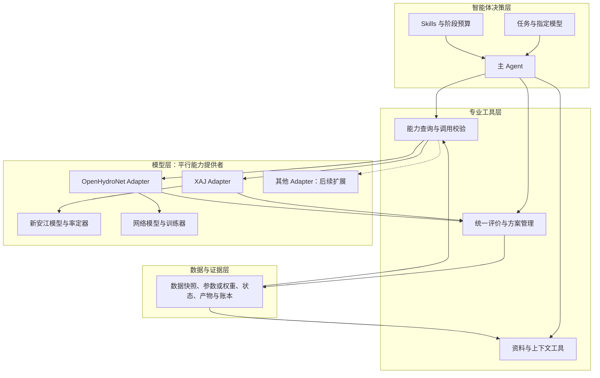
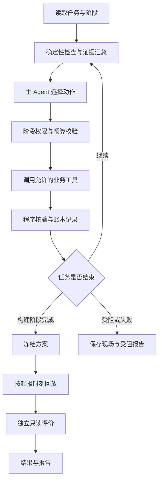

# 基于智能体的水文预报方案构建及参数优化系统：完整课题方案

**面向：** 河海大学数字孪生卓工班（二期）

**指导教师：** 方园皓，河海大学水文水资源学院副教授

**修订日期：** 2026 年 9 月 7 日

**状态：** 设计阶段；本文件为唯一课题方案，实际实现与研究收益待验证。

## 目录

- [1. 课题摘要与研究定位](#section-1)
- [2. 研究范围、输入输出与模型可行性](#section-2)
- [3. 文献基础、拟验证贡献与证据边界](#section-3)
- [4. 四层架构与专业算子契约](#section-4)
- [5. 阶段隔离、自主循环与运行状态](#section-5)
- [6. 水文上下文与历史相似过程](#section-6)
- [7. 证据驱动诊断与有限参数优化](#section-7)
- [8. A01—A12 完整业务动作契约](#section-8)
- [9. Skills、编排、技术栈与证据存储](#section-9)
- [10. 正式实验与验收协议](#section-10)
- [11. 工作台、报告与答辩交付](#section-11)
- [12. 实施阶段、风险与最终完成门槛](#section-12)
- [13. 附录：文献详情与技术依据](#section-13)

<a id="section-1"></a>

## 1. 课题摘要与研究定位

本课题面向河海大学数字孪生卓工班（二期），研究智能体如何依据水文证据，自主组织资料核查、预报方案构建、异常诊断、有限参数适配、结果验证与交付。一个主 Agent 调用共同专业工具，人员一次配置任务后，通过工作台查看结果、暂停恢复和接管异常。

首期采用单流域、日尺度未来第 1—3 日流量预测，并列接入 XAJ（新安江）与 OpenHydroNet 两类模型，在一台 M1 Pro 上开展历史起报回放。以历史实测流量为评价参照，在每个模型内设置 O（固定基础方案）、P（固定优化流程）、A（Agent 驱动方案）三个方法组。历史观测不是方法组。首期由用户明确选择模型，Agent 在该模型能力范围内选动作；自动推荐模型留作后续，不在任务中隐式切换模型。

**实际条件：团队没有水文专业人员，本期不设置必须依赖专家打分或真人操作对照的实验。** 工程人员负责数据来源、程序计算、版本和产物一致性检查；水文物理原因的正确性不由团队或另一个 LLM 代替专家认定。专业人员减负、专家级诊断和实际业务适用性不作为本期收益结论。

本文是唯一维护的课题方案，接口和实验安排均为设计；案例数据尚待下载审计，模型效果与算力尚待实测。文献阅读范围沿用原审查记录；案例数据与权重限制已根据官方固定版本说明核对，但未取得本机运行证据。

**主研究问题：在每个模型内的相同数据、基础方案和可比计算预算下，智能体驱动的方案构建与有限参数适配，能否相比原始模型及固定优化流程，改善独立测试预测表现、自动任务完成率或计算效率？**

围绕这一问题分别验证：

1. A 与 O 比较系统总体效果；该差异包含适配及流程变化，不单独归因为智能体决策。
2. A 与 P 比较同工具、同候选空间和同预算上限下的增量价值，区分 Agent 决策与普通优化的贡献。
3. 对有确定性判据的异常任务检验恢复、撤销、停止和权限边界；真实水文偏差只评价结果与证据引用，不评价专家诊断准确率。

预测质量、可靠性和资源成本分别报告，不合成任意总分。主预测指标为独立测试三个 lead 的 NSE 等权平均，必须同时报告各 lead、MAE、KGE、Bias、事件指标和覆盖率；主可靠性指标为无需中途接管的合格完成率。质量不可计算或完整性不满足时，不凭平均分宣称整体优势。

参数优化是可选处理措施。系统允许保持、撤销和受阻，不预设 Agent 必须优于 O/P，也不将方法名称或框架使用视为创新证明。

### 题目与研究内容的对应

| 题目关键词 | 本项目中的实际落点 | 不是在做什么 |
|---|---|---|
| 基于智能体 | 主 Agent 观察证据、诊断、选择动作、调用工具、核验并决定继续或结束 | 不是给每个步骤加一个聊天机器人 |
| 水文预报方案构建 | 数据核查、模型/配置校验、起报条件、预报执行、异常诊断、结果比较、方案冻结 | 不是只运行一次模型得到一条过程线 |
| 参数优化 | 当证据支持时，Agent 调用受约束的适配/优化算子，在冻结空间内执行局部优化并接受或回滚 | 不是 LLM 自由生成学习率、epoch 或神经网络权重 |

“参数优化”是预报方案构建闭环中的一种处理动作，而不是每个任务都必须发生的步骤。对于正常方案，Agent 正确选择 **KEEP / 不干预** 与正确启动一次适配同样重要。

### 模型优化与职责边界

A07 按模型能力执行两类不同优化：XAJ 的有界参数率定，以及 OpenHydroNet 的有限权重适配。二者共享动作与评价流程，但参数、状态和数值实现分开。

更准确的表述是：

> **本课题不以水文基础模型训练或模型结构创新为研究目标。水文模型作为智能体可调用的专业数值能力；需要优化时，由模型对应的率定器或优化器/训练器在冻结约束下执行，Agent 不直接生成物理参数向量或神经网络权重。**

职责边界如下：

- **Agent 决定：** 当前是否需要干预、优先排查什么、是否允许进入率定/适配、选择哪一种当前模型已冻结的优化策略、适配结果是否解决原问题。
- **Optimizer 决定：** 在已冻结候选空间中运行哪些数值配置及其执行顺序。
- **数值执行器执行：** XAJ 率定器搜索合法参数并重算状态；OHN Trainer 更新允许模块，保存各自候选与运行记录。
- **Evaluator 核验：** 使用冻结指标、样本和质量门槛对候选结果进行统一评分。
- **Agent 不能做：** 自由生成神经网络权重、绕过候选空间修改超参数、看到独立测试结果后调整策略或阈值。

这使“智能体决策”和“数值训练”保持可解释、可审计的分离。

“参数优化”分别指 XAJ 概念模型参数率定和 OpenHydroNet 网络局部适配；两者不能使用同一参数表或相互解释。

推荐表述：

> 智能体依据任务证据判断是否优化，并选择当前模型已经验证的策略。XAJ 由数值率定器搜索有界参数向量，OpenHydroNet 由优化器与训练器执行局部适配；统一评价器验证结果并决定候选是否通过门槛。参数变化不直接证明真实水文原因，网络权重不解释为可直接对应的物理参数。

XAJ 与 OpenHydroNet 是首期并行能力提供者，均须完成真实接入和各自的验收。HBV、GR4J 等仅保留扩展接口。

<a id="section-2"></a>

## 2. 研究范围、输入输出与模型可行性

### 首期范围

| 项目 | 本期设计 |
|---|---|
| 空间范围 | 一个公开数据流域；第二流域属于扩展 |
| 预测对象 | 站点未来第 1、2、3 日流量及日尺度高流量过程 |
| 应用方式 | 历史起报回放；正式回放前冻结方案 |
| 计算条件 | 一台 M1 Pro，CPU 为可验证起点，MPS 加速需单独测试；第三方 LLM API |
| 模型路线 | XAJ 参数率定与 OpenHydroNet 局部适配并行，通过独立 Adapter 接入 |
| Agent 组织 | 一个主 Agent；确定性程序完成检查、计算、优化和验证 |
| 交互方式 | 任务配置一次；自动运行；网页查看、暂停、恢复和异常接管 |
| 成果 | 网页工作台、预报方案包、预测文件、动作账本、O/P/A 对照结果、结题报告、答辩 PPT 与图表 |

本期不以小时级山洪预警、洪水淹没、水深流速、调度控制、全球模型训练或自主学习新的水文机理为交付目标。首期不做自动模型选择、多模型集成或任务中切换模型；两类模型分别完成数据与资源门槛。

### 任务配置与产物

#### 一次性任务配置

配置由课题开发者准备默认案例，可由网页读取，无需终端用户填写专业模型参数。必须明确：流域、起报范围、模型版本、数据来源、运行模式、预算、验收规则和停止条件。无人逐轮指挥不等于系统无需目标或可以猜测缺失信息。

输入分为：

- **模型输入：** 所选模型要求的历史气象、未来气象驱动、流域属性及必要历史窗口；按真实输入契约取用。
- **评价资料：** 实测流量及其发布时间、质量标记；用于合法训练、历史诊断和事后评价，不默认它必然是 LSTM 直接输入。
- **方案资料：** 权重、配置、缩放器、模型代码版本、训练时间范围及来源。
- **运行约束：** 允许动作、候选空间、计算及 API 预算、阶段权限。

#### 两种实验模式

| 模式 | 未来气象来源 | 可支持的结论 |
|---|---|---|
| F：历史预报驱动 | 起报时已发布且可获得的历史气象预报 | 在所验证信息条件下的历史提前预报表现 |
| R：理想气象驱动回算 | 未来实测或再分析气象 | 已知未来气象条件下的水文计算、适配和流程表现 |

F 是目标模式。若只能获取 R 模式所需资料，明确降为回算实验并记录范围缺口；不能称为已完成真实提前预报验证。正式实验中各组使用相同模式，禁止缺资料时无声切换。

#### 任务与产物

一个评价任务包是有起点、问题条件、产物要求和预算的完整工作单元，可包含一段连续起报日期。起报日期不自动等于独立实验样本。

每次起报保存 `model_id、adapter_version、basin_id、issue_time、target_time、lead_day、q_pred、unit、scheme_id、data_snapshot_id、mode、quality_flag`。每个任务交付：

1. 预报方案包：模型、配置、数据映射、时间协议和版本引用。
2. 预测及质量标签：有缺口时记录缺口，不能用伪造结果补齐。
3. 动作账本：现象、证据、假设、工具、结果、验证和成本。
4. 状态与报告：完成、受限完成、受阻或失败；未解决事项和下一步所需条件。

### 数据、流域和模型门槛

#### OpenHydroNet 模型依据

沿用源码核查版本 `828dfc5a66f4e6f2c86b09d500e4547c4d92ed25`。官方教程含 Mean Embedding Forecast LSTM 的局部微调路径；对应模块名是 **`static_embedding_fc`**，不是 `static_attributes_fc`。教程存在并不表示项目已完成推理、微调或 MPS 验证。[教程配置](https://github.com/google-research/flood-forecasting/blob/828dfc5a66f4e6f2c86b09d500e4547c4d92ed25/tutorial/configs/finetune-config.yml)

本机先验证单流域推理和一次小规模微调，记录环境、耗时、峰值内存、模块更新及产物。MPS 不通过则使用 CPU；若 CPU 预算也无法承受，缩小模型/样本/候选规模并重新报告范围，不能直接承诺“非常适合本机”。

#### 候选流域与双模型适用性

首选核查 **South Fork Payette River at Lowman, Idaho，USGS 13235000**。官方 Notebook 将 `camels_13235000` 设为示例微调流域，USGS 核对了站点名称。[官方 Notebook](https://github.com/google-research/flood-forecasting/blob/828dfc5a66f4e6f2c86b09d500e4547c4d92ed25/tutorial/OpenHydroNet_Tutorial.ipynb)；[USGS 站点](https://waterdata.usgs.gov/monitoring-location/USGS-13235000/)

上述是 OpenHydroNet 路线的现有候选，不是已经验证的双模型共同案例。用户示例中的 Leaf River 仅为界面示意，未据此更换流域。采用理由是教程接口与复现便利，不能为了保证改善而选择低分测试流域。正式使用前核查数据时间覆盖、变量、面积、气象发布时间、融雪和人为调节等流域特点；不预设其代表所有降雨洪水流域。South Yamhill 可作为后续候选，首期不要求同时实现。

候选不通过时，根据资料可用性与算力选择下一对象，保留排除原因；禁止按独立测试分数挑流域。双模型首选同一流域，但必须同时核查降水、蒸散资料、暖机长度与雪过程/人为调节等适用边界。若只能分别使用不同流域，模型内 O/P/A 可独立开展，不能据此比较两种模型谁更优；共同案例验收仍标未完成。

#### 案例数据清单与当前状态

| 数据 | 候选来源与用途 | 当前状态 |
|---|---|---|
| 日流量观测 | Caravan 中 `camels_13235000` 对应站点记录；核对 USGS 13235000 来源、单位、质量标记 | 未完成下载与质量审计 |
| 历史气象与未来驱动 | 官方教程的 Caravan Multimet 路线；按所选模型契约核对 HRES、GraphCast 等变量和发布时间 | 实际覆盖与起报可得性待核查 |
| 流域属性 | Caravan 属性，如面积及模型要求的静态字段 | 字段和版本待核查 |
| 基础权重与缩放器 | 优先核查教学模型，记录实际权重、训练范围和配套配置 | 尚未锁定具体可用权重 |
| 训练、验证与独立测试年份 | 根据上述数据及权重来源确定互不泄漏的切分 | 未冻结，不沿用教程日期作为正式切分 |

官方教程配置的 `targets_data_dir`、`statics_data_dir` 指向 Caravan，`dynamics_data_dir` 指向 `gs://caravan-multimet/v1.1`。这些是候选获取路线，不表示数据已在本项目落地。[官方配置](https://github.com/google-research/flood-forecasting/blob/828dfc5a66f4e6f2c86b09d500e4547c4d92ed25/tutorial/configs/train-config.yml)

每项资料记录下载来源、版本、哈希、时间覆盖、单位、缺测比例和质量标记。观测只作为有测量误差的评价参照，不称绝对真值；缺测不插值成评价标签。官方示例存在将缺失气象产品回填为 ERA5-Land 的配置，正式实验必须追踪实际来源，不能把再分析补值标为起报时可得预报。

#### OpenHydroNet 权重与时间合法性

公开全球权重说明其训练覆盖 1982—2023 年且没有时间留出。不能直接用其在重叠时期的分数证明独立时间预报能力；微调不会消除这个问题。官方教学配置也存在验证与测试时期重合，正式实验须重新划分。[权重说明](https://github.com/google-research/flood-forecasting/blob/828dfc5a66f4e6f2c86b09d500e4547c4d92ed25/pretrained-models/Pretrained-Models-README.md)；[教学配置](https://github.com/google-research/flood-forecasting/blob/828dfc5a66f4e6f2c86b09d500e4547c4d92ed25/tutorial/configs/train-config.yml)

优先查清轻量教学权重的训练范围。若不可核查，可评估在合法开发资料上自训一次轻量基础模型；若采用全球权重，独立时间测试须严格晚于其及后续适配所用资料，并取得对应驱动。正式日期在数据审计后冻结，不在本方案中虚构可用年份。

### XAJ 数据、实现与基线门槛

首期采用可复现的日尺度集总 XAJ 实现作为候选，具体变体、代码版本、许可证、路由方法与参数清单在 G0 锁定。可先审计 [hydromodel 项目](https://github.com/OuyangWenyu/hydromodel)；这是候选依赖，不代表已安装、接入或验证。该项目提供不同 XAJ 变体和数值率定接口，因此不在选型前硬写“所有 XAJ 都有固定 15 个参数”。

XAJ 需流域平均降水、所选实现要求的蒸发或潜在蒸散输入、初始状态及暖机资料；流量观测用于合法开发和评价。蒸发皿蒸发、潜在蒸散和实际蒸散不能无依据互换。候选实现的输入和状态定义参见 [XAJ API 文档](https://ouyangwenyu.github.io/hydromodel/models/xaj/)。

G0 数据清单增加蒸散来源、单位、计算方法、时间分辨率和 `available_at`。若计算 PET，公式、所需气象字段及缺测政策固定并可追溯。未来三日所需降水和蒸散必须具有合法起报来源；使用未来再分析推导蒸散时归入 R 模式，不能无声标为 F 模式。降雨与蒸散序列不能仅因文件齐全就认定适用于当前流域。

Adapter 将每个起报日之前的合法历史计算推进到初始状态，再用当时可得的未来驱动生成 lead 1/2/3；全历史连续模拟不自动等于提前预报。首期优先从固定暖机规则重算，验证缓存后再支持状态恢复。参数、暖机窗口、日界线和汇流状态一起冻结；同一候选不能继承另一候选率定后的状态。

XAJ 的 O 基线采用 G0/G1b 预先固定的参数方案，可来自有来源的参数配置，或共同的开发期标准率定。若先率定基础方案，必须记录训练资料、算法、种子与成本，并向 P/A 提供完全相同起点；O 后续不再优化。不能用随意填写的极差参数制造 Agent 提升。基础方案不可用时报告缺口，不把“默认参数”当合格保证。

两种模型均须完成真实推理、输出单位转换、状态重算、优化调用与独立评价。OpenHydroNet 的预训练泄漏检查和 XAJ 的参数率定资料隔离分别保留；某个模型通过不代表另一个通过。

<a id="section-3"></a>

## 3. 文献基础、拟验证贡献与证据边界

已有研究覆盖 LLM 率定、工具调用、全流程建模及 Skills 化经验，因此本项目不将这些框架本身作为首创。完整文献及原阅读范围保留在附录，相关研究的专家资源不作为本团队已具备的条件。

| 研究方向 | 采用的经验 | 本期验证方式 |
|---|---|---|
| Skills 水文流程 | 方法、工具与规则分工 | 工具契约与流程验收，不声称已吸收本地专家经验 |
| LLM 与传统率定 | 强优化基线、公平预算、保留负结果 | O/P/A 对照，单列 P 与 A 的差异 |
| 水文 Agent 与网页平台 | 执行、恢复和产物追溯 | 真实任务、覆盖率及恢复记录 |
| 水文诊断 | 将资料、时间、状态、forcing 和模型偏差分开 | 记录候选解释；物理因果不作准确率评价 |
| 人机分工 | 自动运行与人工收益是不同问题 | 本期不做真人减负证明，留作后续有条件研究 |

拟验证贡献为可追溯的动作闭环、决策与数值搜索分离，以及预测质量、运行可靠性和计算成本的可复现对照。资料核查、批量起报、报表等确定性工作优先由程序完成；Agent 是否有必要，通过与 P 的实测差异判断。

Skills 来源为官方文档、公开研究、明确标注的工程规则及开发集案例。每条规则记录来源、适用边界、测试和反例；通过程序测试说明工程一致性，不等于获得水文专家认可。未经证实的机理解释保持假设状态，不进入硬标签评分。

<a id="section-4"></a>

## 4. 四层架构与专业算子契约

系统采用四层架构：**Agent Decision Layer、Hydrology Tool Layer、Numerical Model Layer、Data & Evidence Layer**。



### Agent Decision Layer

这是课题最主要的研究层。

Agent 不负责重复计算 NSE、累加降水或训练网络，而负责解决程序难以用单一固定规则表达的业务选择问题：

- 当前异常需要先查数据、时间、状态、forcing 还是模型？
- 现有证据是否足以支持干预？
- 应保持当前方案、修复资料、重建状态、启动有限适配还是停止？
- 已执行动作是否解决原问题？
- 什么时候应该回滚，什么时候应该报告能力不足？

### Hydrology Tool Layer

把水文人员实际使用的能力封装为确定性或受约束工具。Agent 只通过工具契约调用，不直接操作底层文件、模型权重或评价公式。

工具必须具有明确的：输入、输出、证据引用、权限、失败状态和幂等/恢复规则。

### Numerical Model Layer

并列包含 XAJ 模型与率定器、OpenHydroNet 模型与优化器/训练器。两类 Adapter 实现上层协议，模型内参数、状态和依赖分别管理。

从 Agent 视角看，具体模型不是决策主体，而是**专业数值计算能力**。模型结构可以不同，只要经过 Adapter 提供统一的工具契约，Agent 的上层业务闭环原则上无需随模型整体重写。

注意：不同模型输入、状态、可调参数和适用场景不同，因此“可替换”指的是通过适配器统一上层调用方式，不意味着所有模型可以无条件互换。

### Data & Evidence Layer

保存 Agent 决策和程序核验能够引用的事实，包括数据快照、水文上下文、forcing、历史相似过程、模型版本、评价指标、动作结果和成本。

Agent 的重要结论必须能够指向该层中的证据 ID；不可得信息明确标记 unknown/unavailable，不允许通过语言模型补造事实。

### 模型、能力与任务约束

模型是能力提供者，`forecast / calibrate / adapt / validate` 是它暴露的能力。能力注册采用 `metadata + capabilities + constraints`，由版本化注册表提供，LLM 不自行声明能力。

以下是设计期注册描述示例，并不表示模型已就绪：

```json
[
  {
    "metadata": {"model_id": "xaj", "display_name": "新安江模型", "status": "planned"},
    "capabilities": ["forecast", "calibrate", "validate", "get_parameters"],
    "constraints": {"optimization_phases": ["B"], "strategy_registry_id": "xaj-frozen-strategies", "horizon_days": [1, 2, 3]}
  },
  {
    "metadata": {"model_id": "openhydronet", "display_name": "OpenHydroNet", "status": "planned"},
    "capabilities": ["forecast", "adapt", "validate", "get_model_info"],
    "constraints": {"optimization_phases": ["B"], "strategy_registry_id": "ohn-frozen-strategies", "horizon_days": [1, 2, 3]}
  }
]
```

运行时还必须返回实际实现版本、Adapter 版本、输入/输出 schema、暖机和状态要求、支持阶段、策略 ID、数值约束、预算及失败类型。只有通过 G0/G1 验证的能力才标为 ready；未就绪模型在前端说明缺项，不能点击启动后悄悄换模型。

调用权限取交集：模型能力 ∩ 当前阶段 ∩ 任务优化许可 ∩ 冻结策略 ∩ 剩余预算。`allow_optimization=true` 只是许可，不能绕过 F/E 禁止优化；为 false 时两个模型均不能执行 A07。XAJ 不允许调用 `adapt`，OpenHydroNet 不允许调用 `calibrate` 或 XAJ 参数接口。错误请求在执行前拒绝并入账。

`validate` 只做当前模型的输入、配置与产物合法性检查，不替代统一 `evaluate` 的质量评分，也不决定最终采用门槛。Agent 根据 `scheme_id` 对应的 `model_id` 路由，执行器再次核对两者；首期任务内模型固定，失败时受阻，不自动切换。

### 预报算子

在 Agent 层，不建议把 OpenHydroNet 暴露成大量模型内部 API，而应封装为标准预报算子。例如：

```python
forecast(
    scheme_id: str,
    basin_id: str,
    issue_time: datetime,
    data_snapshot_id: str,
) -> ForecastResult
```

`ForecastResult` 至少返回：

```yaml
forecast_result:
  scheme_id: null
  issue_time: null
  predictions:
    - lead_day: 1
      target_time: null
      q_pred: null
      unit: m3/s
    - lead_day: 2
      target_time: null
      q_pred: null
      unit: m3/s
    - lead_day: 3
      target_time: null
      q_pred: null
      unit: m3/s
  quality_flags: []
  model_id: null
  adapter_version: null
  state_snapshot_id: null
  model_version: null
  data_snapshot_id: null
  artifact_ids: []
```

Agent 不需要知道模型内部每一层如何计算；它只需要知道该算子的：

- 输入契约是否满足；
- 当前方案和模型版本是什么；
- 输出是否完整合法；
- 该模型支持哪些合法的适配能力；
- 当前阶段是否允许调用这些能力。

首期注册 XAJ Adapter 与 OpenHydroNet Adapter；后续 HBV、GR4J 可沿同一接口扩展。Agent 不需要把某个模型作为另一个模型的子步骤。

### OpenHydroNet 局部适配算子

A07 不应表达成“Agent 自己训练模型”，而应表达成：

```python
adapt_model(
    base_scheme_id: str,
    strategy_id: str,
    training_snapshot_id: str,
    validation_snapshot_id: str,
    budget_id: str,
) -> AdaptationRun
```

其中 `strategy_id` 只能来自正式实验前冻结的训练策略集合，例如：

```text
HEAD
STATIC
STATIC_HEAD
```

KEEP 直接维持现有方案，不调用训练算子。具体允许哪些策略由 G1b 的 M0 机制实验决定，未验证的策略不得为了提高正式测试成绩临时加入。

数值参数由 Optimizer 在冻结空间内搜索，例如：

```text
learning_rate ∈ frozen_set
epochs ∈ frozen_set
```

Agent 负责的是：

```text
是否值得适配？
        ↓
适配哪一种允许的机制？
        ↓
调用 adapt_model()
        ↓
程序完成候选训练与统一评价
        ↓
原问题是否改善且没有不可接受副作用？
        ↓
ACCEPT / ROLLBACK / KEEP
```

因此，“参数优化”的研究价值不只是找出一组更高分参数，还包括：**什么时候不应该优化、什么情况下优化无效、如何发现副作用以及何时回滚。**

### XAJ 参数率定算子

```python
calibrate_model(
    base_scheme_id: str,
    strategy_id: str,
    calibration_snapshot_id: str,
    validation_snapshot_id: str,
    budget_id: str,
) -> CalibrationRun
```

这是 XAJ 的 `calibrate` 能力，和 OpenHydroNet 的 `adapt_model` 平行。Agent 仅选择已冻结的率定策略 ID，数值率定器决定候选参数值；学习率与网络模块不会出现在 XAJ 策略中。优化器的搜索目标只能使用 calibration_snapshot，validation_snapshot 用于候选验收，独立测试不参与搜索或选择。

两类优化结果统一返回任务/运行 ID、model_id、策略 ID、基础与候选方案 ID、实际资源、证据 ID、状态和失败原因；模型专属详情分别记录参数向量及约束检查，或可训练模块及权重变化。运行成功后仍须 A08 统一比较，不能由模型工具自行宣布采用。

### 动作与工具映射

| 动作 | Agent 决策重点 | 主要调用的 Tool | 模型层是否参与 |
|---|---|---|---|
| A01 检查资料 | 哪些问题阻断任务、先查什么 | data_check | 否 |
| A02 补取/修复 | 选择合法修复路径 | repair_data | 否 |
| A03 方案校验 | 选择兼容方案/模板 | validate_scheme | 读取模型元数据 |
| A04 历史条件 | 是否重建状态/窗口 | rebuild_state | 可能 |
| A05 执行预报 | 异常结果下一步如何处理 | forecast | 是，作为预报算子 |
| A06 水文诊断 | DATA/TIMING/STATE/FORCING/MODEL/UNKNOWN | context + analogue + metrics | 读取结果，不训练 |
| A07 有限优化 | 是否优化、选当前模型哪种策略 | XAJ: calibrate_model；OHN: adapt_model | 率定器或优化器/Trainer 执行 |
| A08 比较/撤销 | 问题是否真正解决 | compare_candidates | 读取候选结果 |
| A09 恢复/受阻 | 重试、保持还是停止 | recovery | 视故障而定 |
| A10 冻结方案 | 推荐依据和边界是否完整 | freeze_scheme | 冻结模型引用 |
| A11 连续起报 | 运行异常是否需要处理 | batch_forecast | 是，重复调用预报算子 |
| A12 评价报告 | 如何组织事实与失败结论 | evaluate/report | 只读 |

这个映射强调：**A01—A12 才是智能体工作空间；水文模型只是其中若干动作会调用的底层能力。**

### 实现原则

后续代码实现应遵循以下原则：

1. **Agent 不直接 import 模型内部训练逻辑作为自由操作接口。** 统一通过 Tool/Service 契约调用。
2. **forecast 与 calibrate/adapt 分离。** 日常预报不能隐式率定或训练。
3. **模型 Adapter 与 Agent 解耦。** 上层动作使用稳定 schema，模型差异放在 Adapter 内处理。
4. **数值计算尽量确定性。** 指标、单位转换、历史累计、相似度、阈值和评分由程序计算。
5. **Agent 只做有价值的路径选择。** 程序能直接判断的逻辑不消耗 LLM 决策轮次。
6. **所有动作可核验。** 每个动作返回 artifact/evidence ID 和显式状态。
7. **允许不干预。** KEEP 是正式正确动作，不把“调用更多工具”作为智能程度指标。
8. **允许失败和受阻。** BLOCK/HANDOVER 是系统边界能力，不用模型微调掩盖资料或 forcing 不确定性。
9. **优化仅在合法阶段发生。** B 且任务允许优化时才可率定/适配；F/E 不得修改参数或权重。
10. **模型可替换不等于实验可随意换模型。** 正式实验模型与 Adapter 版本必须提前冻结。

<a id="section-5"></a>

## 5. 阶段隔离、自主循环与运行状态

### B：方案构建与历史适配

使用训练资料与验证资料，开展 A01—A09。只有在真值已合法获得且属于开发资料时，才计算预报误差并考虑适配。连续误差是检查依据，不直接等于模型参数存在问题。完成后 A10 冻结方案。

### F：冻结方案的历史起报回放

按历史起报时刻推进 A11。XAJ 参数/状态规则或 OHN 权重、候选规则、Skills、数据策略及质量门槛均已冻结。只允许当时可得资料的取数、已定义转换、历史条件重建和技术恢复。**本期独立测试不根据测试流量真值调整模型、提示词、策略或方案。**

### E：只读评价与复盘

由独立评价器读取测试实测值，A12 生成评价和报告；工具权限不允许率定、训练或改写已冻结预测。测试中发现的新问题保存为下一版本研究材料，下一版本需要新的留出测试。



起报时，未来实测曲线不能提供给 Agent 或模型；网页也按阶段显示，已发生且已发布的观测与未来目标明确分开。回放结束才开放完整对照图。

### 阶段与模式必须分别存储

`phase ∈ {B,F,E}` 表示运行权限阶段，`forcing_mode ∈ {F,R}` 表示气象来源。两者不可共用一个字段。R 模式的未来实测/再分析气象只能作为已声明的理想驱动输入，不包含未来流量真值；阶段 F 在任何气象模式下均不得据测试流量适配。F 气象模式仍须逐项满足起报可得性。

### 任务终态与动作结果

任务状态统一为运行中、完成、受限完成、受阻、失败和人工接管；KEEP、ACCEPT、ROLLBACK 是动作结果，不自动等于任务已完成。受限完成必须列出缺失日期或产物；是否合格由冻结验收规则判定。BLOCK 保留未完成状态；恢复必须核对原任务产物和幂等键。

A06 的基于误差诊断和 A07—A08 的模型适配闭环只在 B 阶段开放。F 阶段可以核查当时合法可得的输入和技术异常，不能沿诊断流程进入模型更新；E 阶段仅评价与导出。

<a id="section-6"></a>

## 6. 水文上下文与历史相似过程

### 水文上下文构建器

#### 定位

Context Builder 不是新的 Agent，也不生成自由文本结论。它是一个确定性工具，负责把已有资料转换为统一、可验证的水文上下文卡片。

推荐接口：

```python
build_hydrologic_context(task_id, issue_time, scheme_id) -> HydrologicContextCard
```

#### 第一版字段

```yaml
hydrologic_context:
  issue_time: null  # 由任务逻辑起报时刻填写

  current_flow:
    value: null
    unit: m3/s
    percentile: null
    recent_trend: rising | falling | stable | unknown

  antecedent_conditions:
    precipitation_3d_mm: null
    precipitation_7d_mm: null
    precipitation_14d_mm: null
    wetness_proxy: high | medium | low | unknown

  forecast_forcing:
    lead_1_precip_mm: null
    lead_2_precip_mm: null
    lead_3_precip_mm: null
    total_precip_mm: null
    hres_total_mm: null
    graphcast_total_mm: null
    disagreement_score: null
    disagreement_level: high | medium | low | unavailable

  regime:
    season: winter | spring | summer | autumn
    temperature_context: null
    snow_fraction_context: null
    process_regime: rainfall | snowmelt | mixed | unknown

  recent_model_behavior:
    sample_count: 0
    mean_bias: null
    high_flow_bias: null
    lead_1_bias: null
    lead_2_bias: null
    lead_3_bias: null
    persistence: isolated | repeated | unknown

  analogues:
    - event_id: null
      similarity: null
      observed_context: null
      model_behavior: under | over | normal | unavailable

  evidence_ids: []
```

#### 计算原则

1. 所有字段由程序从合法资料计算，Agent 不自己做降水累加、分位数、单位转换和相似度数学计算。
2. 不可得字段标记 `unknown/unavailable`，不允许 LLM 猜值。
3. 前期湿润程度第一版可采用简单、透明的代理量，例如训练期 P7/P14 分位数和当前流量分位数；不声称等于真实土壤含水量。
4. `process_regime` 仅在资料支持时生成；缺少雪资料时应返回 `unknown`。
5. Context Card 使用和模型输入相同的数据快照与逻辑起报时刻，保存版本与内容哈希。
6. F 阶段只使用 `issue_time` 时刻已可获得的信息，未来观测不得进入 Context Card。

### 历史相似过程检索

#### 目的

借鉴 case-based reasoning 的思想，把历史经验转成结构化案例证据，而不是普通文本 RAG。

Agent 不需要“记住”过去洪水，而是调用程序检索：

> 当前水文气象条件最像哪些开发期历史过程？模型在这些过程上通常高估、低估还是表现正常？

#### 第一版特征

优先使用现有数据可以稳定获得的变量：

- 起报流量分位数；
- 前 3/7/14 日累计降水；
- lead 1/2/3 预报降水；
- 未来三日累计降水；
- 季节；
- 温度/雪背景（仅资料支持时）；
- HRES 与 GraphCast forcing 差异；
- 当前方案 ID。

#### 相似度

第一版不让 LLM 给权重。采用冻结的标准化距离或简单加权距离：

```text
normalize features on development data
        ↓
calculate distance
        ↓
Top-K historical analogues
```

K 初始取 3—5，在先导实验后冻结。

必须输出每个 analogue 的：

- 案例 ID；
- 相似度/距离；
- 关键上下文差异；
- 当时基础模型表现；
- 是否发生高流量事件；
- 是否曾启动适配，以及适配是否通过验证。

历史相似过程只能来自 B 阶段允许的开发资料，不得从独立测试集检索形成“经验”。

### 气象驱动不确定性与不适配决策

气象驱动不确定性是诊断与适配决策的必要证据。

OpenHydroNet 本身使用未来气象驱动。即使水文模型结构正确，未来降水预报错误也可能造成洪峰和洪量错误。因此，A06/A07 必须把 forcing uncertainty 与 model bias 分开。

#### 第一版 forcing 证据

如果同一任务同时具有 HRES 与 GraphCast，可计算：

- 三日累计降水绝对差；
- 相对差；
- 各 lead 降水差；
- 温度差（资料支持时）；
- 两种 forcing 导致的预测差（若计算预算允许且共同工具支持）。

#### 决策示例

以下是待验证的工程决策启发，不是专家标注答案。气象源一致不保证气象预报正确，偏差持续也不能独立证明模型为真实原因；程序只验收证据、权限和后续结果。

**场景 A：**

```text
单次高流量低估
+ HRES/GraphCast 降水明显分歧
+ 历史相似事件中基础模型并无持续低估
→ 优先 C4 FORCING
→ 不启动模型微调
```

**场景 B：**

```text
多场高流量持续低估
+ 数据/时间/状态检查通过
+ forcing 一致性较高
+ 相似历史事件出现同方向偏差
→ C5 MODEL 获得较强支持
→ 允许进入适配候选
```

**场景 C：**

```text
偏差明显
+ forcing 资料缺失或发布时间不合法
→ C6 UNKNOWN / C4 FORCING
→ BLOCK 或受限完成
```

是否按冻结规则保持模型单独评价；不将遵守规则称为专家判断正确。

<a id="section-7"></a>

## 7. 证据驱动诊断与有限参数优化

### 诊断输入、原因空间与输出契约

#### 输入

A06 读取：

1. A01—A05 数据与运行核查结果；
2. 过程线及程序计算的 NSE/KGE/Bias/高流量与事件指标；
3. Hydrologic Context Card；
4. Top-K 历史相似过程；
5. 当前方案和过去已尝试动作；
6. 阶段权限与剩余预算。

#### 原因空间（Cause Space）

A06 不要求 LLM 宣称找到真实物理因果，而是在一个受约束的业务原因空间中形成**候选解释**：

| 编码 | 原因类别 | 示例 |
|---|---|---|
| C1 DATA | 资料问题 | 缺测、单位、站点、异常替代源 |
| C2 TIMING | 时间/起报对齐问题 | 日界线、issue/target 错位 |
| C3 STATE | 历史状态问题 | warm-up 不足、缓存/窗口不一致 |
| C4 FORCING | 未来气象驱动不确定 | HRES/GraphCast 明显分歧、降水中心可能不确定 |
| C5 MODEL | 持续模型系统偏差 | 多事件同方向高流量低估，资料和 forcing 检查均通过 |
| C6 UNKNOWN | 证据不足 | 多个原因均可能，无法安全判断 |

重要原则：

- `C5 MODEL` 不是默认兜底项；必须在 DATA/TIMING/STATE/FORCING 已有足够检查后才允许提高其优先级。
- 单场洪峰低估不能直接推出 MODEL。
- forcing 分歧高时，应优先保留 C4，不用模型微调掩盖输入不确定性。
- 证据不能唯一判因时，允许并列多个 hypotheses。

#### 输出契约

```json
{
  "phenomenon": "...",
  "evidence_ids": ["..."],
  "context_summary": "...",
  "cause_hypotheses": [
    {
      "code": "C4_FORCING",
      "supporting_evidence": ["..."],
      "contradicting_evidence": ["..."]
    }
  ],
  "alternative_explanations": ["..."],
  "next_action": "KEEP | REPAIR | REBUILD_STATE | CALIBRATE | ADAPT | BLOCK",
  "expected_check": "...",
  "stop_condition": "..."
}
```

不记录、也不要求暴露模型内部思维链；只保存可核验的业务结论和证据引用。

### M0 机制验证与正式策略空间

#### M0-OHN：OpenHydroNet 局部适配机制实验

局部适配策略采用以下统一规则：**正式 Agent 实验前，先在开发/验证期资料上做一次小型局部适配机制实验，再冻结允许策略。**

初始比较：

| 策略 | 更新模块 | 目的 |
|---|---|---|
| S0 KEEP | 无 | 基础对照 |
| S1 HEAD | `head` | 观察输出映射/尺度适配能力 |
| S2 STATIC | `static_embedding_fc` | 观察流域静态表征局部适配能力 |
| S3 STATIC+HEAD | `static_embedding_fc` + `head` | 对齐 OpenHydroNet 官方示例的局部适配思路 |

既有核查版本的 OpenHydroNet 源码将这些模块列为可微调子模块，官方 fine-tuning 示例也包含 `static_embedding_fc` 与 `head`。M0 的目的不是证明某一模块具有明确物理意义，而是确定：

- 哪些局部适配策略在目标流域确实可运行；
- 哪些策略在 M1 Pro 预算内；
- 哪些策略有稳定的验证改善或至少具有差异化行为；
- 哪些策略应进入正式 Agent 动作空间。

M0 只使用开发/验证资料。完成后冻结正式策略集合，独立测试后不得再新增策略。

#### 正式动作空间

A07 前的动作选择统一为以下枚举；仅 ADAPT 分支进入训练：

```text
KEEP
维持当前模型

REPAIR
先处理数据/时间问题，不进行模型适配

REBUILD_STATE
重建合法历史窗口/状态

ADAPT_<strategy>
调用 M0-OHN 冻结的局部适配策略

CALIBRATE_<strategy>
调用 M0-XAJ 冻结的参数率定策略

BLOCK
证据或能力不足，停止并保留现场
```

如果选择 `ADAPT`，Agent 只能选择已冻结的策略 ID，例如 `HEAD` 或 `STATIC_HEAD`；不能直接设置神经网络权重、学习率、epoch 等连续数值。

#### OpenHydroNet 数值搜索

本小节与后续 OHN 预算仅适用于 OpenHydroNet，XAJ 遵循 M0-XAJ。每个冻结策略绑定自己的有限配置空间。第一版仍可采用小网格，例如：

```text
learning_rate ∈ frozen set
epochs ∈ frozen set
```

由固定网格/Optuna sampler 执行。

候选必须满足：

1. 从同一基础权重起点开始；
2. 使用相同训练/验证资料；
3. 固定 seed 规则；
4. 记录真实 trainable parameters；
5. 检查非目标模块没有更新；
6. 训练失败与水文效果无改善分开记录。

### OpenHydroNet 搜索预算

开发期以学习率 `{1e-5, 1e-4, 1e-3}`、轮数 `{2, 5}` 的小网格作为单策略先导起点。M0 分别记录各策略试验预算；正式任务采用任务级候选总上限，初始建议最多 6 个，不能每选择一个策略就重置额度。跨策略候选清单、分配规则和总预算在 G4 前根据实测冻结，P/A 完全一致；O 不执行适配，单列其实际成本。

训练窗口、损失、batch、基础权重、seed 配套规则固定；首期不同时搜索历史窗口和 early stopping。无新证据不得重复搜索同一候选。数值失败、真实权重更新和验证无改善分别记录。M0 不要求预先取得改善，但须为每个被评估策略记录可运行性、质量、耗时、峰值内存和排除依据。

### M0-XAJ：有限率定与预算

G1b 单独验证 XAJ 的固定参数模拟和有限率定。先选择一种有实现依据的数值算法作为 P/A 共同起点，例如开发期审计 SCE-UA；算法、参数边界、最大目标函数评价次数、时间上限和 seed 在实测后冻结，不把存在接口当作率定已成功。

策略第一版为 KEEP 和 `CALIBRATE_BOUNDED`；只有可复现证据支持时才加入局部参数子集策略。Agent 不必有多个优化策略才能决策，其价值仍包括是否调用、先查什么、何时停止与回滚。默认不让 LLM 根据“洪峰偏低”直接改某个参数。

率定契约必须锁定：具体 XAJ 变体；每个参数的名称、单位、上下界和联合约束；初始参数来源；搜索算法；暖机/状态重建方法；训练目标与验证规则；总函数评价次数和历时上限。参数维度与联合约束以锁定实现为准，不套用其他变体的参数表。

每个候选从其自身参数及同一合法暖机输入独立重算状态，不继承上个候选的水量状态。记录搜索轨迹、有效/拒绝/失败候选、目标值和资源；参数非法在模拟前拒绝，未知或越界参数不能被工具静默截断。参数确有变化与是否改善分别验收；返回原参数允许记 KEEP，不伪装成成功优化。

XAJ 的一次率定会包含多次目标函数评价，不能把“6 次工具调用”等同于 OHN 的 6 个训练候选。XAJ 用 `max_function_evaluations` 和历时约束，OHN 用训练候选数及训练成本约束；在各自模型内 P/A 预算一致。跨模型记录实际资源，不宣称相同候选数代表相同算力。两个 M0 均只使用开发期资料，结果不进入独立测试成绩。

### 候选采用与撤销的分层质量门槛

正式候选采用不依赖单一综合总分。

推荐顺序：

#### Gate 1：产物合法性

- 输出完整；
- 无非法 NaN/Inf；
- 时间和单位正确；
- 覆盖率达到冻结要求。

#### Gate 2：关键 lead 不发生不可接受退化

分别检查 lead 1、2、3。平均分改善不能掩盖关键 lead 的明显退化。

#### Gate 3：高流量/事件指标不越过红线

检查：

- 高流量 Bias；
- 峰值偏差；
- 峰现日期误差；
- 洪量偏差；
- 漏报/误报（若任务定义适用）。

#### Gate 4：主指标存在足够改善

候选通过前述 guardrails 后，再按冻结主指标排序，例如三 lead NSE 等权平均，同时报告 KGE 分项。

#### Gate 5：复杂度/成本规则

性能近似时优先：

1. 不适配；
2. 模型内更简单的策略（OHN 更新模块更少；XAJ 按事先固定的可变参数范围规则）；
3. 计算成本更低的候选。

避免为了极小的指标增益引入不必要模型变更。

候选只有通过合法性、各 lead、事件约束和最小改善门槛后才可采用。与基础模型的提升不足时 KEEP；合格候选在预先冻结的近似容差内并列时，依次优先模型内复杂度更低、计算成本更低、固定候选 ID 更小者。不得运行后改变近似容差或排序规则。

<a id="section-8"></a>

## 8. A01—A12 完整业务动作契约

### 动作定义与执行范围

动作是一个带输入、判断、执行、验证和结束状态的业务处理单元。Agent 选择动作，确定性工具执行计算，执行器校验权限。A01—A12 为固定业务动作编号。

阶段 B 为历史方案构建与适配，F 为冻结方案起报回放，E 为只读评价。阶段 F 不得读取未授权测试真值，也不得率定、训练、改变诊断规则或接受新参数/权重。模式 F/R 表示气象来源，与运行阶段分别存储。

共同记录字段：任务与动作 ID、阶段、逻辑起报时间、输入/方案版本、问题、证据 ID、候选解释、替代解释、工具及参数、输出、验证、状态、历时、可选接管记录、费用和预算余额。自然语言说明须指向证据；不要求展示模型内部思维链。

动作请求先检查阶段、工具权限、输入类型、数据可得性、已执行记录和预算；无权动作先拒绝并记录。相同输入及工具版本的结果可复用，复用政策各实验组一致。

### 动作总表

| 编号 | 动作 | 允许阶段 | 对应的工程操作 |
|---|---|---|---|
| A01 | 检查资料与预报条件 | B/F | 逐个文件核对和交叉检查 |
| A02 | 有依据补取或纠正资料 | B/F | 查来源、转换和修复后复核 |
| A03 | 建立或校验可执行方案 | B；F 只校验 | 查配置、匹配模型和排查接口 |
| A04 | 重建起报历史计算 | B/F | 手动准备窗口、处理缓存不一致 |
| A05 | 执行预报与产物检查 | B/F | 启动运行、查输出和归档 |
| A06 | 诊断历史预报现象 | B | 阅读多份指标、组织假设及排查 |
| A07 | 委托有限适配试验 | B | 配置候选、安排与跟踪试验 |
| A08 | 比较并采用或撤销 | B | 对齐指标、核对副作用和回退 |
| A09 | 技术恢复、维持或受阻收尾 | B/F/E，依阶段限制 | 重试、接续和整理失败现场 |
| A10 | 冻结推荐方案 | B | 版本与依赖核对、方案交接 |
| A11 | 自动连续起报 | F | 重复启动与汇总每日任务 |
| A12 | 只读评价与报告 | B/E；F 仅运行摘要 | 指标搬运、制图、日志整理和报告修订 |

### A01：检查资料与预报条件

**输入：** 任务清单、模型输入契约、文件快照、来源元数据、逻辑起报时间。

**程序检查：** 文件与变量齐全、单位及时间索引一致、缺测/重复、面积和站点匹配、资料发布时间、历史长度、权重与切分来源。极端但可能真实的数值作为待核查项，不能仅因超过经验范围删除。

**Agent 判断：** 汇总哪些异常阻止起报，哪些需要来源追查，哪些只需质量标记；按依赖关系安排下一步。

**输出：** 带证据的数据质量表及可执行下一动作。完整则 A03/A04/A05；有可追查问题则 A02；不可用则 A09。

**验收：** 不漏掉已知关键问题；正常资料不重复检查或无故修正。检查程序的准确性与 Agent 的路径选择分别评价。

### A02：有依据地补取或纠正资料

**输入：** A01 问题、数据来源、允许的备用源和转换规则。

**允许动作：** 补取缺文件；按来源单位进行转换；按来源时区/日界线重新聚合；去除确证重复条目。若是日平均流量与径流深转换，面积核对后使用 `Q(m³/s)=runoff(mm/day)×area(km²)/86.4`。

**判断重点：** 来源是否支持修复，备用产品是否在冻结政策中，是否满足起报可得时间。缺测处理按事前规则；没有足够依据时停止，不填造降雨或流量。

**验收：** 保留原始文件，生成派生版本和差异；检查非目标字段未改变；返回 A01 核查。修复效果不能只用 NSE 上升证明。

**限制：** 不依据测试流量真值平移或缩放气象；不因缺历史预报气象而换为未来再分析。模型优劣比较必须在相同合法输入上重新运行各组。

### A03：建立或校验可执行预报方案

**输入：** 指定 model_id、能力注册表、数据契约、已验证模板、基础方案（XAJ 参数/初始状态规则或 OHN 权重/缩放器）、任务模式及预算。

**B 阶段：** 选择兼容模板，设置变量映射、历史长度、预见期、解析器和输出单位，运行小窗试例。模型家族由用户预先指定，A03 不改选；输入变量、能力与参数名称从锁定注册表和代码确认。

**F 阶段：** 只校验冻结方案的依赖、哈希与文件存在性；不得据测试表现更换模型或配置。

**验收：** 真实可解析输出、时间与单位正确、版本可追溯。XAJ 参数名与状态 schema、OHN 的 `static_embedding_fc` 等模块必须与实际实现一致，未知字段拒绝执行。OHN 权重训练范围不明或 XAJ 参数来源/率定资料不明，均不能标为通过独立评价门槛。

**失败分支：** 技术依赖问题进入 A09；数据问题返回 A01/A02；模型能力不足形成具体缺口。

### A04：重建起报历史计算条件

**触发：** 历史窗口缺失、缓存与方案/日期/数据版本不匹配或首次运行。

**执行：** 首期优先用合法历史资料重新完成模型所需的历史计算；缓存优化以后验证。缓存至少关联 model_id、Adapter 版本、参数或权重哈希、配置、资料哈希和截止时间。XAJ 从合法暖机重建蓄水与汇流状态，OHN 从历史窗口重建网络状态；两类状态不可互换。

**验收：** 窗口只使用允许信息；同一输入重算一致；缓存恢复与完整重算在约定数值容差内一致。

**限制：** 隐状态保存/加载不等于用实测流量同化；不允许手工捏造隐状态或按未来流量调整历史条件。历史信息不足且无已验证方案时进入 A09。

### A05：执行预报与产物检查

**输入：** 已校验方案、当前资料快照、起报时刻和运行模式。

**执行与检查：** 模型生成 lead 1/2/3 结果；检查 target_time 与 issue_time 的关系、数量、单位、NaN、文件完整性和版本。物理可疑输出标记，按政策判合格；不得静默裁剪后当原模型成绩。

**阶段分支：** B 的验证资料有合法真值时可交 A06；F 保存结果，转下一起报日或技术异常处理，不计算未来真值误差指导决策。

**验收：** 预测真实可复现，有质量标签和成本。极端高值不凭主观阈值自动删除；失败日期记录为失败，不能用零值填平曲线。

### A06：诊断历史预报现象

**输入：** B 阶段允许的历史验证预测与实测、分 lead/事件统计、数据核查、方案信息、Hydrologic Context Card、历史相似过程和剩余预算。

**程序特征：** 总体及高/低流量偏差、NSE/KGE、事件峰值/洪量/峰现误差、样本量、缺测、输入异常及已做处理。短事件不足以稳定计算 NSE/KGE 时改为显示适用的事件误差，不凑分数。

**Agent 工作方法：** 按本文原因空间检查 DATA、TIMING、STATE、FORCING，再提高 MODEL 假设优先级；检查持续性、预见期差异和历史相似过程。无相似过程时明确记录，证据不足保留 UNKNOWN。

**输出契约：** `phenomenon、evidence_ids、context_summary、cause_hypotheses、alternative_explanations、next_action、expected_check、stop_condition`。

**验收：** 每个重要判断能追到证据；证据不能唯一判因时可保留多个解释。洪峰偏低不直接推出学习率应增加，也不能断言静态嵌入控制洪峰。正常则维持；资料问题 A02；历史条件 A04；适配条件满足 A07；不足则 A09。

### A07：委托模型对应的有限优化

**前置条件：** 阶段 B，任务允许优化，指定模型 ready 且支持目标能力；输入、合法开发资料、策略与剩余预算足够。

**Agent 决定：** 保持当前方案或选择本模型已冻结策略。XAJ 调用 calibrate，OpenHydroNet 调用 adapt；禁止跨模型调用、直接生成参数向量、学习率、epoch 或网络权重。

**工具执行：** XAJ 率定器在冻结参数约束和总评价次数内搜索，每个候选独立暖机；OHN 训练器按冻结候选配置更新允许模块，各候选从同一权重起点开始。两类调用各自遵循 M0 和模型内 P/A 公平预算。

**验收：** XAJ 检查参数及联合约束、状态重算、模拟产物与实际评价次数；OHN 检查目标模块真实更新及非目标模块冻结。未改变或未改善如实记录，输出交 A08，不直接采用。

**限制：** 不边修数据边优化；不搜索独立测试；不换模型救场；不重置预算。执行器拒绝错误能力、关闭优化权限、F/E 调用优化和未注册策略，并保存证据。

### A08：比较并采用或撤销

**输入：** 同一验证条件下的基础/候选结果、质量门槛、预算和原问题。

**程序决策：** 核查对照一致性；先检查合法性、覆盖率、每个 lead 及事件约束，再比较主指标和最小改善量。无效指标不得当零或自动通过；并列按预定成本和简洁性规则处理。

**Agent 工作：** 解释原问题是否改善、其他方面是否退化，记录尚未解决事项。不能越过程序门槛批准候选。

**采用：** 更新候选方案引用，保留完整基础版本；**撤销：** 维持或恢复基础引用，记录退化/无提升。候选训练报错与水文效果无提升分开归因。

**后续：** 有新证据且预算允许时返回 A06；没有则 A10 或 A09。反复试验所得验证最优成绩不冒充独立测试效果。

### A09：技术恢复、维持或受阻收尾

**触发：** 工具故障、超时、缺少能力、预算不足、证据不足或方案无需改进。

**执行：** 查询原任务状态，复用已完成产物，按冻结重试规则恢复；常见重试不需要 LLM。Agent 在允许路径间选择恢复或终止，无新证据不循环同一错误。

**输出：** 当前可用产物、已查证据、尝试记录、状态与下一步条件。工程接管可从此处继续，记录原因；接管后完成不计为自动成功。

**阶段限制：** F 只能技术恢复和保持冻结方案；E 只恢复评价/导出。B/F 均不得通过改指标或补假数据“完成”。

**验收：** 受阻原因具体且可验证；没有把受阻报告当作成功预测。无需改进属于维持方案，不计为技术失败；任务达成与正确识别边界分别打分。

### A10：冻结推荐方案

**输入：** 合法基础/候选方案、验证记录、预算和未解决问题。

**冻结内容：** model_id、Adapter 及能力版本、XAJ 参数与状态规则或 OHN 权重/缩放器、代码、数据与预处理、历史窗口、允许恢复、优化权限、Skills/提示词、API 标识、质量门槛与模式。

**验收：** 方案依赖齐全、可从干净任务环境恢复、哈希一致。没有候选改善时可冻结合格基础模型；基础模型不可用则不能伪装完成冻结。

**后续：** A11。独立测试结果不可触发本轮重新冻结。

### A11：自动连续起报

**输入：** 冻结方案、日期计划及逻辑时钟。

**执行：** 每个日期运行 A01、必要的 A02/A04、A05；常规通过由批量程序推进，只在需要判断的异常处调用主 Agent。任务中止恢复后按起报 ID 防止重复产物。

**验收：** 每日预测、资料可得性和状态可追踪；失败日期及受限输出保留分母。测试真值存储和读取权限与执行环节隔离。

**限制：** 本期不做基于测试反馈的在线适配，不改变阈值与 Skills。预算耗尽后清楚标识尚未运行日期，不把未运行计入正常无干预。

### A12：只读评价、结论与答辩材料

**输入：** B 的验证资料，或 E 的冻结测试预测与实测；动作、运行资源、费用账本。

**执行：** 程序计算指标和图表，LLM 依据文件组织事实、候选解释和结论。F 只可生成运行状态摘要，不读取尚未开放的未来目标。

**验收：** 数字与源文件一致；含正常、不提升、失败和接管；报告训练、推理、等待与 API 成本，保留工程接管记录；不声称存在专家对照或人工节省收益。

**权限：** 只读模型与预测，写入报告目录；不能调用训练、数据修复或接受模型工具。报告正确不代表预报任务成功。

### 五类业务包如何使用动作

资料包组织 A01/A02；执行包组织 A03/A04/A05/A11 及技术恢复；诊断包使用 A06；适配包组织 A07/A08/A10 及停止判断；报告包使用 A12。共享动作不要求复制执行工具或创建多个 Agent。

Skill 内容来自可核对案例：触发现象、排查顺序、有效证据、允许动作、反例、验证和停止条件。规则、示例、工具校验和模型能力声明分别存储；仅来源明确、适用边界清楚并通过程序验证的工程规则进入正式版本；不标为专家认可。Skills 按需加载，执行器始终检查阶段权限。

### 必须跑通的四条路径

1. **正常：** 数据合格 → 预报 → 归档，不额外适配。
2. **资料问题：** 检查异常 → 查证来源 → 确定性修复 → 重新核查 → 同一方案预报；不得通过真值倒推修复。
3. **历史适配：** 验证误差 → 多证据排查 → 委托有限搜索 → 检查真实更新 → 比较 → 采用或撤销 → 冻结；结果允许无提升。
4. **能力不足：** 发现问题 → 合理有限检查 → 形成受阻包 → 接管或结束；保留未完成状态及真实成本。

正式验收另外检查 F 阶段拒绝适配、E 阶段拒绝改写、恢复不重复训练，以及正常极端输入不被无依据删除。

<a id="section-9"></a>

## 9. Skills、编排、技术栈与证据存储

### Skills 是可复用的处理方法

首期暂分五个业务包，依动作契约和试验结果调整边界；当前仅设计，不生成可加载的 Skill 文件。

| 业务包 | 覆盖动作 | 应携带的工作方法 |
|---|---|---|
| 资料核查与追查 | A01—A02 | 异常分类、来源核查顺序、合法转换和补取验证 |
| 方案与预报执行 | A03—A05、A11，复用 A09 | 配置兼容、历史条件、运行恢复与输出检查 |
| 预报诊断 | A06 | 多证据排查、替代解释、样本不足及不干预判断 |
| 有限适配与方案验证 | A07—A10 | 策略启用、搜索委托、验收、回退和冻结 |
| 评价与报告 | A12 | 只读评价、事实与假设分开、失败结论和计算成本核算 |

每个包设计触发条件、允许输入、步骤、工具、证据要求、反例、停止/接管条件及输出契约。知识来源包括官方文档、相关论文和经过来源与程序一致性核对的开发案例；每项经验记录来源、适用范围、版本与测试案例。Skills 应包含“怎么处理”的方法，而不仅是禁止事项。

### 自主查询循环

LangGraph 管理单主 Agent 的状态、条件路由、检查点和恢复；LangChain 的模型适配组件接入第三方 API。执行结构是“观察证据—选择动作—调用工具—核验—继续/结束”，不是给每个 Skill 各配一个 Agent。[LangGraph 说明](https://docs.langchain.com/oss/python/langgraph/overview)

运行状态至少含任务 ID、阶段、逻辑起报时间、资料快照、当前方案、问题与证据、已尝试动作、工具结果、预算、产物及结束原因。Skills 按需加载，工具参数需通过结构校验。相同动作和输入已有成功产物时优先复用，不重复计费或训练。

每个逻辑工具调用分配唯一 ID；长计算单进程排队，完成后唤醒主循环。恢复先查已有任务和产物，再决定重试，避免检查点恢复导致重复训练。API 错误只做有上限重试；同一失败动作无新证据不重复执行。

资源上限包括决策轮数、工具超时、候选数、总历时和 API 费用；开发先导期可从 20 轮主决策、OHN 最多 6 个训练候选、同一技术故障最多 2 次重试；XAJ 另冻结目标函数评价总上限起步。批量起报由确定性工具完成，不要求每天消耗一轮 LLM。正式预算实测后冻结。

### 权限与人员接管

允许工具由阶段、动作及任务配置共同决定，并在执行器校验。仅在 SKILL.md 写明限制不足以阻止误调用。[Skills 格式](https://agentskills.io/specification)

常规任务无需人工批准每一步。遇到不可恢复条件时，形成可直接接续的受阻包：问题、已查证据、已尝试措施、现有可用产物和所需条件。研究实验按预定规则计为受阻/失败或人工接管，不把暂停时长隐藏。最终由独立评价程序核验产物，工程人员核对可复现性；业务预警签发不属于本期任务。

### 领域方法的内容要求

五个业务包中，“预报诊断”和“有限适配与方案验证”须满足以下内容要求。

#### 预报诊断 Skill

必须包括：

1. 先检查数据、时间、状态、forcing，再提高 model bias 假设优先级；
2. 使用 Context Card，不让 LLM 自己计算水文量；
3. 必须查看历史相似过程或明确记录无可用 analogue；
4. 区分 isolated error 与 persistent error；
5. forcing disagreement 高时不得自动触发模型适配；
6. 支持多个候选解释和 UNKNOWN；
7. 正常情况优先保持，不为了展示 Agent 而增加动作。

#### 有限优化 Skill

必须包括：

1. 只有 B 阶段且任务允许优化时可执行当前模型的 calibrate/adapt；
2. 只能选择对应模型 M0 冻结后的策略；
3. LLM 不给 XAJ 参数向量、OHN 连续超参数值或权重；
4. 同一模型 P/A 候选由共同数值优化器执行，跨模型不强行共用优化算法；
5. 同起点、同预算、同数据；
6. A08 质量 Gate 不通过必须撤销；
7. 无改善、退化、预算耗尽均是合法终态。

### 技术选型与存储

拟采用 Vue 3＋TypeScript＋ECharts 前端，FastAPI 后端，LangGraph 编排，LangChain 模型接入，XAJ 独立数值实现及率定器、OpenHydroNet/PyTorch 计算，模型对应的有限搜索，SQLite 与本地文件存储。版本在 G0 环境验证后锁定。先采用本地单任务执行，避免并行训练挤占内存。

数据保持“原始快照—派生输入—模型与配置—预测—指标—动作记录—资源成本—报告”的引用链。关键产物记录内容哈希及版本；费用和账本只追加，模型接受通过更新方案引用完成，原始文件不覆盖。网页、报告及实验统计读取同一份账本。

### 最小证据实体与关联

| 实体 | 必须记录的关联 |
|---|---|
| Task | task_id、phase、forcing_mode、起报范围、预算和终态 |
| DataSnapshot | 来源、available_at、处理规则、原始引用、内容哈希 |
| Scheme | model_id、Adapter/能力版本、基础/候选关系、XAJ 参数和状态规则或 OHN 权重/缩放器、优化策略版本 |
| ActionRun | action_id、逻辑调用 ID、输入哈希、证据、工具结果和验证状态 |
| Forecast / Evaluation | 起报与目标时间、lead、方案和数据引用、覆盖率、指标版本 |
| CostLedger | 任务/动作引用、训练/推理耗时、内存、等待、API 与计算费用、可选接管记录 |

表名和接口路径在实现时确定；上述关联与隔离要求属于验收契约。可复用产物必须同时匹配输入、工具/模型版本与阶段权限，不能只凭文件存在判断完成。

<a id="section-10"></a>

## 10. 正式实验与验收协议

### 实验目标与方法组

本期使用历史观测和确定性评价程序，不设置人员 H 组，不依赖水文专家逐案审核。软件完成、实验完成和效果改善分别验收；完整负结果可以形成研究结论，但不豁免真实实现和完整比较。

| 标识 | 对象 | 执行方式与比较作用 |
|---|---|---|
| OBS | 历史实测流量，评价参照 | 仅按授权阶段用于训练、验证或独立测试评分，不是预测方法组 |
| O_m | 模型 m 的固定基础方案 | OHN 为锁定基础权重；XAJ 为有来源的固定参数方案；本轮不额外优化 |
| P_m | 固定优化流程＋模型 m | 用事前冻结的检查、触发、候选分配、重试和停止规则调用共同工具 |
| A_m | Agent＋模型 m | 在相同权限、信息、候选空间和预算内动态选择允许动作 |
| A0（可选） | 通用 Agent 消融 | 与 A 相同模型、工具和预算，移除领域方法指导；非首期必做 |

此处 m 为 XAJ 或 OHN；下文 O/P/A 均指同一模型内的比较。两类模型各形成 O_m/P_m/A_m 三组，共六个实验单元，OBS 是共同观测参照。

同一模型内 P/A 使用相同 Context、历史相似过程、优化器和评价器。O 使用相同基线模型和规范输入读取、输出检查，不享有人工额外修复。O 不执行本轮额外率定/适配，因此实际计算成本通常更低；不能宣称三组实际训练量相同。P/A 在同一模型内共享候选或函数评价上限、计算上限和基础方案，实际用量单列。API 成本是 A 的额外成本，不隐藏。

P 必须具有合理的常见恢复及有限优化能力；规则和参数在开发集调试后冻结，不能故意构造弱基线。仅 A 超过 O，只能说明整套方案的效果；A 超过同预算 P 才为 Agent 的增量价值提供证据，仍需结合重复运行和适用范围解释。

### 模型内对照与跨模型边界

首要结论分别来自 `A_XAJ − P_XAJ` 和 `A_OHN − P_OHN`，用于检验相同 Agent 架构在两类能力下的增量价值。不能只比较 A_XAJ 和 O_OHN 后把差异归因于 Agent。

跨模型仅在同流域、同测试日期、同 lead、同观测与单位、可比气象信息条件下做辅助对照。两种模型实际必需输入、预训练来源、PET 构造与资源可能不同，必须列差异；不能把 OHN 独有的输入强行删掉冒充原始模型，也不能宣称它们输入特征完全相同。无共同合法测试窗口时分别报告，跨模型优劣不作结论。

历史相似过程的模型表现必须按 model_id、版本和方案归属检索，不能把 OHN 历史偏差当作 XAJ 的历史偏差。共享的是合法原始信息和计算规则，模型依赖证据单独生成。

### 两条实验线与时间隔离

**实验线一：独立历史预测比较。** 在训练/验证阶段分别生成 O、P、A 的方案；P/A 仅使用开发资料选择候选并冻结。随后在完全相同的独立测试日期和原始合法输入上回放，评价 OBS 与三种预测。各方法的处理变换必须可追溯；主预测比较使用共同规范输入，避免将异常修复效果混作模型适配收益。

**实验线二：自动流程可靠性。** 在匹配的正常或异常任务上比较 O/P/A，独立统计任务完成、恢复、错误修改、停止、预算及覆盖率。O 按固定基础执行流程运行，不能手工救援后计为自动成功。此线反映整套流程能力，不能用于孤立证明水文模型更优。

B 阶段使用训练/验证资料，F 阶段仅以冻结方案起报，E 阶段开放测试流量进行只读评价。XAJ 参数率定资料及初始状态来源、OHN 预训练权重与缩放器、特征标准化、相似过程库和目标窗口均纳入泄漏检查。F 气象模式满足 `available_at <= issue_time`；R 模式明确标记理想驱动回算。测试期间不得调整规则、模型、阈值、Skills 或数据模式。

开发任务用于编写工具、P 规则和 Skills，正式行为任务单独冻结。即使某任务处在 B 阶段，其行为样例也不能提前提供给被测方法。Bug 原运行保留；修复复测标为已接触任务，不能冒充新的独立评价。

### 15 个流程模板与双模型实例

15 个任务模板分别实例化到 XAJ 与 OHN，共计划 30 个模型任务、90 个 O/P/A 方法运行（不含重复与可选消融），每个模型仍按下表分配 15 个。故障依据各自输入契约实例化，不把不支持的能力伪装成可执行任务；未能实例化需报告该模型覆盖缺口。15 个模板是探索性流程验证规模，不是预测测试样本量或统计学充分性保证。预测实验使用完整冻结测试序列，不能只挑这 15 个案例画效果曲线。

| 类型 | 数量 | 阶段 | 可自动判定内容 |
|---|---:|---|---|
| 正常 | 4 | B 2、F 2 | 输入完整、输出合法、无越权修改、日期与版本一致；覆盖正常高值 |
| 数据异常 | 3 | B 1、F 2 | 已知缺文件、可追溯单位转换、已知时间索引扰动的发现与合法恢复 |
| 运行异常 | 2 | F 2 | 已知任务中断或产物缺失的恢复、幂等和成本记录 |
| 历史偏差与优化 | 4 | B 4 | 在开发资料上执行有限候选、真实参数/模块更新、质量门槛、采用或撤销 |
| 证据/资源不足 | 2 | B 1、F 1 | 缺必要输入、无合法恢复或预算耗尽时停止并保存未完成状态 |

历史偏差仅为观测到的误差现象，不预标 MODEL 为真实原因。适配是否有效由实际验证结果决定，不要求制造提升。输入扰动可由工程人员依据可逆变换生成，原始快照、变换参数及预期程序断言存于独立评价区；不得泄露到提示词、文件名、错误详情和工具响应中。

每个任务记录 ID、类型、阶段、模式、快照、日期、方案起点、预算、预期产物、自动验收断言和可修复性。自然出现的问题与注入问题分开报告；注入比例不表示业务发生率。真实错误原因未知时标记“无原因标签”，只验收可客观检查的部分。

必须覆盖质量门槛拒绝候选、F 拒绝率定和训练、E 拒绝改写、正常高值不被擅自删除、相似过程为空不补造案例、预算耗尽不循环等边界。真实候选未出现某种退化时，可用明确标注的契约测试验证拒绝逻辑，其合成分数不进入真实预测成绩。

### 无专家条件下的自动评价边界

| 内容 | 判据 | 可以支持的结论 |
|---|---|---|
| 预测与历史观测偏差 | 固定指标、统一时间对齐和有效样本 | 所测资料条件下的预测或回算表现 |
| 注入故障处理 | 原始快照、已知变换、预定义断言 | 已知故障的检测/恢复能力 |
| 候选采用或撤销 | 真实更新、冻结指标和门槛 | 遵守选择规则及候选的验证效果 |
| 引用与上下文 | 证据存在、来源合法、计算可复现 | 可追溯性；不等于物理解释正确 |
| 真实水文原因 | 无独立专家标签 | 只保存假设和支持/反对证据，不计算原因准确率 |

取消依赖专家标签的 Cause accuracy、真实 forcing 误判为 model bias 比例、真实 model bias 漏触发率。forcing 分歧只能作为不确定性证据，不能直接认定气象预报错了或模型必然正确。另一个 LLM 的评分不替代客观验收。

### 质量指标与接受规则

#### 模型结果

每个 lead 单独按 target_time 对齐预测与观测，不把不同起报的 lead 混成一条最优曲线。共同有效样本上的性能和完整时间轴覆盖率同时报告。目标缺测不插值成测试真值；预测失败不从覆盖率分母删除。

- NSE、KGE 明确公式版本；KGE 暂采用原始形式，其相关、均值比与标准差比分项保留。观测恒定、方差为零或均值接近零时标不可用。
- MAE 为同一 lead 有效样本上绝对误差的平均值，保留流量单位；RMSE 可辅助报告。
- 相对 Bias 暂定 `100 × sum(pred − obs) / sum(obs)`，正为高估、负为低估；分母不足时不计算相对值。
- 高流量可暂以合法训练期日流量第 95 百分位为探索阈值，正式阈值需按流域核对冻结。
- 事件使用预定义阈值和合并间隔识别，指标包括日平均流量峰值偏差、峰现日期差和固定窗口累计水量偏差。日尺度水量按日平均流量乘 86400 秒累计；事件边界由评价器确定，不反馈给起报 Agent。
- 报告漏报、误报和覆盖率；没有事件时记不适用，不当作完美成绩。短任务只报告适用指标，NSE/KGE 在足够长度的评价序列上计算。

#### 候选验收

在 B 阶段同一验证样本上，以三个 lead NSE 的等权平均为主排序，先过质量门槛再排序；事件表现和输出覆盖不能被一个综合分数掩盖。最小改善不足则维持基础模型；候选近似并列时按本文统一规则，优先模型内复杂度更低、计算成本更低，再按固定候选 ID 排序。

以下为**正式实验前必须冻结的参数**，不能由 Agent 选择：

| 参数 | 冻结依据 |
|---|---|
| 各 lead 的最低覆盖率与合法输出条件 | 数据质量、任务要求 |
| 候选相对基础模型允许的 NSE 退化量 | 开发集波动、预先声明的工程容忍量 |
| 接受候选的最小改善量 | 先导波动，避免接受数值噪声 |
| 峰值、洪量、峰现误差及漏报/误报约束 | 日尺度任务目的与流域特点 |
| O/P/A 合格任务判定及质量容忍差 | 共同产物要求及评价规则 |
| 工具超时、停止条件、任务历时上限 | 本机先导实测 |

G4 未填齐则协议未冻结。不得为了得出优势结论事后放宽阈值。探索试验满足经验门槛不等于通过正式统计非劣效检验。


### 阈值来源和指标分母

工程人员按公开公式和合法开发集统计确定探索性阈值，记录计算脚本、样本、数值及冻结版本；不能将其包装为防汛业务标准。最小改善和允许退化可依据开发集重复试验波动确定；正式值在 G4 前填齐，不根据测试结果反向放宽。缺少足够事件时报告不适用，不能用经验臆测补齐。

预测主指标是独立测试三个 lead NSE 的等权平均；任一 lead 不可计算时，主指标整体记不可用，不静默改成两项平均。各 lead 的 MAE、KGE、Bias、覆盖率和事件表现必须同时报告。指标计算使用各方法共同有效的观测/预测交集，另列各方法独立有效样本及完整起报轴覆盖率，防止失败样本被选择性删除。

自动合格完成率分母为所有计划任务，分子为无需中途接管且达到冻结产物标准的任务。超时、受阻、失败和未运行全部保留分母。受阻识别率以预先定义的不可完成任务为分母，单独报告，不能计为合格预测完成。故障恢复率以标为可修复的注入故障为分母。错误动作请求、被拦截和实际错误修改分别报告计数和分母；遵守自设规则不等于达到专业水文判断水平。

### M0、重复运行与成本

正式比较前分别完成 M0-XAJ 与 M0-OHN。XAJ 报告固定参数及有界率定轨迹、参数约束和函数评价次数；OHN 报告 KEEP/HEAD/STATIC/STATIC_HEAD 的更新核验。共同报告每个 lead、NSE/KGE/MAE、Bias、事件、耗时与峰值内存，冻结策略及排除依据，M0 不作为独立测试成绩。

同一模型内 P/A 使用相同基础方案、合法训练/验证资料与配套 seed。OHN 候选独立从基础权重开始；XAJ 每组率定从冻结搜索初始化规则开始，每个参数候选独立暖机。两类预算按第 7 章分别计量，禁止借重试重置计数。LLM 不直接选择数值参数或 seed 争取高分。

先在代表性开发任务验证 3 次独立 Agent 运行成本，再冻结正式重复计划。训练随机性和 Agent 随机性分开记录；P 的随机训练使用配套 seed，O 的确定性结果可按统一缓存政策复用。未覆盖重复的任务不宣称稳定优势，所有运行结果保留，不能只挑最好一次。

逐任务记录总历时、训练/推理耗时、排队与 API 延迟、峰值内存、候选数、工具调用、重试、API 费用和实际计算费用。无付费计算凭据时报告时间和内存，不编造货币折算。开发维护投入单列；人工接管次数及原因可以作为运行记录，接管后的产物不计为自动成功。本期不计算真人工时节省率、专业人员替代收益或投资回收期。

### 统计与结果解释

报告逐任务、逐 lead、逐方法结果和配对差值，分别给出预测实验与流程实验结论。连续日期、重叠目标窗口、同一事件和重复 Agent 运行均存在相关性，不当作独立样本扩大显著性；需要区间估计时，先在开发期确定按事件或时间块重采样的方法与块长度，再冻结。首期允许描述性探索报告，不预设统计显著。

| 结果 | 可写结论 |
|---|---|
| A 优于 O，A 与 P 接近 | 整体适配/流程有效，未证明 Agent 额外价值 |
| A 在同预算下优于 P，质量和覆盖率满足约束 | 对所测任务有 Agent 增量价值证据，结合重复范围解释 |
| A/P 预测接近，A 成本更高 | 未观察到成本优势，固定流程更经济 |
| A 只在注入故障恢复占优 | 已知故障流程能力改善，不能外推专家诊断能力 |
| A 少训练但质量退化 | 成本减少，不构成质量约束下的效率改善 |
| 候选均未改善，正确 KEEP | 选择/停止规则执行正确，参数优化收益未成立 |
| 权重或资料无法支持独立测试 | 只报告工程运行或明确标记的探索结果，不宣称时间泛化 |
| 只有 R 模式资料 | 报告理想气象驱动回算，提前预报能力待验证 |

### 最终验收清单

- 案例实际落地，来源、覆盖、单位、质量和权重训练范围均有记录。
- 两模型 O/P/A 定义、时间切分、测试序列、15 个模板/30 个模型任务、规则、各自预算和版本冻结。
- 真实预测、真实适配及保留/撤销、恢复、受阻路径可追溯，合成契约测试与真实效果分开。
- 评价器按观测与确定性断言评分，测试标签与故障答案对执行环节隔离。
- 全任务失败、未运行、覆盖率和成本进入报告，不依赖专家或真人实验作为通过前提。
- 网页、结题报告和 PPT 数字来自同一账本；未证明的效果不写成已实现收益。

<a id="section-11"></a>

## 11. 工作台、报告与答辩交付

### 创建任务与模型选择

首期创建页提供：流域/案例、任务类型（历史方案构建或冻结方案起报回放）、日期范围、预报时长（本期固定 3 日）、模型（新安江 / OpenHydroNet）、已有基础方案及“允许参数优化”。不展示算子复选框，不要求用户逐项点击 forecast/calibrate/adapt。

用户选模型和目标，Agent 查询能力并选择动作。科研对照分别创建模型固定的实验任务，由实验配置指定 O/P/A；不让 Agent 自选所属方法组。首期不提供可执行的“自动推荐”入口，模型推荐和跨模型选择作为后续研究问题。

选择冻结方案回放时，必须引用已冻结方案，优化开关关闭并解释“回放期间保持模型参数”；后端仍强制执行阶段权限。资料不支持当前模型时直接列缺项，不换模型或补假数据。

### 运行展示与阶段区分

时间线使用“资料检查完成”“历史条件已重建”“正在比较历史验证结果”“正在率定新安江参数”或“正在适配 OpenHydroNet”“维持原方案”“已冻结方案”等业务表述，A01 和工具调用 ID 放在可展开的技术记录中。

优化前后指标仅在 B 的合法验证序列上展示，并标注“验证期”、日期、样本数和模型版本；未来三日刚起报时没有未来实测，不能展示当次 NSE 或宣称精度提升。E 阶段再展示独立测试指标，且不触发重新率定。示例界面不填造 0.71→0.83 等效果值。

### 工作台与交付

首页为预报工作台，展示候选流域、数据实际落地状态、阶段、起报范围、预测及缺口。二维地图说明位置，过程线按同一 lead 和目标时间展示结果。

| 页面 | 内容与目的 |
|---|---|
| 数据与任务 | 来源、质量、时间切分、权重、模式、任务状态及预算 |
| 过程线 | 先选择模型，再看 OBS 与该模型 O/P/A；共同条件满足时可展开跨模型对照；F 隐藏未来观测 |
| 处理记录 | 问题、证据、工具动作、恢复与停止；水文解释标为假设 |
| 方案实验 | M0、候选实际更新、质量门槛、采用/撤销及训练预算 |
| 对照评价 | 分 lead NSE/KGE/MAE/Bias、事件、覆盖率、自动完成率与计算成本 |
| 报告导出 | 源数据对应的图表、全部运行和失败、结题素材 |

上下文页面显示 forcing 分歧及可用性、Top-K 相似过程和证据引用；缺失标不可得，不能补零。流程可靠性页区分真实异常、注入故障和合成契约测试。报表不设置必须填写的专家评分或人工节省比例。

答辩建议 12 页：问题与团队条件、文献定位、案例数据、基础模型、算子与 Agent、隔离机制、O/P/A 设计、适配机制、预测结果、可靠性与成本、失败及局限、交付结论。当前只准备方法和模板，不填造结果。

网页、报告及 PPT 使用同一账本，每个数字可追到评价、预测、方案和快照。本期结论限定为历史数据条件下的工程与预测表现，不宣称替代专业预报员。

<a id="section-12"></a>

## 12. 实施阶段、风险与最终完成门槛

| 阶段 | 工作 | 通过证据 |
|---|---|---|
| G0 数据与双模型 | 核查共同案例、XAJ 蒸散/参数/状态与 OHN 权重、时间、模式和资源，分别完成真实推理 | 数据清单、合法切分、真实输出、资源实测；无法独立测试则明确缺口 |
| G1a 共同工具与评价器 | 数据核查、上下文、相似过程、适配/回退、指标、注入故障与断言 | 可复现数值、隐藏标签隔离、更新和恢复核验 |
| G1b M0-XAJ/M0-OHN | 分别验证有界率定和局部适配，冻结模型各自策略与预算 | 真实效果或不可运行记录、更新模块、耗时内存；不要求改善 |
| G2 O/P 与先导任务 | 两模型分别跑通 O/P，调试合理规则，验证任务和评价程序 | 相同基础输入与工具、可靠的程序判据、无专家依赖 |
| G3 主 Agent | 自主循环、Skills、权限、恢复和证据记录 | 无逐轮指挥完成正常、修复、适配/撤销或受阻 |
| G4 协议冻结 | 测试序列、15 个模板及 30 个模型任务、阈值、六组方法、候选、重复计划和版本 | 冻结清单齐全，数据泄漏检查通过 |
| G5 正式比较 | 独立预测与流程可靠性两条实验线，分别执行两模型 O/P/A | 全部质量、覆盖率、任务状态与资源结果；不选择性修补 |
| G6 交付 | 工作台、可复现方案、账本、报告与答辩 | 一次完整回放，图表有来源，结论符合证据 |

### 专项验收

1. 水文上下文数值来自确定性程序；历史相似过程只从合法开发资料检索。
2. A06 的原因空间保留为假设；检验字段、引用和规则执行，不要求证明物理因果或专家水平。
3. 每个模型内 P/A 同工具、同信息和可比数值预算，O 固定基础方案；跨模型差异清楚记录。
4. Agent 只能选择已验证策略 ID，不能修改连续训练配置、评价公式或门槛。
5. 候选真实更新正确，分层 Gate 不通过必须拒绝；没有提升允许 KEEP。
6. F 不训练/率定，E 不改预测；测试流量和注入答案不可进入执行器输入。
7. 正常高值不擅自删除、无相似过程不补造、无法处理保留未完成状态。
8. 运行成功、自动验收通过和预测改善分别报告，失败及无改善不得隐去。

### 双模型接入必验项

- XAJ 与 OHN 均有真实 forecast 和对应 calibrate/adapt 产物，不能以接口占位宣称完成双模型。
- model_id 与 scheme_id 不匹配、错误能力、未就绪模型、关闭优化及 F/E 优化调用均被拒绝。
- 同输入及方案可复现；XAJ 参数/状态与 OHN 权重/缓存完全隔离，恢复不重复率定或训练。
- 前端可指定两种模型、查看业务动作和真实指标，不能静默模型切换，自动推荐不属于本期。
- 完成各模型内 O/P/A；数据或资源缺口如实报告，单模型完成不能替代双模型验收。

### 当前待落实事项

| 事项 | 确定方法 | 最迟门槛 |
|---|---|---|
| 候选站点观测、属性和驱动 | 下载、来源与质量审计、覆盖和单位核对 | G0 |
| 实际权重及训练范围 | 核查具体文件、配套配置和缩放器，避免预训练泄漏 | G0 |
| 年份、气象模式与独立测试可行性 | 核对发布时间与训练边界；缺口如实记录 | G0 |
| XAJ 变体、参数/蒸散/状态、率定预算及 OHN 模块/训练预算 | 两类本机 M0 实测 | G1b，G4 锁定 |
| 上下文字段、距离、K 与质量阈值 | 合法开发集、公开公式及工程判据；不称业务标准 | G4 |
| P 规则、自动验收、任务与隐藏答案 | 开发集调试、注入清单、断言和权限检查 | G4 |
| 正式重复计划与统计口径 | 开发期成本及波动试验，冻结种子与样本层级 | G4 |

人员招募、专家标签、真人计时和人工单价不属于本期门槛。未来具备专业人员条件时，可再增加独立的人机或专业诊断验证，不将本期结果追溯包装为专家认可。

模型资料不满足条件时先记录缺口，再调整对象或模型路线，并同步修订本文。软件完成、实验完成与收益成立分别判定；课程结题仍按导师与课程要求，但本方案不依赖尚不存在的专业校验资源。

下一步执行 G0，先审计共同案例与 XAJ 候选实现，分别形成两模型的数据清单和基础方案真实推理，再开展率定/适配。尚未完成下载、推理和独立测试验证，不把设计文件当运行成果。

<a id="section-13"></a>

## 13. 附录：文献详情与技术依据

以下保留原文献审查的引用、阅读范围和判断边界。它们是既有审查记录，本次文档整合未开展新的文献检索，不能视为重新核验后的发表状态。

### 既有检索范围

检索方向包括：水文 LLM 智能体与自动率定、预报工作流与 Skills、人工预报员价值，以及自动化的人工负担评价；沿相关论文引用追踪邻近工作。主要使用出版社论文页面、arXiv、NOAA 学术存档及作者代码仓库。Semantic Scholar 两次公开 API 查询均返回 429，未作为完整文献库来源；Crossref 成功核对 HydroCraft 元数据，另一次请求限流。

这是一轮定向文献审查，不是穷尽式系统综述，也不构成“尚无人研究”的查新证明。以截至审查日可检索的材料为依据。下表区分正式期刊研究、评论、预印本与代码材料；阅读范围不足的条目不用于强定量结论。不同作者使用 HydroAgent / Hydro-Agent 同名，不应视为同一个项目。

### 相关文献与阅读范围

| 引用键 | 文献与状态 | 已有工作的核心内容 | 对本课题的影响 |
|---|---|---|---|
| Yang2026Skills | Yang 等，2026-07-27，*HydroAgent: Formalizing Forecaster Expertise into Skill-Orchestrated Flood Forecasting Workflows*；arXiv 预印本 | 以 Skills 组织预报员经验、新安江方案准备、研判、方案选择、滚动预报及审核 | 最直接的架构重合项；Skills 化经验与流程不能单独作为新颖点 |
| Zhu2026Calibration | Zhu 等，2026-01-24，*Large Language Models as Calibration Agents in Hydrological Modeling: Feasibility and Limitations*；Geophysical Research Letters | 对比不同 LLM 与传统优化算法的 VIC 率定表现，结果因 LLM 而异 | 自动率定已有正式研究；必须设置优化算法对照，不能保证 LLM 更好 |
| Yan2026Agent | Yan 等，2026-07-04，*AI Agent for Hydrologic Modeling: Definition, Development, and Application*；Geophysical Research Letters | 提出自主等级框架，在案例中串联取数、执行、诊断与报告 | 全流程自动执行和降低操作门槛已有先例 |
| Tudaji2026HydroCraft | Tudaji、Tian、Wu，2026 年 9 月卷期，*HydroCraft: an efficient online platform for hydrological modeling integrated with a large language model agent*；Journal of Hydrology | 网页平台集成流域提取、数据准备、率定、展示及 Agent | 网页、自然语言操作、多模型集成已有成熟的比较对象 |
| Zhao2026MADR | Zhao 等，2026-06-22，*LLM-Driven Diagnostic Reasoning for Distributed Hydrological Model Calibration*；Research Square v1 预印本 | 作者仓库提供多智能体诊断率定框架及预印本引用 | “根据水文诊断选择参数”也已有研究；不能将多 Agent 编排本身作为贡献 |
| Li2026CalibrationRL | Li 等，2026-05-18，*HydroAgent: Closing the Gap Between Frontier LLMs and Human Experts in Hydrologic Model Calibration via Simulator-Grounded RL*；arXiv 预印本 | 在 CREST 率定上评价通用 LLM，并讨论领域训练路线 | 通用 API 的能力需要实测，角色提示不足以证明专家水平 |
| Eythorsson2025INDRA | Eythorsson、Clark，2025，*Toward Automated Scientific Discovery in Hydrology: The Opportunities and Dangers of AI Augmented Research Frameworks*；Hydrological Processes 评论 | INDRA 原型将多 Agent 引入模型构思、配置、执行和解释 | 自动化科学工作流的研究方向已有明确先例；评论不等于严格减负实验 |
| Pagano2016Automation | Pagano 等，2016，*Automation and human expertise in operational river forecasting*；WIREs Water 综述 | 讨论河流预报任务、自动化及人员专业判断之间的分工 | 应按实际工作任务评估替代程度，而非按 Agent 数量评价 |
| Tran2026Forecasters | Tran 等，2026，*The Value of Forecasters-in-the-Loop in Real-Time Flood Forecasting in the Age of Machine Learning*；Geophysical Research Letters | 将 ML 与 CNRFC 实际有人参与的预报系统比较 | 离线模型比较与实际预报业务比较不是同一问题；本文仅核对摘要层面信息，不引用其定量效果 |

#### 最需要先读的三篇

**Yang2026Skills：** 已核对正文方法与讨论，其框架设有专家审核节点，主要实验集中在前期研判，并明确后续仍需实际业务验证。论文中的 LLM 运行时间、API 费用不能直接当成人工工时节约。本期借鉴其方法组织方式，通过自动完成率、程序可判定的错误和资源成本评价；没有真人对照，不据此宣称人工减负。[论文](https://arxiv.org/abs/2607.23983)

**Zhu2026Calibration：** 已核对正文。其主要比较涉及率定质量及求解效率，研究显示不同 LLM 表现并不一致。对我们的启发是保留强优化对照，并区分数值搜索效果与人员劳动收益；本期只实测前者及运行成本。[论文](https://doi.org/10.1029/2025GL120043)

**Yan2026Agent：** 已核对出版社摘要、方法相关页面及可用性声明。案例同时揭示气象驱动错误可以使预报失败。流程自动跑完不等于预报可用，也不证明人工成本一定下降。[论文](https://doi.org/10.1029/2025GL119814)

#### 阅读范围说明

HydroCraft 核对了出版社索引中的摘要、工作流、知识库及结论段落，并由 Crossref 核对标题、作者、卷期年份和 DOI；直接页面打开不稳定，未逐一核验其全部实验数据。不能将其案例耗时换算为本项目节省比例。

MADR 的 Research Square 页面访问失败，原审查以作者仓库核对框架及引文，不据二次网站摘要转述定量优势。INDRA 使用 NOAA 存档摘要；Pagano 使用出版社和作者机构收录信息。Li2026CalibrationRL 阅读正文及局限讨论；不将其所提领域训练路线笼统表述为已全面替代专家。

### 参考文献入口

1. **Yang2026Skills** — Yang, Q., et al. (2026). *HydroAgent: Formalizing Forecaster Expertise into Skill-Orchestrated Flood Forecasting Workflows*. arXiv 预印本，v1。[摘要与版本](https://arxiv.org/abs/2607.23983)；[正文](https://arxiv.org/html/2607.23983v1)。稿件出现期刊模板名称不表示已经录用。
2. **Zhu2026Calibration** — Zhu, Z., Tang, Y., Tang, X., Zhang, J., Gao, C., Zhang, S., Xu, H., & Guan, T. (2026). *Large Language Models as Calibration Agents in Hydrological Modeling: Feasibility and Limitations*. Geophysical Research Letters, 53, e2025GL120043。[DOI](https://doi.org/10.1029/2025GL120043)。
3. **Yan2026Agent** — Yan, S., et al. (2026). *AI Agent for Hydrologic Modeling: Definition, Development, and Application*. Geophysical Research Letters, 53, e2025GL119814。[DOI](https://doi.org/10.1029/2025GL119814)。
4. **Tudaji2026HydroCraft** — Tudaji, M., Tian, F., & Wu, X. (2026). *HydroCraft: an efficient online platform for hydrological modeling integrated with a large language model agent*. Journal of Hydrology, 677, 135801。[DOI](https://doi.org/10.1016/j.jhydrol.2026.135801)。
5. **Zhao2026MADR** — Zhao, Y., Li, Z., Zhu, L., Jin, J., & Zhang, J. (2026). *LLM-Driven Diagnostic Reasoning for Distributed Hydrological Model Calibration*. Research Square 预印本，v1。[DOI](https://doi.org/10.21203/rs.3.rs-10106384/v1)；[作者仓库及引文](https://github.com/jovequli/MADR)。
6. **Li2026CalibrationRL** — Li, Z., Yan, S., Cao, J., Zhang, M., Wei, A., Yoo, J., & Hong, Y. (2026). *HydroAgent: Closing the Gap Between Frontier LLMs and Human Experts in Hydrologic Model Calibration via Simulator-Grounded RL*. arXiv 预印本，v1。[论文](https://arxiv.org/abs/2605.17792)。
7. **Eythorsson2025INDRA** — Eythorsson, D., & Clark, M. (2025). *Toward Automated Scientific Discovery in Hydrology: The Opportunities and Dangers of AI Augmented Research Frameworks*. Hydrological Processes, 39, e70065。[DOI](https://doi.org/10.1002/hyp.70065)；[NOAA 存档](https://repository.library.noaa.gov/view/noaa/72820)。
8. **Pagano2016Automation** — Pagano, T. C., Pappenberger, F., Wood, A. W., Ramos, M. H., Persson, A., & Anderson, B. (2016). *Automation and human expertise in operational river forecasting*. WIREs Water。[DOI](https://doi.org/10.1002/wat2.1163)。
9. **Tran2026Forecasters** — Tran, V. N., et al. (2026). *The Value of Forecasters-in-the-Loop in Real-Time Flood Forecasting in the Age of Machine Learning*. Geophysical Research Letters, 53, e2025GL118317。[DOI](https://doi.org/10.1029/2025GL118317)。

### 模型与框架依据

- [Mean Embedding 模型源码](https://github.com/google-research/flood-forecasting/blob/828dfc5a66f4e6f2c86b09d500e4547c4d92ed25/googlehydrology/modelzoo/mean_embedding_forecast_lstm.py)：模块与历史计算接口。
- [训练器源码](https://github.com/google-research/flood-forecasting/blob/828dfc5a66f4e6f2c86b09d500e4547c4d92ed25/googlehydrology/training/basetrainer.py)：微调解冻与训练产物。
- [LangGraph 文档](https://docs.langchain.com/oss/python/langgraph/overview)：状态编排与恢复的技术依据。
- [Agent Skills 规范](https://agentskills.io/specification)：业务方法包的格式依据。

源码核查记录不等于本机运行证据；隐藏状态保存/加载不代表已实现实测流量同化。
