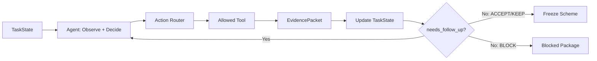

# 基于智能体的水文预报方案构建及参数优化系统：完整课题方案

**面向：** 河海大学数字孪生卓工班（二期）

**指导教师：** 方园皓，河海大学水文水资源学院副教授

**修订日期：** 2026 年 9 月 7 日

**状态：** 设计阶段；本文件为唯一课题方案，实际实现与研究收益待验证。

**本次核心修订：** 将原先容易被理解为“一次诊断 → 一次优化 → 一次比较”的流程，重构为 **Codex 式 iterative tool-use agent loop**：Agent 每轮观察当前 TaskState，选择一个合法业务动作，工具执行后返回结构化 EvidencePacket，再由 Agent 基于新证据决定继续、换假设、换动作、回滚、保持或停止。XAJ 参数率定和 OpenHydroNet 局部适配仍由模型专属数值优化器执行，形成“外层 Agent Loop + 内层 Optimizer Loop”的双层结构。

## 目录

- [1. 课题摘要与研究定位](#section-1)
- [2. 研究范围、输入输出与模型可行性](#section-2)
- [3. 文献基础、工程参考与拟验证贡献](#section-3)
- [4. 四层架构、Agent Runtime 与专业算子契约](#section-4)
- [5. 阶段隔离、TaskState 与自主查询循环](#section-5)
- [6. 水文上下文与历史相似过程](#section-6)
- [7. 证据驱动诊断与双层参数优化循环](#section-7)
- [8. A01—A12 Action Space 完整业务动作契约](#section-8)
- [9. Skills、编排、技术栈与证据存储](#section-9)
- [10. 正式实验与验收协议](#section-10)
- [11. 工作台、报告与答辩交付](#section-11)
- [12. 实施阶段、风险与最终完成门槛](#section-12)
- [13. 附录：文献与工程技术依据](#section-13)

<a id="section-1"></a>

## 1. 课题摘要与研究定位

本课题研究：**一个受约束的水文 Agent，能否像代码智能体通过“观察—调用工具—读取结果—再决策”反复解决问题那样，在水文证据约束下自主完成预报方案构建、异常排查、有限参数优化、结果验证与方案冻结。**

首期采用单流域、日尺度未来第 1—3 日流量预测，并列接入 XAJ（新安江）与 OpenHydroNet 两类模型，在一台 M1 Pro 上开展历史起报回放。每个模型内设置 O（固定基础方案）、P（固定优化流程）、A（Agent 驱动方案）三个方法组。首期由用户明确选择模型，Agent 只在该模型能力范围内选动作；自动推荐模型、任务中跨模型切换和模型集成不属于首期。

### 核心研究问题

> 在同一模型、相同基础方案、相同合法数据、相同候选空间与可比总预算下，允许 Agent 根据每轮 Tool Output 动态更新假设和下一动作，是否比固定流程 P 带来更好的预测质量、任务完成率或计算效率？

围绕主问题分别验证：

1. **A 与 O：** 整套 Agent 方案相对固定基础模型是否有效；该差异包含流程、修复和适配，不单独归因为 Agent 决策。
2. **A 与 P：** 在同工具、同候选空间、同预算下，动态证据反馈决策是否优于冻结流程；这是 Agent 增量价值的主要证据。
3. **边界能力：** 当问题来自数据、时间、状态、forcing、资源或能力不足时，Agent 是否能正确避免无意义调参并进入 KEEP、ROLLBACK、BLOCK 或 HANDOVER。

### 本课题真正的 Agent 性在哪里

本课题不把“调用一次 LLM 决定要不要调参”视为完整 Agent。核心运行方式是：

```text
TaskState
   ↓
Agent 观察证据并选择下一动作
   ↓
Tool / Model / Optimizer 执行
   ↓
EvidencePacket
   ↓
写回 TaskState
   ↓
needs_follow_up ?
   ├─ Yes → Agent 再次观察与决策
   └─ No  → ACCEPT / KEEP / BLOCK / FREEZE
```

一个参数优化失败不会自动结束任务。失败本身可以成为新证据，例如：

- HEAD 适配改善高流量 Bias，但 lead 3 明显退化 → rollback，下一轮重新诊断；
- 参数确有变化但预报表现几乎不变 → 降低“模型参数是主因”的假设优先级；
- 适配无效，同时 HRES/GraphCast forcing 分歧很高 → 转而检查 C4 FORCING，而不是继续盲调模型；
- 多轮没有产生新证据 → 正确停止，而不是把验证集试到变好。

### 双层 Loop

**外层 Agent Loop：** 决定 what / when / why / continue-or-stop。

- 现在最应该检查什么？
- 是否值得干预？
- 下一轮调用哪个 Action？
- 优化失败后，是换策略、换假设、回滚还是停止？
- 当前证据是否足够冻结方案？

**内层 Optimizer Loop：** 决定具体数值搜索。

- XAJ：率定器在冻结边界内搜索参数向量；
- OpenHydroNet：Optimizer/Trainer 在冻结策略与超参数集合中搜索候选；
- Evaluator：按冻结 Gate 验证候选。

Agent 不直接生成 XAJ 参数向量，也不自由生成 learning rate、epoch 或网络权重。

### 题目与研究内容对应

| 题目关键词 | 本项目中的实际落点 | 不是在做什么 |
|---|---|---|
| 基于智能体 | Agent 基于每轮新证据动态选择下一业务动作，并决定继续或停止 | 不是给固定流水线加一层聊天界面 |
| 水文预报方案构建 | 数据核查、方案校验、状态重建、预报、诊断、处理、比较、冻结 | 不是只运行一次模型得到过程线 |
| 参数优化 | Agent 决定何时调用受约束率定/适配工具，并根据结果决定下一实验 | 不是 LLM 自己搜索连续参数或直接训练基础模型 |

### 团队条件与结论边界

**团队没有水文专业人员，本期不设置必须依赖专家逐案打分或真人操作对照的实验。** 工程人员负责数据来源、程序计算、版本、产物和可复现性核对；真实水文物理原因不由另一个 LLM 代替专家认定。

因此本期可以评价：预测质量、流程完成、已知故障恢复、动作越权、候选采用/撤销、运行成本和证据可追溯性；不能宣称专家级诊断正确率、专业人员替代比例或真实业务人工节省率。

<a id="section-2"></a>

## 2. 研究范围、输入输出与模型可行性

### 首期范围

| 项目 | 本期设计 |
|---|---|
| 空间范围 | 一个公开数据流域；第二流域属于扩展 |
| 预测对象 | 站点未来第 1、2、3 日流量及日尺度高流量过程 |
| 应用方式 | 历史起报回放；正式回放前冻结方案 |
| 计算条件 | 一台 M1 Pro；CPU 为可验证起点，MPS 单独验证；第三方 LLM API |
| 模型路线 | XAJ 参数率定与 OpenHydroNet 局部适配平行接入 |
| Agent 组织 | 一个主 Agent；A01—A12 为 Action Space；确定性程序完成计算和核验 |
| 交互方式 | 一次配置任务；自动运行；网页查看、暂停、恢复和异常接管 |
| 成果 | 工作台、预报方案包、预测文件、Evidence/Action 账本、O/P/A 对照、报告与答辩材料 |

本期不以小时级山洪预警、淹没计算、调度控制、全球模型训练、自动模型选择、多模型集成或自主发现新水文机理为交付目标。

### 一次性任务配置

任务必须明确：

- `basin_id`；
- `model_id`；
- 日期范围与 lead 1/2/3；
- 数据源与 forcing mode；
- 基础方案；
- 是否允许优化；
- Agent 轮数、优化次数、数值候选/函数评价、时间及 API 预算；
- 验收 Gate 与停止条件；
- B/F/E 阶段权限。

无人逐轮指挥不等于 Agent 可以猜测缺失目标或无限试验。

### 输入类型

- **模型输入：** 当前模型真实要求的历史气象、未来气象驱动、流域属性及历史窗口。
- **评价资料：** 实测流量及发布时间、质量标记；仅在授权阶段用于训练/验证或事后评价。
- **方案资料：** 参数或权重、配置、缩放器、状态规则、模型和 Adapter 版本。
- **运行约束：** Action 权限、策略注册表、候选空间、阶段、预算和 Gate。

### 两种气象模式

| 模式 | 未来气象来源 | 可支持的结论 |
|---|---|---|
| F：历史预报驱动 | 起报时已经发布并可获得的历史气象预报 | 所验证信息条件下的历史提前预报表现 |
| R：理想气象驱动回算 | 未来实测或再分析气象 | 已知未来气象条件下的水文回算、适配和流程表现 |

F 是目标模式。若只能取得 R 所需资料，明确降为回算实验，不能称为已完成真实提前预报验证。`phase` 与 `forcing_mode` 必须分别存储。

### 任务产物

每个任务至少生成：

1. **Scheme**：模型、配置、数据映射、状态规则、参数/权重及版本；
2. **Forecast**：issue_time、target_time、lead、预测值、单位、scheme 和数据快照引用；
3. **EvidencePacket**：每次工具执行后的结构化新证据；
4. **ActionLedger**：每轮 Agent 选择、工具调用、结果、预算和停止原因；
5. **Evaluation**：开发期验证或独立 E 阶段评价；
6. **TaskStatus**：完成、受限完成、受阻、失败或人工接管。

### OpenHydroNet 可行性门槛

沿用已核查源码版本 `828dfc5a66f4e6f2c86b09d500e4547c4d92ed25`。官方教程提供 Mean Embedding Forecast LSTM 的局部微调路径，对应模块名为 `static_embedding_fc`，并包含 `head` 等可微调模块。教程存在不等于本项目已完成推理、微调、MPS 或独立时间评价。

本机必须先完成：

- 单流域真实推理；
- 一次小规模局部适配；
- trainable parameters 核验；
- 非目标模块未更新核验；
- CPU/MPS 耗时与峰值内存记录；
- 权重、缩放器和训练范围审计。

公开全球权重说明其训练覆盖 1982—2023 年且没有时间留出。正式独立测试不能与基础权重或后续适配训练资料重叠。若无法证明独立时间泛化，只报告工程运行或明确标记的探索性结果。

### 候选流域

首选核查 **South Fork Payette River at Lowman, Idaho，USGS 13235000**。OpenHydroNet 官方 Notebook 将 `camels_13235000` 用作示例微调流域，便于复现模型接口。

但它目前只是候选，不是已经验证的双模型共同案例。G0 必须核查：

- 流量与流域属性覆盖；
- HRES/GraphCast 等 forcing 的实际可用时间和发布时间；
- XAJ 需要的降水与蒸散/PET；
- 融雪与人为调节影响；
- 两模型共同合法测试窗口。

禁止根据独立测试分数倒选流域。

### XAJ 数据、实现与基线门槛

首期采用可复现的日尺度集总 XAJ 实现，具体变体、许可证、路由方法、状态变量和参数清单在 G0 锁定。可优先审计 `hydromodel`，但不在真实接入前假设所有 XAJ 变体具有完全相同参数数目和边界。

XAJ 需流域平均降水、实现所要求的蒸发/PET、合法暖机资料和初始状态；流量观测用于开发和评价。蒸发皿蒸发、潜在蒸散和实际蒸散不能无依据互换。

XAJ 的 O 基线采用 G0/G1b 预先固定的有来源参数方案，或共同开发期标准率定结果；P/A 必须从完全相同基础方案开始。不得使用故意较差的随机参数制造 Agent 提升。

两模型均须完成真实 forecast 与对应 calibrate/adapt 产物。单模型通过不代表双模型方案已经完成。

<a id="section-3"></a>

## 3. 文献基础、工程参考与拟验证贡献

已有研究覆盖 LLM 水文率定、工具调用、全流程建模、Skills 化预报经验和人机协作，因此本项目不把“LLM 能调用水文模型”“LLM 能做率定”“有网页 Agent”作为创新本身。

| 方向 | 已有工作给出的启发 | 本项目处理方式 |
|---|---|---|
| Skills 水文流程 | 可以将预报经验组织为方法与工具 | Skills 只提供处理方法，不代替运行时 Loop |
| LLM 与传统率定 | 必须和传统优化公平比较 | 同模型设置 O/P/A，P/A 共用 optimizer 与预算 |
| 水文 Agent | 工具调用、诊断、执行和报告已有研究 | 重点检验 evidence-feedback 决策是否带来增量 |
| 水文诊断 | 数据/forcing/model 问题需区分 | 原因空间保留候选假设，不冒充物理真因 |
| 人机协作 | 自动化与专业收益不是同一个问题 | 本期不做真人减负证明 |

### 工程参考：OpenAI Codex 的 iterative tool-use loop

本项目把 `openai/codex` 的执行控制思想作为**软件工程参考**，不是水文研究文献，也不是要复制 Codex 的代码编辑工具。

Codex 的核心运行思想可以抽象为：

```text
model sampling
    ↓
function/tool call ?
    ├─ yes → execute tool → append tool output → next sampling
    └─ no  → final response → stop
```

Hydro-Agent 将这一控制范式映射为：

```text
Agent decision
    ↓
Hydrology Action
    ↓
EvidencePacket
    ↓
needs_follow_up ?
    ├─ yes → next Agent decision
    └─ no  → ACCEPT / KEEP / BLOCK / FREEZE
```

关键借鉴是：**Tool Output 天然成为下一轮决策上下文。** 本项目不复制 Codex 的 shell/edit/test 工具，而是使用水文领域的 data_check、forecast、context、calibrate、adapt、evaluate 等受约束工具。

### 拟验证贡献

本期拟验证的是：

1. **可追溯的证据反馈 Agent Loop；**
2. **Agent 决策与数值搜索明确分层；**
3. **A01—A12 作为可动态选择的 Action Space，而非固定流水线；**
4. **在相同总预算下与固定流程 P 比较 adaptive experiment planning 的增量价值；**
5. **严格 B/F/E 隔离下的停止、回滚和受阻能力。**

完整负结果仍然是合法研究结果：如果 A 与 P 接近甚至更差，应如实说明固定流程在本案例上更经济或更稳定。

<a id="section-4"></a>

## 4. 四层架构、Agent Runtime 与专业算子契约

系统保留四层业务架构，但明确增加一个贯穿层间的 **Agent Runtime Loop**。

### 四层

1. **Agent Decision Layer**：读取状态、更新候选假设、选择下一 Action、决定继续或停止。
2. **Hydrology Tool Layer**：数据、上下文、状态、预报、诊断辅助、比较、恢复和方案管理工具。
3. **Numerical Model Layer**：XAJ + 率定器；OpenHydroNet + Optimizer/Trainer。
4. **Data & Evidence Layer**：快照、方案、预测、指标、EvidencePacket、ActionLedger、CostLedger。

### 核心运行图



因此 LangGraph 不应实现成：

```text
A01 → A02 → A03 → ... → A12
```

而应实现成最小循环：

```text
AGENT → TOOL_ROUTER → TOOL_EXECUTION → STATE_UPDATE → FOLLOW_UP_GATE
   ↑                                                  │
   └────────────────── needs_follow_up = true ────────┘
```

A01—A12 是 `TOOL_ROUTER` 可选择的 Action Space。

### Agent Decision Layer

Agent 不负责重复计算 NSE、降水累计、单位转换或神经网络训练，而负责程序难以仅靠一组静态规则完整表达的选择：

- 当前优先排查 DATA / TIMING / STATE / FORCING / MODEL 哪一类？
- 这轮新证据支持还是削弱了上一轮假设？
- 下一步的信息增益最大的是检查、修复、重建、预报、率定、适配还是停止？
- 一个优化候选被拒绝后，是否有理由尝试另一个策略？
- 是否已经没有新证据，应该 KEEP 或 BLOCK？

### Hydrology Tool Layer

所有 Tool 必须声明：

- 输入 schema；
- 输出 schema；
- 允许阶段；
- 模型能力要求；
- 策略与预算要求；
- 幂等键；
- 失败类型；
- Evidence/Artifact 引用。

Agent 不直接修改原始文件、模型参数文件或评价公式。

### Numerical Model Layer

XAJ 与 OpenHydroNet 是平行的能力提供者，不互为子步骤。

```text
XAJ Adapter
  ├─ forecast
  ├─ validate
  └─ calibrate

OpenHydroNet Adapter
  ├─ forecast
  ├─ validate
  └─ adapt
```

模型能力由版本化 registry 声明，Agent 不能自行发明能力。运行权限取交集：

```text
model capability
∩ current phase
∩ task permission
∩ frozen strategy registry
∩ remaining budget
```

### TaskState

建议首期状态至少包含：

```yaml
task_state:
  task_id: null
  phase: B | F | E
  forcing_mode: F | R
  model_id: null
  issue_time: null
  current_scheme_id: null

  active_problem: null
  hypotheses: []
  evidence_ids: []
  latest_evidence_packet_id: null

  attempted_actions: []
  attempted_strategies: []
  decision_round: 0
  optimization_cycle: 0

  budget:
    agent_rounds_remaining: null
    optimization_cycles_remaining: null
    model_budget_remaining: null
    wall_time_remaining: null
    api_budget_remaining: null

  terminal_status: null
  terminal_reason: null
```

Agent 每轮读取的是可审计的 TaskState，而不是依赖隐藏“记忆”猜测之前发生了什么。

### EvidencePacket

所有重要 Tool Output 统一投影成结构化 EvidencePacket：

```yaml
evidence_packet:
  packet_id: null
  task_id: null
  action_id: null
  tool_name: null
  input_hash: null
  status: success | partial | failed | blocked

  artifacts: []
  observations: []
  metrics: {}
  gates: {}

  hypothesis_effects:
    supported: []
    weakened: []
    unresolved: []

  changed_scheme_id: null
  cost:
    wall_time_s: null
    model_compute_s: null
    api_cost: null

  follow_up_hints:
    has_new_evidence: true
    safe_actions: []
```

`hypothesis_effects` 可以由确定性规则填一部分，也可以由 Agent 在下一轮解释；工具本身不能宣布真实物理因果。

### 标准预报算子

```python
forecast(
    scheme_id: str,
    basin_id: str,
    issue_time: datetime,
    data_snapshot_id: str,
) -> ForecastResult
```

`ForecastResult` 必须含模型、Adapter、方案、状态、数据快照、lead 1/2/3、target_time、单位、quality_flags 与 artifact_ids。

### OpenHydroNet 适配算子

```python
adapt_model(
    base_scheme_id: str,
    strategy_id: str,
    training_snapshot_id: str,
    validation_snapshot_id: str,
    budget_id: str,
) -> AdaptationRun
```

`strategy_id` 只能来自 M0 冻结策略，例如 `HEAD / STATIC / STATIC_HEAD`。一次 Tool Call 内可由固定网格或 Optuna sampler 搜索冻结的 learning rate / epochs 候选；这是**内层数值循环**。

### XAJ 率定算子

```python
calibrate_model(
    base_scheme_id: str,
    strategy_id: str,
    calibration_snapshot_id: str,
    validation_snapshot_id: str,
    budget_id: str,
) -> CalibrationRun
```

一次率定内部可执行多次目标函数评价；Agent 只选择已冻结策略，例如 `CALIBRATE_BOUNDED`，不直接给出参数向量。

### 实现原则

1. Agent 不直接 import 模型内部训练/率定逻辑作为自由操作接口。
2. forecast 与 calibrate/adapt 分离，日常预报不能隐式训练。
3. Adapter 与 Agent 解耦。
4. 数值计算、指标、Gate 和单位转换尽量确定性。
5. Tool Output 必须进入 TaskState，不能执行完就丢弃。
6. 每轮 Agent 默认只选择一个主要 next_action；长数值搜索可在 Tool 内完成。
7. KEEP、ROLLBACK、BLOCK 都是合法结果。
8. 无新证据不得重复同一 hypothesis + action + strategy + base_scheme。
9. B 才允许模型参数/权重改变；F/E 后端硬拒绝。
10. 正式实验前冻结 Agent/Skills、策略、模型、阈值和预算。

<a id="section-5"></a>

## 5. 阶段隔离、TaskState 与自主查询循环

### B：方案构建与历史适配

使用训练/验证资料，允许自主 Agent Loop。A01—A10 均可能被选择，但具体顺序由当前 TaskState 和权限决定。

B 阶段是唯一允许以下行为的阶段：

- 根据合法开发真值计算误差；
- 诊断历史表现；
- 调用 XAJ calibrate 或 OHN adapt；
- 接受/撤销候选；
- 多轮依据新证据修正下一步计划；
- 最终 A10 freeze。

### F：冻结方案历史起报回放

F 只运行冻结方案。允许当时可得资料的取数、固定转换、状态重建和技术恢复，但不得根据测试流量：

- 改参数或权重；
- 改 Skills/Prompt；
- 改阈值；
- 改策略顺序；
- 新增优化策略。

F 阶段也可以有工具调用循环，但它只能解决技术性执行问题，不能沿着误差反馈进入模型更新。

### E：只读评价与复盘

E 阶段开放测试实测流量，由独立评价器计算指标和报告。E 只读预测和模型方案，不允许修改已冻结结果。

### Codex 式 run loop 映射

概念伪代码：

```python
while True:
    state = load_task_state(task_id)

    if terminal(state):
        break

    decision = agent.sample(state, available_actions(state))
    validate_action(decision, state)

    result = execute_tool(decision)
    packet = build_evidence_packet(result)
    state = append_and_update(state, decision, packet)

    follow_up = evaluate_follow_up(state)
    if not follow_up:
        finalize(state)
        break
```

这里的关键不是 Python `while` 本身，而是：**每次 Tool Result 都参与下一轮模型采样。**

### needs_follow_up 语义

`needs_follow_up=true` 至少需要同时满足：

1. 当前任务未达到 ACCEPT / KEEP / BLOCK 等终止条件；
2. 本轮产生了可影响下一决策的新 Evidence，或存在明确未执行的必要 Action；
3. 当前阶段允许下一动作；
4. 仍有对应预算；
5. 未触发重复动作保护。

以下情况应为 false：

- 所有质量 Gate 通过并 ACCEPT；
- 基础方案已合格且无充分干预证据，KEEP；
- 候选均无改善且没有新假设证据，KEEP；
- 缺少必要资料/能力，BLOCK；
- optimization cycle 或总体预算耗尽；
- 连续两轮没有新 Evidence；
- 再次请求相同 hypothesis + action + strategy + base_scheme 且没有新的支持证据。

### Bounded Agent Loop

为防止验证集过拟合，Agent 自主性必须有上限。

开发先导期建议起点：

```text
max_agent_decision_rounds = 20
max_optimization_cycles = 4
OHN max_training_candidates_total = 6
XAJ max_function_evaluations = G1b 实测后冻结
same technical failure retry <= 2
```

其中：

- `max_agent_decision_rounds` 是整个任务的 Agent 决策上限；
- `max_optimization_cycles` 只统计外层 Agent 重新发起 calibrate/adapt 的次数；
- OHN 的 6 个候选是数值候选总预算，不能每轮 Agent 重置；
- XAJ 的函数评价次数与 OHN 候选数不是同一种预算；
- 正式值在 G4 前根据本机实测冻结。

### 状态恢复

LangGraph checkpoint 恢复必须先查询 ActionLedger 和 artifact：

- 相同 tool + input_hash 已成功 → 复用结果；
- 长训练已经完成 → 不重复启动；
- Tool 失败 → 只按冻结技术重试规则恢复；
- Agent 决策轮次与模型候选预算不得因进程重启清零。

<a id="section-6"></a>

## 6. 水文上下文与历史相似过程

### Hydrologic Context Card

Context Builder 是确定性工具，不是新的 Agent。

```python
build_hydrologic_context(task_id, issue_time, scheme_id) -> HydrologicContextCard
```

第一版字段：

```yaml
hydrologic_context:
  issue_time: null

  current_flow:
    value: null
    unit: m3/s
    percentile: null
    recent_trend: rising | falling | stable | unknown

  antecedent_conditions:
    precipitation_3d_mm: null
    precipitation_7d_mm: null
    precipitation_14d_mm: null
    wetness_proxy: high | medium | low | unknown

  forecast_forcing:
    lead_1_precip_mm: null
    lead_2_precip_mm: null
    lead_3_precip_mm: null
    total_precip_mm: null
    hres_total_mm: null
    graphcast_total_mm: null
    disagreement_score: null
    disagreement_level: high | medium | low | unavailable

  regime:
    season: winter | spring | summer | autumn
    temperature_context: null
    snow_fraction_context: null
    process_regime: rainfall | snowmelt | mixed | unknown

  recent_model_behavior:
    sample_count: 0
    mean_bias: null
    high_flow_bias: null
    lead_1_bias: null
    lead_2_bias: null
    lead_3_bias: null
    persistence: isolated | repeated | unknown

  analogues: []
  evidence_ids: []
```

原则：所有数值由程序计算；不可得标 `unknown/unavailable`；F 只使用 issue_time 已可获得资料；Context Card 与模型输入使用相同数据快照。

### 历史相似过程检索

Agent 可以查询：

> 当前情景最像哪些开发期历史过程？当前模型/方案在这些过程上曾经出现什么行为？

第一版特征可包含：起报流量分位数、P3/P7/P14、lead 1/2/3 forcing、三日累计 forcing、季节、温度/雪背景、HRES/GraphCast 分歧、model_id 和 scheme_id。

第一版使用冻结的标准化距离或简单加权距离，K 可从 3—5 先导验证后冻结。历史 analogue 只能来自开发资料，不能从独立测试集建立经验库。

每个 analogue 返回：案例 ID、距离、关键差异、模型版本、基础模型表现、是否高流量、是否执行过适配及适配是否通过。

### forcing 不确定性

forcing disagreement 是诊断证据，不是“气象一定错了”的标签。

示例：

```text
单次高流量低估
+ HRES / GraphCast 差异大
+ 历史 analogue 无持续同方向偏差
→ C4 FORCING 优先
→ 不应直接 ADAPT
```

```text
多场持续高流量低估
+ DATA/TIMING/STATE 已通过
+ forcing 分歧低
+ analogue 有同方向偏差
→ C5 MODEL 支持增强
→ 允许把模型优化作为下一实验
```

<a id="section-7"></a>

## 7. 证据驱动诊断与双层参数优化循环

### Cause Space

A06 不宣称发现真实物理因果，而是在受约束原因空间内维护候选解释：

| 编码 | 原因类别 | 示例 |
|---|---|---|
| C1 DATA | 资料问题 | 缺测、单位、站点、来源 |
| C2 TIMING | 时间问题 | 日界线、issue/target 错位 |
| C3 STATE | 状态问题 | warm-up、缓存、窗口不一致 |
| C4 FORCING | 气象驱动不确定 | 多 forcing 分歧、降水位置/量级不确定 |
| C5 MODEL | 持续模型系统偏差 | 多事件同方向偏差，前述问题已有足够排查 |
| C6 UNKNOWN | 证据不足 | 多种原因均可能 |

`C5 MODEL` 不是默认兜底。单场洪峰低估不能直接推导“应该调哪个参数”。

### A06 诊断输出

```json
{
  "decision_round": 2,
  "phenomenon": "persistent high-flow underestimation",
  "evidence_ids": ["..."],
  "cause_hypotheses": [
    {
      "code": "C5_MODEL",
      "supporting_evidence": ["..."],
      "contradicting_evidence": ["..."]
    }
  ],
  "hypothesis_update": "C5_MODEL strengthened; C4_FORCING weakened",
  "next_action": "ADAPT_STATIC_HEAD",
  "why_this_action_now": "HEAD candidate was rolled back because lead-3 degraded",
  "expected_observation": "check whether additional representation adaptation improves all leads without event guardrail violation",
  "stop_condition": "stop if Gate 2/3 fails again or optimization budget is exhausted"
}
```

不记录模型隐藏思维链；只保存可核验业务结论、证据、选定动作和预期检查。

### 外层 Agent Loop：Adaptive Experiment Planning

参数优化不再描述为一次性的：

```text
A06 diagnose
  ↓
A07 run one allowed optimization strategy
  ↓
A08 evaluate / accept / rollback
  ↓
new EvidencePacket
  ↓
problem solved ?
  ├─ yes → ACCEPT / KEEP → A10
  └─ no + new evidence + budget → 回到 Agent/A06
```

例如：

```text
Round 1
C5 MODEL supported
→ ADAPT_HEAD
→ high-flow Bias improves, lead-3 degrades
→ Gate 2 FAIL
→ ROLLBACK
→ new evidence: output-head change helps magnitude but harms long lead

Round 2
Agent updates hypothesis/plan
→ ADAPT_STATIC_HEAD
→ all lead guardrails pass
→ ACCEPT
→ FREEZE
```

也可能：

```text
ADAPT_HEAD
→ parameters/weights changed but hydrologic behavior unchanged
→ rollback
→ forcing disagreement newly inspected and found high
→ C4 FORCING strengthened
→ KEEP instead of further adaptation
```

这才是本项目希望验证的 Agent 能力：**根据实验反馈改变下一实验，而不是让 LLM 猜数值参数。**

### 内层 OpenHydroNet Optimizer Loop

正式 Agent 实验前做 M0-OHN：

| 策略 | 更新模块 | 目的 |
|---|---|---|
| KEEP | 无 | 基础对照 |
| HEAD | `head` | 输出映射/尺度局部适配 |
| STATIC | `static_embedding_fc` | 静态表征局部适配 |
| STATIC_HEAD | `static_embedding_fc` + `head` | 组合局部适配 |

每个策略绑定冻结候选空间，例如：

```text
learning_rate ∈ frozen_set
epochs ∈ frozen_set
```

由固定网格/Optuna 执行。一次 Agent Tool Call 可以在该策略内部运行多个候选，但整个任务候选总数受统一预算约束。

候选必须：同一基础权重、同一训练/验证资料、固定 seed 规则、记录真实 trainable parameters、检查非目标模块未更新。

### 内层 XAJ Optimizer Loop

M0-XAJ 先验证固定参数模拟与有限率定。可审计 SCE-UA 等有实现依据的算法，最终算法、参数边界、联合约束、seed、最大函数评价次数和时间上限在 G1b/G4 冻结。

首期策略可只有：

```text
KEEP
CALIBRATE_BOUNDED
```

Agent 不需要多个率定算法才有价值。即使只有一种数值率定策略，Agent 仍然可以决定：先查什么、是否值得调用、率定失败后是否回查其他原因、何时停止和回滚。

每个参数候选必须从自身参数和同一合法暖机输入独立重算状态，不继承前一个候选的水量状态。

### 候选质量 Gate

候选采用不使用一个随意综合总分。

**Gate 1：合法性**

- 输出完整；
- 无非法 NaN/Inf；
- 时间/单位正确；
- 覆盖率满足冻结要求。

**Gate 2：lead guardrail**

lead 1/2/3 分别检查，不允许平均改善掩盖某个关键 lead 明显退化。

**Gate 3：高流量/事件 guardrail**

检查高流量 Bias、峰值误差、峰现日期、洪量、漏报/误报（适用时）。

**Gate 4：主指标改善**

在 Gate 1—3 通过后，按冻结主指标排序，例如三个 lead NSE 等权平均，同时报告 KGE/MAE/Bias。

**Gate 5：复杂度/成本**

性能近似时优先 KEEP，其次更简单策略，再次更低成本。

### A08 结果类型

A08 不再只有“接受/撤销后就结束”，而应返回：

```text
ACCEPT_STOP
KEEP_STOP
ROLLBACK_CONTINUE
ROLLBACK_STOP
BLOCK_STOP
```

其中只有 `ROLLBACK_CONTINUE` 会生成 `needs_follow_up=true`，且必须有新 Evidence 和剩余预算。

<a id="section-8"></a>

## 8. A01—A12 Action Space 完整业务动作契约

### 最重要的解释

**A01—A12 是编号稳定的业务 Action Space，不是固定流程顺序。**

编号用于：

- Tool schema 稳定；
- 日志和论文引用；
- 阶段权限校验；
- 前后端展示；
- 实验复现。

运行时真正的顺序由 Agent 或固定流程 P 决定。例如一个任务可能是：

```text
A01 → A03 → A04 → A05 → A06 → A07 → A08
                                  ↑             │
                                  └──── rollback + new evidence ────┘
→ A06 → A02 → A05 → A06 → A09 KEEP → A10
```

也可能正常任务只需要：

```text
A01 → A03 → A04 → A05 → A10
```

### 动作总表

| 编号 | Action | 允许阶段 | 主要作用 |
|---|---|---|---|
| A01 | 检查资料与预报条件 | B/F | 生成数据/时间/来源 Evidence |
| A02 | 有依据补取或纠正资料 | B/F | 处理已证实的数据问题 |
| A03 | 建立或校验可执行方案 | B；F 只校验 | 模型/配置/Adapter 契约检查 |
| A04 | 重建起报历史计算条件 | B/F | warm-up、状态和缓存恢复 |
| A05 | 执行预报与产物检查 | B/F | 运行 forecast 并检查产物 |
| A06 | 诊断历史预报现象 | B | 更新候选 hypotheses 与 next_action |
| A07 | 委托有限优化 | B | 调用 XAJ calibrate 或 OHN adapt |
| A08 | 比较并采用/撤销/继续 | B | Gate 验证并产生 follow-up Evidence |
| A09 | 恢复、维持或受阻收尾 | B/F/E | 技术恢复、KEEP、BLOCK/HANDOVER |
| A10 | 冻结推荐方案 | B | 冻结进入 F 的全部依赖 |
| A11 | 自动连续起报 | F | 使用冻结方案批量回放 |
| A12 | 只读评价与报告 | B/E；F 仅运行摘要 | 指标、图表与结论 |

### A01：检查资料与预报条件

程序检查文件/变量、单位、时间、缺测、重复、面积/站点、发布时间、历史长度、权重和数据切分。Agent 决定哪些异常阻断任务、哪些需要 A02、哪些只是质量标记。

输出必须形成 EvidencePacket。正常极端值不能仅因“看起来异常”被删除。

### A02：有依据补取或纠正资料

只处理可追溯问题：补取缺文件、单位转换、合法时区/日界线重聚合、确证重复数据处理。修复保留原始快照与差异。

修复后通常回到 A01/A05 验证；不能用测试流量真值倒推气象修复。

### A03：建立或校验可执行方案

模型由任务固定。A03 读取 Model Registry，确认当前 `model_id`、基础方案、输入 schema、Adapter、策略与阶段兼容。

F 只校验冻结方案依赖，不能因为测试表现更换模型或配置。

### A04：重建起报历史计算条件

处理历史窗口、warm-up、缓存与状态。XAJ 与 OHN 状态严格隔离；缓存至少绑定 model_id、Adapter、参数/权重哈希、配置、资料哈希和截止时间。

### A05：执行预报与产物检查

生成 lead 1/2/3，检查 target_time、单位、NaN、文件完整性、版本和质量标签。

B 阶段若有合法开发真值可进入 A06；F 不读取未来测试真值决定下一动作。

### A06：诊断历史预报现象

输入包含：A01—A05 Evidence、Context Card、analogue、分 lead/事件指标、当前 hypotheses、已尝试动作和预算。

每轮 A06 必须回答：

1. 与上一轮相比有什么新证据？
2. 哪些 hypothesis 被支持/削弱？
3. 当前最有信息价值的 next_action 是什么？
4. 期望通过该动作观察什么？
5. 什么结果会触发停止或换方向？

没有新证据时不能仅换措辞后重复同一 A07。

### A07：委托模型对应的有限优化

前置：B、任务允许优化、模型 ready、策略已冻结、开发资料合法、预算足够。

Agent 一轮只选择一个模型内策略 ID；数值候选搜索在 Tool 内完成。

A07 输出不直接 ACCEPT，必须交 A08。优化器运行成功和水文效果改善是两件事。

### A08：比较、采用、撤销或继续

程序先执行 Gate。Agent 可以解释候选为什么解决/未解决原问题，但不能越过 Gate 批准。

输出需包含：

- action_result；
- base/candidate scheme；
- Gate 结果；
- 原问题是否改善；
- 新出现的副作用；
- hypotheses 的支持/削弱线索；
- `has_new_evidence`；
- `needs_follow_up`。

有新证据且预算允许时 `ROLLBACK_CONTINUE → 下一 Agent 轮`；无新证据则停止。

### A09：技术恢复、维持或受阻收尾

常见重试由程序按上限处理；Agent 不应为每次网络错误消耗推理轮次。

A09 可以产出 KEEP、BLOCK 或 HANDOVER。受阻包必须说明：问题、证据、已尝试动作、现有可用产物和继续所需条件。

### A10：冻结推荐方案

冻结：model/Adapter 版本、XAJ 参数与状态规则或 OHN 权重/缩放器、代码、数据和预处理、历史窗口、Skills/Prompt、策略注册表、质量 Gate、预算和模式。

独立测试结果不得触发本轮重新冻结。

### A11：自动连续起报

F 阶段使用冻结方案按 issue_time 推进。批量程序完成常规日期；只有技术异常需要 Agent 时才进入受限工具循环。

测试真值与执行器权限隔离。

### A12：只读评价、结论与答辩材料

程序计算指标与图表；LLM 只组织事实、证据和结论。报告包含失败、无改善、KEEP、BLOCK 和成本，不能只保留成功案例。

### 必须跑通的路径

1. **正常：** 检查 → forecast → 结果合法 → KEEP/FREEZE。
2. **资料问题：** 异常 Evidence → repair → re-check → forecast。
3. **多轮历史适配：** diagnose → optimize → rollback → new evidence → re-diagnose → alternate action → accept/keep。
4. **优化后转向其他假设：** optimize 无效 → forcing/state 新证据 → 停止模型调参。
5. **能力不足：** 有限检查 → BLOCK/HANDOVER，不无限重试。
6. **F/E 越权：** 尝试 adapt/calibrate 必须被后端拒绝并记录。

<a id="section-9"></a>

## 9. Skills、编排、技术栈与证据存储

### Skills 是方法，不是 Agent 节点

首期可分五个业务方法包：

| Skill/业务包 | 主要覆盖 | 内容 |
|---|---|---|
| 资料核查与追查 | A01—A02 | 异常分类、来源优先级、合法转换、验证方法 |
| 方案与预报执行 | A03—A05/A11/A09 | 配置、状态、运行、恢复、产物检查 |
| 预报诊断 | A06 | Cause Space、多证据、analogue、forcing、UNKNOWN |
| 有限适配与验证 | A07—A10 | 策略选择、optimizer 委托、Gate、rollback、freeze |
| 评价与报告 | A12 | 只读评价、结果边界、成本和失败报告 |

Skill 不控制固定节点跳转。它给 Agent 提供“这个问题应该怎么处理”的领域方法，真正的 next_action 由 Runtime 每轮决定。

### LangGraph 编排建议

不要把 A01—A12 各做一个串行 Graph Node。首期核心图建议只有：

```text
START
  ↓
LOAD_STATE
  ↓
AGENT_DECIDE
  ↓
ACTION_PERMISSION_GATE
  ↓
TOOL_EXECUTE
  ↓
NORMALIZE_EVIDENCE
  ↓
UPDATE_STATE
  ↓
FOLLOW_UP_GATE
  ├─ continue → AGENT_DECIDE
  └─ terminal → FINALIZE
```

具体 A01—A12 由 Tool Router 注册。

### 与 Codex 类比的实现心智模型

| Codex | Hydro-Agent |
|---|---|
| conversation/thread state | TaskState + EvidenceLedger |
| model sample | Agent decision |
| function/tool call | A01—A12 action call |
| shell/edit/test result | EvidencePacket |
| function_call_output 回写 | EvidencePacket 写入 TaskState |
| needs follow-up | Hydro `needs_follow_up` |
| final assistant message | ACCEPT / KEEP / BLOCK / FREEZE |

这只是控制模式类比，不要求实现 Codex 的线程系统、终端沙箱或代码编辑器。

### 权限与恢复

权限必须在执行器硬校验，不能只写在 Prompt/Skill：

- phase；
- model capability；
- strategy registry；
- allow_optimization；
- budget；
- input schema。

每次逻辑工具调用有唯一 ID 和 input_hash。相同输入、工具版本和阶段已有成功产物时复用。

### 技术选型

- 前端：Vue 3 + TypeScript + ECharts；
- 后端：FastAPI；
- Agent 编排：LangGraph；
- LLM 接入：LangChain 或直接模型 client；
- XAJ：独立数值实现 + 率定器；
- OHN：OpenHydroNet/PyTorch + 有限 Optimizer；
- 存储：SQLite + 本地文件；
- 首期本地单任务执行，避免并行训练挤占 M1 Pro。

### 证据实体

| 实体 | 必须记录 |
|---|---|
| Task | phase、mode、模型、起报范围、预算、终态 |
| TaskStateSnapshot | round、当前方案、hypotheses、Evidence、预算 |
| DataSnapshot | 来源、available_at、处理、哈希 |
| Scheme | model/Adapter、基础/候选关系、参数或权重、策略版本 |
| ActionRun | decision_round、action_id、输入哈希、Tool Output、状态 |
| EvidencePacket | 新观察、指标、Gate、假设影响、成本 |
| Forecast/Evaluation | issue/target/lead、方案、样本、指标版本 |
| CostLedger | LLM、训练/率定、预报、等待、重试、峰值内存 |

<a id="section-10"></a>

## 10. 正式实验与验收协议

### 方法组

| 标识 | 对象 | 执行方式 |
|---|---|---|
| OBS | 历史观测 | 评价参照，不是方法组 |
| O_m | 固定基础方案 | 不执行本轮额外优化 |
| P_m | 固定流程 + 模型 m | 预先冻结检查、触发、策略顺序、重试和停止规则 |
| A_m | Agent + 模型 m | 每轮读取 EvidencePacket 后动态更新 hypothesis 和 next_action |
| A0 可选 | 通用 Agent 消融 | 去除领域 Skill，其他权限和工具相同 |

`m ∈ {XAJ, OHN}`。

### P 与 A 的核心差异必须冻结清楚

P 不是故意做弱。P 可以拥有合理的数据修复、状态恢复和有限优化，但它的**实验计划是冻结的**。

例如 P 可事先定义：

```text
persistent_bias && checks_pass
→ HEAD
→ if Gate fail: STATIC_HEAD
→ if Gate fail: KEEP
```

A 则不是固定顺序：

```text
observe current evidence
→ choose one action
→ read result
→ update hypothesis
→ choose next action
```

A 可能在 HEAD 失败后选择 STATIC_HEAD，也可能根据新 forcing/state 证据决定停止优化或转向 A02/A04。

公平性要求：

- 相同基础方案；
- 相同原始合法数据；
- 相同 Context/analogue 工具；
- 相同 optimizer；
- 相同允许策略集合；
- 相同总 OHN candidate budget / XAJ function-evaluation budget；
- 相同总 wall-time 上限；
- A 的额外 LLM/API 成本单列。

这样 `A − P` 才主要反映 evidence-conditioned adaptive planning，而不是“给 A 更多优化次数”。

### 两条实验线

**实验线一：独立历史预测比较。**

B 阶段生成并冻结 O/P/A 方案；F 在相同独立测试日期回放；E 统一计算 OBS 对照。测试期间不允许调整策略、阈值、Prompt、模型或数据模式。

**实验线二：自动流程可靠性。**

比较正常、数据异常、运行异常、历史偏差、证据不足等任务上的完成、恢复、错误修改、STOP/BLOCK 和成本。

### 时间泄漏隔离

- B：训练/验证；
- F：冻结预测；
- E：测试只读评价。

OHN 权重训练范围、XAJ 参数率定资料、标准化器、analogue 库、阈值和 Prompt/Skills 全部进入泄漏检查。

### 15 个流程模板与双模型实例

每个模型 15 个模板，共计划 30 个模型任务；O/P/A 分别执行，形成 90 个方法运行（不含重复和可选消融）。15 个模板是流程验证规模，不是预测统计样本量。

| 类型 | 数量 | 重点 |
|---|---:|---|
| 正常 | 4 | 无额外干预、正常极端值不误删 |
| 数据异常 | 3 | 缺文件、单位、时间索引等已知故障 |
| 运行异常 | 2 | 中断、产物缺失、恢复和幂等 |
| 历史偏差与优化 | 4 | 至少覆盖一次 rollback + follow-up 的多轮路径 |
| 证据/资源不足 | 2 | BLOCK、预算耗尽、无新证据停止 |

其中至少一条 B 任务必须真实展示：

```text
Agent round N
→ optimization Tool
→ Gate fail / rollback
→ EvidencePacket
→ Agent round N+1
→ changed hypothesis or changed next_action
```

否则“外层 Agent Loop”只有接口，没有实证运行证据。

### 预测指标

每个 lead 按 target_time 对齐：

- NSE；
- KGE 及分项；
- MAE；
- Bias；
- 覆盖率；
- 高流量 Bias；
- 峰值偏差；
- 峰现日期误差；
- 洪量偏差；
- 漏报/误报（适用时）。

主预测指标可采用独立测试 lead 1/2/3 NSE 等权平均；任一 lead 不可计算时，主指标整体不可用，不静默改平均方式。

### Agent Loop 过程指标

除最终预测结果，A/P 还记录：

- Agent 决策轮数；
- optimization cycle 数；
- 每轮 action sequence；
- hypothesis 是否因新 Evidence 改变；
- 重复动作被阻止次数；
- ACCEPT / KEEP / ROLLBACK / BLOCK 统计；
- Tool 调用总数；
- OHN candidate / XAJ function evaluation 实际消耗；
- LLM/API 成本；
- 总 wall time。

这些指标只说明流程行为，不自动等于“更智能”。

### 候选接受规则

G4 前冻结：

- 各 lead 最低覆盖率；
- 允许的 lead NSE 退化量；
- 接受候选最小改善；
- 高流量/事件 guardrail；
- Tool 超时；
- max_agent_rounds；
- max_optimization_cycles；
- OHN 总 candidate 数；
- XAJ 函数评价上限；
- no-new-evidence stop 规则。

不得根据测试结果事后放宽。

### 成本与重复运行

先在开发任务实测至少 3 次 Agent 运行，分离 LLM 随机性和训练随机性。正式重复计划在 G4 冻结。

逐任务记录：总历时、LLM/API、模型推理、训练/率定、排队、候选数、函数评价、重试、峰值内存。没有货币成本凭据时不编造折算。

### 结果解释

| 结果 | 可写结论 |
|---|---|
| A > O，但 A ≈ P | 整体流程/适配有效，未证明动态 Agent 决策有额外价值 |
| A 在同预算下稳定优于 P | 对所测任务存在 evidence-feedback Agent 增量价值证据 |
| A/P 质量接近，A 成本高 | 固定流程在本案例更经济 |
| A 更少调用优化且保持质量 | 动态停止可能带来计算效率收益 |
| A 多轮试验后仍无改善并 KEEP | 参数优化收益未成立，但停止/边界逻辑可正确 |
| A 不断消耗预算才变好 | 需要警惕验证集过拟合，不能直接宣称智能体优势 |
| 只有 R 模式 | 只能报告理想气象驱动回算 |

<a id="section-11"></a>

## 11. 工作台、报告与答辩交付

### 创建任务

前端只让用户选择：流域/案例、日期、模型、基础方案、阶段、是否允许优化。不展示 A01—A12 复选框，也不要求用户逐轮操作。

### 运行时间线

业务展示优先使用：

- 正在检查资料；
- 已建立水文上下文；
- 正在运行 XAJ/OpenHydroNet；
- Agent 判断下一步；
- 正在执行第 2 轮有限适配；
- 候选被撤销：lead 3 退化；
- 根据新证据改为检查 forcing；
- 维持原方案；
- 已冻结方案。

技术详情展开后显示 `decision_round / action_id / tool_call_id / evidence_packet_id`。

### 推荐页面

| 页面 | 内容 |
|---|---|
| 数据与任务 | 来源、质量、切分、权重/参数、模式、预算 |
| Agent Loop | 当前 TaskState、round、hypotheses、next_action、Evidence 时间线 |
| 过程线 | 指定模型 O/P/A 的预测与 OBS；F 隐藏未来观测 |
| Context | forcing 分歧、analogue、证据引用 |
| 方案实验 | M0、优化 cycle、candidate、Gate、rollback/accept |
| 对照评价 | lead 指标、事件、覆盖率、完成率、成本 |
| 报告导出 | 全部成功、失败、KEEP、BLOCK 和结论 |

### Workflow 图

`docs/diagrams/hydro-agent.workflow.json` 是面向小组成员的主图，强调：

> TaskState → Agent → Action Space → Tool/Optimizer → EvidencePacket → needs_follow_up → Agent/Freeze。

`docs/diagrams/hydro-agent.dual-model.workflow.json` 展示双模型细节：XAJ 与 OHN 平行，外层 Agent Loop 共用，内层 optimizer 各自独立。

### 答辩建议

12 页：

1. 问题与研究边界；
2. 文献与已有工作；
3. 为什么传统“一次优化”不等于 Agent；
4. Codex 式 iterative tool-use 参考与水文映射；
5. 四层架构 + TaskState/EvidencePacket；
6. 外层 Agent Loop + 内层 Optimizer Loop；
7. XAJ/OHN 双模型；
8. B/F/E 防泄漏；
9. O/P/A 公平实验；
10. 预测质量与流程结果；
11. 成本、失败、KEEP/BLOCK；
12. 结论与局限。

当前设计阶段不填造任何效果值。

<a id="section-12"></a>

## 12. 实施阶段、风险与最终完成门槛

| 阶段 | 工作 | 通过证据 |
|---|---|---|
| G0 数据与双模型 | 审计共同案例、XAJ 输入/状态/参数、OHN 权重/输入/资源，真实 forecast | 数据清单、合法切分、真实输出、资源实测 |
| G1a 共同工具 | data/context/analogue/forecast/evaluate/EvidencePacket/ledger | schema 可复现、证据引用完整 |
| G1b M0-XAJ/OHN | 验证有限率定和局部适配，冻结策略及数值预算 | 真实更新、候选轨迹、耗时内存 |
| G2 P 固定流程 | 完成合理的固定优化基线 | 固定分支、停止规则与公平预算 |
| G3 Agent Runtime | 实现 TaskState → Agent → Tool → Evidence → follow-up loop | 至少一条真实 rollback → re-plan 多轮路径 |
| G4 协议冻结 | 测试序列、阈值、Agent/optimizer 预算、Prompt/Skills、P/A 规则 | 冻结清单与泄漏检查 |
| G5 正式比较 | 双模型 O/P/A 预测与流程实验 | 全部质量、覆盖、状态、Action/Evidence、成本 |
| G6 交付 | 工作台、方案、账本、报告和 PPT | 一次完整回放，数字同源 |

### Agent Loop 专项验收

1. Tool Output 必须进入下一轮 Agent 可见状态。
2. 至少一个任务真实出现 `rollback → new Evidence → changed next_action`。
3. A01—A12 不以固定 DAG 强制顺序执行。
4. 没有新 Evidence 时不能重复同一优化策略刷验证集。
5. `max_agent_rounds` 与 `max_optimization_cycles` 重启后不清零。
6. OHN candidate budget / XAJ function-evaluation budget 跨 Agent 轮次共享。
7. Agent 不能直接修改连续超参数或 XAJ 参数向量。
8. F/E 优化调用被执行器拒绝。
9. ACCEPT、KEEP、ROLLBACK、BLOCK 均有真实可追溯状态。
10. P/A 同工具、同候选空间、同总数值预算。

### 双模型必验

- XAJ：forecast + calibrate 真实产物；
- OHN：forecast + adapt 真实产物；
- model_id/scheme_id 不匹配拒绝；
- 错误能力调用拒绝；
- XAJ 状态/参数与 OHN 权重/缓存隔离；
- 任务中模型固定，不静默切换；
- 两模型分别完成 O/P/A。

### 主要风险

**风险 1：Agent Loop 只是图上循环。**

解决：G3 必须保存逐轮 TaskState、EvidencePacket 和 changed next_action 的真实运行记录。

**风险 2：验证集被多轮 Agent 过拟合。**

解决：冻结总轮数、优化 cycle、候选/函数评价、阈值和 no-new-evidence stop；独立测试完全隔离。

**风险 3：A 比 P 只是因为做了更多计算。**

解决：同模型 P/A 共享总 optimizer 预算和 wall-time 上限，单列 LLM 额外成本。

**风险 4：LLM 给出看似专业但不可验证的水文解释。**

解决：Cause Space 只存候选 hypothesis，重要结论必须引用 Evidence；不评价真实物理原因准确率。

**风险 5：M1 Pro 无法承担 OHN 多轮适配。**

解决：G1b 实测后缩小冻结候选空间；Agent 外层轮数与模型内 candidate 总数分开控制。

### 当前下一步

1. G0 锁定共同案例、XAJ 实现、OHN 权重和数据切分；
2. G1a 先实现 `TaskState / EvidencePacket / ActionLedger` schema；
3. G1b 分别跑通一次 XAJ calibrate 与 OHN adapt；
4. 实现最小 LangGraph Runtime，不先写 A01→A12 串行图；
5. 构造第一条真实多轮任务：`ADAPT → Gate fail → rollback → re-diagnose → changed action`；
6. 再冻结 P 与 A 的公平实验协议。

<a id="section-13"></a>

## 13. 附录：文献与工程技术依据

### 水文研究

1. **Yang2026Skills** — Yang, Q., et al. (2026). *HydroAgent: Formalizing Forecaster Expertise into Skill-Orchestrated Flood Forecasting Workflows*. arXiv v1. 重点参考 Skills 化预报经验与业务流程组织。
2. **Zhu2026Calibration** — Zhu, Z., et al. (2026). *Large Language Models as Calibration Agents in Hydrological Modeling: Feasibility and Limitations*. Geophysical Research Letters, 53, e2025GL120043. 说明 LLM 率定已有正式研究，且不同 LLM 表现并不一致。
3. **Yan2026Agent** — Yan, S., et al. (2026). *AI Agent for Hydrologic Modeling: Definition, Development, and Application*. Geophysical Research Letters, 53, e2025GL119814. 全流程水文 Agent 与自主等级参考。
4. **Tudaji2026HydroCraft** — Tudaji, M., Tian, F., & Wu, X. (2026). *HydroCraft: an efficient online platform for hydrological modeling integrated with a large language model agent*. Journal of Hydrology, 677, 135801.
5. **Zhao2026MADR** — Zhao, Y., et al. (2026). *LLM-Driven Diagnostic Reasoning for Distributed Hydrological Model Calibration*. Research Square v1.
6. **Li2026CalibrationRL** — Li, Z., et al. (2026). *HydroAgent: Closing the Gap Between Frontier LLMs and Human Experts in Hydrologic Model Calibration via Simulator-Grounded RL*. arXiv v1.
7. **Eythorsson2025INDRA** — Eythorsson, D., & Clark, M. (2025). *Toward Automated Scientific Discovery in Hydrology: The Opportunities and Dangers of AI Augmented Research Frameworks*. Hydrological Processes, 39, e70065.
8. **Pagano2016Automation** — Pagano, T. C., et al. (2016). *Automation and human expertise in operational river forecasting*. WIREs Water.
9. **Tran2026Forecasters** — Tran, V. N., et al. (2026). *The Value of Forecasters-in-the-Loop in Real-Time Flood Forecasting in the Age of Machine Learning*. Geophysical Research Letters, 53, e2025GL118317.

### 模型依据

- OpenHydroNet / Google flood-forecasting Mean Embedding 模型源码：`googlehydrology/modelzoo/mean_embedding_forecast_lstm.py`。
- OpenHydroNet 训练器：`googlehydrology/training/basetrainer.py`。
- 官方 fine-tuning 教程和配置用于核查 `static_embedding_fc`、`head` 等模块与局部适配路径。
- XAJ 候选实现优先审计 `OuyangWenyu/hydromodel`，最终以 G0 锁定版本为准。

### Agent Runtime 工程依据

- **OpenAI Codex repository：** `https://github.com/openai/codex`。
- 重点参考 `codex-rs/core/src/session/turn.rs` 中的 turn loop：模型发出 function call 时执行 Tool，将 Tool Output 写回上下文并继续下一次 sampling；只有不再需要 follow-up 时结束 turn。
- 重点参考 `codex-rs/core/src/stream_events_utils.rs` 中 tool call 设置 follow-up、Tool Output 持久化与下一轮继续的控制模式。
- 本项目只借鉴 iterative tool-use runtime 的抽象，不复制 Codex 的 shell、代码编辑、权限模型或具体实现。

### 编排与 Skills

- LangGraph：用于 state、conditional routing、checkpoint 和恢复。
- Agent Skills specification：用于业务方法包格式。

源码核查记录不等于本机运行证据；设计图、接口和 Prompt 均不等于系统已真实跑通。最终结论以 G0—G6 的真实实验、账本和独立测试为准。
