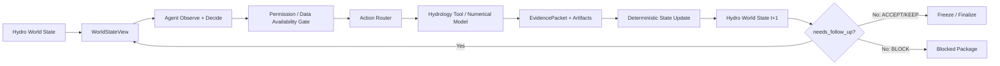

# 基于智能体的水文预报方案构建及参数优化系统：完整课题方案

**面向：** 河海大学数字孪生卓工班（二期）

**指导教师：** 方园皓，河海大学水文水资源学院副教授

**修订日期：** 2026 年 9 月 8 日

**状态：** 设计阶段；本文件为课题科研方案与总体设计的统一入口。产品实现细节仍以 [`产品规格.md`](./产品规格.md) 为准；专项设计可参考 [`水文世界模型.md`](./水文世界模型.md) 与 [`数据源与实验数据协议.md`](./数据源与实验数据协议.md)，但若存在表述冲突，以本文件的研究边界、阶段定义和实验协议为准。

**本次核心修订：** 将原有 Agent Loop、轻量水文世界模型（Hydro World Model）和开源数据/实验数据协议整合为一个统一方案。系统不再仅以 `TaskState` 作为 Agent 的主要认知入口，而是形成 **Hydro World State → WorldStateView → Agent → Action → Tool/Model → Evidence → World State Update** 的闭环；同时将 `available_at`、R/F forcing mode、B/F/E 阶段权限和数据快照追溯直接纳入世界状态与执行权限。

---

## 目录

- [1. 课题摘要、研究定位与核心假设](#section-1)
- [2. 研究范围、对象、模型与输入输出](#section-2)
- [3. 开源数据源与实验数据协议](#section-3)
- [4. 轻量水文世界模型 Hydro World Model](#section-4)
- [5. 总体架构：五层一闭环与硬约束](#section-5)
- [6. TaskState、WorldStateView、阶段隔离与运行时循环](#section-6)
- [7. 水文上下文、历史相似过程与证据驱动诊断](#section-7)
- [8. 双层参数优化循环与候选质量 Gate](#section-8)
- [9. A01—A12 Action Space 完整业务动作契约](#section-9)
- [10. Skills、编排、技术栈与证据存储](#section-10)
- [11. 正式实验设计、O/P/A 对照与验收协议](#section-11)
- [12. 工作台、报告与答辩交付](#section-12)
- [13. 实施阶段、风险与最终完成门槛](#section-13)
- [14. 附录：文献与工程技术依据](#section-14)

<a id="section-1"></a>

## 1. 课题摘要、研究定位与核心假设

### 1.1 课题要解决什么

本课题研究：**一个受约束的水文 Agent，能否像代码智能体通过“观察—调用工具—读取结果—再决策”反复解决问题那样，在可审计的水文世界状态与证据约束下，自主完成预报方案构建、异常排查、有限参数优化、候选验证、方案冻结和历史起报回放。**

首期采用一个公开流域、日尺度未来第 1—3 日流量预测，并列接入 XAJ（新安江）与 OpenHydroNet 两类模型。首期由用户明确选择模型，Agent 只在该模型的声明能力范围内选动作；自动选模型、任务中跨模型切换、多模型集成、调度控制和通用水利知识图谱不属于首期。

### 1.2 本课题的统一方法框架

本课题不把“LLM + Tool Calling”本身视为创新，而将系统定义为：

```text
Hydro-Agent
=
Hydro World Model
+ Data Contract
+ Agent Runtime
+ Constrained Action Space
+ Hydrology Tools
+ Numerical Models / Optimizers
+ Evidence Feedback
+ Governance
```

其中：

- **Hydro World Model** 负责表达 Agent 正在操作的流域、站点、数据、forcing、水文状态、模型、方案、预报和证据；
- **Data Contract** 负责约束“什么数据在什么时候可以知道、允许进入哪个阶段”；
- **Agent Runtime** 负责根据当前状态和新证据选择下一动作；
- **Action Space** 负责限制 Agent 只能选择 A01—A12 中当前合法动作；
- **Hydrology Tools / Numerical Models** 负责实际确定性计算、预报、率定、局部适配和评价；
- **Evidence Feedback** 负责把工具输出变成下一轮决策依据；
- **Governance** 负责阶段权限、预算、Gate、停止、回滚和审计。

### 1.3 核心研究问题

> 在同一模型、相同基础方案、相同合法数据、相同候选空间与可比总预算下，允许 Agent 根据每轮 Tool Output 动态更新假设和下一动作，是否比冻结的固定流程 P 带来更好的预测质量、任务完成率、错误恢复能力或计算效率？

围绕主问题分别验证：

1. **A 与 O：** 整套 Agent 方案相对固定基础模型是否有效；差异可以来自检查、修复、状态重建和有限适配，不能全部归因于 Agent 决策。
2. **A 与 P：** 在同工具、同候选空间、同总预算下，动态 evidence-conditioned planning 是否优于冻结流程；这是 Agent 增量价值的主要证据。
3. **边界能力：** 当问题来自 DATA / TIMING / STATE / FORCING / MODEL / RESOURCE / UNKNOWN 时，Agent 是否能避免无意义调参并正确进入 ACCEPT、KEEP、ROLLBACK、BLOCK 或 HANDOVER。
4. **可审计性：** 任意一次预测和决策是否能追溯到合法数据快照、起报时刻、模型方案、动作和证据。

### 1.4 本课题真正的 Agent 性在哪里

本课题不把“调用一次 LLM 判断要不要调参”视为完整 Agent。核心运行方式是：

```text
Hydro World State(t)
        ↓
Build WorldStateView
        ↓
Agent 观察状态与 Evidence
        ↓
选择一个合法 Action
        ↓
Tool / Model / Optimizer 执行
        ↓
EvidencePacket + Artifact
        ↓
更新 Domain Objects / TaskState
        ↓
Hydro World State(t+1)
        ↓
needs_follow_up ?
   ├─ Yes → 下一轮 Agent 决策
   └─ No  → ACCEPT / KEEP / BLOCK / FREEZE
```

优化失败不会自动结束任务，失败本身可以成为新的 Evidence：

- HEAD 适配改善高流量 Bias，但 lead 3 明显退化 → Gate fail → rollback → 下一轮重新诊断；
- 参数确有变化但预报表现几乎不变 → 削弱 MODEL 假设，不继续盲调；
- 适配无效且 HRES/GraphCast forcing 分歧高 → 转向 FORCING；
- 多轮没有产生新证据 → KEEP/BLOCK，而不是继续刷验证集。

### 1.5 双层 Loop

**外层 Agent Loop：** 决定 what / when / why / continue-or-stop。

- 当前最应该检查什么？
- 是否值得干预？
- 下一轮调用哪个 Action？
- 优化失败后，是换假设、换动作、回滚还是停止？
- 当前证据是否足够冻结方案？

**内层 Optimizer Loop：** 决定具体数值搜索。

- XAJ：率定器在冻结参数边界内搜索参数向量；
- OpenHydroNet：Trainer/Optimizer 在冻结策略与超参数集合中搜索候选；
- Evaluator：按冻结 Gate 验证候选。

Agent 不直接生成 XAJ 连续参数向量，也不自由生成 learning rate、epoch 或网络权重。

### 1.6 题目与研究内容对应

| 题目关键词 | 本项目中的实际落点 | 不是在做什么 |
|---|---|---|
| 基于智能体 | Agent 基于 WorldStateView 和每轮 Evidence 动态选择下一业务动作 | 不是给固定流水线加聊天界面 |
| 水文预报方案构建 | 数据核查、状态重建、方案校验、预报、诊断、处理、验证、冻结 | 不是只运行一次模型 |
| 参数优化 | Agent 决定是否/何时委托专业 optimizer，并根据结果改变下一实验 | 不是 LLM 自己做数值搜索 |
| 世界模型 | 将流域、数据、forcing、模型、方案、预测和证据组织为可审计状态 | 不是建设通用水利知识图谱 |

### 1.7 研究结论边界

本期可评价：预测质量、流程完成、已知故障恢复、越权拒绝、候选采用/撤销、运行成本、证据可追溯性和 Agent 动作变化。

本期不宣称：专家级物理诊断正确率、真实业务减负比例、生产级实时调度能力、自主发现新水文机理或通用水利 Ontology。

---

<a id="section-2"></a>

## 2. 研究范围、对象、模型与输入输出

### 2.1 首期范围

| 项目 | 本期设计 |
|---|---|
| 空间范围 | 一个公开数据流域；第二流域属于扩展 |
| 首选流域 | South Fork Payette River at Lowman, Idaho；USGS 13235000 / `camels_13235000` |
| 预测对象 | 站点未来第 1、2、3 日流量及日尺度高流量过程 |
| 应用方式 | B 阶段构建方案；F 阶段冻结方案历史起报回放；E 阶段只读评价 |
| 计算条件 | 一台 M1 Pro；CPU 为可验证起点，MPS 单独验证；第三方 LLM API |
| 模型路线 | XAJ 参数率定与 OpenHydroNet 局部适配平行接入 |
| Agent 组织 | 一个主 Agent；A01—A12 为 Action Space；数值计算由确定性程序完成 |
| 交互方式 | 一次配置任务；自动运行；网页查看、暂停、恢复和异常接管 |
| 成果 | 工作台、预报方案包、预测文件、WorldState/Evidence/Action 账本、O/P/A 对照、报告和答辩材料 |

本期不以小时级山洪预警、淹没计算、水库调度控制、全球模型训练、自动模型选择、多模型集成或图数据库为交付目标。

### 2.2 一次性任务配置

任务必须明确：

- `basin_id`；
- `model_id`；
- 日期范围与 lead 1/2/3；
- 数据源与 `forcing_mode`；
- 基础方案；
- 是否允许优化；
- Agent 轮数、优化次数、数值候选/函数评价、时间及 API 预算；
- 验收 Gate 与停止条件；
- B/F/E 阶段权限。

无人逐轮指挥不等于 Agent 可以猜测缺失目标或无限试验。

### 2.3 两类模型的首期定位

#### XAJ

XAJ 需至少明确：

- 流域平均降水 P；
- 实现所要求的蒸发/PET；
- 合法 warm-up 资料；
- 初始/起报状态；
- 流域面积；
- 开发/验证/评价阶段合法的流量观测 Q。

蒸发皿蒸发、潜在蒸散发和实际蒸散发不能无依据互换。XAJ 的 O 基线采用 G0/G1b 预先固定的有来源参数方案或共同开发期标准率定结果；P/A 从同一基础方案开始，不允许用故意差的随机参数制造 Agent 提升。

#### OpenHydroNet

沿用已核查的 FloodHub-style Mean Embedding Forecast LSTM 路线。官方教程支持局部微调，包含 `static_embedding_fc`、`head` 等可适配模块。

本机必须先完成：

- 单流域真实 inference；
- 一次小规模局部适配；
- trainable parameters 核验；
- 非目标模块未更新核验；
- CPU/MPS 耗时与峰值内存记录；
- 权重、缩放器和训练范围审计。

公开 FloodHub-style 预训练权重训练覆盖 1982—2023，且没有严格 temporal holdout；不能直接在该时间段做独立泛化结论。

### 2.4 任务产物

每个任务至少生成：

1. **Task**：目标、阶段、模式、预算、终态；
2. **DataSnapshot**：来源、版本、时间语义、hash、派生链；
3. **HydroState**：起报水文上下文与状态引用；
4. **Scheme**：模型、配置、参数/权重、状态规则和版本；
5. **Forecast**：issue_time、target_time、lead、预测值、单位、scheme、snapshot/state 引用；
6. **EvidencePacket**：每次工具执行后的结构化新证据；
7. **ActionLedger**：每轮决策、动作、工具结果、成本和停止原因；
8. **Evaluation**：开发期验证或 E 阶段独立评价；
9. **WorldStateSnapshot**：关键轮次的领域状态投影与权限视图。

---

<a id="section-3"></a>

## 3. 开源数据源与实验数据协议

### 3.1 数据是否足够

当前公开数据足以支撑本课题做成真实可运行系统，而不是仅做概念验证。

首期固定核查 **USGS 13235000 / `camels_13235000`**，主要原因：

1. USGS 提供长期公开流量观测；
2. CAMELS / Caravan 提供流域边界、面积和静态属性；
3. OpenHydroNet 官方教程使用 `camels_13235000` 作为局部微调示例；
4. Caravan MultiMet 提供与 FloodHub-style 模型直接兼容的多源历史/预报 forcing；
5. XAJ 所需 P、PET、Q、A 均有公开路径；
6. 单流域按需读取适合 M1 Pro。

### 3.2 首期数据源矩阵

| 数据源 | 主要内容 | 本课题用途 | R | F | 优先级 |
|---|---|---|---:|---:|---:|
| USGS Water Data | 日/连续流量、站点信息 | target、当前流量、评价真值 | ✅ | ✅* | P0 |
| CAMELS | 流域属性、边界、历史水文气象 | basin metadata、XAJ/OHN 辅助 | ✅ | 部分 | P0 |
| Caravan | 统一流域数据、streamflow、statics | OHN target/statics、统一领域对象 | ✅ | 部分 | P0 |
| Caravan MultiMet | HRES、GraphCast、CPC、IMERG 等 | OHN hindcast/forecast forcing | ✅ | ✅ | P0 |
| ERA5-Land | 再分析降水、温度、辐射等 | R 模式、PET/状态重建 | ✅ | ❌ 作为未来 forcing | P0 |
| NOAA GEFS Reforecast | 历史天气预报 | XAJ 严格 F 模式 P + forecast PET | 可 | ✅ | P1 |

`*`：USGS 在 F 阶段只能使用 `available_at <= issue_time` 的观测；未来实测 Q 只允许 E 阶段读取。

### 3.3 R 与 F 必须严格区分

#### R：理想气象驱动回算

`forcing_mode = R`

允许使用目标时刻以后最终形成的再分析或实测气象资料，例如 ERA5-Land。适合验证：

- 数据检查/修复；
- XAJ 率定和参数优化；
- OHN 工程推理与局部适配；
- Agent Loop 是否因 Evidence 改变下一动作；
- O/P/A 的机制对照。

R 模式不能声称真实历史提前预报。

#### F：历史真实起报回放

`forcing_mode = F`

对于 `issue_time = T`，所有进入 Agent / Tool / Model 的信息必须满足其当时可获得性约束。核心规则：

```text
available_at <= issue_time
```

未来 lead forcing 必须来自在 T 时刻已发布/可获得的天气 forecast，不能用事后再分析偷偷替代。

### 3.4 `available_at` 是防数据泄漏的核心字段

每一个数据快照至少记录：

```yaml
data_snapshot:
  snapshot_id: null
  source: null
  variable_set: []
  observed_or_forecast: observation | forecast | reanalysis | derived
  valid_time_start: null
  valid_time_end: null
  issue_time: null
  available_at: null
  retrieved_at: null
  source_version: null
  parent_snapshot_id: null
  transformation_version: null
  hash: null
  forcing_mode_compatibility: [R, F]
```

本课题的数据合法性核心问题不是“这个文件是不是历史数据”，而是：

> **在当前起报时刻，这条信息当时是否已经可以知道？**

### 3.5 OpenHydroNet 数据协议

优先复用公开官方路径：

```text
targets      = Caravan
statics      = Caravan
dynamics     = Caravan MultiMet
hindcast     = HRES + GraphCast + IMERG + CPC (+ fallback)
forecast     = HRES + GraphCast
```

F 模式对每个 issue_time：

1. 取当时已经可用的 hindcast inputs；
2. 取对应起报时间合法的 HRES/GraphCast future inputs；
3. 只预测 lead 1/2/3；
4. 保存 forcing issue/release 与 snapshot 引用；
5. 若使用未来 ERA5-Land 代替未来 forecast，则任务必须标记为 R。

#### 预训练权重泄漏

公开 FloodHub-style 权重训练覆盖 1982—2023 且无严格 temporal holdout，因此：

```text
禁止：
pretrained OHN + 1982—2023 historical evaluation
→ 宣称独立时间泛化能力
```

允许：

- post-2023 forward evaluation；或
- 为正式 O/P/A 自建严格时间隔离 baseline：`Train < Validation < Test`。

正式时间切分在 G0 根据 MultiMet 实际覆盖冻结，示意：

```text
Training       2000—2018
Validation     2019—2021
Test / Replay  2022—2024
```

### 3.6 XAJ 数据协议

XAJ 首期至少：

```text
P    precipitation
PET  potential evapotranspiration
Q    observed streamflow
A    basin area
```

#### XAJ R 模式

优先先跑通：

```text
P / meteorology  ← ERA5-Land / Caravan
PET              ← 合法公开 PET 或冻结方法计算
Q                ← USGS
A                ← CAMELS / Caravan
```

这足够完成 baseline、bounded calibration、parameter optimization、Gate/rollback 和 Agent 是否继续调参的机制验证。

#### XAJ 严格 F 模式的 PET 问题

严格 F 模式不能在 `issue_time = T` 使用未来 T+1...T+3 的 ERA5-Land PET。推荐 P1 路线：

```text
NOAA GEFS Reforecast
  ├─ forecast precipitation
  ├─ temperature
  ├─ humidity / dew point
  ├─ wind
  ├─ pressure
  └─ radiation
          ↓
冻结的 PET 计算方法
          ↓
forecast PET
          ↓
XAJ F-mode
```

GEFS/PET 完成以前：XAJ 可以作为正式 R 模式模型，但不能把使用未来再分析 PET 的结果标成严格 F。

### 3.7 DataSnapshot 不允许静默覆盖

任何清洗、单位变换、PET 派生、时区/日界线修正都必须形成新快照：

```text
Raw Snapshot
     ↓
Versioned Transformation
     ↓
Derived Snapshot
```

Agent 和 Tool 只引用 snapshot ID，不能直接修改 canonical raw data。

### 3.8 时间与单位语义

必须区分：

```text
issue_time     起报时间
available_at   信息可获得时间
valid_time     数据代表的实际时间
target_time    预报目标时间
retrieved_at   系统实际下载时间
```

USGS local day、UTC 气象数据和模型日尺度切片使用冻结的时区/日界线转换规则。

DataSnapshot 保留 source unit，Adapter 显式转换到 model unit，例如：

```text
streamflow: ft3/s → m3/s
precipitation: m → mm/day
radiation: J/m2 → model-required unit
```

不允许 Tool 根据字段名猜单位。

### 3.9 B/F/E 数据权限

| 数据/行为 | B 构建 | F 回放 | E 评价 |
|---|---:|---:|---:|
| 训练/率定期 Q | ✅ | 只允许截至 issue_time 的状态输入 | 只读 |
| 测试期未来 Q | ❌ | ❌ | ✅ |
| R-mode future reanalysis | ✅，仅 R | R 任务可用；F 禁止 | 只读 |
| issue-time 合法天气 forecast | ✅ | ✅ | 只读 |
| 修改参数/权重 | ✅ | ❌ | ❌ |
| 根据测试 Q 改 Prompt/Gate/策略 | ❌ | ❌ | ❌ |

执行器必须硬拒绝：

```python
if phase == "F" and forcing_mode == "F":
    assert snapshot.available_at <= issue_time

if phase in {"F", "E"}:
    deny(calibrate_model)
    deny(adapt_model)

if phase != "E":
    deny(test_future_observation)
```

---

<a id="section-4"></a>

## 4. 轻量水文世界模型 Hydro World Model

### 4.1 为什么需要这一层

TaskState 适合描述“任务运行到了哪里”，但不能完整描述“Agent 正在操作什么水文世界”。因此本研究增加一个轻量 **Hydro World Model**，把流域实体、数据、forcing、水文状态、模型、方案、预报和证据统一成稳定领域对象。

它不是额外的知识图谱产品，而是 Agent 的**领域状态契约**。

### 4.2 设计原则

1. **轻量优先：** Pydantic / JSON Schema / SQLite 即可；
2. **对象稳定、关系显式：** 不依赖 Prompt 临时解释 ID；
3. **数值计算仍由专业程序完成：** World Model 不替代模型或 optimizer；
4. **证据驱动更新：** Tool Output → EvidencePacket → 受控更新状态；
5. **数据合法性内建：** Snapshot 可见性受 `available_at` 与 phase/mode 约束；
6. **可追溯：** Forecast 可回溯 Scheme/Model/Snapshot/HydroState；
7. **不提前泛化：** 首期只支持单流域、单模型、lead 1/2/3 所需对象。

### 4.3 十个核心对象

| Object | 作用 | 首期最小字段 |
|---|---|---|
| `Basin` | 流域实体 | `basin_id`, `name`, `area_km2?` |
| `Station` | 水文/气象观测点 | `station_id`, `name`, `station_type`, `basin_id` |
| `DataSnapshot` | 某次任务合法可见的数据快照 | `snapshot_id`, `source`, `available_at`, `hash`, `variables` |
| `Forcing` | 模型驱动信息 | `forcing_id`, `snapshot_id`, `mode`, `issue_time`, `horizon` |
| `HydroState` | 起报时刻水文上下文 | `state_id`, `basin_id`, `issue_time`, `current_flow?`, `antecedent_rainfall?`, `quality_flags` |
| `HydrologicModel` | 模型及能力注册 | `model_id`, `version`, `capabilities` |
| `Scheme` | 可执行预报方案 | `scheme_id`, `model_id`, `config_version`, `parameter_or_weight_ref`, `status` |
| `Forecast` | 一次预报产物 | `forecast_id`, `scheme_id`, `issue_time`, `lead_values`, `unit`, `artifact_ids` |
| `Evidence` | 工具返回的结构化证据 | `evidence_id`, `action_id`, `status`, `observations`, `metrics`, `gates` |
| `Task` | 一次方案构建/回放任务 | `task_id`, `basin_id`, `phase`, `forcing_mode`, `current_scheme_id`, `terminal_status` |

现有 `EvidencePacket` 即 `Evidence` 的运行时表达，不重复造一套平行结构。

### 4.4 核心关系

```text
Station        -- located_in ------> Basin
DataSnapshot   -- describes -------> Basin
Forcing        -- derived_from ----> DataSnapshot
HydroState     -- describes -------> Basin
Scheme         -- uses ------------> HydrologicModel
Forecast       -- generated_by ----> Scheme
Forecast       -- uses ------------> DataSnapshot
Forecast       -- starts_from -----> HydroState
Evidence       -- evaluates -------> Forecast / Scheme / DataSnapshot
Task           -- operates_on -----> Basin
Task           -- current_scheme --> Scheme
Task           -- accumulates -----> Evidence
```

关系首期通过 ID/外键实现，不要求图数据库。

### 4.5 首期真实对象映射

```text
Basin
└── camels_13235000

Station
└── USGS-13235000

DataSnapshot
├── USGS discharge
├── Caravan statics
├── ERA5-Land / historical forcing
├── MultiMet HRES
└── MultiMet GraphCast

Forcing
├── ERA5_R
├── HRES_F
├── GRAPHCAST_F
└── GEFS_F (P1)

HydrologicModel
├── XAJ
└── OpenHydroNet
```

这意味着 World Model 不是空概念，每个核心对象都有首期公开数据或程序产物对应。

### 4.6 Action 对领域对象的作用

| Action | 主要读取对象 | 主要产生/更新对象 |
|---|---|---|
| A01 | Task, Basin, DataSnapshot, Forcing | Evidence |
| A02 | DataSnapshot, Evidence | 新 DataSnapshot, Evidence |
| A03 | Scheme, HydrologicModel, Task | Evidence |
| A04 | DataSnapshot, Scheme, Basin | HydroState, Evidence |
| A05 | Scheme, HydroState, Forcing | Forecast, Evidence |
| A06 | Task, Forecast, Evidence, HydroState | hypothesis update / Evidence |
| A07 | Scheme, Evidence, HydrologicModel | candidate Scheme, Evidence |
| A08 | base/candidate Scheme, Forecast, Evidence | ACCEPT/KEEP/ROLLBACK Evidence |
| A09 | Task, Evidence | Task terminal/follow-up state |
| A10 | Scheme, Task, Evidence | frozen Scheme |
| A11 | frozen Scheme, DataSnapshot, HydroState | Forecast[] |
| A12 | Forecast[], observations | Evidence, report |

### 4.7 WorldStateView

Agent 每轮不直接读取全部数据库，而读取一个决策投影：

```yaml
world_state_view:
  task:
    task_id: task-001
    phase: B
    forcing_mode: F

  basin:
    basin_id: camels_13235000
    name: South Fork Payette River at Lowman

  data_availability:
    legal_snapshot_ids: []
    blocked_snapshot_ids: []

  hydro_state:
    issue_time: null
    current_flow: null
    antecedent_rainfall: null
    quality_flags: []

  model:
    model_id: xaj
    capabilities: [forecast, validate, calibrate]

  scheme:
    scheme_id: scheme-v1
    status: candidate

  forecast_summary:
    available: false
    lead_metrics: {}

  evidence_summary:
    supported: []
    weakened: []
    unresolved: [DATA, TIMING, STATE, FORCING, MODEL]

  permissions:
    safe_actions: [A01, A03]

  budget:
    agent_rounds_remaining: 20
    optimization_cycles_remaining: 4
```

`WorldStateView` 是投影，不是新的事实源。

### 4.8 权限公式升级

原权限公式升级为：

```text
allowed_actions =
  model_capability
  ∩ phase_permission
  ∩ task_permission
  ∩ strategy_registry
  ∩ remaining_budget
  ∩ object_preconditions
  ∩ data_availability_rules
```

示例：

- 没有合法 DataSnapshot → 不能 A05；
- F 严格模式出现 `available_at > issue_time` → 数据不可进入当前 WorldStateView；
- 模型不含 `calibrate` 能力 → 不能执行对应优化；
- F/E 即使模型支持优化 → A07 仍被拒绝；
- candidate 未通过 Gate → 不能 A10；
- frozen Scheme 在 F 不能隐式修改。

---

<a id="section-5"></a>

## 5. 总体架构：五层一闭环与硬约束

### 5.1 从“四层”优化为“五层一闭环”

本课题最终采用五层结构：

1. **Domain World Model Layer**：Basin / Station / DataSnapshot / Forcing / HydroState / Model / Scheme / Forecast / Evidence / Task；
2. **Agent Decision & Runtime Layer**：读取 WorldStateView、维护候选假设、选择 next_action、决定继续/停止；
3. **Hydrology Tool Layer**：数据检查、修复、状态重建、预报、上下文、诊断辅助、评价和方案管理；
4. **Numerical Model & Optimizer Layer**：XAJ + calibrator；OpenHydroNet + Trainer/Optimizer；
5. **Data, Evidence & Audit Layer**：快照、artifact、ActionLedger、CostLedger、Evaluation、版本/hash。

贯穿全系统的两类硬约束：

- **Data Contract：** available_at、R/F、时间切分、单位、snapshot lineage；
- **Governance：** B/F/E、model capability、strategy registry、budget、Gate、stop/rollback。

### 5.2 核心闭环



### 5.3 A01—A12 不是串行 DAG

禁止把 LangGraph 实现成：

```text
A01 → A02 → A03 → ... → A12
```

核心 Runtime 应是：

```text
LOAD_WORLD_STATE
   ↓
BUILD_WORLD_STATE_VIEW
   ↓
AGENT_DECIDE
   ↓
PERMISSION_GATE
   ↓
TOOL_EXECUTE
   ↓
NORMALIZE_EVIDENCE
   ↓
UPDATE_WORLD_STATE
   ↓
FOLLOW_UP_GATE
   ├─ continue → AGENT_DECIDE
   └─ terminal → FINALIZE
```

A01—A12 是 Router 的 Action Space。

### 5.4 数值模型是能力提供者

```text
XAJ Adapter
  ├─ forecast
  ├─ validate
  └─ calibrate

OpenHydroNet Adapter
  ├─ forecast
  ├─ validate
  └─ adapt
```

模型能力由版本化 registry 声明，Agent 不能发明模型不存在的能力。

---

<a id="section-6"></a>

## 6. TaskState、WorldStateView、阶段隔离与运行时循环

### 6.1 TaskState 的职责

TaskState 保留运行控制状态：

```yaml
task_state:
  task_id: null
  phase: B | F | E
  forcing_mode: F | R
  model_id: null
  issue_time: null
  current_scheme_id: null

  active_problem: null
  hypotheses: []
  evidence_ids: []
  latest_evidence_packet_id: null

  attempted_actions: []
  attempted_strategies: []
  decision_round: 0
  optimization_cycle: 0

  budget:
    agent_rounds_remaining: null
    optimization_cycles_remaining: null
    model_budget_remaining: null
    wall_time_remaining: null
    api_budget_remaining: null

  terminal_status: null
  terminal_reason: null
```

TaskState 回答“任务运行到哪里”；World Model 回答“世界里有哪些对象及其关系”；WorldStateView 回答“当前这一轮 Agent 合法可见什么”。

### 6.2 EvidencePacket

```yaml
evidence_packet:
  packet_id: null
  task_id: null
  action_id: null
  tool_name: null
  input_hash: null
  status: success | partial | failed | blocked

  target_objects: []
  artifacts: []
  observations: []
  metrics: {}
  gates: {}

  hypothesis_effects:
    supported: []
    weakened: []
    unresolved: []

  changed_scheme_id: null
  changed_snapshot_id: null

  cost:
    wall_time_s: null
    model_compute_s: null
    api_cost: null

  follow_up_hints:
    has_new_evidence: true
    safe_actions: []
```

工具不能宣布真实物理因果，只能返回可验证观察与指标。

### 6.3 B：方案构建与历史适配

B 是唯一允许以下行为的阶段：

- 使用开发真值计算误差；
- 数据检查和合法修复；
- 状态重建；
- XAJ calibrate / OHN adapt；
- 候选接受/撤销；
- 多轮 Agent Loop；
- 最终 A10 freeze。

### 6.4 F：冻结方案历史起报回放

F 只运行冻结方案。允许：

- 取 issue_time 当时合法可得资料；
- 固定转换；
- 状态重建；
- 技术恢复；
- 连续起报。

禁止根据未来测试流量：

- 改参数/权重；
- 改 Prompt/Skill；
- 改阈值；
- 改策略顺序；
- 新增优化策略。

### 6.5 E：只读评价与复盘

E 才开放测试实测 Q，Evaluator 只读计算指标、图表和报告，不允许修改已冻结结果。

### 6.6 运行循环

```python
while True:
    state = load_task_state(task_id)
    world = load_hydro_world_state(task_id)
    view = build_world_state_view(state, world)

    if terminal(state):
        break

    allowed = get_allowed_actions(view)
    decision = agent.sample(view, allowed)
    validate_action(decision, view)

    result = execute_tool(decision)
    packet = build_evidence_packet(result)
    apply_evidence_deterministically(packet)

    if not evaluate_follow_up(task_id):
        finalize(task_id)
        break
```

### 6.7 `needs_follow_up` 语义

`true` 至少同时满足：

1. 任务未终止；
2. 本轮有新 Evidence 或明确未执行的必要 Action；
3. 阶段和对象权限允许；
4. 数据可见性合法；
5. 预算仍在；
6. 未触发重复动作保护。

应为 false：

- Gate 全通过并 ACCEPT；
- 基础方案已合格且无充分干预证据 → KEEP；
- 候选无改善且没有新假设 → KEEP；
- 缺必要资料/能力 → BLOCK；
- 预算耗尽；
- 连续两轮无新 Evidence；
- 重复相同 hypothesis + action + strategy + base_scheme 且无新证据。

### 6.8 Bounded Agent Loop

开发先导期起点：

```text
max_agent_decision_rounds = 20
max_optimization_cycles = 4
OHN max_training_candidates_total = 6
XAJ max_function_evaluations = G1b 实测后冻结
same technical failure retry <= 2
```

预算跨 Agent 轮次共享，进程重启不清零。

---

<a id="section-7"></a>

## 7. 水文上下文、历史相似过程与证据驱动诊断

### 7.1 Hydrologic Context Card

Context Builder 是确定性工具，不是新 Agent。

```python
build_hydrologic_context(task_id, issue_time, scheme_id) -> HydrologicContextCard
```

首期字段：

```yaml
hydrologic_context:
  issue_time: null

  current_flow:
    value: null
    unit: m3/s
    percentile: null
    recent_trend: rising | falling | stable | unknown

  antecedent_conditions:
    precipitation_3d_mm: null
    precipitation_7d_mm: null
    precipitation_14d_mm: null
    wetness_proxy: high | medium | low | unknown

  forecast_forcing:
    lead_1_precip_mm: null
    lead_2_precip_mm: null
    lead_3_precip_mm: null
    total_precip_mm: null
    hres_total_mm: null
    graphcast_total_mm: null
    disagreement_score: null
    disagreement_level: high | medium | low | unavailable

  regime:
    season: winter | spring | summer | autumn
    temperature_context: null
    snow_fraction_context: null
    process_regime: rainfall | snowmelt | mixed | unknown

  recent_model_behavior:
    sample_count: 0
    mean_bias: null
    high_flow_bias: null
    lead_1_bias: null
    lead_2_bias: null
    lead_3_bias: null
    persistence: isolated | repeated | unknown

  analogues: []
  evidence_ids: []
```

Context Card 与模型输入必须引用同一批合法 DataSnapshot；F 严格模式禁止读取未来资料生成“上下文”。

### 7.2 历史相似过程

第一版特征可包含：起报流量分位数、P3/P7/P14、lead 1/2/3 forcing、三日累计 forcing、季节、温度/雪背景、HRES/GraphCast 分歧、model_id 和 scheme_id。

第一版使用冻结的标准化距离或简单加权距离；K 可从 3—5 先导验证后冻结。Analogue 只能来自开发资料，不能从独立测试集建立经验库。

### 7.3 Cause Space

A06 不宣称真实物理因果，而维护受约束候选解释：

| 编码 | 原因类别 | 示例 |
|---|---|---|
| C1 DATA | 资料问题 | 缺测、单位、站点、来源 |
| C2 TIMING | 时间问题 | 日界线、issue/target 错位 |
| C3 STATE | 状态问题 | warm-up、缓存、窗口不一致 |
| C4 FORCING | 气象驱动不确定 | 多 forcing 分歧、量级/位置不确定 |
| C5 MODEL | 持续模型系统偏差 | 多事件同方向偏差，前述问题已有排查 |
| C6 UNKNOWN | 证据不足 | 多种原因均可能 |

`C5 MODEL` 不是默认兜底。

### 7.4 forcing disagreement 的正确使用

```text
单次高流量低估
+ HRES/GraphCast 差异大
+ analogue 无持续同方向偏差
→ C4 FORCING 优先
→ 不直接 ADAPT
```

```text
多场持续高流量低估
+ DATA/TIMING/STATE 已通过
+ forcing 分歧低
+ analogue 同方向偏差
→ C5 MODEL 支持增强
→ 允许把优化作为下一实验
```

### 7.5 A06 输出

```json
{
  "decision_round": 2,
  "phenomenon": "persistent high-flow underestimation",
  "evidence_ids": ["..."],
  "cause_hypotheses": [
    {
      "code": "C5_MODEL",
      "supporting_evidence": ["..."],
      "contradicting_evidence": ["..."]
    }
  ],
  "hypothesis_update": "C5_MODEL strengthened; C4_FORCING weakened",
  "next_action": "A07",
  "strategy_id": "STATIC_HEAD",
  "why_this_action_now": "HEAD candidate was rolled back because lead-3 degraded",
  "expected_observation": "check whether representation adaptation improves all leads",
  "stop_condition": "stop if guardrails fail again or budget is exhausted"
}
```

不记录隐藏思维链，只保存业务结论、证据、动作和预期检查。

---

<a id="section-8"></a>

## 8. 双层参数优化循环与候选质量 Gate

### 8.1 外层 Agent Loop：Adaptive Experiment Planning

```text
A06 diagnose
  ↓
A07 run one allowed optimization strategy
  ↓
A08 evaluate / accept / rollback
  ↓
new EvidencePacket
  ↓
problem solved ?
  ├─ yes → ACCEPT / KEEP → A10
  └─ no + new evidence + budget → 下一 Agent round
```

这才是本课题希望验证的 Agent 能力：**根据实验反馈改变下一实验，而不是让 LLM 猜数值参数。**

### 8.2 OpenHydroNet 内层策略

正式 Agent 实验前做 M0-OHN：

| 策略 | 更新模块 | 目的 |
|---|---|---|
| KEEP | 无 | 基础对照 |
| HEAD | `head` | 输出映射/尺度局部适配 |
| STATIC | `static_embedding_fc` | 静态表征局部适配 |
| STATIC_HEAD | `static_embedding_fc` + `head` | 组合局部适配 |

候选空间预先冻结，例如：

```text
learning_rate ∈ frozen_set
epochs ∈ frozen_set
```

一次 A07 可在 Tool 内运行多个数值候选，但任务总候选数受共享预算限制。

### 8.3 XAJ 内层策略

首期可只有：

```text
KEEP
CALIBRATE_BOUNDED
```

最终算法、参数边界、联合约束、seed、最大函数评价次数和时间上限在 G1b/G4 冻结。每个候选必须从自身参数与同一合法 warm-up 独立重算状态。

### 8.4 候选质量 Gate

候选采用不使用一个随意综合总分。

**Gate 1：合法性**

- 输出完整；
- 无非法 NaN/Inf；
- 时间/单位正确；
- 数据 lineage 完整；
- 覆盖率满足冻结要求。

**Gate 2：lead guardrail**

lead 1/2/3 分别检查，不允许平均改善掩盖某个关键 lead 明显退化。

**Gate 3：高流量/事件 guardrail**

检查高流量 Bias、峰值误差、峰现日期、洪量、漏报/误报（适用时）。

**Gate 4：主指标改善**

Gate 1—3 通过后，按冻结主指标排序，例如三 lead NSE 等权平均，同时报告 KGE/MAE/Bias。

**Gate 5：复杂度/成本**

性能近似时优先 KEEP，其次更简单策略，再次更低成本。

### 8.5 A08 结果类型

```text
ACCEPT_STOP
KEEP_STOP
ROLLBACK_CONTINUE
ROLLBACK_STOP
BLOCK_STOP
```

只有 `ROLLBACK_CONTINUE` 会进入下一轮，且必须有新 Evidence、合法动作和剩余预算。

---

<a id="section-9"></a>

## 9. A01—A12 Action Space 完整业务动作契约

### 9.1 核心解释

**A01—A12 是编号稳定的业务 Action Space，不是固定流程顺序。**

编号用于 Tool schema、日志、论文引用、阶段权限、前后端展示和实验复现。

### 9.2 动作总表

| 编号 | Action | 允许阶段 | 主要领域对象 | 主要作用 |
|---|---|---|---|---|
| A01 | 检查资料与预报条件 | B/F | DataSnapshot, Forcing | 数据/时间/来源 Evidence |
| A02 | 有依据补取或纠正资料 | B/F | DataSnapshot | 新 snapshot + 修复 Evidence |
| A03 | 建立或校验可执行方案 | B；F 只校验 | Scheme, Model | 配置/Adapter/能力检查 |
| A04 | 重建起报历史计算条件 | B/F | HydroState | warm-up、状态、缓存恢复 |
| A05 | 执行预报与产物检查 | B/F | Scheme, Forcing, HydroState | Forecast + Evidence |
| A06 | 诊断历史预报现象 | B | Forecast, Evidence | hypothesis update + next_action |
| A07 | 委托有限优化 | B | Scheme, Model | candidate Scheme |
| A08 | 比较并采用/撤销/继续 | B | base/candidate Scheme | Gate + follow-up Evidence |
| A09 | 恢复、维持或受阻收尾 | B/F/E | Task, Evidence | KEEP/BLOCK/HANDOVER |
| A10 | 冻结推荐方案 | B | Scheme, Task | frozen Scheme |
| A11 | 自动连续起报 | F | frozen Scheme, Snapshot, State | Forecast[] |
| A12 | 只读评价与报告 | B/E；F 仅摘要 | Forecast, Evaluation | 指标、图表、报告 |

### 9.3 A01：检查资料与预报条件

检查文件/变量、单位、时间、缺测、重复、面积/站点、`available_at`、历史长度、权重训练范围和数据切分。正常极端值不能仅因“看起来异常”删除。

### 9.4 A02：有依据补取或纠正资料

只处理可追溯问题。任何单位转换、时区/日界线修正和 PET 派生都生成新 DataSnapshot，保留原快照和差异。

### 9.5 A03：建立或校验可执行方案

模型由任务固定。读取 Model Registry，确认 `model_id`、基础方案、输入 schema、Adapter、策略与阶段兼容。F 只能校验冻结方案。

### 9.6 A04：重建起报条件

处理历史窗口、warm-up、缓存与状态。XAJ 与 OHN 状态严格隔离；缓存绑定模型/Adapter、参数或权重 hash、配置、资料 hash 和截止时间。

### 9.7 A05：执行预报

生成 lead 1/2/3，检查 target_time、单位、NaN、文件完整性、版本和质量标签，并保证全部输入 snapshot 在当前 phase/mode 合法。

### 9.8 A06：诊断

每轮必须回答：

1. 新 Evidence 是什么？
2. 哪些 hypothesis 被支持/削弱？
3. 下一动作是什么？
4. 期望通过该动作观察什么？
5. 什么结果触发停止/换方向？

无新 Evidence 不能换措辞后重复同一 A07。

### 9.9 A07：委托有限优化

前置：B、允许优化、模型 ready、策略冻结、开发资料合法、预算足够。Agent 只选 strategy ID；数值搜索在 Tool 内完成。

### 9.10 A08：比较、采用、撤销或继续

程序先执行 Gate，Agent 不能越过 Gate 批准。输出包含 base/candidate、Gate、新副作用、hypothesis 线索、`has_new_evidence` 和 `needs_follow_up`。

### 9.11 A09：恢复、维持或受阻

常见技术重试由程序按上限处理。BLOCK/HANDOVER 包必须说明问题、证据、已尝试动作、可用产物和继续条件。

### 9.12 A10：冻结推荐方案

冻结：模型/Adapter、参数/权重、状态规则、数据和预处理、时间规则、Skills/Prompt、策略注册表、Gate、预算和 forcing mode。

### 9.13 A11：自动连续起报

F 使用冻结方案按 issue_time 推进。测试真值与执行器权限隔离。

### 9.14 A12：只读评价与报告

程序计算指标和图表；LLM 只组织事实和结论。必须保留失败、无改善、KEEP、BLOCK 和成本。

### 9.15 必须跑通的业务路径

1. 正常：检查 → forecast → 结果合法 → KEEP/FREEZE；
2. 资料问题：Evidence → repair → re-check → forecast；
3. 多轮适配：diagnose → optimize → rollback → new evidence → re-plan → accept/keep；
4. 优化无效：MODEL 被削弱 → 转向 FORCING/STATE 或停止；
5. 能力不足：有限检查 → BLOCK/HANDOVER；
6. F/E 越权：adapt/calibrate 或读取未来观测被拒绝并记账。

---

<a id="section-10"></a>

## 10. Skills、编排、技术栈与证据存储

### 10.1 Skills 是方法，不是节点

| Skill/业务包 | 主要覆盖 | 内容 |
|---|---|---|
| 资料核查与追查 | A01—A02 | 异常分类、来源优先级、合法转换、验证方法 |
| 方案与预报执行 | A03—A05/A11/A09 | 配置、状态、运行、恢复、产物检查 |
| 预报诊断 | A06 | Cause Space、analogue、forcing、UNKNOWN |
| 有限适配与验证 | A07—A10 | 策略、optimizer 委托、Gate、rollback、freeze |
| 评价与报告 | A12 | 只读评价、结果边界、成本和失败报告 |

### 10.2 LangGraph 建议

```text
START
  ↓
LOAD_STATE_AND_WORLD
  ↓
BUILD_WORLD_STATE_VIEW
  ↓
AGENT_DECIDE
  ↓
ACTION_PERMISSION_GATE
  ↓
TOOL_EXECUTE
  ↓
NORMALIZE_EVIDENCE
  ↓
UPDATE_WORLD_STATE
  ↓
FOLLOW_UP_GATE
  ├─ continue → AGENT_DECIDE
  └─ terminal → FINALIZE
```

### 10.3 标准算子契约

```python
forecast(
    scheme_id: str,
    basin_id: str,
    issue_time: datetime,
    data_snapshot_id: str,
    hydro_state_id: str,
) -> ForecastResult
```

```python
adapt_model(
    base_scheme_id: str,
    strategy_id: str,
    training_snapshot_id: str,
    validation_snapshot_id: str,
    budget_id: str,
) -> AdaptationRun
```

```python
calibrate_model(
    base_scheme_id: str,
    strategy_id: str,
    calibration_snapshot_id: str,
    validation_snapshot_id: str,
    budget_id: str,
) -> CalibrationRun
```

建议世界模型 API：

```python
get_world_state(task_id: str) -> WorldStateView
get_allowed_actions(task_id: str) -> list[ActionPermission]
apply_evidence(task_id: str, evidence_packet_id: str) -> WorldStateUpdate
```

`apply_evidence` 由确定性 updater 执行，不允许 LLM 自由写数据库。

### 10.4 技术选型

- 前端：Vue 3 + TypeScript + ECharts；
- 后端：FastAPI；
- Agent 编排：LangGraph；
- LLM：直接模型 client 或 LangChain；
- Domain schema：Pydantic / JSON Schema；
- XAJ：独立实现 + calibrator；
- OHN：OpenHydroNet / PyTorch + 有限 Optimizer；
- 存储：SQLite + 本地文件 artifact；
- 首期本地单任务执行。

### 10.5 建议代码目录

```text
packages/core/domain/
  basin.py
  station.py
  data_snapshot.py
  forcing.py
  hydro_state.py
  model.py
  scheme.py
  forecast.py
  evidence.py
  task.py
  world_state.py

packages/core/policies/
  action_permissions.py
  data_availability.py
  object_preconditions.py

packages/tools/
packages/models/xaj/
packages/models/ohn/
packages/runtime/
```

### 10.6 证据与审计实体

| 实体 | 必须记录 |
|---|---|
| Task | phase、mode、模型、范围、预算、终态 |
| WorldStateSnapshot | 当前对象、关系、合法数据与权限投影 |
| TaskStateSnapshot | round、hypotheses、Evidence、预算 |
| DataSnapshot | 来源、available_at、版本、处理、hash、父快照 |
| Scheme | model/Adapter、基础/候选关系、参数/权重、策略 |
| ActionRun | round、action_id、input_hash、结果、状态 |
| EvidencePacket | 观察、指标、Gate、假设影响、成本 |
| Forecast/Evaluation | issue/target/lead、方案、样本、指标版本 |
| CostLedger | LLM、训练/率定、预报、重试、峰值内存 |

---

<a id="section-11"></a>

## 11. 正式实验设计、O/P/A 对照与验收协议

### 11.1 方法组

| 标识 | 对象 | 执行方式 |
|---|---|---|
| OBS | 历史观测 | 评价参照，不是方法组 |
| O_m | 固定基础方案 | 不执行本轮额外优化 |
| P_m | 固定流程 + 模型 m | 冻结检查、触发、策略顺序、重试和停止规则 |
| A_m | Agent + 模型 m | 每轮读取 WorldStateView/Evidence 后动态更新 next_action |
| A0 可选 | 通用 Agent 消融 | 去除领域 Skill，其他权限/工具相同 |

`m ∈ {XAJ, OHN}`。

### 11.2 P 与 A 的公平性

P 不是故意做弱。P 可以有合理的数据修复、状态恢复和有限优化，但实验计划冻结。

公平性要求：

- 相同基础方案；
- 相同合法 DataSnapshot 集合；
- 相同 Context/analogue 工具；
- 相同 optimizer；
- 相同策略集合；
- 相同总 OHN candidate / XAJ function-evaluation budget；
- 相同 wall-time 上限；
- A 的 LLM/API 成本单列。

这样 `A − P` 才主要反映 evidence-conditioned adaptive planning。

### 11.3 两条实验线

**实验线一：独立历史预测比较**

B 生成并冻结 O/P/A 方案；F 在相同独立日期回放；E 统一与 OBS 评价。

**实验线二：自动流程可靠性**

比较正常、数据异常、时间异常、运行异常、历史偏差、forcing 不确定、证据不足和资源不足任务上的完成、恢复、错误修改、STOP/BLOCK 和成本。

### 11.4 故障注入

故障注入从 canonical snapshot 派生，不污染原始数据：

| 故障 | 目标动作/结果 |
|---|---|
| 缺文件 | A01 → A02 或 BLOCK |
| 单位错误 | A01 → 新 snapshot 转换 |
| 重复日期 | A01 → 可追溯修复 |
| 时区/日界线错位 | DATA/TIMING hypothesis |
| forcing 缺 lead | FORCING → BLOCK/换合法 forcing |
| candidate lead 3 退化 | Gate → ROLLBACK |
| 调参几乎无变化 | MODEL weakened → KEEP/换方向 |
| F 读取未来 observation | Permission Gate 拒绝 |
| F/E calibrate/adapt | Permission Gate 拒绝 |

### 11.5 正式实验冻结清单

正式 O/P/A 前冻结：

1. basin ID；
2. 数据源/版本；
3. train/validation/test 时间切分；
4. issue-time 与 available_at 规则；
5. timezone/day-boundary；
6. 单位转换；
7. 缺测处理；
8. PET 计算方法；
9. forcing fallback；
10. Model/Adapter version；
11. baseline scheme；
12. optimizer candidate space；
13. Gate；
14. Agent/Skill/Prompt；
15. P 固定流程；
16. budget；
17. analogue 库；
18. test observation 开放阶段。

正式回放以后不能因测试结果不好修改。

### 11.6 15 个流程模板与双模型实例

每模型 15 个模板，共 30 个模型任务；O/P/A 分别执行形成 90 个方法运行（不含重复和可选消融）。这是流程验证规模，不是统计样本量。

| 类型 | 数量 | 重点 |
|---|---:|---|
| 正常 | 4 | 无额外干预、正常极端值不误删 |
| 数据/时间异常 | 3 | 缺文件、单位、时间索引、可用性 |
| 运行异常 | 2 | 中断、产物缺失、恢复、幂等 |
| 历史偏差与优化 | 4 | 至少覆盖 rollback + follow-up |
| 证据/资源不足 | 2 | BLOCK、预算耗尽、无新证据停止 |

至少一条真实任务必须出现：

```text
Agent round N
→ optimization Tool
→ Gate fail / rollback
→ EvidencePacket
→ World State update
→ Agent round N+1
→ changed hypothesis or changed next_action
```

### 11.7 预测指标

每个 lead 按 target_time 对齐：

- NSE；
- KGE 及分项；
- MAE；
- Bias；
- 覆盖率；
- 高流量 Bias；
- 峰值偏差；
- 峰现日期误差；
- 洪量偏差；
- 漏报/误报（适用时）。

主预测指标可采用独立测试 lead 1/2/3 NSE 等权平均；任一 lead 不可计算时，不静默改变主指标定义。

### 11.8 Agent 过程指标

- Agent 决策轮数；
- optimization cycle 数；
- action sequence；
- hypothesis 是否因 Evidence 改变；
- 重复动作阻止次数；
- ACCEPT / KEEP / ROLLBACK / BLOCK；
- Tool 调用总数；
- OHN candidate / XAJ function evaluation；
- 越权/泄漏数据拒绝次数；
- LLM/API 成本；
- 总 wall time。

### 11.9 结果解释

| 结果 | 可写结论 |
|---|---|
| A > O，但 A ≈ P | 流程/适配有效，未证明动态 Agent 额外价值 |
| A 在同预算下稳定优于 P | 对所测任务存在 evidence-feedback 增量证据 |
| A/P 质量接近，A 成本高 | 固定流程在本案例更经济 |
| A 更少优化仍保持质量 | 动态停止可能带来效率收益 |
| A 多轮后无改善并 KEEP | 优化收益未成立，但边界逻辑可正确 |
| A 不断耗预算才变好 | 警惕验证集过拟合 |
| 只有 R 模式 | 只能报告理想气象驱动回算 |
| F 严格通过 available_at 审计 | 可报告所验证信息条件下 historical forecast replay |

---

<a id="section-12"></a>

## 12. 工作台、报告与答辩交付

### 12.1 创建任务

用户只选择：流域/案例、日期、模型、基础方案、forcing mode、是否允许优化和预算。不展示 A01—A12 复选框。

### 12.2 运行时间线

优先用业务语言：

- 正在检查资料与可用时间；
- 已构建当前水文世界状态；
- 已建立水文上下文；
- 正在运行 XAJ/OpenHydroNet；
- Agent 正在判断下一动作；
- 候选被撤销：lead 3 退化；
- 根据新证据转为检查 forcing；
- 数据因 `available_at > issue_time` 被拒绝；
- 维持原方案；
- 已冻结方案。

### 12.3 推荐页面

| 页面 | 内容 |
|---|---|
| 数据与任务 | 来源、快照、available_at、质量、切分、模式、预算 |
| World State | Basin/Station/Forcing/HydroState/Scheme/权限投影 |
| Agent Loop | round、hypotheses、next_action、Evidence 时间线 |
| 过程线 | O/P/A 预测与 OBS；F 隐藏未来观测 |
| Context | forcing 分歧、analogue、证据引用 |
| 方案实验 | optimizer cycle、candidate、Gate、rollback/accept |
| 对照评价 | lead 指标、事件、完成率、成本 |
| 报告导出 | 成功、失败、KEEP、BLOCK、结论边界 |

### 12.4 答辩建议 12 页

1. 问题、题目与研究边界；
2. 文献与已有水文 Agent/率定研究；
3. 为什么固定流水线不等于 Agent；
4. 开源数据、13235000 与 R/F 数据协议；
5. Hydro World Model：Agent 正在操作什么世界；
6. 五层架构 + WorldStateView；
7. 外层 Agent Loop + 内层 Optimizer Loop；
8. A01—A12 与 B/F/E 硬约束；
9. XAJ/OHN 双模型和数据路径；
10. O/P/A 公平实验；
11. 预测/流程/成本/失败结果；
12. 结论、局限与后续工程化。

当前设计阶段不填造任何效果值。

---

<a id="section-13"></a>

## 13. 实施阶段、风险与最终完成门槛

### 13.1 实施阶段

| 阶段 | 工作 | 通过证据 |
|---|---|---|
| G0 数据与共同案例 | 13235000 数据、可用性、OHN/XAJ 输入、权重/参数、真实 forecast | 数据清单、快照、合法切分、真实输出 |
| G1a Domain/Data | 实现核心对象、DataSnapshot、WorldStateView、available_at policy | schema、关系追溯、拒绝非法数据 |
| G1b M0-XAJ/OHN | 真实 calibrate/adapt，冻结策略和数值预算 | 参数/权重更新、候选轨迹、资源实测 |
| G2 Common Tools | data/context/analogue/forecast/evaluate/Evidence/ledger | API 可单独调用、产物同源 |
| G3 P 固定流程 | 完成合理固定优化基线 | 固定分支、停止规则、公平预算 |
| G4 Agent Runtime | WorldStateView → Agent → Tool → Evidence → update loop | 真实 rollback → re-plan |
| G5 协议冻结 | 测试序列、数据协议、预算、Prompt/Skills、P/A 规则 | 冻结清单与泄漏审计 |
| G6 正式比较与交付 | 双模型 O/P/A、工作台、报告 | 全部质量、状态、成本和追溯链 |

### 13.2 优化后的开发顺序

相较原方案，开发顺序调整为：

1. **先数据与事实，再 Agent。** G0 真实读取一个流域并跑出一个模型 forecast；
2. **先 Domain Contract，再 Runtime。** 让 Basin/Snapshot/Forcing/Scheme/Forecast 有稳定 schema；
3. **先单 Tool 可运行，再 LangGraph。** C0—C4 无 LLM 也应能检查、预报、优化、Gate；
4. **先 R 模式验证能力，再严格 F。** 不让 GEFS/PET 等数据工程阻塞核心 Agent 机制；
5. **OHN 先走 Caravan/MultiMet 官方路径。** 降低接口风险；
6. **XAJ F 模式放到 P1。** 完成 GEFS Reforecast + forecast PET 后再声称严格 F；
7. **最后冻结 P/A 公平实验。** 防止先写结论再改规则。

### 13.3 World Model 专项验收

1. 10 个核心对象有 schema；
2. 对象关系可通过 ID/外键追溯；
3. 任意 Forecast 可追溯 `Task → Basin → Scheme → Model → Snapshot/HydroState → Forecast`；
4. Evidence 可定位 Action 和作用对象；
5. Agent 每轮通过 WorldStateView 获取领域状态；
6. `get_allowed_actions()` 同时考虑 phase、能力、预算、对象前置条件和 data availability；
7. 首期不依赖 RDF/OWL/图数据库。

### 13.4 数据协议专项验收

1. 13235000 的 metadata、Q 和至少一套真实 meteorological forcing 可读取；
2. 每个模型输入可追溯 DataSnapshot；
3. Snapshot 有 source/version/hash/time metadata；
4. R/F 在数据层明确区分；
5. F 真实拒绝 `available_at > issue_time`；
6. OHN 不拿 1982—2023 pretrained in-sample 指标冒充独立测试；
7. XAJ 严格 F 不偷看未来 ERA5 PET；
8. 数据修复形成新 snapshot；
9. 至少一个模型真实产出 lead 1/2/3；
10. 一条泄漏/越权数据读取被执行器拒绝并记账。

### 13.5 Agent Loop 专项验收

1. Tool Output 必须进入下一轮可见 WorldStateView；
2. 至少一条任务出现 `rollback → new Evidence → changed next_action`；
3. A01—A12 不以固定 DAG 强制执行；
4. 无新 Evidence 不允许重复刷同一优化策略；
5. 轮数与优化预算重启后不清零；
6. OHN candidate / XAJ function evaluation 跨轮共享；
7. Agent 不直接修改连续超参数或 XAJ 参数向量；
8. F/E 优化调用被后端拒绝；
9. ACCEPT、KEEP、ROLLBACK、BLOCK 均可追溯；
10. P/A 同工具、同候选空间、同数值预算。

### 13.6 双模型必验

- XAJ：forecast + calibrate 真实产物；
- OHN：forecast + adapt 真实产物；
- model_id/scheme_id 不匹配拒绝；
- 错误能力调用拒绝；
- XAJ 状态/参数与 OHN 权重/缓存隔离；
- 任务中模型固定，不静默切换；
- 两模型分别完成 O/P/A。

### 13.7 主要风险

**风险 1：World Model 变成概念包装。**  
解决：必须落到 schema、外键、WorldStateView、permission 和真实 snapshot/forecast 追溯。

**风险 2：Agent Loop 只是图上循环。**  
解决：保存逐轮 WorldState/TaskState、EvidencePacket 和 changed next_action。

**风险 3：历史数据泄漏。**  
解决：available_at、R/F、B/F/E 执行器硬约束；E 才开放未来测试 Q。

**风险 4：验证集被多轮 Agent 过拟合。**  
解决：冻结总轮数、optimization cycle、候选/函数评价、Gate 和 no-new-evidence stop。

**风险 5：A 比 P 只是做更多计算。**  
解决：共享 optimizer 总预算和 wall-time 上限，单列 LLM 成本。

**风险 6：LLM 给出不可验证的专业解释。**  
解决：Cause Space 仅维护 hypothesis，重要结论引用 Evidence。

**风险 7：M1 Pro 无法承担 OHN 多轮适配。**  
解决：G1b 实测后缩小候选空间；外层轮次与内层 candidate 分开控制。

**风险 8：XAJ 严格 F 被 PET 数据工程拖慢。**  
解决：首期先完成 XAJ R；严格 F 作为 GEFS/PET P1 能力，不阻塞核心研究问题。

### 13.8 当前下一步

1. G0 锁定 13235000 数据覆盖、OHN 官方输入路径和 XAJ 实现；
2. 实现最小 Domain schema 与 DataSnapshot/available_at policy；
3. 跑通一个模型真实 forecast，随后第二模型；
4. 分别跑通 XAJ calibrate 与 OHN adapt；
5. 实现最小 WorldStateView 与 `get_allowed_actions()`；
6. 再接 LangGraph Agent Runtime；
7. 构造第一条真实 `optimize → Gate fail → rollback → evidence → changed action`；
8. 最后冻结 O/P/A 正式实验协议。

---

<a id="section-14"></a>

## 14. 附录：文献与工程技术依据

### 14.1 水文研究

1. **Yang2026Skills** — Yang, Q., et al. (2026). *HydroAgent: Formalizing Forecaster Expertise into Skill-Orchestrated Flood Forecasting Workflows*. arXiv v1. 参考 Skills 化预报经验与业务流程组织。
2. **Zhu2026Calibration** — Zhu, Z., et al. (2026). *Large Language Models as Calibration Agents in Hydrological Modeling: Feasibility and Limitations*. Geophysical Research Letters, 53, e2025GL120043. 说明 LLM 率定已有正式研究且表现不稳定。
3. **Yan2026Agent** — Yan, S., et al. (2026). *AI Agent for Hydrologic Modeling: Definition, Development, and Application*. Geophysical Research Letters, 53, e2025GL119814. 全流程水文 Agent 与自主等级参考。
4. **Tudaji2026HydroCraft** — Tudaji, M., Tian, F., & Wu, X. (2026). *HydroCraft: an efficient online platform for hydrological modeling integrated with a large language model agent*. Journal of Hydrology, 677, 135801.
5. **Zhao2026MADR** — Zhao, Y., et al. (2026). *LLM-Driven Diagnostic Reasoning for Distributed Hydrological Model Calibration*. Research Square v1.
6. **Li2026CalibrationRL** — Li, Z., et al. (2026). *HydroAgent: Closing the Gap Between Frontier LLMs and Human Experts in Hydrologic Model Calibration via Simulator-Grounded RL*. arXiv v1.
7. **Eythorsson2025INDRA** — Eythorsson, D., & Clark, M. (2025). *Toward Automated Scientific Discovery in Hydrology: The Opportunities and Dangers of AI Augmented Research Frameworks*. Hydrological Processes, 39, e70065.
8. **Pagano2016Automation** — Pagano, T. C., et al. (2016). *Automation and human expertise in operational river forecasting*. WIREs Water.
9. **Tran2026Forecasters** — Tran, V. N., et al. (2026). *The Value of Forecasters-in-the-Loop in Real-Time Flood Forecasting in the Age of Machine Learning*. Geophysical Research Letters, 53, e2025GL118317.

### 14.2 模型与数据依据

- OpenHydroNet / Google flood-forecasting Mean Embedding Forecast LSTM 源码与官方配置；
- 官方 fine-tuning 教程用于核查 `static_embedding_fc`、`head` 和局部适配路径；
- Caravan / Caravan MultiMet 作为 OHN 主要 targets/statics/dynamics 路线；
- USGS 13235000 作为首期观测流量站；
- ERA5-Land 用于 R 模式再分析气象；
- NOAA GEFS Reforecast 作为 XAJ 严格 F 的候选历史天气预报路径；
- XAJ 候选实现优先审计 `OuyangWenyu/hydromodel`，最终以 G0 锁定版本为准。

### 14.3 Agent Runtime 工程依据

- OpenAI Codex repository：`https://github.com/openai/codex`；
- 重点借鉴 iterative tool-use runtime：Tool Result 回写上下文并参与下一轮 sampling；
- 本项目不复制 Codex 的 shell、代码编辑器或具体权限系统，只借鉴“观察—工具—结果—再决策”的控制抽象。

### 14.4 编排与领域状态

- LangGraph：state、conditional routing、checkpoint、恢复；
- Agent Skills specification：业务方法包；
- Hydro World Model：首期使用 Pydantic / JSON Schema / SQLite，不要求 RDF/OWL/Neo4j。

源码核查、文档、架构图、接口和 Prompt 均不等于系统已真实跑通。最终结论必须以 G0—G6 的真实数据、真实模型运行、Action/Evidence 账本、数据可用性审计和独立测试为准。
