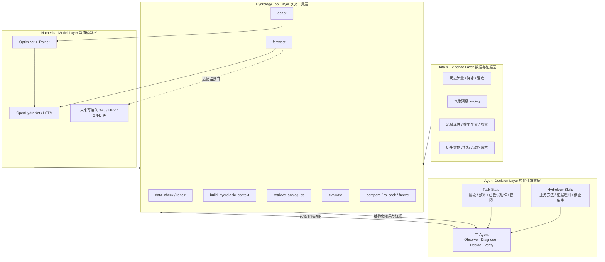
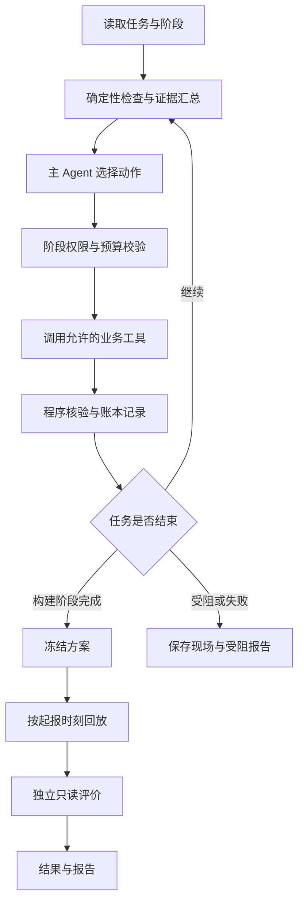

# 基于智能体的水文预报方案构建及参数优化系统：完整课题方案

**面向：** 河海大学数字孪生卓工班（二期）

**指导教师：** 方园皓，河海大学水文水资源学院副教授

**修订日期：** 2026 年 9 月 7 日

**状态：** 设计阶段；本文件为唯一课题方案，实际实现与研究收益待验证。

## 目录

- [1. 课题摘要与研究定位](#section-1)
- [2. 研究范围、输入输出与模型可行性](#section-2)
- [3. 文献基础、拟验证贡献与证据边界](#section-3)
- [4. 四层架构与专业算子契约](#section-4)
- [5. 阶段隔离、自主循环与运行状态](#section-5)
- [6. 水文上下文与历史相似过程](#section-6)
- [7. 证据驱动诊断与有限参数适配](#section-7)
- [8. A01—A12 完整业务动作契约](#section-8)
- [9. Skills、编排、技术栈与证据存储](#section-9)
- [10. 正式实验与验收协议](#section-10)
- [11. 工作台、报告与答辩交付](#section-11)
- [12. 实施阶段、风险与最终完成门槛](#section-12)
- [13. 附录：文献详情与技术依据](#section-13)

<a id="section-1"></a>

## 1. 课题摘要与研究定位

本课题面向河海大学数字孪生卓工班（二期），研究智能体如何依据水文证据，自主组织资料核查、预报方案构建、异常诊断、有限参数适配、结果验证与交付。一个主 Agent 调用共同专业工具，人员一次配置任务后，通过工作台查看结果、暂停恢复和接管异常。

首期采用单流域、日尺度未来第 1—3 日流量预测，以 OpenHydroNet 轻量模型为优先工程路线，在一台 M1 Pro 上开展历史起报回放。主实验为 H（人员＋共同工具）、P（固定流水线）、A（业务动作 Agent）对照，计划 15 个正式任务包，以预报质量和完整性为约束，评价人员主动工时、处理正确性及成本。

本文是唯一维护的课题方案，包含研究、开发、实验和验收要求。所有接口、示例、门槛和实验安排均为设计；数据、模型、实际效果和参与者尚待验证。文献与源码说明沿用原资料的审查记录，本次整合未重新联网核验。

本课题面向日尺度水文预报中的资料核查、方案配置、异常排查、模型适配和结果复核，构建一个自主调用水文模型与专业工具的智能体。系统读取预设任务后持续执行，依据证据选择下一步动作，完成后交付预报、处理记录及报告；人员无需逐轮输入指令。

**主研究问题：在相同数据、工具和资源约束下，智能体能否在满足预报质量及任务完整性要求的前提下，减少人员主动操作、异常处理和返工时间？**

围绕这一问题开展三项验证：

1. 对比“人员＋共同工具”，测量人员主动工时是否下降。
2. 对比固定自动化流程，检验 Agent 是否更能处理需要组合证据和选择路径的异常。
3. 在资源允许时，对比通用 Agent，检验经核对的业务动作知识是否减少错误干预。

参数优化是处理措施之一。系统既要能够启动有依据的适配，也要能维持正常方案、撤销无效试验和明确报告能力不足。项目先形成工程验证成果，创新程度依据与已有研究的差异及实测结果确定。

### 题目与研究内容的对应

| 题目关键词 | 本项目中的实际落点 | 不是在做什么 |
|---|---|---|
| 基于智能体 | 主 Agent 观察证据、诊断、选择动作、调用工具、核验并决定继续或结束 | 不是给每个步骤加一个聊天机器人 |
| 水文预报方案构建 | 数据核查、模型/配置校验、起报条件、预报执行、异常诊断、结果比较、方案冻结 | 不是只运行一次模型得到一条过程线 |
| 参数优化 | 当证据支持时，Agent 调用受约束的适配/优化算子，在冻结空间内执行局部优化并接受或回滚 | 不是 LLM 自由生成学习率、epoch 或神经网络权重 |

“参数优化”是预报方案构建闭环中的一种处理动作，而不是每个任务都必须发生的步骤。对于正常方案，Agent 正确选择 **KEEP / 不干预** 与正确启动一次适配同样重要。

### 模型训练与职责边界

本项目应避免使用“完全不做模型训练”这一表述，因为 A07 的局部适配在技术上会发生有限权重更新，属于 fine-tuning/训练行为。

更准确的表述是：

> **本课题不以水文基础模型训练或模型结构创新为研究目标。水文模型作为智能体可调用的专业数值能力；如确有模型适配需要，由独立的优化器和训练器在冻结约束下执行有限局部训练，Agent 不直接生成或修改模型权重。**

职责边界如下：

- **Agent 决定：** 当前是否需要干预、优先排查什么、是否允许进入模型适配、选择哪一种已冻结的适配策略、适配结果是否解决原问题。
- **Optimizer 决定：** 在已冻结候选空间中运行哪些数值配置及其执行顺序。
- **Trainer 执行：** 按给定配置更新允许更新的模型模块，保存候选模型和训练记录。
- **Evaluator 核验：** 使用冻结指标、样本和质量门槛对候选结果进行统一评分。
- **Agent 不能做：** 自由生成神经网络权重、绕过候选空间修改超参数、看到独立测试结果后调整策略或阈值。

这使“智能体决策”和“数值训练”保持可解释、可审计的分离。

课题题目保留“参数优化”，但结题报告中必须避免把神经网络微调描述成传统概念水文模型物理参数率定。

推荐表述：

> 本课题中的参数优化，是在既有预训练数据驱动水文模型基础上，对局地适配策略及其训练配置开展受约束搜索。智能体负责判断是否需要适配以及采用哪类已验证策略，数值优化器负责具体训练参数搜索；神经网络内部权重变化不解释为土壤蓄水、下渗或河道汇流等可直接对应的物理参数变化。

如导师后续明确要求“物理水文参数率定”，再启动新安江/概念模型替代路线并更新本文，不与当前 OpenHydroNet 的网络参数混写。

<a id="section-2"></a>

## 2. 研究范围、输入输出与模型可行性

### 首期范围

| 项目 | 本期设计 |
|---|---|
| 空间范围 | 一个公开数据流域；第二流域属于扩展 |
| 预测对象 | 站点未来第 1、2、3 日流量及日尺度高流量过程 |
| 应用方式 | 历史起报回放；正式回放前冻结方案 |
| 计算条件 | 一台 M1 Pro，CPU 为可验证起点，MPS 加速需单独测试；第三方 LLM API |
| 模型路线 | 优先 Google OpenHydroNet 的轻量示例模型与局部适配 |
| Agent 组织 | 一个主 Agent；确定性程序完成检查、计算、优化和验证 |
| 交互方式 | 任务配置一次；自动运行；网页查看、暂停、恢复和异常接管 |
| 成果 | 网页工作台、预报方案包、预测文件、动作账本、H/P/A 对照结果、结题报告、答辩 PPT 与图表 |

本期不以小时级山洪预警、洪水淹没、水深流速、调度控制、全球模型训练或自主学习新的水文机理为交付目标。新安江保留为导师已允许的替代路线；若启动替代，在本文内修订模型适配与评价协议，不把两类模型参数混写。

### 任务配置与产物

#### 一次性任务配置

配置由课题开发者准备默认案例，可由网页读取，无需终端用户填写专业模型参数。必须明确：流域、起报范围、模型版本、数据来源、运行模式、预算、验收规则和停止条件。无人逐轮指挥不等于系统无需目标或可以猜测缺失信息。

输入分为：

- **模型输入：** 所选模型要求的历史气象、未来气象驱动、流域属性及必要历史窗口；按真实输入契约取用。
- **评价资料：** 实测流量及其发布时间、质量标记；用于合法训练、历史诊断和事后评价，不默认它必然是 LSTM 直接输入。
- **方案资料：** 权重、配置、缩放器、模型代码版本、训练时间范围及来源。
- **运行约束：** 允许动作、候选空间、计算及 API 预算、阶段权限。

#### 两种实验模式

| 模式 | 未来气象来源 | 可支持的结论 |
|---|---|---|
| F：历史预报驱动 | 起报时已发布且可获得的历史气象预报 | 在所验证信息条件下的历史提前预报表现 |
| R：理想气象驱动回算 | 未来实测或再分析气象 | 已知未来气象条件下的水文计算、适配和流程表现 |

F 是目标模式。若只能获取 R 模式所需资料，明确降为回算实验并记录范围缺口；不能称为已完成真实提前预报验证。正式实验中各组使用相同模式，禁止缺资料时无声切换。

#### 任务与产物

一个评价任务包是有起点、问题条件、产物要求和预算的完整工作单元，可包含一段连续起报日期。起报日期不自动等于独立实验样本。

每次起报保存 `basin_id、issue_time、target_time、lead_day、q_pred、unit、scheme_id、data_snapshot_id、mode、quality_flag`。每个任务交付：

1. 预报方案包：模型、配置、数据映射、时间协议和版本引用。
2. 预测及质量标签：有缺口时记录缺口，不能用伪造结果补齐。
3. 动作账本：现象、证据、假设、工具、结果、验证和成本。
4. 状态与报告：完成、受限完成、受阻或失败；未解决事项和下一步所需条件。

### 数据、流域和模型门槛

#### 模型依据

沿用源码核查版本 `828dfc5a66f4e6f2c86b09d500e4547c4d92ed25`。官方教程含 Mean Embedding Forecast LSTM 的局部微调路径；对应模块名是 **`static_embedding_fc`**，不是 `static_attributes_fc`。教程存在并不表示项目已完成推理、微调或 MPS 验证。[教程配置](https://github.com/google-research/flood-forecasting/blob/828dfc5a66f4e6f2c86b09d500e4547c4d92ed25/tutorial/configs/finetune-config.yml)

本机先验证单流域推理和一次小规模微调，记录环境、耗时、峰值内存、模块更新及产物。MPS 不通过则使用 CPU；若 CPU 预算也无法承受，缩小模型/样本/候选规模并重新报告范围，不能直接承诺“非常适合本机”。

#### 首选候选流域

首选核查 **South Fork Payette River at Lowman, Idaho，USGS 13235000**。官方 Notebook 将 `camels_13235000` 设为示例微调流域，USGS 核对了站点名称。[官方 Notebook](https://github.com/google-research/flood-forecasting/blob/828dfc5a66f4e6f2c86b09d500e4547c4d92ed25/tutorial/OpenHydroNet_Tutorial.ipynb)；[USGS 站点](https://waterdata.usgs.gov/monitoring-location/USGS-13235000/)

采用理由是教程接口与复现便利，不能为了保证改善而选择低分测试流域。正式使用前核查数据时间覆盖、变量、面积、气象发布时间、融雪和人为调节等流域特点；不预设其代表所有降雨洪水流域。South Yamhill 可作为后续候选，首期不要求同时实现。

候选不通过时，根据资料可用性与算力选择下一对象，保留排除原因；禁止按独立测试分数挑流域。

#### 权重与时间合法性

公开全球权重说明其训练覆盖 1982—2023 年且没有时间留出。不能直接用其在重叠时期的分数证明独立时间预报能力；微调不会消除这个问题。官方教学配置也存在验证与测试时期重合，正式实验须重新划分。[权重说明](https://github.com/google-research/flood-forecasting/blob/828dfc5a66f4e6f2c86b09d500e4547c4d92ed25/pretrained-models/Pretrained-Models-README.md)；[教学配置](https://github.com/google-research/flood-forecasting/blob/828dfc5a66f4e6f2c86b09d500e4547c4d92ed25/tutorial/configs/train-config.yml)

优先查清轻量教学权重的训练范围。若不可核查，可评估在合法开发资料上自训一次轻量基础模型；若采用全球权重，独立时间测试须严格晚于其及后续适配所用资料，并取得对应驱动。正式日期在数据审计后冻结，不在本方案中虚构可用年份。

<a id="section-3"></a>

## 3. 文献基础、拟验证贡献与证据边界

已有研究覆盖 LLM 率定、水文建模自动执行、网页平台，以及将预报员经验组织为 Skills。因此，本项目不将 Agent、Skills、LangGraph、网页或优化器的使用本身表述为首创。

| 已有研究 | 本项目采用的经验 | 本项目仍需验证的内容 |
|---|---|---|
| Yang 等的 Skills 水文预报框架，2026，预印本 | 专家经验、数值工具和流程规则分工 | 限定任务内，减少中途干预能否带来净工时收益 |
| Zhu 等的 LLM 率定研究，GRL，2026 | 与传统优化做公平比较，保留负结果 | 智能体是否减少错误适配和无效试验 |
| Yan 等的水文 Agent，GRL，2026；HydroCraft，J. Hydrology，2026 | 工具化、任务执行及产物追溯 | 相同工具下比固定流程多解决了哪些问题 |
| MADR，2026，预印本 | 以过程特征组织诊断依据 | 单流域任务是否需要 LLM 的路径选择能力 |
| 人员预报与自动化相关研究 | 按具体职责和结果评价人机分工 | 学生与专业人员结论分开，计算耗时与人工工时分开 |

拟验证的贡献为：可追溯的业务动作闭环；动作选择与数值搜索分离的模型适配机制；同时覆盖人员工时、处理正确性和预报质量的对照证据。这些为项目研究内容，不能预先写成已实现、已证明的新方法。

文献详情、既有阅读范围与完整入口见本文附录。

以下是待验证的工程判断，不是已经测得的收益。

| 工作 | 对应动作 | 预期减负方式 | Agent 必要性及主要限制 |
|---|---|---|---|
| 资料到齐检查、变量单位和时间对齐 | A01—A02 | 少翻文件、少重复核对、自动补取有来源的资料 | 固定检查用代码即可；Agent 价值在组合证据、决定下一条排查路径 |
| 初次配置与小样本试运行 | A03 | 少查接口和反复试错，复用已验证方案 | 一次性收益需与长期运行收益分开；不能无限生成未经验证配置 |
| 历史条件重算、任务异常恢复 | A04、A09 | 少盯运行、少手动重启和接续 | 常见重试由程序处理；超出已知模式的恢复选择才值得调用 LLM |
| 误差排查与决定是否适配 | A06—A08 | 缩小排查范围，减少无意义试验 | 最有领域研究潜力，也最容易误诊；需要专家核对及动作结果验证 |
| 日常起报与结果归档 | A05、A10—A11 | 减少重复启动、导出和版本整理 | 调度与归档本来可自动化；必须对比固定流水线 |
| 多轮结果比较、失败归纳和图表报告 | A08、A12 | 少搬数字、少整理过程线和实验记录 | 数字由程序生成，文字必须关联证据；人工审阅时间计入成本 |

优先完成三条有业务意义的路径：资料异常的追查与恢复；连续预报误差的诊断与有限试验；结果对照、撤销和报告收尾。正常数据与正常预报应能直接通过，不为了展示智能而多做动作。

专家经验须来自可核对的业务案例。建议在先导阶段请导师或其指定人员核对 3—5 个典型案例，记录观察资料、排除原因、动作依据和停止条件。专家案例核对不等于专业人员工时对照，也不构成行业普适性证明。

<a id="section-4"></a>

## 4. 四层架构与专业算子契约

系统采用四层架构：**Agent Decision Layer、Hydrology Tool Layer、Numerical Model Layer、Data & Evidence Layer**。



### Agent Decision Layer

这是课题最主要的研究层。

Agent 不负责重复计算 NSE、累加降水或训练网络，而负责解决程序难以用单一固定规则表达的业务选择问题：

- 当前异常需要先查数据、时间、状态、forcing 还是模型？
- 现有证据是否足以支持干预？
- 应保持当前方案、修复资料、重建状态、启动有限适配还是停止？
- 已执行动作是否解决原问题？
- 什么时候应该回滚，什么时候应该报告能力不足？

### Hydrology Tool Layer

把水文人员实际使用的能力封装为确定性或受约束工具。Agent 只通过工具契约调用，不直接操作底层文件、模型权重或评价公式。

工具必须具有明确的：输入、输出、证据引用、权限、失败状态和幂等/恢复规则。

### Numerical Model Layer

包含 OpenHydroNet/LSTM 等实际水文预测模型及有限适配所需的优化器、训练器。

从 Agent 视角看，具体模型不是决策主体，而是**专业数值计算能力**。模型结构可以不同，只要经过 Adapter 提供统一的工具契约，Agent 的上层业务闭环原则上无需随模型整体重写。

注意：不同模型输入、状态、可调参数和适用场景不同，因此“可替换”指的是通过适配器统一上层调用方式，不意味着所有模型可以无条件互换。

### Data & Evidence Layer

保存 Agent 决策和程序核验能够引用的事实，包括数据快照、水文上下文、forcing、历史相似过程、模型版本、评价指标、动作结果和成本。

Agent 的重要结论必须能够指向该层中的证据 ID；不可得信息明确标记 unknown/unavailable，不允许通过语言模型补造事实。

### 预报算子

在 Agent 层，不建议把 OpenHydroNet 暴露成大量模型内部 API，而应封装为标准预报算子。例如：

```python
forecast(
    scheme_id: str,
    basin_id: str,
    issue_time: datetime,
    data_snapshot_id: str,
) -> ForecastResult
```

`ForecastResult` 至少返回：

```yaml
forecast_result:
  scheme_id: null
  issue_time: null
  predictions:
    - lead_day: 1
      target_time: null
      q_pred: null
      unit: m3/s
    - lead_day: 2
      target_time: null
      q_pred: null
      unit: m3/s
    - lead_day: 3
      target_time: null
      q_pred: null
      unit: m3/s
  quality_flags: []
  model_version: null
  data_snapshot_id: null
  artifact_ids: []
```

Agent 不需要知道模型内部每一层如何计算；它只需要知道该算子的：

- 输入契约是否满足；
- 当前方案和模型版本是什么；
- 输出是否完整合法；
- 该模型支持哪些合法的适配能力；
- 当前阶段是否允许调用这些能力。

以后如果接入新安江、HBV、GR4J 或其他机器学习模型，可以增加对应 Adapter，而不是重写 Agent 的诊断与控制主循环。

### 有限适配算子

A07 不应表达成“Agent 自己训练模型”，而应表达成：

```python
adapt_model(
    base_scheme_id: str,
    strategy_id: str,
    training_snapshot_id: str,
    validation_snapshot_id: str,
    budget_id: str,
) -> AdaptationRun
```

其中 `strategy_id` 只能来自正式实验前冻结的训练策略集合，例如：

```text
HEAD
STATIC
STATIC_HEAD
```

KEEP 直接维持现有方案，不调用训练算子。具体允许哪些策略由 G1b 的 M0 机制实验决定，未验证的策略不得为了提高正式测试成绩临时加入。

数值参数由 Optimizer 在冻结空间内搜索，例如：

```text
learning_rate ∈ frozen_set
epochs ∈ frozen_set
```

Agent 负责的是：

```text
是否值得适配？
        ↓
适配哪一种允许的机制？
        ↓
调用 adapt_model()
        ↓
程序完成候选训练与统一评价
        ↓
原问题是否改善且没有不可接受副作用？
        ↓
ACCEPT / ROLLBACK / KEEP
```

因此，“参数优化”的研究价值不只是找出一组更高分参数，还包括：**什么时候不应该优化、什么情况下优化无效、如何发现副作用以及何时回滚。**

### 动作与工具映射

| 动作 | Agent 决策重点 | 主要调用的 Tool | 模型层是否参与 |
|---|---|---|---|
| A01 检查资料 | 哪些问题阻断任务、先查什么 | data_check | 否 |
| A02 补取/修复 | 选择合法修复路径 | repair_data | 否 |
| A03 方案校验 | 选择兼容方案/模板 | validate_scheme | 读取模型元数据 |
| A04 历史条件 | 是否重建状态/窗口 | rebuild_state | 可能 |
| A05 执行预报 | 异常结果下一步如何处理 | forecast | 是，作为预报算子 |
| A06 水文诊断 | DATA/TIMING/STATE/FORCING/MODEL/UNKNOWN | context + analogue + metrics | 读取结果，不训练 |
| A07 有限适配 | 是否适配、选哪类策略 | adapt_model | 是，由 Trainer 执行 |
| A08 比较/撤销 | 问题是否真正解决 | compare_candidates | 读取候选结果 |
| A09 恢复/受阻 | 重试、保持还是停止 | recovery | 视故障而定 |
| A10 冻结方案 | 推荐依据和边界是否完整 | freeze_scheme | 冻结模型引用 |
| A11 连续起报 | 运行异常是否需要处理 | batch_forecast | 是，重复调用预报算子 |
| A12 评价报告 | 如何组织事实与失败结论 | evaluate/report | 只读 |

这个映射强调：**A01—A12 才是智能体工作空间；水文模型只是其中若干动作会调用的底层能力。**

### 实现原则

后续代码实现应遵循以下原则：

1. **Agent 不直接 import 模型内部训练逻辑作为自由操作接口。** 统一通过 Tool/Service 契约调用。
2. **forecast 与 adapt 分离。** 日常预报调用不能隐式触发训练。
3. **模型 Adapter 与 Agent 解耦。** 上层动作使用稳定 schema，模型差异放在 Adapter 内处理。
4. **数值计算尽量确定性。** 指标、单位转换、历史累计、相似度、阈值和评分由程序计算。
5. **Agent 只做有价值的路径选择。** 程序能直接判断的逻辑不消耗 LLM 决策轮次。
6. **所有动作可核验。** 每个动作返回 artifact/evidence ID 和显式状态。
7. **允许不干预。** KEEP 是正式正确动作，不把“调用更多工具”作为智能程度指标。
8. **允许失败和受阻。** BLOCK/HANDOVER 是系统边界能力，不用模型微调掩盖资料或 forcing 不确定性。
9. **训练仅在合法阶段发生。** B 可在冻结规则内适配；F/E 不得借测试真值修改模型。
10. **模型可替换不等于实验可随意换模型。** 正式实验模型与 Adapter 版本必须提前冻结。

<a id="section-5"></a>

## 5. 阶段隔离、自主循环与运行状态

### B：方案构建与历史适配

使用训练资料与验证资料，开展 A01—A09。只有在真值已合法获得且属于开发资料时，才计算预报误差并考虑适配。连续误差是检查依据，不直接等于模型参数存在问题。完成后 A10 冻结方案。

### F：冻结方案的历史起报回放

按历史起报时刻推进 A11。模型权重、候选规则、Skills、数据策略及质量门槛均已冻结。只允许当时可得资料的取数、已定义转换、历史条件重建和技术恢复。**本期独立测试不根据测试流量真值调整模型、提示词、策略或方案。**

### E：只读评价与复盘

由独立评价器读取测试实测值，A12 生成评价和报告；工具权限不允许训练或改写已冻结预测。测试中发现的新问题保存为下一版本研究材料，下一版本需要新的留出测试。



起报时，未来实测曲线不能提供给 Agent 或模型；网页也按阶段显示，已发生且已发布的观测与未来目标明确分开。回放结束才开放完整对照图。

### 阶段与模式必须分别存储

`phase ∈ {B,F,E}` 表示运行权限阶段，`forcing_mode ∈ {F,R}` 表示气象来源。两者不可共用一个字段。R 模式的未来实测/再分析气象只能作为已声明的理想驱动输入，不包含未来流量真值；阶段 F 在任何气象模式下均不得据测试流量适配。F 气象模式仍须逐项满足起报可得性。

### 任务终态与动作结果

任务状态统一为运行中、完成、受限完成、受阻、失败和人工接管；KEEP、ACCEPT、ROLLBACK 是动作结果，不自动等于任务已完成。受限完成必须列出缺失日期或产物；是否合格由冻结验收规则判定。BLOCK 保留未完成状态；恢复必须核对原任务产物和幂等键。

A06 的基于误差诊断和 A07—A08 的模型适配闭环只在 B 阶段开放。F 阶段可以核查当时合法可得的输入和技术异常，不能沿诊断流程进入模型更新；E 阶段仅评价与导出。

<a id="section-6"></a>

## 6. 水文上下文与历史相似过程

### 水文上下文构建器

#### 定位

Context Builder 不是新的 Agent，也不生成自由文本结论。它是一个确定性工具，负责把已有资料转换为统一、可验证的水文上下文卡片。

推荐接口：

```python
build_hydrologic_context(task_id, issue_time, scheme_id) -> HydrologicContextCard
```

#### 第一版字段

```yaml
hydrologic_context:
  issue_time: null  # 由任务逻辑起报时刻填写

  current_flow:
    value: null
    unit: m3/s
    percentile: null
    recent_trend: rising | falling | stable | unknown

  antecedent_conditions:
    precipitation_3d_mm: null
    precipitation_7d_mm: null
    precipitation_14d_mm: null
    wetness_proxy: high | medium | low | unknown

  forecast_forcing:
    lead_1_precip_mm: null
    lead_2_precip_mm: null
    lead_3_precip_mm: null
    total_precip_mm: null
    hres_total_mm: null
    graphcast_total_mm: null
    disagreement_score: null
    disagreement_level: high | medium | low | unavailable

  regime:
    season: winter | spring | summer | autumn
    temperature_context: null
    snow_fraction_context: null
    process_regime: rainfall | snowmelt | mixed | unknown

  recent_model_behavior:
    sample_count: 0
    mean_bias: null
    high_flow_bias: null
    lead_1_bias: null
    lead_2_bias: null
    lead_3_bias: null
    persistence: isolated | repeated | unknown

  analogues:
    - event_id: null
      similarity: null
      observed_context: null
      model_behavior: under | over | normal | unavailable

  evidence_ids: []
```

#### 计算原则

1. 所有字段由程序从合法资料计算，Agent 不自己做降水累加、分位数、单位转换和相似度数学计算。
2. 不可得字段标记 `unknown/unavailable`，不允许 LLM 猜值。
3. 前期湿润程度第一版可采用简单、透明的代理量，例如训练期 P7/P14 分位数和当前流量分位数；不声称等于真实土壤含水量。
4. `process_regime` 仅在资料支持时生成；缺少雪资料时应返回 `unknown`。
5. Context Card 使用和模型输入相同的数据快照与逻辑起报时刻，保存版本与内容哈希。
6. F 阶段只使用 `issue_time` 时刻已可获得的信息，未来观测不得进入 Context Card。

### 历史相似过程检索

#### 目的

借鉴 case-based reasoning 的思想，把历史经验转成结构化案例证据，而不是普通文本 RAG。

Agent 不需要“记住”过去洪水，而是调用程序检索：

> 当前水文气象条件最像哪些开发期历史过程？模型在这些过程上通常高估、低估还是表现正常？

#### 第一版特征

优先使用现有数据可以稳定获得的变量：

- 起报流量分位数；
- 前 3/7/14 日累计降水；
- lead 1/2/3 预报降水；
- 未来三日累计降水；
- 季节；
- 温度/雪背景（仅资料支持时）；
- HRES 与 GraphCast forcing 差异；
- 当前方案 ID。

#### 相似度

第一版不让 LLM 给权重。采用冻结的标准化距离或简单加权距离：

```text
normalize features on development data
        ↓
calculate distance
        ↓
Top-K historical analogues
```

K 初始取 3—5，在先导实验后冻结。

必须输出每个 analogue 的：

- 案例 ID；
- 相似度/距离；
- 关键上下文差异；
- 当时基础模型表现；
- 是否发生高流量事件；
- 是否曾启动适配，以及适配是否通过验证。

历史相似过程只能来自 B 阶段允许的开发资料，不得从独立测试集检索形成“经验”。

### 气象驱动不确定性与不适配决策

气象驱动不确定性是诊断与适配决策的必要证据。

OpenHydroNet 本身使用未来气象驱动。即使水文模型结构正确，未来降水预报错误也可能造成洪峰和洪量错误。因此，A06/A07 必须把 forcing uncertainty 与 model bias 分开。

#### 第一版 forcing 证据

如果同一任务同时具有 HRES 与 GraphCast，可计算：

- 三日累计降水绝对差；
- 相对差；
- 各 lead 降水差；
- 温度差（资料支持时）；
- 两种 forcing 导致的预测差（若计算预算允许且共同工具支持）。

#### 决策示例

**场景 A：**

```text
单次高流量低估
+ HRES/GraphCast 降水明显分歧
+ 历史相似事件中基础模型并无持续低估
→ 优先 C4 FORCING
→ 不启动模型微调
```

**场景 B：**

```text
多场高流量持续低估
+ 数据/时间/状态检查通过
+ forcing 一致性较高
+ 相似历史事件出现同方向偏差
→ C5 MODEL 获得较强支持
→ 允许进入适配候选
```

**场景 C：**

```text
偏差明显
+ forcing 资料缺失或发布时间不合法
→ C6 UNKNOWN / C4 FORCING
→ BLOCK 或受限完成
```

“知道什么时候不调模型”作为正确的专家行为单独评价。

<a id="section-7"></a>

## 7. 证据驱动诊断与有限参数适配

### 诊断输入、原因空间与输出契约

#### 输入

A06 读取：

1. A01—A05 数据与运行核查结果；
2. 过程线及程序计算的 NSE/KGE/Bias/高流量与事件指标；
3. Hydrologic Context Card；
4. Top-K 历史相似过程；
5. 当前方案和过去已尝试动作；
6. 阶段权限与剩余预算。

#### 原因空间（Cause Space）

A06 不要求 LLM 宣称找到真实物理因果，而是在一个受约束的业务原因空间中形成**候选解释**：

| 编码 | 原因类别 | 示例 |
|---|---|---|
| C1 DATA | 资料问题 | 缺测、单位、站点、异常替代源 |
| C2 TIMING | 时间/起报对齐问题 | 日界线、issue/target 错位 |
| C3 STATE | 历史状态问题 | warm-up 不足、缓存/窗口不一致 |
| C4 FORCING | 未来气象驱动不确定 | HRES/GraphCast 明显分歧、降水中心可能不确定 |
| C5 MODEL | 持续模型系统偏差 | 多事件同方向高流量低估，资料和 forcing 检查均通过 |
| C6 UNKNOWN | 证据不足 | 多个原因均可能，无法安全判断 |

重要原则：

- `C5 MODEL` 不是默认兜底项；必须在 DATA/TIMING/STATE/FORCING 已有足够检查后才允许提高其优先级。
- 单场洪峰低估不能直接推出 MODEL。
- forcing 分歧高时，应优先保留 C4，不用模型微调掩盖输入不确定性。
- 证据不能唯一判因时，允许并列多个 hypotheses。

#### 输出契约

```json
{
  "phenomenon": "...",
  "evidence_ids": ["..."],
  "context_summary": "...",
  "cause_hypotheses": [
    {
      "code": "C4_FORCING",
      "supporting_evidence": ["..."],
      "contradicting_evidence": ["..."]
    }
  ],
  "alternative_explanations": ["..."],
  "next_action": "KEEP | REPAIR | REBUILD_STATE | ADAPT | BLOCK",
  "expected_check": "...",
  "stop_condition": "..."
}
```

不记录、也不要求暴露模型内部思维链；只保存可核验的业务结论和证据引用。

### M0 机制验证与正式策略空间

#### M0 机制实验

局部适配策略采用以下统一规则：**正式 Agent 实验前，先在开发/验证期资料上做一次小型局部适配机制实验，再冻结允许策略。**

初始比较：

| 策略 | 更新模块 | 目的 |
|---|---|---|
| S0 KEEP | 无 | 基础对照 |
| S1 HEAD | `head` | 观察输出映射/尺度适配能力 |
| S2 STATIC | `static_embedding_fc` | 观察流域静态表征局部适配能力 |
| S3 STATIC+HEAD | `static_embedding_fc` + `head` | 对齐 OpenHydroNet 官方示例的局部适配思路 |

既有核查版本的 OpenHydroNet 源码将这些模块列为可微调子模块，官方 fine-tuning 示例也包含 `static_embedding_fc` 与 `head`。M0 的目的不是证明某一模块具有明确物理意义，而是确定：

- 哪些局部适配策略在目标流域确实可运行；
- 哪些策略在 M1 Pro 预算内；
- 哪些策略有稳定的验证改善或至少具有差异化行为；
- 哪些策略应进入正式 Agent 动作空间。

M0 只使用开发/验证资料。完成后冻结正式策略集合，独立测试后不得再新增策略。

#### 正式动作空间

A07 前的动作选择统一为以下枚举；仅 ADAPT 分支进入训练：

```text
KEEP
维持当前模型

REPAIR
先处理数据/时间问题，不进行模型适配

REBUILD_STATE
重建合法历史窗口/状态

ADAPT_<strategy>
调用 M0 冻结的局部适配策略

BLOCK
证据或能力不足，停止并保留现场
```

如果选择 `ADAPT`，Agent 只能选择已冻结的策略 ID，例如 `HEAD` 或 `STATIC_HEAD`；不能直接设置神经网络权重、学习率、epoch 等连续数值。

#### 数值搜索

每个冻结策略绑定自己的有限配置空间。第一版仍可采用小网格，例如：

```text
learning_rate ∈ frozen set
epochs ∈ frozen set
```

由固定网格/Optuna sampler 执行。

候选必须满足：

1. 从同一基础权重起点开始；
2. 使用相同训练/验证资料；
3. 固定 seed 规则；
4. 记录真实 trainable parameters；
5. 检查非目标模块没有更新；
6. 训练失败与水文效果无改善分开记录。

### 统一的搜索预算

开发期以学习率 `{1e-5, 1e-4, 1e-3}`、轮数 `{2, 5}` 的小网格作为单策略先导起点。M0 分别记录各策略试验预算；正式任务采用任务级候选总上限，初始建议最多 6 个，不能每选择一个策略就重置额度。跨策略候选清单、分配规则和总预算在 G4 前根据实测冻结，H/P/A 完全一致。

训练窗口、损失、batch、基础权重、seed 配套规则固定；首期不同时搜索历史窗口和 early stopping。无新证据不得重复搜索同一候选。数值失败、真实权重更新和验证无改善分别记录。M0 不要求预先取得改善，但须为每个被评估策略记录可运行性、质量、耗时、峰值内存和排除依据。

### 候选采用与撤销的分层质量门槛

正式候选采用不依赖单一综合总分。

推荐顺序：

#### Gate 1：产物合法性

- 输出完整；
- 无非法 NaN/Inf；
- 时间和单位正确；
- 覆盖率达到冻结要求。

#### Gate 2：关键 lead 不发生不可接受退化

分别检查 lead 1、2、3。平均分改善不能掩盖关键 lead 的明显退化。

#### Gate 3：高流量/事件指标不越过红线

检查：

- 高流量 Bias；
- 峰值偏差；
- 峰现日期误差；
- 洪量偏差；
- 漏报/误报（若任务定义适用）。

#### Gate 4：主指标存在足够改善

候选通过前述 guardrails 后，再按冻结主指标排序，例如三 lead NSE 等权平均，同时报告 KGE 分项。

#### Gate 5：复杂度/成本规则

性能近似时优先：

1. 不适配；
2. 更新模块更少的策略；
3. 计算成本更低的候选。

避免为了极小的指标增益引入不必要模型变更。

候选只有通过合法性、各 lead、事件约束和最小改善门槛后才可采用。与基础模型的提升不足时 KEEP；合格候选在预先冻结的近似容差内并列时，依次优先更新模块更少、计算成本更低、固定候选 ID 更小者。不得运行后改变近似容差或排序规则。

<a id="section-8"></a>

## 8. A01—A12 完整业务动作契约

### 动作的定义与人员替代范围

动作是一个带输入、判断、执行、验证和结束状态的业务处理单元。Agent 选择动作，确定性工具执行计算，执行器校验权限。A01—A12 为固定业务动作编号。

阶段 B 为历史方案构建与适配，F 为冻结方案起报回放，E 为只读评价。阶段 F 不得读取未授权测试真值，也不得训练、改变诊断规则或接受新权重。模式 F/R 表示气象来源，与运行阶段分别存储。

共同记录字段：任务与动作 ID、阶段、逻辑起报时间、输入/方案版本、问题、证据 ID、候选解释、替代解释、工具及参数、输出、验证、状态、历时、主动人工时间、费用和预算余额。自然语言说明须指向证据；不要求展示模型内部思维链。

动作请求先检查阶段、工具权限、输入类型、数据可得性、已执行记录和预算；无权动作先拒绝并记录。相同输入及工具版本的结果可复用，复用政策各实验组一致。

### 动作总表

| 编号 | 动作 | 允许阶段 | 主要减少的人员劳动 |
|---|---|---|---|
| A01 | 检查资料与预报条件 | B/F | 逐个文件核对和交叉检查 |
| A02 | 有依据补取或纠正资料 | B/F | 查来源、转换和修复后复核 |
| A03 | 建立或校验可执行方案 | B；F 只校验 | 查配置、匹配模型和排查接口 |
| A04 | 重建起报历史计算 | B/F | 手动准备窗口、处理缓存不一致 |
| A05 | 执行预报与产物检查 | B/F | 启动运行、查输出和归档 |
| A06 | 诊断历史预报现象 | B | 阅读多份指标、组织假设及排查 |
| A07 | 委托有限适配试验 | B | 配置候选、安排与跟踪试验 |
| A08 | 比较并采用或撤销 | B | 对齐指标、核对副作用和回退 |
| A09 | 技术恢复、维持或受阻收尾 | B/F/E，依阶段限制 | 重试、接续和整理失败现场 |
| A10 | 冻结推荐方案 | B | 版本与依赖核对、方案交接 |
| A11 | 自动连续起报 | F | 重复启动与汇总每日任务 |
| A12 | 只读评价与报告 | B/E；F 仅运行摘要 | 指标搬运、制图、日志整理和报告修订 |

### A01：检查资料与预报条件

**输入：** 任务清单、模型输入契约、文件快照、来源元数据、逻辑起报时间。

**程序检查：** 文件与变量齐全、单位及时间索引一致、缺测/重复、面积和站点匹配、资料发布时间、历史长度、权重与切分来源。极端但可能真实的数值作为待核查项，不能仅因超过经验范围删除。

**Agent 判断：** 汇总哪些异常阻止起报，哪些需要来源追查，哪些只需质量标记；按依赖关系安排下一步。

**输出：** 带证据的数据质量表及可执行下一动作。完整则 A03/A04/A05；有可追查问题则 A02；不可用则 A09。

**验收：** 不漏掉已知关键问题；正常资料不重复检查或无故修正。检查程序的准确性与 Agent 的路径选择分别评价。

### A02：有依据地补取或纠正资料

**输入：** A01 问题、数据来源、允许的备用源和转换规则。

**允许动作：** 补取缺文件；按来源单位进行转换；按来源时区/日界线重新聚合；去除确证重复条目。若是日平均流量与径流深转换，面积核对后使用 `Q(m³/s)=runoff(mm/day)×area(km²)/86.4`。

**判断重点：** 来源是否支持修复，备用产品是否在冻结政策中，是否满足起报可得时间。缺测处理按事前规则；没有足够依据时停止，不填造降雨或流量。

**验收：** 保留原始文件，生成派生版本和差异；检查非目标字段未改变；返回 A01 核查。修复效果不能只用 NSE 上升证明。

**限制：** 不依据测试流量真值平移或缩放气象；不因缺历史预报气象而换为未来再分析。模型优劣比较必须在相同合法输入上重新运行各组。

### A03：建立或校验可执行预报方案

**输入：** 数据契约、已验证模型模板、权重和缩放器来源、任务模式及预算。

**B 阶段：** 选择兼容模板，设置变量映射、历史长度、预见期、解析器和输出单位，运行小窗试例。模型家族、输入变量和参数名称从锁定代码中确认。

**F 阶段：** 只校验冻结方案的依赖、哈希与文件存在性；不得据测试表现更换模型或配置。

**验收：** 真实可解析输出、时间与单位正确、版本可追溯。`static_embedding_fc` 等模块必须真实存在；未知模块拒绝执行。权重训练范围不明时不能标为已通过独立预报评价门槛。

**失败分支：** 技术依赖问题进入 A09；数据问题返回 A01/A02；模型能力不足形成具体缺口。

### A04：重建起报历史计算条件

**触发：** 历史窗口缺失、缓存与方案/日期/数据版本不匹配或首次运行。

**执行：** 首期优先用合法历史资料重新完成模型所需的历史计算；缓存优化以后验证。缓存至少关联模型、配置、资料哈希和截止时间。

**验收：** 窗口只使用允许信息；同一输入重算一致；缓存恢复与完整重算在约定数值容差内一致。

**限制：** 隐状态保存/加载不等于用实测流量同化；不允许手工捏造隐状态或按未来流量调整历史条件。历史信息不足且无已验证方案时进入 A09。

### A05：执行预报与产物检查

**输入：** 已校验方案、当前资料快照、起报时刻和运行模式。

**执行与检查：** 模型生成 lead 1/2/3 结果；检查 target_time 与 issue_time 的关系、数量、单位、NaN、文件完整性和版本。物理可疑输出标记，按政策判合格；不得静默裁剪后当原模型成绩。

**阶段分支：** B 的验证资料有合法真值时可交 A06；F 保存结果，转下一起报日或技术异常处理，不计算未来真值误差指导决策。

**验收：** 预测真实可复现，有质量标签和成本。极端高值不凭主观阈值自动删除；失败日期记录为失败，不能用零值填平曲线。

### A06：诊断历史预报现象

**输入：** B 阶段允许的历史验证预测与实测、分 lead/事件统计、数据核查、方案信息、Hydrologic Context Card、历史相似过程和剩余预算。

**程序特征：** 总体及高/低流量偏差、NSE/KGE、事件峰值/洪量/峰现误差、样本量、缺测、输入异常及已做处理。短事件不足以稳定计算 NSE/KGE 时改为显示适用的事件误差，不凑分数。

**Agent 工作方法：** 按本文原因空间检查 DATA、TIMING、STATE、FORCING，再提高 MODEL 假设优先级；检查持续性、预见期差异和历史相似过程。无相似过程时明确记录，证据不足保留 UNKNOWN。

**输出契约：** `phenomenon、evidence_ids、context_summary、cause_hypotheses、alternative_explanations、next_action、expected_check、stop_condition`。

**验收：** 每个重要判断能追到证据；证据不能唯一判因时可保留多个解释。洪峰偏低不直接推出学习率应增加，也不能断言静态嵌入控制洪峰。正常则维持；资料问题 A02；历史条件 A04；适配条件满足 A07；不足则 A09。

### A07：委托有限适配试验

**前置条件：** 阶段 B；资料与模型检查通过；存在可检验的验证问题；可用样本、允许策略及剩余预算足够。

**Agent 决定：** 是否适配、采用哪一种 M0 已验证且正式冻结的策略及理由，不直接指定连续学习率或神经网络权重。候选空间、评分和预算按协议冻结。

**工具执行：** 优化器在任务级冻结候选总预算内选择配置，训练器仅更新所选策略声明的模块。开发期总候选预算起点为 6，正式值及策略分配按本文冻结规则确定。每个候选从相同基础模型、训练数据和配套 seed 开始，记录实际梯度更新和冻结模块检查。

**验收：** 目标模块确实更新、其他模块保持冻结、产物与费用完整。参数不合法或模块不存在时拒绝。执行成功后交 A08，不能直接宣布精度提升。

**限制：** 不边修数据边换模型；不搜索测试时期；不把随机 seed 当成争取好分数的可调参数。开发期若改变候选空间，正式实验前同步所有组并冻结。

### A08：比较并采用或撤销

**输入：** 同一验证条件下的基础/候选结果、质量门槛、预算和原问题。

**程序决策：** 核查对照一致性；先检查合法性、覆盖率、每个 lead 及事件约束，再比较主指标和最小改善量。无效指标不得当零或自动通过；并列按预定成本和简洁性规则处理。

**Agent 工作：** 解释原问题是否改善、其他方面是否退化，记录尚未解决事项。不能越过程序门槛批准候选。

**采用：** 更新候选方案引用，保留完整基础版本；**撤销：** 维持或恢复基础引用，记录退化/无提升。候选训练报错与水文效果无提升分开归因。

**后续：** 有新证据且预算允许时返回 A06；没有则 A10 或 A09。反复试验所得验证最优成绩不冒充独立测试效果。

### A09：技术恢复、维持或受阻收尾

**触发：** 工具故障、超时、缺少能力、预算不足、证据不足或方案无需改进。

**执行：** 查询原任务状态，复用已完成产物，按冻结重试规则恢复；常见重试不需要 LLM。Agent 在允许路径间选择恢复或终止，无新证据不循环同一错误。

**输出：** 当前可用产物、已查证据、尝试记录、状态与下一步条件。人员接管直接从此处继续，计入人工劳动。

**阶段限制：** F 只能技术恢复和保持冻结方案；E 只恢复评价/导出。B/F 均不得通过改指标或补假数据“完成”。

**验收：** 受阻原因具体且可验证；没有把受阻报告当作成功预测。无需改进属于维持方案，不计为技术失败；任务达成与正确识别边界分别打分。

### A10：冻结推荐方案

**输入：** 合法基础/候选方案、验证记录、预算和未解决问题。

**冻结内容：** 权重、缩放器、代码版本、数据来源和预处理、历史窗口、允许技术恢复、Skills/提示词、模型/API 标识、质量门槛与模式。

**验收：** 方案依赖齐全、可从干净任务环境恢复、哈希一致。没有候选改善时可冻结合格基础模型；基础模型不可用则不能伪装完成冻结。

**后续：** A11。独立测试结果不可触发本轮重新冻结。

### A11：自动连续起报

**输入：** 冻结方案、日期计划及逻辑时钟。

**执行：** 每个日期运行 A01、必要的 A02/A04、A05；常规通过由批量程序推进，只在需要判断的异常处调用主 Agent。任务中止恢复后按起报 ID 防止重复产物。

**验收：** 每日预测、资料可得性和状态可追踪；失败日期及受限输出保留分母。测试真值存储和读取权限与执行环节隔离。

**限制：** 本期不做基于测试反馈的在线适配，不改变阈值与 Skills。预算耗尽后清楚标识尚未运行日期，不把未运行计入正常无干预。

### A12：只读评价、结论与答辩材料

**输入：** B 的验证资料，或 E 的冻结测试预测与实测；动作、人工工时、费用账本。

**执行：** 程序计算指标和图表，LLM 依据文件组织事实、候选解释和结论。F 只可生成运行状态摘要，不读取尚未开放的未来目标。

**验收：** 数字与源文件一致；含正常、不提升、失败和接管；报告人员主动工时与计算等待的差别。人工核验与修订计入成本，不声称不存在的专家对照。

**权限：** 只读模型与预测，写入报告目录；不能调用训练、数据修复或接受模型工具。报告正确不代表预报任务成功。

### 五类业务包如何使用动作

资料包组织 A01/A02；执行包组织 A03/A04/A05/A11 及技术恢复；诊断包使用 A06；适配包组织 A07/A08/A10 及停止判断；报告包使用 A12。共享动作不要求复制执行工具或创建多个 Agent。

Skill 内容来自可核对案例：触发现象、排查顺序、有效证据、允许动作、反例、验证和停止条件。规则、示例、工具校验和模型能力声明分别存储；仅通过专家认可并经工具验证的内容进入正式版本。Skills 按需加载，执行器始终检查阶段权限。

### 必须跑通的四条路径

1. **正常：** 数据合格 → 预报 → 归档，不额外适配。
2. **资料问题：** 检查异常 → 查证来源 → 确定性修复 → 重新核查 → 同一方案预报；不得通过真值倒推修复。
3. **历史适配：** 验证误差 → 多证据排查 → 委托有限搜索 → 检查真实更新 → 比较 → 采用或撤销 → 冻结；结果允许无提升。
4. **能力不足：** 发现问题 → 合理有限检查 → 形成受阻包 → 接管或结束；保留未完成状态及真实成本。

正式验收另外检查 F 阶段拒绝适配、E 阶段拒绝改写、恢复不重复训练，以及正常极端输入不被无依据删除。

<a id="section-9"></a>

## 9. Skills、编排、技术栈与证据存储

### Skills 是可复用的处理方法

首期暂分五个业务包，依动作契约和试验结果调整边界；当前仅设计，不生成可加载的 Skill 文件。

| 业务包 | 覆盖动作 | 应携带的工作方法 |
|---|---|---|
| 资料核查与追查 | A01—A02 | 异常分类、来源核查顺序、合法转换和补取验证 |
| 方案与预报执行 | A03—A05、A11，复用 A09 | 配置兼容、历史条件、运行恢复与输出检查 |
| 预报诊断 | A06 | 多证据排查、替代解释、样本不足及不干预判断 |
| 有限适配与方案验证 | A07—A10 | 策略启用、搜索委托、验收、回退和冻结 |
| 评价与报告 | A12 | 只读评价、事实与假设分开、失败结论和工时核算 |

每个包设计触发条件、允许输入、步骤、工具、证据要求、反例、停止/接管条件及输出契约。知识来源包括官方文档、相关论文和经导师核对的案例；每项经验记录来源、适用范围、版本与测试案例。Skills 应包含“怎么处理”的方法，而不仅是禁止事项。

### 自主查询循环

LangGraph 管理单主 Agent 的状态、条件路由、检查点和恢复；LangChain 的模型适配组件接入第三方 API。执行结构是“观察证据—选择动作—调用工具—核验—继续/结束”，不是给每个 Skill 各配一个 Agent。[LangGraph 说明](https://docs.langchain.com/oss/python/langgraph/overview)

运行状态至少含任务 ID、阶段、逻辑起报时间、资料快照、当前方案、问题与证据、已尝试动作、工具结果、预算、产物及结束原因。Skills 按需加载，工具参数需通过结构校验。相同动作和输入已有成功产物时优先复用，不重复计费或训练。

每个逻辑工具调用分配唯一 ID；长计算单进程排队，完成后唤醒主循环。恢复先查已有任务和产物，再决定重试，避免检查点恢复导致重复训练。API 错误只做有上限重试；同一失败动作无新证据不重复执行。

资源上限包括决策轮数、工具超时、候选数、总历时和 API 费用；开发先导期可从 20 轮主决策、6 个候选、同一技术故障最多 2 次重试起步。批量起报由确定性工具完成，不要求每天消耗一轮 LLM。正式预算实测后冻结。

### 权限与人员接管

允许工具由阶段、动作及任务配置共同决定，并在执行器校验。仅在 SKILL.md 写明限制不足以阻止误调用。[Skills 格式](https://agentskills.io/specification)

常规任务无需人工批准每一步。遇到不可恢复条件时，形成可直接接续的受阻包：问题、已查证据、已尝试措施、现有可用产物和所需条件。研究实验按预定规则计为受阻/失败或人工接管，不把暂停时长隐藏。最终人员核验算入工时，业务预警签发不属于本期任务。

### 领域方法的内容要求

五个业务包中，“预报诊断”和“有限适配与方案验证”须满足以下内容要求。

#### 预报诊断 Skill

必须包括：

1. 先检查数据、时间、状态、forcing，再提高 model bias 假设优先级；
2. 使用 Context Card，不让 LLM 自己计算水文量；
3. 必须查看历史相似过程或明确记录无可用 analogue；
4. 区分 isolated error 与 persistent error；
5. forcing disagreement 高时不得自动触发模型适配；
6. 支持多个候选解释和 UNKNOWN；
7. 正常情况优先保持，不为了展示 Agent 而增加动作。

#### 有限适配 Skill

必须包括：

1. 只有 B 阶段允许适配；
2. 只能选择 M0 冻结后的策略；
3. LLM 不给连续超参数值；
4. 所有候选由统一优化器执行；
5. 同起点、同预算、同数据；
6. A08 质量 Gate 不通过必须撤销；
7. 无改善、退化、预算耗尽均是合法终态。

### 技术选型与存储

拟采用 Vue 3＋TypeScript＋ECharts 前端，FastAPI 后端，LangGraph 编排，LangChain 模型接入，OpenHydroNet/PyTorch 计算，Optuna 有限搜索，SQLite 与本地文件存储。版本在 G0 环境验证后锁定。先采用本地单任务执行，避免并行训练挤占内存。

数据保持“原始快照—派生输入—模型与配置—预测—指标—动作记录—工时—报告”的引用链。关键产物记录内容哈希及版本；费用和账本只追加，模型接受通过更新方案引用完成，原始文件不覆盖。网页、报告及实验统计读取同一份账本。

### 最小证据实体与关联

| 实体 | 必须记录的关联 |
|---|---|
| Task | task_id、phase、forcing_mode、起报范围、预算和终态 |
| DataSnapshot | 来源、available_at、处理规则、原始引用、内容哈希 |
| Scheme | 基础/候选关系、权重、缩放器、代码及适配策略版本 |
| ActionRun | action_id、逻辑调用 ID、输入哈希、证据、工具结果和验证状态 |
| Forecast / Evaluation | 起报与目标时间、lead、方案和数据引用、覆盖率、指标版本 |
| CostLedger | 任务/动作引用、参与者、主动工时分项、等待、API 与计算费用 |

表名和接口路径在实现时确定；上述关联与隔离要求属于验收契约。可复用产物必须同时匹配输入、工具/模型版本与阶段权限，不能只凭文件存在判断完成。

<a id="section-10"></a>

## 10. 正式实验与验收协议

### 主问题与成功标准

主问题为：在相同工具和资源约束下，A 组能否以满足预设质量及完整性要求的结果，减少相对 H 组的人员主动工时，并在需要判断的任务上优于 P 组的自主处理表现？

分别验收软件、实验和收益：

- 软件完成：真实数据与模型、无需逐轮提示的处理、正常/修复/撤销/受阻路径、账本和网页可用。
- 实验完成：冻结协议、三组对照、全部结果及失败、时间边界和可复现产物齐全。
- 减负成立：在明确的任务与人员范围内，质量及完成率满足预设约束，计入复核和返工后仍减少劳动。

软件或实验完成不自动表示减负成立。未获得提升不应隐瞒，但不能因此免除真实实现与完整实验要求。

### 实验组与共同条件

| 组别 | 主体 | 允许资源与行为 |
|---|---|---|
| H | 人员＋工具 | 同样的检查、模型、优化、制图和恢复工具；同样原始资料及业务方法文档；不要求手工计算 |
| P | 固定流水线 | 事前固定的质量检查、优先级、重试及适配触发规则；相同优化器；超出规则交人员 |
| A | 业务动作 Agent | 一主 Agent 自主选择动作；同样工具、数据、数值预算；领域 Skills 按需加载 |
| A0（可选） | 通用 Agent | 与 A 相同 LLM、工具、输入和预算，去除领域步骤/案例指导，保留技术权限及校验 |

H/P/A 共享同样的 Hydrologic Context、历史相似过程、forcing 对比和工具入口；P 使用冻结规则选择路径。

共同冻结：模型与基础权重、允许信息、数据模式、优化空间、训练资料、验证目标、seed 规则、缓存、计算额度、任务结束条件、人工核验标准。H 可读取与 A 等价的业务指导；A0 的区别须书面说明，不能额外削弱其工具。

P 要作为合理自动化基线：正常批量处理、常见故障重试、阈值驱动检查与适配均可实现。若规则足以解决任务，如实记录 P 的优势。H/P/A 统一通过同一任务界面或等价入口调用共同工具，避免把 UI 便利误归因于 Agent。

H 与 P 的 LLM 成本可为零，这是方法差异；统一的是允许的数值计算资源，A 额外的 API 成本须计入。LLM 版本变化时记录变化，不能将不同版本混作同一重复实验。

### 两条独立的隔离要求

#### 水文资料的时间隔离

冻结训练、验证、独立测试及预热窗口。基础权重和缩放器来源可核查；训练样本的目标窗口不能跨越边界。真实预报模式还需 `available_at <= issue_time`。未经证实的未来预报产品不当作已可得资料。

B 阶段只用训练/验证资料优化；F 阶段按冻结方案预测独立测试；E 阶段读取测试真值评价。高流量阈值、事件规则与筛选标准提前定义。不得按测试分数重选流域、模型、Skills、候选或阈值。

#### 行为任务的隔离

开发示例集用于编写工具与 Skills、调试 P 和培训计时；正式任务集用于最后比较。冻结后不得看正式任务失败再修方法并合并报告成绩。

正式行为任务含 B/F 两类：B 任务可使用其明确授权的训练/验证资料完成诊断和适配，但不能使用独立测试标签；F 任务不得适配。行为任务是否见过，与水文目标是否进入训练，是两个不同检查项。

如正式实验暴露 Bug，原运行仍记录；修订后形成新版本和新的正式任务集/留出资料，或明确标为对原任务的修复复测，不能当未经接触的评估。

### 15 个任务包的初始分配

下列为设计配额，具体文件和日期在 G4 前填写。故障不一定全部需要“修好”，但必须区分预测完成与正确边界识别。

| 类型 | 数量 | 建议阶段 | 应覆盖的处理 |
|---|---:|---|---|
| 正常 | 4 | B 2、F 2 | 不必要适配检查、正常持续起报、正常高值不乱改 |
| 数据异常 | 3 | B 1、F 2 | 缺测、来源单位冲突、时间索引不一致 |
| 运行异常 | 2 | F 2 | 产物缺失、进程/任务恢复；不得重复产生副作用 |
| 模型偏差 | 4 | B 4 | 持续偏差、高流量偏差、适配无效、其他 lead 退化 |
| 证据不足 | 2 | B 1、F 1 | 无法唯一判因、缺合法驱动或超出恢复能力 |

具体异常是否自然出现、故障是否注入均写入清单。为展示某种偏差而挑选开发案例，可以作为机制演示；不能据此声称总体业务发生率或普遍收益。实际运行无预想改善时保留结果，不能造出“有效适配”任务。

每个任务清单至少包含：ID、类型、阶段、气象模式、数据快照、起报时间/日期范围、输入可得性、方案起点、任务要求、验收标准、预算、可修复性、人工接管规则。隐藏真值/正确路径由评价者保存，Agent 只看到正常工作可得信息。

不把工具报错中泄露的故障答案当作诊断能力，也不以 LLM 自评代替外部验收。

### 质量指标与接受规则

#### 模型结果

每个 lead 单独按 target_time 对齐预测与观测，不把不同起报的 lead 混成一条最优曲线。共同有效样本上的性能和完整时间轴覆盖率同时报告。目标缺测不插值成测试真值；预测失败不从覆盖率分母删除。

- NSE、KGE 明确公式版本；KGE 暂采用原始形式，其相关、均值比与标准差比分项保留。观测恒定、方差为零或均值接近零时标不可用。
- 相对 Bias 暂定 `100 × sum(pred − obs) / sum(obs)`，正为高估、负为低估；分母不足时不计算相对值。
- 高流量可暂以合法训练期日流量第 95 百分位为探索阈值，正式阈值需按流域核对冻结。
- 事件使用预定义阈值和合并间隔识别，指标包括日平均流量峰值偏差、峰现日期差和固定窗口累计水量偏差。日尺度水量按日平均流量乘 86400 秒累计；事件边界由评价器确定，不反馈给起报 Agent。
- 报告漏报、误报和覆盖率；没有事件时记不适用，不当作完美成绩。短任务只报告适用指标，NSE/KGE 在足够长度的评价序列上计算。

#### 候选验收

在 B 阶段同一验证样本上，以三个 lead NSE 的等权平均为主排序，先过质量门槛再排序；事件表现和输出覆盖不能被一个综合分数掩盖。最小改善不足则维持基础模型；候选近似并列时按本文统一规则，优先更新模块更少、计算成本更低，再按固定候选 ID 排序。

以下为**正式实验前必须冻结的参数**，不能由 Agent 选择：

| 参数 | 冻结依据 |
|---|---|
| 各 lead 的最低覆盖率与合法输出条件 | 数据质量、任务要求 |
| 候选相对基础模型允许的 NSE 退化量 | 先导波动与导师意见 |
| 接受候选的最小改善量 | 先导波动，避免接受数值噪声 |
| 峰值、洪量、峰现误差及漏报/误报约束 | 日尺度任务目的与流域特点 |
| H/P/A 合格任务判定及质量容忍差 | 共同产物要求及评价规则 |
| 工具超时、接管条件、任务工时上限 | 本机实测及人员试运行 |

G4 未填齐则协议未冻结。不得为了得出减负结论事后放宽阈值。探索试验满足经验门槛不等于通过正式统计非劣效检验。

### 有限适配子实验

先开展 M0，对 KEEP、HEAD、STATIC、STATIC_HEAD 做开发期机制比较，再冻结正式可用策略。数值配置由统一优化器选择，采用本文任务级候选总预算；单策略网格与总额度不混淆。正式空间在 G4 前依据 G0/G1a/G1b 实测冻结。

基础模型、训练窗口、损失、batch 及配套 seed 固定。先完成基线与一次适配的工程验证，再运行候选；不要求先证明某流域有改善才能纳入研究。

每次候选记录训练完成与否、可训练参数清单、真实更新检查、验证结果、资源和采用/撤销。所有组若启动适配，则具有相同搜索空间与额度；是否启动以及前置检查顺序正是比较对象。

如比较随机性，先在代表性任务上做 3 次独立 Agent 运行，全部记录；训练随机性与 Agent 决策随机性分开控制。是否扩展全任务重复取决于预算，不能未重复却声称稳定优势。

### 真人实验与计时

#### 参与者与顺序

在正式试验前招募确认参与者，记录人数、建模经验及工具熟悉度；人数尚未确定，不预填为已落实。提供相同培训和开发练习，不把学习工具时间偷偷计入 H 而豁免 A。

同一参与者做难度匹配的不同任务，交叉平衡条件和顺序；若必须重复同一任务，记录学习效应并限制结论。H 条件完成工作，A/P 条件人员负责最终核验和按规则接管。所有条件使用同一合格标准。

具备条件时由未参与运行的评价者按统一规则检查产物，隐藏方法标签；无法盲评时明确披露。只有学生参与时只报告学生/模型使用者的负担，专家案例核对不等于专家工时对照。

#### 时间账本

主动工时分项：初始准备、理解状态与异常、操作工具、检查结果、人工接管、纠正错误、修订报告、最终核验。工作单元计时可用界面计时与操作日志交叉核对；点击数仅为辅助。

计算等待、排队、API 延迟单列。需要人在旁持续监视的部分属于主动劳动；多人参与按各自主动分钟求和，同一人并行任务不重复累计。

自动运行失败后人工重做的工时全部计入 A/P。初始统一任务配置属于共同成本；特定方法额外设置及复核应计入对应组。开发与维护劳动单独记录，用于长期摊销，不与每次运行操作混为一谈。

### 统计与成本报告

对每个任务报告状态、质量、人员分钟、端到端历时、API 费用、计算资源、接管和无效尝试。必须保留所有任务，包括失败、受阻、未运行和结果不可用。

同时给出：

1. 全部任务的合格完成率、无人中途接管的合格完成率、总人员工时及分类型结果。
2. 两组共同合格任务的配对分钟差和节省率；明确这是条件子集，不能代替全部任务结果。
3. 失败后的修复劳动、剩余未完成数；无法修复的任务不虚构“修复到合格”的耗时。
4. 在预定时间上限内的完成情况；超时任务记为超时，不用假设时间补齐。

`Saving=(T_H−T_A)/T_H`，仅在 `T_H>0` 时定义。优先报告分钟差、中位数、范围和逐例结果。参与者、任务类型、事件和重复运行层次分别处理，不能把连续日期当成独立样本扩大显著性。15 个任务是探索性规模，不预设显著下降。

货币成本包括人员时间乘人工单价、实际 API、计算和维护分摊。人工单价未确定时报告实际分钟和费用，附不同任务频率/单价的敏感性分析即可。净单次收益为负时不报告正的投资回收期。

错误动作分别记录请求、被拦截和实际错误修改。合理撤销或有依据地停止不自动算误操作；但预测没有完成仍保留未完成状态。“正确识别受阻”与“合格预测完成”是两项指标。

### 结果解释矩阵

| 结果 | 可写结论 |
|---|---|
| 质量与完成率满足约束，A 主动工时低于 H | 在该人员与任务范围内有减负证据 |
| A/P 接近且 P 更便宜 | 常规自动化足以处理所测任务 |
| A 只在复杂异常占优 | 适合作为异常处理环节，不能外推所有预报任务 |
| 优化减少但人工复核增加 | 计算效率改善，净人工收益未成立 |
| 资料恢复有效而水文诊断不足 | 工具协调价值已体现，领域判断仍需改进 |
| 无适配改善，系统正确维持基础模型 | 合理停止能力成立，参数优化收益未成立 |
| 数据不支持独立 F 模式评价 | 可报告 R 模式或流程证据，真实提前预报能力尚未验证 |

### 最终验收清单

- G0 实测环境、数据模式、权重来源、时间切分及运行日志完整。
- 任务、方法、工具、模型、提示词/Skills、预算和阈值版本冻结。
- 正常、资料修复、适配采用/撤销、受阻四条路径具备真实证据。
- 独立测试不能触发训练，报告不能改写预测；恢复不重复执行已完成训练。
- H/P/A 的共同工具和信息边界一致，全任务成本及结果均可追溯。
- 页面区分起报时可见信息与事后真值，不用未来曲线辅助当时决策。
- 结题报告与 PPT 数字来自同一账本；注明探索性范围和失败结果。

以上是待执行协议，不代表模型、Agent 或人工实验已通过验收。


### M0 报告、诊断指标与任务必覆盖情形

#### M0 局部适配机制实验

正式 H/P/A 之前增加一次开发期子实验：

```text
S0 Base
vs
S1 Head
vs
S2 Static
vs
S3 Static+Head
```

报告：

- NSE/KGE；
- 各 lead；
- Bias/高流量 Bias；
- 事件指标；
- 训练耗时和峰值内存；
- 更新参数量；
- 至少一个固定 seed 下的可复现结果。

M0 的结论只是确定正式动作空间，不作为独立测试成绩。

#### Agent 诊断指标

在原任务指标上增加：

- Cause category accuracy/acceptability（按评价者定义的允许解释集合）；
- 不必要模型适配率；
- forcing 问题误判为 model bias 的比例；
- model bias 任务中漏触发适配的比例；
- 正确 KEEP/BLOCK 比例；
- analogue 检索是否支持最终动作；
- A06 → A07 的无效试验数。

当真实证据无法唯一判因时，不以单一标签要求 Agent“猜中故事”，可定义多个可接受 cause codes。

#### 必须覆盖的诊断情形

在 15 个正式任务中至少覆盖以下情形：

- 1 个 forcing disagreement 高、应避免调参的案例；
- 1 个持续 model bias、允许适配的案例；
- 1 个适配后某 lead 改善但另一 lead 退化、应撤销的案例；
- 1 个历史 analogue 不充分、应保留 UNKNOWN/BLOCK 的案例；
- 1 个正常高流量过程，Agent 不应因数值极端而干预。

如果这些现象在真实开发资料中不能自然出现，可作为明确标记的行为任务注入；不得把注入比例解释为业务发生率。

### 指标分母与评价边界

每项诊断指标同时报告分子、分母和不适用数量。原因可接受率以可评价诊断任务为分母；不必要适配率以评价规则定义的无需适配任务为分母；forcing 误判率以允许解释包含 forcing 且不支持模型适配的任务为分母；漏触发率以证据和预算足以支持适配的任务为分母。多个解释均成立时使用评价者冻结的允许集合，不能强制唯一标签。小样本同时列出逐任务结果。

主试验之外的主观负担问卷可作为辅助。模型原始计算耗时与缓存后的实际耗时分别记录。一次性开发成本单列，只有单次净收益为正时才估算投入回收次数。

<a id="section-11"></a>

## 11. 工作台、报告与答辩交付

首页是预报工作台，默认展示预设案例、任务状态、流域、起报时间、预测与质量标记。二维地图说明流域位置，过程线说明水文变化。

| 页面 | 内容与目的 |
|---|---|
| 当前任务 | 运行阶段、输入覆盖、预报及受阻事项；无需聊天启动每个动作 |
| 过程线 | 历史观测与各 lead 预测；完成评价后再显示未来真值和方案对比 |
| 处理记录 | 发现的问题、证据、动作、核验、保留/撤销、人工介入与耗时 |
| 方案实验 | 基础与候选指标、版本、预算及失败原因 |
| 减负评价 | H/P/A 工时分解、合格完成率、接管与错误处理对照 |
| 报告导出 | 真实数据图表、汇总表、结题报告素材和 PPT 配图 |

答辩建议 12 页：问题与人员劳动、文献与定位、输入输出、动作与 Skills、模型数据门槛、自主循环、时间边界、典型处理、H/P/A 设计、质量与工时结果、失败与局限、交付与结论。当前可准备方法图，不填造结果曲线或减负比例。

工作台同时展示水文上下文、forcing 分歧及可用性、Top-K 相似过程、原因候选及证据引用。缺少资料显示不可得，不填零；未来真值仅在评价阶段开放。方案实验页展示 M0 冻结策略、实际更新模块、候选预算、分层质量门槛及采用/撤销原因。

页面、结题报告和 PPT 使用同一动作与成本账本。需能从展示数字回到评价产物、预测、方案和数据快照；人工复核与报告修订同样计入成本。

<a id="section-12"></a>

## 12. 实施阶段、风险与最终完成门槛

| 阶段 | 工作 | 通过证据 |
|---|---|---|
| G0 数据与模型门槛 | 核查流域、时间、权重、输入与 CPU/MPS；完成一次推理 | 可复现真实输出、模式标记、资源实测与合法切分 |
| G1a 共同工具 | 数据核查、上下文、相似过程、forcing 对比、重算、微调、比较与回退 | 数值和证据可追溯，时间隔离，相同条件结果一致 |
| G1b M0 机制实验 | 比较 KEEP、HEAD、STATIC、STATIC_HEAD，确定正式策略集合 | 各策略真实运行结果或不可运行证据、更新模块、质量、耗时与内存；未改善也保留 |
| G2 Pipeline 与先导任务 | 建立 P、开发试例及人工操作步骤；核对少量业务案例 | 合理自动化基线、可执行验收、计时方案可用 |
| G3 单主 Agent | 自主循环、业务包、权限、恢复及证据记录 | 无逐轮提示完成正常、修复、适配撤销及受阻路径 |
| G4 协议冻结 | 冻结 15 个任务、工具/Skills、模型、阈值、预算和任务顺序 | 实验清单及版本可追溯，隐藏答案隔离 |
| G5 正式比较 | 开展 H/P/A，资源允许再做 A0；独立评价 | 全任务结果、失败、质量、工时与费用，不事后修补选择性报告 |
| G6 展示与交付 | 网页、报告及答辩材料 | 一次完整回放、真实图表、局限和后续方案 |

阶段安排以完成门槛推进，不虚构未确定的课时和团队工期。模型可行性未通过时，先交付具体缺口及可选调整，不能用空壳网页替代真实预报。

### 诊断与适配专项验收

本设计进入正式实验前，应至少满足：

1. Context Card 所有数值字段均可追溯到确定性程序和数据快照；
2. F 阶段 Context Card 不含未来真值；
3. analogue 库只使用允许的开发期资料；
4. Agent 能明确区分 DATA/TIMING/STATE/FORCING/MODEL/UNKNOWN；
5. forcing disagreement 高的先导案例不会无条件触发适配；
6. M0 已给出 Head/Static/Static+Head 的真实运行结果，并据此冻结策略；
7. Agent 只能选择策略 ID，不能绕过优化器直接修改连续超参数或网络权重；
8. A08 采用分层 Gate，单一平均 NSE 不能覆盖关键 lead 或事件退化；
9. 正常任务允许 KEEP，证据不足允许 BLOCK；
10. H/P/A 使用相同 Context 和共同工具，Agent 优势不能来自额外数据访问。

### 当前待落实事项

| 事项 | 解决方式 | 最迟门槛 |
|---|---|---|
| 流域、权重训练来源、合法时间切分 | 数据与源码审计，记录排除依据 | G0 |
| 历史气象发布时间、F/R 模式 | 核对可得性，明确可支持的预报或回算结论 | G0 |
| CPU/MPS、耗时和内存 | 一次真实推理与小规模训练实测 | G0/G1b |
| 正式局部适配策略与总候选预算 | M0 机制实验及成本比较 | G1b，G4 锁定 |
| 水文上下文、距离、K、阈值及质量容忍量 | 合法开发数据先导试验与导师核对 | G4 |
| 参与者、培训、顺序、工时上限、人工单价 | 真人试运行；无单价先报分钟与实际费用 | G4，单价可用于后续敏感性分析 |
| 15 个任务、允许解释和隐藏答案 | 开发集分离、评价者核对与权限检查 | G4 |

模型/资料门槛不通过时先记录具体缺口，缩小成本规模或采用有依据的替代路线；替代决定更新本文的模型、参数、数据与实验章节。不得把神经网络权重解释为概念模型的物理参数。

软件完成、实验完成和减负成立分别判定。G6 需交付真实可复现的系统与全部实验结果；负结果可以形成明确的研究结论，但不豁免实现和实验验收，课程结题仍以导师与课程要求为准。

下一步先执行 G0：核查候选流域输入链和权重训练范围，完成一次合法模式下真实推理与小规模适配，再进入共同工具建设。本文未宣称上述工作已完成。

<a id="section-13"></a>

## 13. 附录：文献详情与技术依据

以下保留原文献审查的引用、阅读范围和判断边界。它们是既有审查记录，本次文档整合未开展新的文献检索，不能视为重新核验后的发表状态。

### 既有检索范围

检索方向包括：水文 LLM 智能体与自动率定、预报工作流与 Skills、人工预报员价值，以及自动化的人工负担评价；沿相关论文引用追踪邻近工作。主要使用出版社论文页面、arXiv、NOAA 学术存档及作者代码仓库。Semantic Scholar 两次公开 API 查询均返回 429，未作为完整文献库来源；Crossref 成功核对 HydroCraft 元数据，另一次请求限流。

这是一轮定向文献审查，不是穷尽式系统综述，也不构成“尚无人研究”的查新证明。以截至审查日可检索的材料为依据。下表区分正式期刊研究、评论、预印本与代码材料；阅读范围不足的条目不用于强定量结论。不同作者使用 HydroAgent / Hydro-Agent 同名，不应视为同一个项目。

### 相关文献与阅读范围

| 引用键 | 文献与状态 | 已有工作的核心内容 | 对本课题的影响 |
|---|---|---|---|
| Yang2026Skills | Yang 等，2026-07-27，*HydroAgent: Formalizing Forecaster Expertise into Skill-Orchestrated Flood Forecasting Workflows*；arXiv 预印本 | 以 Skills 组织预报员经验、新安江方案准备、研判、方案选择、滚动预报及审核 | 最直接的架构重合项；Skills 化经验与流程不能单独作为新颖点 |
| Zhu2026Calibration | Zhu 等，2026-01-24，*Large Language Models as Calibration Agents in Hydrological Modeling: Feasibility and Limitations*；Geophysical Research Letters | 对比不同 LLM 与传统优化算法的 VIC 率定表现，结果因 LLM 而异 | 自动率定已有正式研究；必须设置优化算法对照，不能保证 LLM 更好 |
| Yan2026Agent | Yan 等，2026-07-04，*AI Agent for Hydrologic Modeling: Definition, Development, and Application*；Geophysical Research Letters | 提出自主等级框架，在案例中串联取数、执行、诊断与报告 | 全流程自动执行和降低操作门槛已有先例 |
| Tudaji2026HydroCraft | Tudaji、Tian、Wu，2026 年 9 月卷期，*HydroCraft: an efficient online platform for hydrological modeling integrated with a large language model agent*；Journal of Hydrology | 网页平台集成流域提取、数据准备、率定、展示及 Agent | 网页、自然语言操作、多模型集成已有成熟的比较对象 |
| Zhao2026MADR | Zhao 等，2026-06-22，*LLM-Driven Diagnostic Reasoning for Distributed Hydrological Model Calibration*；Research Square v1 预印本 | 作者仓库提供多智能体诊断率定框架及预印本引用 | “根据水文诊断选择参数”也已有研究；不能将多 Agent 编排本身作为贡献 |
| Li2026CalibrationRL | Li 等，2026-05-18，*HydroAgent: Closing the Gap Between Frontier LLMs and Human Experts in Hydrologic Model Calibration via Simulator-Grounded RL*；arXiv 预印本 | 在 CREST 率定上评价通用 LLM，并讨论领域训练路线 | 通用 API 的能力需要实测，角色提示不足以证明专家水平 |
| Eythorsson2025INDRA | Eythorsson、Clark，2025，*Toward Automated Scientific Discovery in Hydrology: The Opportunities and Dangers of AI Augmented Research Frameworks*；Hydrological Processes 评论 | INDRA 原型将多 Agent 引入模型构思、配置、执行和解释 | 自动化科学工作流的研究方向已有明确先例；评论不等于严格减负实验 |
| Pagano2016Automation | Pagano 等，2016，*Automation and human expertise in operational river forecasting*；WIREs Water 综述 | 讨论河流预报任务、自动化及人员专业判断之间的分工 | 应按实际工作任务评估替代程度，而非按 Agent 数量评价 |
| Tran2026Forecasters | Tran 等，2026，*The Value of Forecasters-in-the-Loop in Real-Time Flood Forecasting in the Age of Machine Learning*；Geophysical Research Letters | 将 ML 与 CNRFC 实际有人参与的预报系统比较 | 离线模型比较与实际预报业务比较不是同一问题；本文仅核对摘要层面信息，不引用其定量效果 |

#### 最需要先读的三篇

**Yang2026Skills：** 已核对正文方法与讨论，其框架设有专家审核节点，主要实验集中在前期研判，并明确后续仍需实际业务验证。论文中的 LLM 运行时间、API 费用不能直接当成人工工时节约。本项目若研究限定任务内减少逐轮干预，应把差异落到完成率、误处理、复核与返工的实测结果；不能只删除审核按钮就声称创新。[论文](https://arxiv.org/abs/2607.23983)

**Zhu2026Calibration：** 已核对正文。其主要比较涉及率定质量及求解效率，研究显示不同 LLM 表现并不一致。对我们的启发是保留强优化对照，并把数值搜索和人员劳动分开计量。[论文](https://doi.org/10.1029/2025GL120043)

**Yan2026Agent：** 已核对出版社摘要、方法相关页面及可用性声明。案例同时揭示气象驱动错误可以使预报失败。流程自动跑完不等于预报可用，也不证明人工成本一定下降。[论文](https://doi.org/10.1029/2025GL119814)

#### 阅读范围说明

HydroCraft 核对了出版社索引中的摘要、工作流、知识库及结论段落，并由 Crossref 核对标题、作者、卷期年份和 DOI；直接页面打开不稳定，未逐一核验其全部实验数据。不能将其案例耗时换算为本项目节省比例。

MADR 的 Research Square 页面访问失败，原审查以作者仓库核对框架及引文，不据二次网站摘要转述定量优势。INDRA 使用 NOAA 存档摘要；Pagano 使用出版社和作者机构收录信息。Li2026CalibrationRL 阅读正文及局限讨论；不将其所提领域训练路线笼统表述为已全面替代专家。

### 参考文献入口

1. **Yang2026Skills** — Yang, Q., et al. (2026). *HydroAgent: Formalizing Forecaster Expertise into Skill-Orchestrated Flood Forecasting Workflows*. arXiv 预印本，v1。[摘要与版本](https://arxiv.org/abs/2607.23983)；[正文](https://arxiv.org/html/2607.23983v1)。稿件出现期刊模板名称不表示已经录用。
2. **Zhu2026Calibration** — Zhu, Z., Tang, Y., Tang, X., Zhang, J., Gao, C., Zhang, S., Xu, H., & Guan, T. (2026). *Large Language Models as Calibration Agents in Hydrological Modeling: Feasibility and Limitations*. Geophysical Research Letters, 53, e2025GL120043。[DOI](https://doi.org/10.1029/2025GL120043)。
3. **Yan2026Agent** — Yan, S., et al. (2026). *AI Agent for Hydrologic Modeling: Definition, Development, and Application*. Geophysical Research Letters, 53, e2025GL119814。[DOI](https://doi.org/10.1029/2025GL119814)。
4. **Tudaji2026HydroCraft** — Tudaji, M., Tian, F., & Wu, X. (2026). *HydroCraft: an efficient online platform for hydrological modeling integrated with a large language model agent*. Journal of Hydrology, 677, 135801。[DOI](https://doi.org/10.1016/j.jhydrol.2026.135801)。
5. **Zhao2026MADR** — Zhao, Y., Li, Z., Zhu, L., Jin, J., & Zhang, J. (2026). *LLM-Driven Diagnostic Reasoning for Distributed Hydrological Model Calibration*. Research Square 预印本，v1。[DOI](https://doi.org/10.21203/rs.3.rs-10106384/v1)；[作者仓库及引文](https://github.com/jovequli/MADR)。
6. **Li2026CalibrationRL** — Li, Z., Yan, S., Cao, J., Zhang, M., Wei, A., Yoo, J., & Hong, Y. (2026). *HydroAgent: Closing the Gap Between Frontier LLMs and Human Experts in Hydrologic Model Calibration via Simulator-Grounded RL*. arXiv 预印本，v1。[论文](https://arxiv.org/abs/2605.17792)。
7. **Eythorsson2025INDRA** — Eythorsson, D., & Clark, M. (2025). *Toward Automated Scientific Discovery in Hydrology: The Opportunities and Dangers of AI Augmented Research Frameworks*. Hydrological Processes, 39, e70065。[DOI](https://doi.org/10.1002/hyp.70065)；[NOAA 存档](https://repository.library.noaa.gov/view/noaa/72820)。
8. **Pagano2016Automation** — Pagano, T. C., Pappenberger, F., Wood, A. W., Ramos, M. H., Persson, A., & Anderson, B. (2016). *Automation and human expertise in operational river forecasting*. WIREs Water。[DOI](https://doi.org/10.1002/wat2.1163)。
9. **Tran2026Forecasters** — Tran, V. N., et al. (2026). *The Value of Forecasters-in-the-Loop in Real-Time Flood Forecasting in the Age of Machine Learning*. Geophysical Research Letters, 53, e2025GL118317。[DOI](https://doi.org/10.1029/2025GL118317)。

### 模型与框架依据

- [Mean Embedding 模型源码](https://github.com/google-research/flood-forecasting/blob/828dfc5a66f4e6f2c86b09d500e4547c4d92ed25/googlehydrology/modelzoo/mean_embedding_forecast_lstm.py)：模块与历史计算接口。
- [训练器源码](https://github.com/google-research/flood-forecasting/blob/828dfc5a66f4e6f2c86b09d500e4547c4d92ed25/googlehydrology/training/basetrainer.py)：微调解冻与训练产物。
- [LangGraph 文档](https://docs.langchain.com/oss/python/langgraph/overview)：状态编排与恢复的技术依据。
- [Agent Skills 规范](https://agentskills.io/specification)：业务方法包的格式依据。

源码核查记录不等于本机运行证据；隐藏状态保存/加载不代表已实现实测流量同化。
